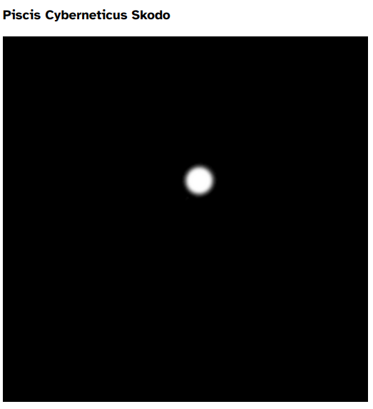
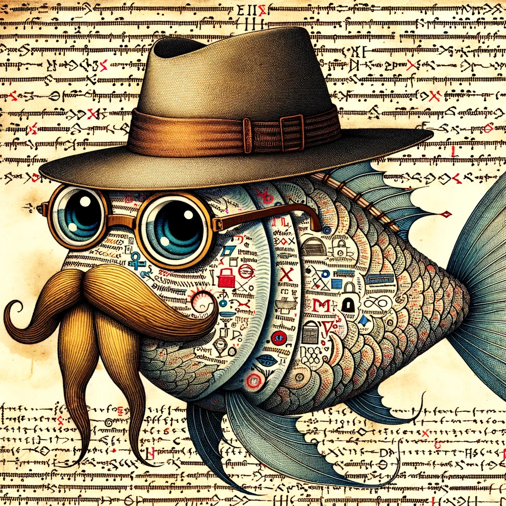

# SANS Holiday Hack Challenge 2023 - Fishing

## Description

> Catch twenty different species of fish that live around Geese Islands. When you're done, report your findings to Poinsettia McMittens on the Island of Misfit Toys.

> Catch at least one of each species of fish that live around Geese islands. When you're done, report your findings to Poinsettia McMittens.

> **Poinsettia McMittens (Squarewheel Yard)**:
*Excuse me, but you're interrupting my fishing serenity. Oh, you'd like to know how to become as good at fishing as I am?
Well, first of all, thank you for noticing my flair for fishing. It's not just about looking good beside the lake, you know.
The key is in the details, much like crafting the perfect toy. Observe the water, the weather, and the fish’s habits - it's a science and an art.
Of course, it helps to have a natural charm. Fish seem to find me irresistible. Must be my sparkling personality... or maybe it's just the glitter of my allure.
Oh, the mysteries of the aquatic life around these islands are as elusive as, well, a clever compliment. But you'll get one if you probe enough.
Remember, patience is more than a virtue in fishing; it’s a strategy. Like waiting for the right time to use flattery, you wait for the right moment to strike.
Go see if you can catch, say, 20 different types of fish!*

### Hints

> **Become the Fish**: Perhaps there are some clues about the local aquatic life located in the HTML source code.

> **I Am Become Data**: One approach to automating web tasks entails the browser's developer console. Browsers' console allow us to manipulate objects, inspect code, and even interact with [WebSockets](https://javascript.info/websocket).

> **Fishing Machine**: There are a variety of strategies for automating repetative website tasks. Tools such as [AutoKey](https://github.com/autokey/autokey) and [AutoIt](https://www.autoitscript.com/site/) allow you to programmatically examine elements on the screen and emulate user inputs.

### Metadata

- Difficulty: 1/5, 4/5
- Tags: `javascript`, `websocket`, `automation`

## Solution

### Video

<iframe width="1280" height="720" src="https://www.youtube-nocookie.com/embed/LtHHYrNxOEw?start=5652" title="SANS Holiday Hack Challenge 2023 - Bonus! Fishing" frameborder="0" allow="accelerometer; autoplay; clipboard-write; encrypted-media; gyroscope; picture-in-picture; web-share" referrerpolicy="strict-origin-when-cross-origin" allowfullscreen></iframe>

### Write-up

For this write-up I've merged two challenges: `BONUS! Fishing Guide` and `BONUS! Fishing Mastery`. For the first one, we have to collect 20 different fishes, which is easy and can be done manually. We got a fishing rod at the beginning of our journey. If we stay on the same spot with our ship for a few second a `Cast Line` button will appear. If there is a fish on the line, the same button will turn red and will say `Reel In`. After we collect 20 different fishes, we get the task to collect all different fishes.

> **Poinsettia McMittens (Squarewheel Yard)**:
*Hoy small fry, nice work!
Now, just imagine if we had an automatic fish catcher? It would be as ingenious as me on a good day!
I came across this fascinating article about such a device in a magazine during one of my more glamorous fishing sessions.
If only I could get my hands on it, I'd be the undisputed queen of catching them all!*

As the hints suggest, we should to this automatically and check the HTML sources.

The main HTML file is the `https://2023.holidayhackchallenge.com/sea/?dockSlip={uuid}` ([sea.html](files/sea.html)), at line 355, we have an interesting comment.

```html
<!-- <a href='fishdensityref.html'>[DEV ONLY] Fish Density Reference</a> -->
```

The <https://2023.holidayhackchallenge.com/sea/fishdensityref.html> file ([fishdensity.html](files/fishdensityref.html)) contains the density of all the different fishes in the ocean. White means that it is likely that the fish appears on that spot, black means that it is unlikely (I mixed it up at first). The most interesting fish is `Piscis Cyberneticus Skodo`, because it can only be found in a small area (below the head of the duck of Steampunk Island).



!

By analyzing the <https://2023.holidayhackchallenge.com/sea/js/client.js> ([client.js](files/client.js)) JavaScript file we can conclude that everything happens through WebSocket, and if we want to automate the fishing we have to send the necessary message through WebSocket and interpret the answer.

At line 251 we can add automatic reeling of the fishes (```socket.send(`reel`)```)

```javascript
if (me.fishing) {
  reelItInBtn.style.display = 'block';
  if (me.onTheLine) {
      reelItInBtn.classList.add('gotone');
      reelItInBtn.innerText = 'Reel it in!';
      socket.send(`reel`)
  } else {
      reelItInBtn.classList.remove('gotone');
      reelItInBtn.innerText = 'Reel it in';
  }
}
```

Now we just have to automatically cast a line after we caught a fish.

Let's add a few new lines at line 451 where the different WebSocket messages are handled (`:f` for `fish`).

Let's add a delayed casting: ```setTimeout(() => {socket.send(`cast`)}, "1000");``` some logging and let's comment out the two lines responsible for opening the Pescadex, we don't need that.

```javascript
socket.addEventListener("message", event => {
    const messageType = event.data.substr(0, 2);
    const payload = event.data.substr(2);
    if (messageType === 'e:') {
        ...
    } else if (messageType === 'f:') {
        const parsed = JSON.parse(payload);
        const idx = playerData.fishCaught.findIndex(fish => fish.name === parsed.fish.name);
        if (idx === -1) {
            playerData.fishCaught.push(parsed.fish);
            pescadexIndex = playerData.fishCaught.length - 1;
            freshCatch = true;
            console.log(`New fish: ${parsed.fish.name}; Length: ${playerData.fishCaught.length};`);
        } else {
            pescadexIndex = idx;
            console.log(`Old fish: ${parsed.fish.name};`);
        }
        setTimeout(() => {socket.send(`cast`)}, "1000");
        // cotd.classList.add('visible');
        // updatePescadex();
    }
    updateUI();
});
```

With these modifications, if we are lucky we will get all 171 fishes in a few hours, we just sometimes have to move to other places in the ocean based on the missing fish's density information.

I've placed all information about the fishes in the [fishes.json](files/fishes.json) file.

> **Poinsettia McMittens (Squarewheel Yard)**:
*You managed to catch every fish? You're like the fishing version of a Christmas miracle!
Now, if only you could teach me your ways... but then again, I'm already pretty fabulous at everything I do.*