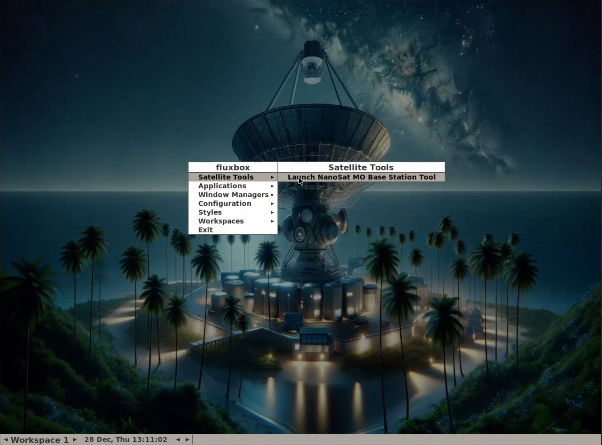
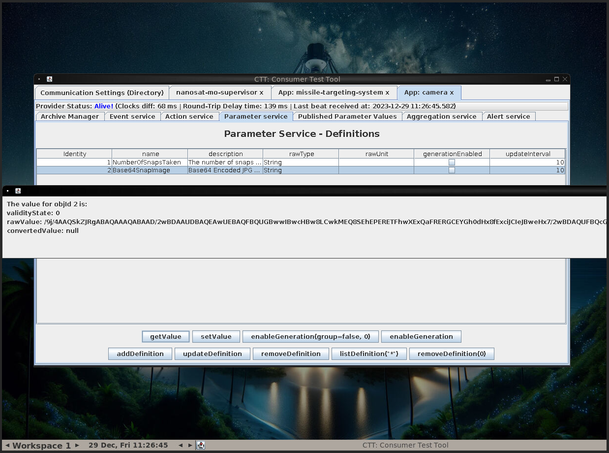

# SANS Holiday Hack Challenge 2023 - 

## Description

> Gain access to Jack's camera. What's the third item on Jack's TODO list?

> **NanoSat-o-Matic (Zenith SGS)**
*Hi there! I am a Ground station client vending machine. Apparently there is a huge need for NanoSat frameworks here, so they have put me in this room. Here, have a [free sample](https://www.holidayhackchallenge.com/2023/client_container.zip)!*

### Hints

> **Hubris is a Virtue**: In his hubris, Wombley revealed that he thinks you won't be able to access the satellite's "Supervisor Directory". There must be a good reason he mentioned that specifically, and a way to access it. He also said there's someone else masterminding the whole plot. There must be a way to discover who that is using the nanosat.

### Metadata

- Difficulty: 3/5
- Tags: `nanosat`, `base64`, `wireshark`, `maltcp`

## Solution

### Video

<iframe width="1280" height="720" src="https://www.youtube-nocookie.com/embed/LtHHYrNxOEw?start=4639" title="SANS Holiday Hack Challenge 2023 - Camera Access" frameborder="0" allow="accelerometer; autoplay; clipboard-write; encrypted-media; gyroscope; picture-in-picture; web-share" referrerpolicy="strict-origin-when-cross-origin" allowfullscreen></iframe>

### Write-up

We can download a [client_container.zip](files/client_container.zip) which helps us get started, we just have to run `build_and_run.sh` and access the NoVNC server at `http://127.0.0.1:6901/vnc.html`

First of all, we have to generate a WireGuard configuration file at `Space Island: Zenith SGS` using the online `GateXOR` application.

We can open a shell to the running docker container, copy the WireGuard configuration and set up the interface.

```shell
$ docker exec -it <container_name> bash 
$ vim /etc/wireguard/wg0.conf
$ wg-quick up wg0
$ ping 10.1.1.1
```

1. We can start the `NanoSat MO Base Station Tool` with right click -> Satellite Tools.



2. The `Directory Service URI` is given in the `README.md` file: `maltcp://10.1.1.1:1024/nanosat-mo-supervisor-Directory`
3. `Fetch Information` -> `Connect to Selected Provider`
4. On the `App Launcher service` we can select `camera` and `runApp`
5. This will print the URI of the `camera` application: `maltcp://10.1.1.1:1024/nanosat-mo-supervisor-Directory`
6. Connect to the camera app
7. On the `Action Service` menu we can select `Base64SnapImage` and then `submitAction`
8. On the `Parameter Service` we can select `Base64SnapImage` and then `getValue`
9. This will print a base64 encoded string in a window from which we cannot copy any data



10. We can start Wireshark and capture the traffic while executing the `getValue` command again
11. By following the TCP stream we can copy the base64 encoded image, decode it in the terminal and open the image


The flag is: `CONQUER HOLIDAY SEASON!`