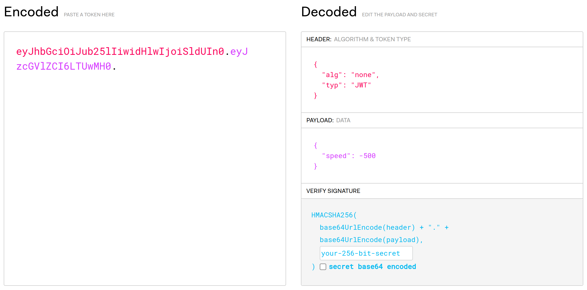

# SANS Holiday Hack Challenge 2023 - Elf Hunt

## Description

> Piney Sappington needs a lesson in JSON web tokens. Hack Elf Hunt and score 75 points.

### Metadata

- Difficulty: 3/5
- Tags: `jwt`, `javascript`, `signature`, `none`

## Solution

### Video

<iframe width="1280" height="720" src="https://youtu.be/LtHHYrNxOEw?t=2841" title="SANS Holiday Hack Challenge 2023 - Elf Hunt solution 1" frameborder="0" allow="accelerometer; autoplay; clipboard-write; encrypted-media; gyroscope; picture-in-picture; web-share" referrerpolicy="strict-origin-when-cross-origin" allowfullscreen></iframe>

<iframe width="1280" height="720" src="https://youtu.be/LtHHYrNxOEw?t=2997" title="SANS Holiday Hack Challenge 2023 - Elf Hunt solution 2" frameborder="0" allow="accelerometer; autoplay; clipboard-write; encrypted-media; gyroscope; picture-in-picture; web-share" referrerpolicy="strict-origin-when-cross-origin" allowfullscreen></iframe>

### Write-up

If we start the game (<https://elfhunt.org>) we can see that the elfs are too fast, and it is very tedious to hunt 75 elfs down. After checking the requests, we can see that we got a JWT token called `ElfHunt_JWT` with a value similar to:

```
eyJhbGciOiJub25lIiwidHlwIjoiSldUIn0.eyJzcGVlZCI6LTUwMH0.
```

If we decode it with <https://jwt.io> we get the following:

```
# header
{
  "alg": "none",
  "typ": "JWT"
}
```

```
# data / payload
{
  "speed": -500
}
```



We can see that there is no signature, so we can modify the data / payload as we want. Let's set the speed to `-50`, place the new cookie in the Developer Tools and refresh the page. 

```
# modified JWT token
eyJhbGciOiJub25lIiwidHlwIjoiSldUIn0.eyJzcGVlZCI6LTUwfQ.
```

The result is that the elfs are much slower and now we can hunt them down in a few minutes.

It is also possible to just simply rewrite the client-side JavaScript and set the score to 75.

In the middle of the HTML page there is a `score++` line. If we put a breakpoint there and hunt one elf down, the breakpoint will be hit. In the `global` variables, we can find the `score` variable, set it to 75 and continue.

```javascript
spawnElf = ()=>{
    if (elves.countActive(!0) < 10) {
        const a = Phaser.Math.Between(100, 700)
            , s = elves.create(a, 2 * this.cameras.main.centerY, "elf");
        s.isHit = !1,
        s.setVelocityY(speed);
        var e = Math.random() < .5 ? -1 : 1;
        s.flipX = e < 0;
        var t = 80 * e;
        s.setVelocityX(t),
        s.setScale(.1),
        s.setOrigin(0, 0),
        s.setInteractive(),
        s.on("pointerdown", (function(e) {
            s.isHit || (s.isHit = !0,
            s.snow = gameScene.add.image(s.x, s.y, "snow").setOrigin(0, 0).setDepth(1),
            s.snow.scale = .1,
            gameScene.sound.play("splat"),
            s.setVelocityX(0),
            s.setVelocityY(0),
            gameScene.tweens.add({
                targets: [s, s.snow],
                scaleX: 0,
                scaleY: 0,
                alpha: 0,
                angle: "+=1900",
                y: 2 * gameScene.cameras.main.centerY,
                duration: 2e3,
                onComplete: function() {
                    s.destroy()
                }
            }),
            score++,
            scoreText.setText("Score: " + score))
        }
        ), s)
    }
```

> **Piney Sappington (Rainraster Cliffs)**:
*Well done! You've brilliantly won Elf Hunt! I couldn't be more thrilled. Keep up the fine work, my friend!
What have you found there? The Captain's Journal? Yeah, he comes around a lot. You can find his comms office over at Brass Buoy Port on Steampunk Island.*