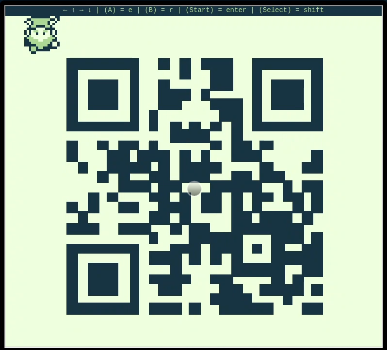
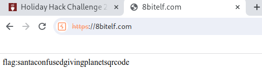

# SANS Holiday Hack Challenge 2023 - Game Cartridges: Vol 1

## Description

> Find the first Gamegosling cartridge and beat the game

> **Tinsel Upatree (Driftbit Grotto)**:
*I can't believe I was actually able to find this underground cavern!
I discovered what looked liike an old pirate map in the attic of one of those huts in Rainraster Cliffs, and it actually led somewhere!
But now that I've seen where it leads, I think this might've been a bad idea. This place is scary! Maybe you want to take it from here?*

> **Tinsel Upatree (Driftbit Grotto)**:
*There are 3 buried treasures in total, each in its own uncharted area around Geese Islands.
I've been searching for a bit, but the mustiness down here is making me sneeze!
Maybe you'll be able to find it. Here, use my Gameboy Cartridge Detector. Go into your items and test it to make sure it's still working.
When you get close to the treasure, it'll start sounding off. The closer you get, the louder the sound.
No need to activate or fiddle with it. It just works!
I bet it's somewhere right... near... ACHOOO!
If you find the treasure, come back and show me, and I'll tell you what I was able to research about it.
Good luck!*

### Hints

> **Buried Treasures**: There are 3 buried treasures in total, each in its own uncharted area around Geese Islands. Use the gameboy cartridge detector and listen for the sound it makes when treasure is nearby, which gets louder the closer you are. Also look for some kind of distinguishing mark or feature, which could mark the treasure's location.

> **Gameboy 1**: 1) Giving things a little push never hurts. 2) Out of sight but not out of ear-shot 3) You think you fixed the QR code? Did you scan it and see where it leads?

> **Approximate Proximity**: Listen for the gameboy cartridge detector's proximity sound that activates when near buried treasure. It may be worth checking around the strange toys in the Tarnished Trove.

### Metadata

- Difficulty: 1/5
- Tags: `gameboy`, `qrcode`, `javascript`

## Solution

### Video

<iframe width="1280" height="720" src="https://youtu.be/LtHHYrNxOEw?t=1147" title="SANS Holiday Hack Challenge 2023 - Game Cartridges: Vol 1" frameborder="0" allow="accelerometer; autoplay; clipboard-write; encrypted-media; gyroscope; picture-in-picture; web-share" referrerpolicy="strict-origin-when-cross-origin" allowfullscreen></iframe>

### Write-up

First, we have to find the toy itself.

The Toy is on the `Island of Misfit Toys: Tarnished Trove` under the Hat in the upper left corner. We can talk to `Dusty Giftwrap` and `Rose Mold`.

> **Rose Mold (Ostrich Saloon)**:
*Yup, I knew you knew. You just have that vibe.
To answer your question of why from earlier... Nunya!
But, I will tell you something better, about some information I... found.
There's a hidden, uncharted area somewhere along the coast of this island, and there may be more around the other islands.
The area is supposed to have something on it that's totes worth, but I hear all the bad vibe toys chill there.
That's all I got. K byyeeeee.
Ugh... n00bs...*

> **Dusty Giftwrap (Tarnished Trove)**: 
*Arrr, matey, shiver me timbers! There be buried treasure herrrrre. 
ust kidding, I'm not really a pirate, I was just hoping it would make finding the treasure easier. 
I guess you heard about the fabled buried treasure, too? 
I didn't expect to see anyone else here. This uncharted islet was hard to find.*

> **Dusty Giftwrap (Tarnished Trove)**:
*I bet one of these creepy toys has the treasure, and I'm sure not going anywhere near them! 
If you find the treasure, come back and show me, and I'll tell you what I was able to research about it. 
Good luck!*

> **Dusty Giftwrap (Tarnished Trove)**: 
*Whoa, you found it! It's a... video game cartridge? 
Coooooollll... I mean, arrrrrr.... 
So, here's what my research uncovered. 
Not sure what it all means, maybe you can make sense of it.*

To solve the challenge, we have to fix the QR code by pushing 7 misfit blocks to the right place ([game.gb](files/game.gb)). To find the misfit, movable block we can "sing" at them, and they start to pulsate. The correct, target position of the block will also pulsate.

- One block is on the top-middle.
- One is on the top-left, need to be moved around the QR code.
- One is on the bottom-right (this should be the last one).
- Four are in the bottom-middle.

One important thing which makes our life much easier is that there is a rewind button - the backspace. By pressing the backspace, we can move back a couple of frames. The existence of the rewind button can be extracted from JavaScript.

If we fix the QR code and read it, it will navigate us to the: <http://8bitelf.com> site which prints the first flag.

```
flag:santaconfusedgivingplanetsqrcode
```





## Files

- `game.gb`
    - [game.gb](files/game.gb)
    - <https://gamegosling.com/vol1-uWn1t6xv4VKPZ6FN/rom/game.gb>