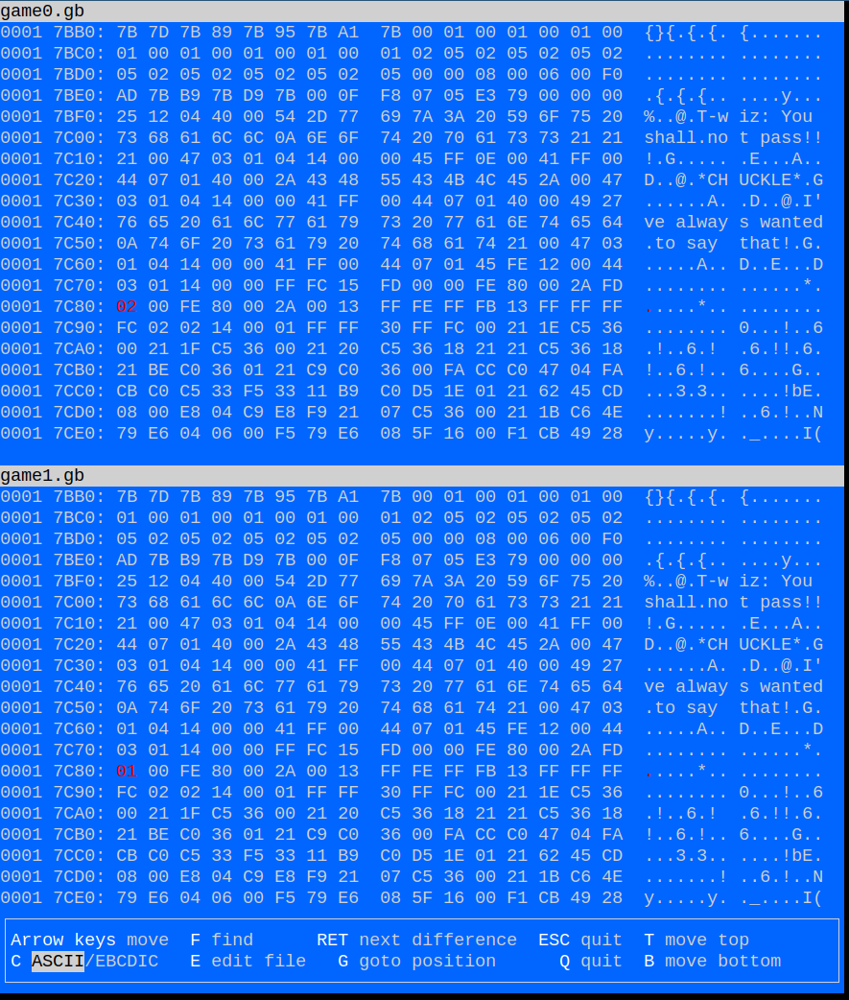
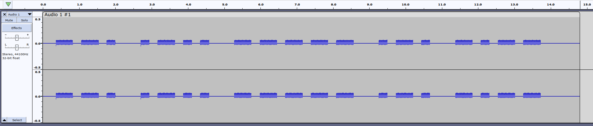

# SANS Holiday Hack Challenge 2023 - Game Cartridges: Vol 2

## Description

> Find the second Gamegosling cartridge and beat the game.

### Hints

> **Buried Treasures**: There are 3 buried treasures in total, each in its own uncharted area around Geese Islands. Use the gameboy cartridge detector and listen for the sound it makes when treasure is nearby, which gets louder the closer you are. Also look for some kind of distinguishing mark or feature, which could mark the treasure's location.

> **Gameboy 2**: 1) This feels the same, but different! 2) If it feels like you are going crazy, you probably are! Or maybe, just maybe, you've not yet figured out where the hidden ROM is hiding. 3) I think I may need to get a DIFFerent perspective. 4) I wonder if someone can give me a few pointers to swap.

> **Gameboy 2**: Try poking around Pixel Island. There really aren't many places you can go here, so try stepping everywhere and see what you get!

### Metadata

- Difficulty: 3/5
- Tags: `gameboy`, `game hacking`, `diff`, `debugging`

## Solution

### Video

<iframe width="1280" height="720" src="https://youtu.be/LtHHYrNxOEw?t=1405" title="SANS Holiday Hack Challenge 2023 - Game Cartridges: Vol 2" frameborder="0" allow="accelerometer; autoplay; clipboard-write; encrypted-media; gyroscope; picture-in-picture; web-share" referrerpolicy="strict-origin-when-cross-origin" allowfullscreen></iframe>

### Write-up

First, we have to find the toy itself.

The Toy can be found on the `Pixel Island: Driftbit Grotto` left end near `Tinsel Upatree`.

> **Tinsel Upatree (Driftbit Grotto)**:
*Whoa, you found it!
What version is it?
Did you know that many games had multiple versions released? Word is: volume 2 has 2 versions!*

If we start the game we see that `T-Wiz` will not let us pass (`You shall not pass!`).

Using the hints, we can solve the challenges:

If we refresh the game we can discover that sometimes [game0.gb](files/game0.gb) and sometimes [game1.gb](files/game1.gb) is loaded.

Let's create a binary diff with `vbindiff`

```shell
$ vbindiff game0.gb game1.gb
```

There are around 16 changes between the two files and one of them is at `0x00017C80` right after where the sentences of `T-Wiz` are stored.

For `game0.gb` a byte is set to `00`, for `game1.gb` a byte is set to `01`.



We can guess that this byte is important. To manipulate the byte, we can use a static or a dynamic approach. I chose the dynamic approach with a Game Boy emulator and debugger: [SameBoy](https://sameboy.github.io/)

We can set a read-write watchpoint to `$05:$7c80`, this is the address of the interesting byte (`rom5`)

```
watch/rw  5:$7c80
```

If we go to `T-Wiz` and we try to pass, after the messages from `T-Wiz` we hit the watchpoint. The value is loaded to the `a` register. I used `game1` where this value is `0x01`, so let's set it to `0x00` using `print` and the assignment operator.

```
print a = $00
```

After continuing the execution, we will experience that we automatically moved a block down and not up. This register should control whether we are moving up or down and how many blocks after the conversation.

After this, if we go to the cave, and listen to the radio, we might identify that it is Morse-code. It is not too long, so if we record it with `Audacity` we can decode it manually or with an online tool.

<audio src="media/morse.wav" width='100%' controls playsinline>
</audio>



```
--. .-.. ----- .-. -.--
```

This Morse-code translates to `GL0RY`, which is the solution.

## Files

- `game0.gb`
    - [game0.gb](files/game0.gb)
    - <https://gamegosling.com/vol2-akHB27gg6pN0/rom/game0.gb>
- `game1.gb`
    - [game1.gb](files/game1.gb)
    - <https://gamegosling.com/vol2-akHB27gg6pN0/rom/game1.gb>