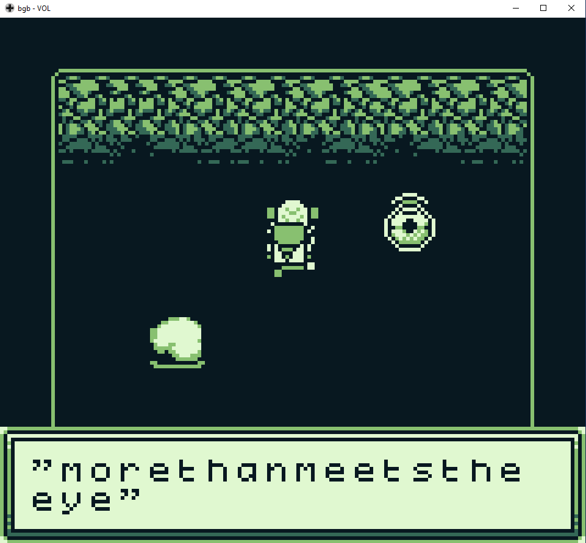
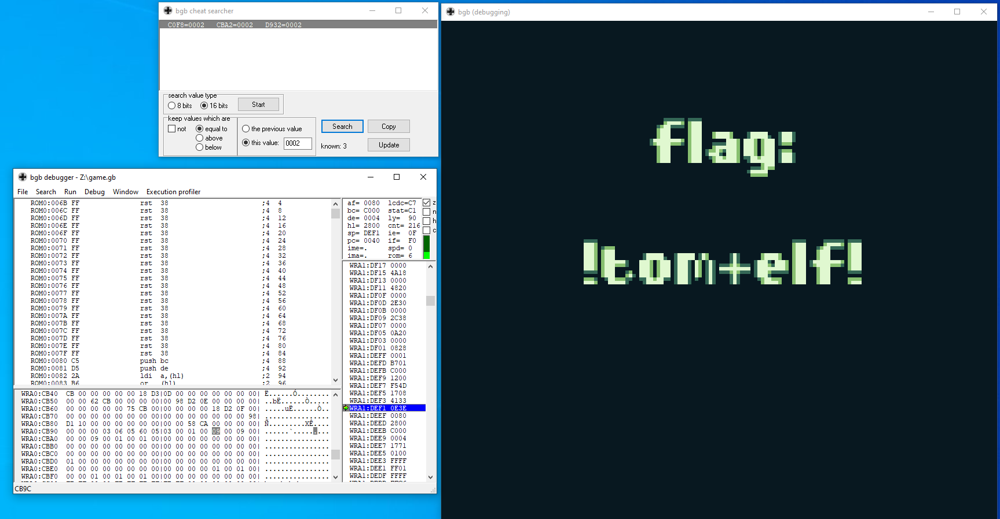

# SANS Holiday Hack Challenge 2023 - Game Cartridges: Vol 3

## Description

> Find the third Gamegosling cartridge and beat the game

### Hints

> **Buried Treasures**: There are 3 buried treasures in total, each in its own uncharted area around Geese Islands. Use the gameboy cartridge detector and listen for the sound it makes when treasure is nearby, which gets louder the closer you are. Also look for some kind of distinguishing mark or feature, which could mark the treasure's location.

> **Bird's Eye View**: The location of the treasure in Rusty Quay is marked by a shiny spot on the ground. To help with navigating the maze, try zooming out and changing the camera angle.

> **Gameboy 3**: 1) This one is a bit long, it never hurts to save your progress! 2) 8bit systems have much smaller registers than you’re used to. 3) Isn’t this great?!? The coins are OVERFLOWing in their abundance.

### Metadata

- Difficulty: 3/5
- Tags: `gameboy`, `game hacking`, `debugging`

## Solution

### Video

Videos are coming soon! I did not want to put them on GitHub as they are 10 - 100 MBs.
<!-- <video src="media/game-cartridges-vol-3.mp4" width='100%' controls playsinline></video> -->

### Write-up

First, we have to find the toy itself.

The Toy can be found on the `Steampunk Island: Rusty Quay` in the middle of the labyrinth. We can talk to `Angel Candysalt`:

> **Angel Candysalt (Rusty Quay)**: 
*The name's Angel Candysalt, the great treasure hunter! 
A euphemism? No, why do people always ask me that?? 
Anyways, I came here to nab the treasure hidden in this ship graveyard, only to discover it's protected by this rusted maze. 
That must be why all these old ships are here. 
Their crew came to find the treasure, only to get lost in the labrynth.*

> **Angel Candysalt (Rusty Quay)**: 
*At least it's obvious where this one is. 
See that shiny spot over to the right? That's gotta be where it is! 
If only I had a bird's eye view. 
But how to get there? Up? Down? Left? Right? Oh well, that's your problem now! 
Come back if you can find your way to it, and I'll tell you some secrets I've heard about this one.*

> **Angel Candysalt (Rusty Quay)**: 
*The life of a treasure hunter isn't easy, but it sure is exciting! 
Oh it's a video game, I love video games! But you've claimed this treasure, nicely done. 
Now, about those secrets I've been told. They're pretty cryptic, but they are. 
Hopefully that helps with something!*

If we walk around the game ([game.gb](files/game.gb)) we can meet `Jared` who hints that we need `999` coins to move forward. It is possible to do this without game hacking or cheating, because on the first "level" the first coin is 1, the second is 10 and the third is 100, and we can respawn these coins if we move to another "level" and back. However, this is very cumbersome as later we might accidentally just collect more coins which will make our coins overflow.

A good idea is to find the memory addresses where our collected coins are stored and modify that while playing the game.

I used BGB (<https://bgb.bircd.org/>, <https://bgb.bircd.org/manual.html#cheatsearcher>).

By selecting 8 bits in the Cheat Searcher, and searching for `00`, `01`, `02` and `03`, while collecting only the first coin in the game multiple times, we can narrow down the memory addresses to: `0xC0F8`, `0xCBA2`, `0xD932`

If we try to modify these values and move to another "level" to reload our coin count on the screen, only the following work modifications work:

```
0xCB9C -> TENS
0xCB9E -> HUNDREDS
0xCBA2 -> ONES
```

If we go to the jumping point and if we have 999 coins, we can make the jump by just holding down the jump button, without releasing it.

We can also save the state at any time and reload it.

After making the jump, finishing the game is straightforward. `Grumpy Man` in the cave tells us that the passphrase is `morethanmeetstheeye`.



If we give the passphrase to ChatNPT and exit through the newly appeared hole, we can get the flag.



```
!tom+elf!
```

## Files

- `game.gb`
    - [game.gb](files/game.gb)
    - <https://gamegosling.com/vol3-7bNwQKGBFNGQT1/rom/game.gb>