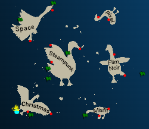
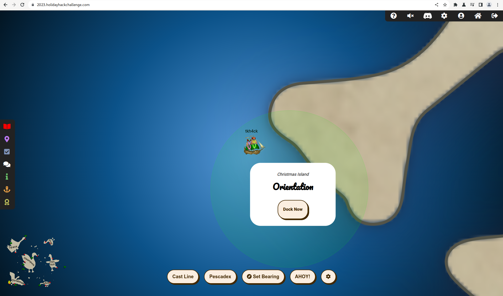
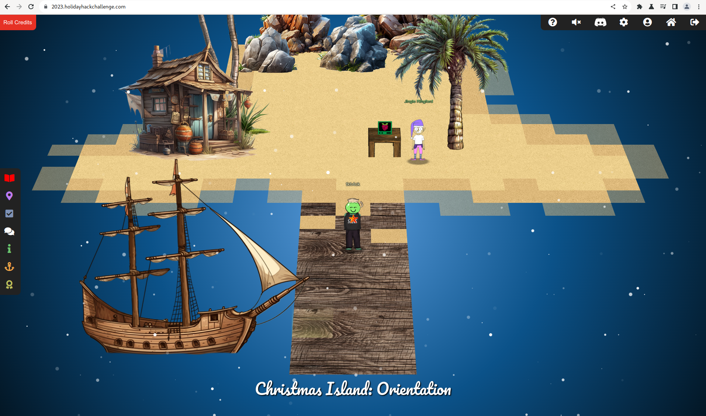
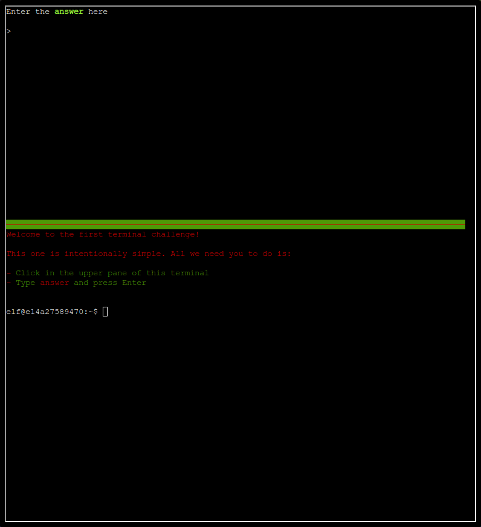

# SANS Holiday Hack Challenge 2023 - Holiday Hack Orientation

## Description

> Talk to Jingle Ringford on Christmas Island and get your bearings at Geese Islands.

### Metadata

- Difficulty: 1/5
- Tags: `intro`

## Solution

### Video

<iframe width="1280" height="720" src="https://youtu.be/LtHHYrNxOEw?t=7" title="SANS Holiday Hack Challenge 2023 - Holiday Hack Orientation" frameborder="0" allow="accelerometer; autoplay; clipboard-write; encrypted-media; gyroscope; picture-in-picture; web-share" referrerpolicy="strict-origin-when-cross-origin" allowfullscreen></iframe>

### Write-up

To solve the first challenge, we just have to sail to `Christmas Island` and dock at the first port `Orientation`.

Here we can talk to `Jingle Ringford` who gives us a badge (a starfish) which makes us an official player and then he describes the rules and goals.

The conversation is the following:

> **Jingle Ringford (Orientation)**:
*Welcome to the Geese Islands and the 2023 SANS Holiday Hack Challenge!
I'm Jingle Ringford, one of Santa's many elves. 
Santa asked me to meet you here and give you a short orientation to this festive event.
Before you head back to your boat, I'll ask you to accomplish a few simple tasks.*

> **Jingle Ringford (Orientation)**:
*First things first, here's your badge! It's that starfish in the middle of your avatar.
Great - now you're official!
Click on the badge on your avatar. That's where you will see your Objectives, Hints, and Conversations for the Holiday Hack Challenge.
We've also got handy links to some awesome talks and more there for you!*

> **Jingle Ringford (Orientation)**:
*Fantastic!
OK, one last thing. Click on the Cranberry Pi Terminal and follow the on-screen instructions.*

If we click on the `Cranberry Pi` we are presented with the screen below, we just have to type `answer` in the top window.

> **Jingle Ringford (Orientation)**:
*Perfect! Your orientation is now complete!
Head back to your boat or click on the anchor icon on the left of the screen to set sail for Frosty's Beach where Santa's waiting for you. I've updated your boat's compass to guide the way.
As you sail to each island, talk to the goose of that island to receive a colorful lei festooning the masts on your ship. 
Safe travels my friend and remember, relax, enjoy the sun, and most importantly, have FUN!*