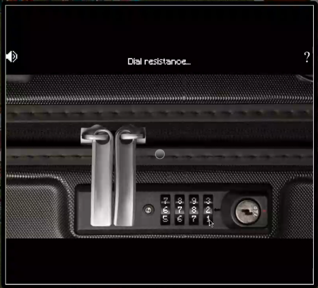
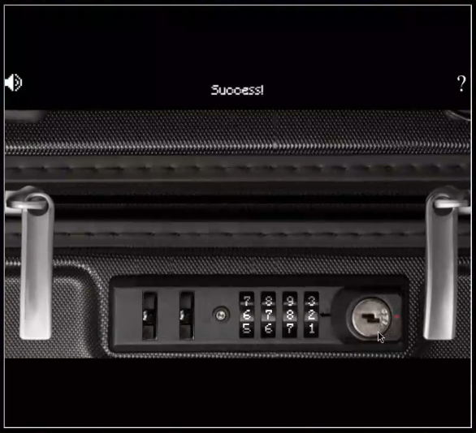

# SANS Holiday Hack Challenge 2023 - Luggage Lock

## Description

> Help Garland Candlesticks on the Island of Misfit Toys get back into his luggage by finding the correct position for all four dials

> **Garland Candlesticks (Squarewheel Yard)**:
*Hey there, I'm Garland Candlesticks! I could really use your help with something.
You see, I have this important pamphlet in my luggage, but I just can't remember the combination to open it!
Chris Elgee gave a talk recently that might help me with this problem. Did you attend that?
I seem to recall Chris mentioning a technique to figure out the combinations...
I have faith in you! We'll get that luggage open in no time.
This pamphlet is crucial for me, so I can't thank you enough for your assistance.
Once we retrieve it, I promise to treat you to a frosty snack on me!*

### Hints

> **Lock Talk**: Check out Chris Elgee's [talk](https://youtu.be/ycM1hBSEyog) regarding his and his wife's luggage. Sounds weird but interesting!

### Metadata

- Difficulty: 1/5
- Tags: `lock picking`

## Solution

### Video

Videos are coming soon! I did not want to put them on GitHub as they are 10 - 100 MBs.
<!-- <video src="media/luggage-lock.mp4" width='100%' controls playsinline></video> -->

### Write-up

If we watch the suggested video, we can get an idea on how to solve the challenge:

[KringleCon - Lock Talk](https://www.youtube.com/watch?v=ycM1hBSEyog)

We can put a bit pressure on the opening button by pressing it a few times. Then if we turn the numbers from left to right there will be a `Dial resistence...` message on the top. 

We should stop when a resistance is detected more frequently. This way we can open the lock, in my case the combination was `6782`.

> **Garland Candlesticks (Squarewheel Yard)**:
*Wow, you did it! I knew you could crack the code. Thank you so much!*