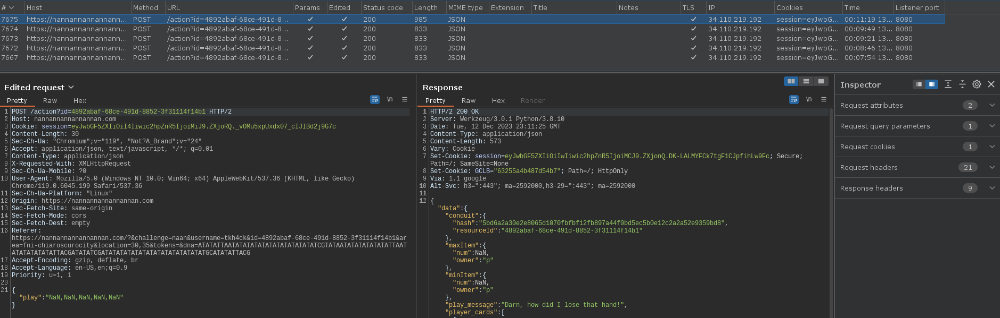

# SANS Holiday Hack Challenge 2023 - Na'an

## Description

> Shifty McShuffles is hustling cards on Film Noir Island. Outwit that meddling elf and win!

### Hints

> **The Upper Hand**: Shifty said his deck of cards is made with Python. Surely there's a [weakness](https://www.tenable.com/blog/python-nan-injection) to give you the upper hand in his game.

### Metadata

- Difficulty: 2/5
- Tags: `python`, `NaN`

## Solution

### Video

Videos are coming soon! I did not want to put them on GitHub as they are 10 - 100 MBs.
<!-- <video src="media/naan.mp4" width='100%' controls playsinline></video> -->

### Write-up

As the challenge name and the hints suggest we should try to submit `NaN` strings instead of numbers.

If we intercept the request sent to the server after we press the `Play` button, we can insert `NaN` strings instead of our chosen numbers.

```
POST /action?id=4892abaf-68ce-491d-8852-3f31114f14b1 HTTP/2
Host: nannannannannannan.com
Content-Length: 34
Content-Type: application/json
[...]

{"play":"NaN, NaN, NaN, NaN, NaN"}
```

This actually result in a win and 2 points.

If we do this 4 times more, we can win the whole game and complete the challenge.



> **Shifty McShuffles (Chiaroscuro City)**:
*Well, you sure are more clever than most of the tourists that show up here.
I couldn't swindle ya, but don't go telling everyone how you beat me!
An elf's gotta put food on the table somehow, and I'm doing the best I can with what I got.*