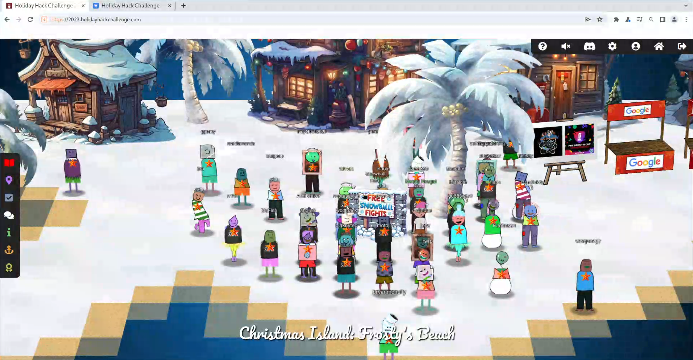
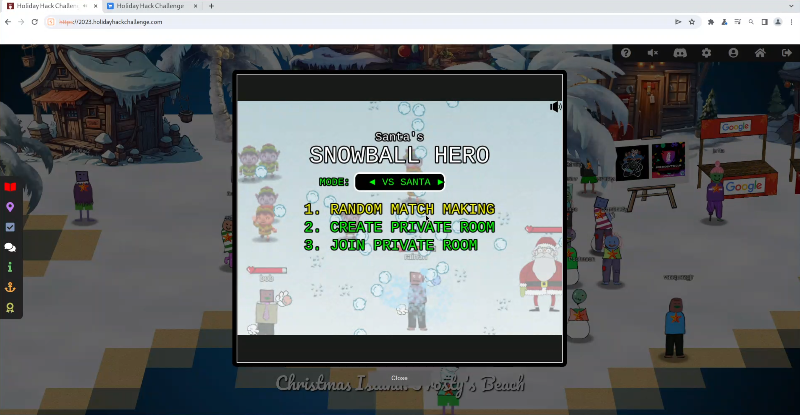
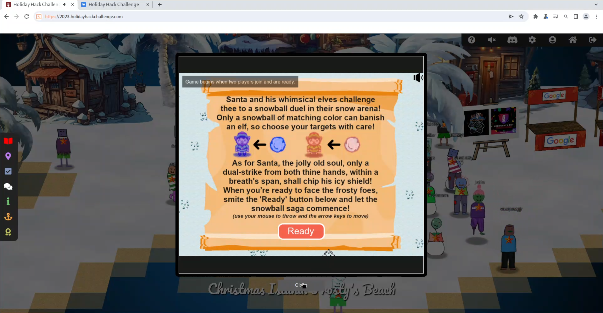
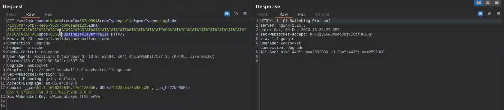
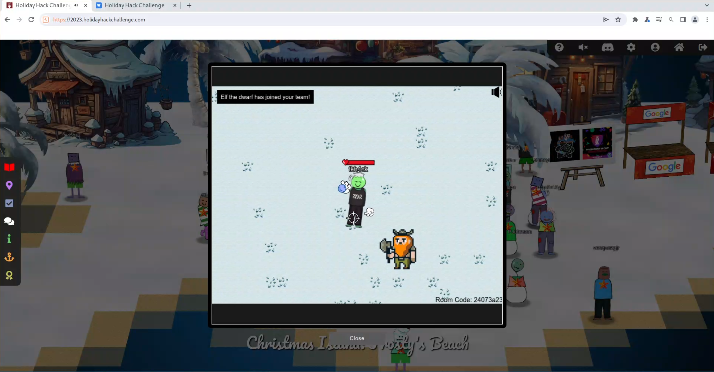
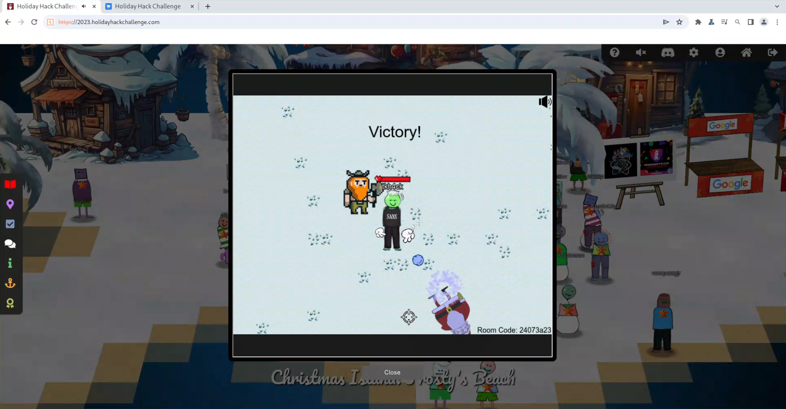

# SANS Holiday Hack Challenge 2023 - Snowball Fight

## Description

> Visit Christmas Island and talk to Morcel Nougat about this great new game. Team up with another player and show Morcel how to win against Santa!

> **Morcel Nougat (Frosty's Beach)**:
*You're like a snowball fighting ninja! A real-life legend. Can I have your autograph!?*

### Metadata

- Difficulty: 2/5
- Tags: `web`, `javascript`, `client-side security`

## Solution

### Video

<iframe width="1280" height="720" src="https://www.youtube-nocookie.com/embed/LtHHYrNxOEw?start=46" title="SANS Holiday Hack Challenge 2023 - Snowball Fight" frameborder="0" allow="accelerometer; autoplay; clipboard-write; encrypted-media; gyroscope; picture-in-picture; web-share" referrerpolicy="strict-origin-when-cross-origin" allowfullscreen></iframe>

### Write-up

If we talk to `Morcel Nougat` we won't get much information about the task.



If we open the game, a `iframe` is created which loads the following site with some path and query string values: <https://hhc23-snowball.holidayhackchallenge.com/>. This is important because we can filter for this site in Burp or set it as the in-scope target, which makes our life much easier.

First, it is recommended to click around the site and play a game as a normal user. If we do this, the following request flow can be identified:
- Call to `/` with some query string parameters like `challenge`, `username`, `id` and `area`. This only displays the first page, the "game type" chooser: random match making, create private room or join private room.



- Choosing the first option (`Random match making`) will send a request to `/room/` with some query string parameters like `username`, `roomId`, `roomType`, `gameType`, etc. The parameters are not important, however, the answer - which is an HTML page with some JavaScript is important. This page is responsible for the game logic.



- As a typical web-based game, the relevant game data between the client and the server travels through WebSocket. The previous page a WebSocket connection `Connection: Upgrade` request to `/ws/` with similar parameters like in case of `/room/` but we can notice a new parameter: `singlePlayer=false`. We can guess that there should be a single player mode.



We can conclude that the important logic is in the second response, which is a 2000-line long HTML code (with mainly JavaScript) code in it.

If we search for `player.health`, we can find the following code section around line 608:

```javascript
player.takehit = (dmg, owner_playerobj) => {
    if (!player.isdefeated) {
    player.health = Math.min( Math.max(Math.abs( player.health - dmg ), 0), 50)
    if (player.health !== player.lastHealth) {
        player.update = true
        player.lastHealth = player.health + 0
        player.healthbar.setFrame( Math.min(50 - player.health, 49) );
        player.healthbar.setFrame( Math.min( Math.max(Math.abs( 50 - player.health ), 0), 49) )
        if (player.health == 0) {
        player.isdefeated = 1
        if (gameType === 'free-for-all') {
            setTimeout(function() {
            ws.close()
            window.location.reload();
            }, playerRespawnTime)
        } else {
            stopTheGame = true
            ws.close()
        }
        }
        if (player.isdefeated) {
        playerDeath(player)
        setTimeout(function() {
            if (ws.readyState === WebSocket.OPEN) {
            ws.send(JSON.stringify({ a: 'd-' + assigned_id + '-' + owner_playerobj.assigned_id, i: playerId})); 
            }
        }, sendRate+50)
        }
    }
    }
}
```

This is basically an anonymous function which can be called using `player.takehit(...)` and handles the logic when the player is hit with a snowball. Let's try and modify the `player.health = Math.min( Math.max(Math.abs( player.health - dmg ), 0), 50)` line to `player.health = 50`. This should mean that our health will always be `50` regardless how many snowballs hits we take.

If we create this modification in the loaded JavaScript resource, or using Burp by modifying the response we will see that our health will stay the same, and we can easily win the game.

Another option is to research the `singlePlayer` parameter and / or variable. The relevant code snippets are the following:

```javascript
var singlePlayer = "false"
function checkAndUpdateSinglePlayer() {
    const localStorageValue = localStorage.getItem('singlePlayer');
    if (localStorageValue === 'true' || localStorageValue === 'false') {
        singlePlayer = String(localStorageValue === 'true');
    }
    const urlParams = new URLSearchParams(window.location.search);
    const urlValue = urlParams.get('singlePlayer');
    if (urlValue === 'true' || urlValue === 'false') {
        singlePlayer = String(urlValue === 'true');
    }
}
[...]
checkAndUpdateSinglePlayer();
[...]
var paramsDefaults = {
    "username": nms[ Math.floor(Math.random() * nms.length) ] + (Math.random() + 1).toString(36).substring(10),
    "roomId": "0",
    "roomType": "public",
    "gameType": 'free-for-all',
    "id": generateUUIDv4(),
    "dna": 'avatar' + (Math.floor(Math.random() * 9) + 1),
    "singlePlayer":"false"
};

var updateURL = false;

for (let param in paramsDefaults) {
    let currentParamValue = url.searchParams.get(param);
    let newValue = setURLParameterIfAbsent(param, paramsDefaults[param]);

    if (currentParamValue !== newValue) {
        updateURL = true;
    }

    switch (param) {
        case 'username': username = newValue; break;
        case 'roomId': roomId = newValue; break;
        case 'roomType': roomType = newValue; break;
        case 'gameType': gameType = newValue; break;
        case 'id': playerId = newValue; break;
        case 'dna': playerDNA = newValue; break;
        case 'singlePlayer': singlePlayer = newValue; break;
    }
}
[...]
ws = new WebSocket(
    ws_type 
    + window.location.href.split('/').slice(2, 3).join('/')
    + "/ws/?username=" + encodeURIComponent(username)
    + "&roomId=" + encodeURIComponent(roomId)
    + "&roomType=" + encodeURIComponent(roomType)
    + "&gameType=" + encodeURIComponent(gameType)
    + "&id=" + encodeURIComponent(playerId)
    + "&dna=" + encodeURIComponent(playerDNA)
    + "&pos=" + encodeURIComponent(starting_pos.x + '-' + starting_pos.y)
    + "&singlePlayer=" + encodeURIComponent(singlePlayer)
);
```

We might be able to control the value of this parameter from the local storage, however, this value is later overridden with the value from the query string (if exists) or the default value which is `false`.

By simply adding a `singlePlayer = "true";` line after the last assignment and before the WebSocket creation (or just changing `case 'singlePlayer': singlePlayer = newValue; break;` to `case 'singlePlayer': singlePlayer = "true"; break;`) we can play the game alone. In the single player mode, we get a companion `Elf the dwarf`. With his help we can easily win the game without any other modification.





> **Morcel Nougat (Frosty's Beach)**:
*You're like a snowball fighting ninja! A real-life legend. Can I have your autograph!?*