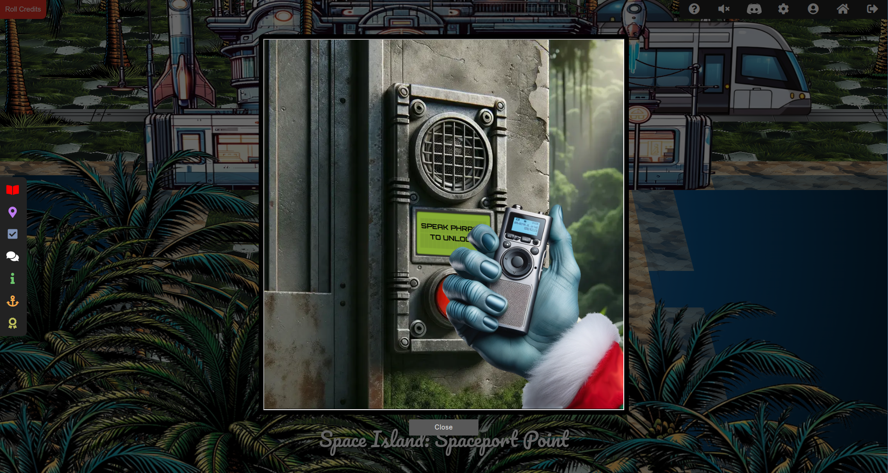
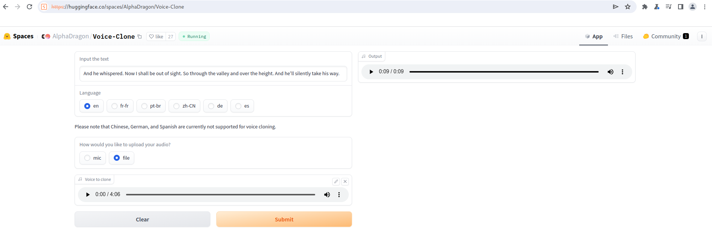
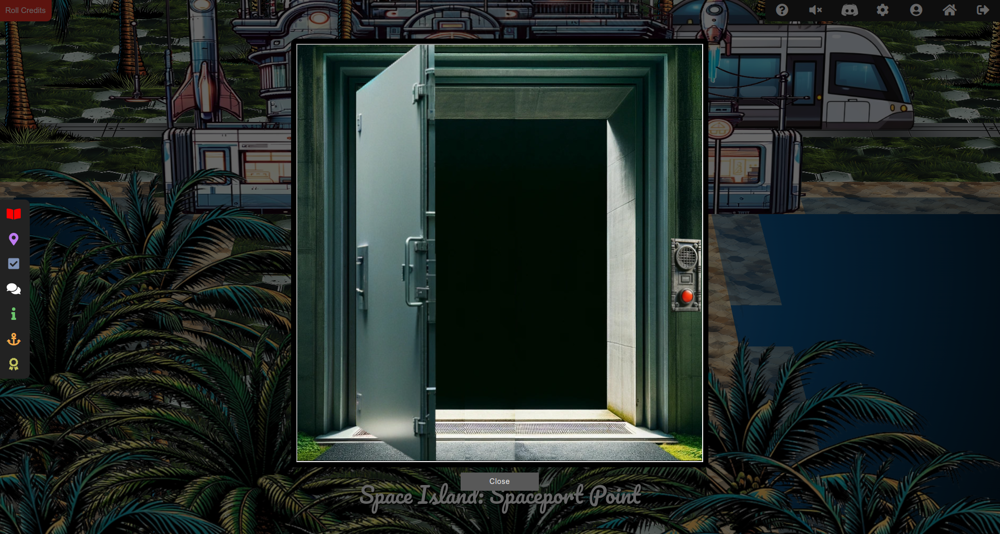

# SANS Holiday Hack Challenge 2023 - 

## Description

> There's a door that needs opening on Space Island! Talk to Jewel Loggins there for more information.

> **Jewel Loggins (Spaceport Point)**:
*What, you know the passphrase!? Let me try it!
Nope, didn't work. Knowing Wombley, the passphrase isn't the only requirement. He's all about that MFA!
Oh yeah, multi-factor authentication! The passphrase for something he knows, and his voice for something he is!
That's it! You need to be Wombley. You need his voice. Now, how are you gonna get that?
Since only us elves can get a subscription to use ChatNPT, try searching for another AI tool that can simulate voices. I'm sure there's one out there.*

> **Wombley Cube (Chiaroscuro City)**:
*Wombley Cube here, welcome to Chiaroscuro City!
Have you heard about my latest project?
I've been so inspired by these wonderful islands I've decided to write a short story!
The title? It's "The Enchanted Voyage of Santa and his Elves to the Geese Islands." Sounds exciting, right?
Here, have this [audiobook](https://www.holidayhackchallenge.com/2023/wombleycube_the_enchanted_voyage.mp3.zip) copy and enjoy the adventure at your convenience, my friend!
Consider it a welcome gift from yours truly, to make your holiday even more delightful.
Trust me, this captivating tale of fiction is going to take you on a magical journey you won't forget.
Oh, and I promise it will provide some great entertainment while you explore the rest of Geese Islands!*

### Hints

> **MFA: Something You Are**: It seems the Access Speaker is programmed to only accept Wombley's voice. Maybe you could get a sample of his voice and use an AI tool to simulate Wombley speaking the passphrase.

### Metadata

- Difficulty: 3/5
- Tags: `ai`, `voice copy`, `mfa`

## Solution

### Video

Videos are coming soon! I did not want to put them on GitHub as they are 10 - 100 MBs.
<!-- <video src="media/space-island-access-speaker.mp4" width='100%' controls playsinline></video> -->

### Write-up

Wombley Cube gives us an [audiobook](https://www.holidayhackchallenge.com/2023/wombleycube_the_enchanted_voyage.mp3.zip) ([wombleycube_the_enchanted_voyage.mp3](files/wombleycube_the_enchanted_voyage.mp3)) copy.

We can use it as a voice sample to generate arbitrary other voice recordings.



There was a hint - actually a vital information - in the `Active Directory` challenge:

```
# cat InstructionsForEnteringSatelliteGroundStation.txt
Note to self:

To enter the Satellite Ground Station (SGS), say the following into the speaker:

And he whispered, 'Now I shall be out of sight;
So through the valley and over the height.'
And he'll silently take his way.
```

We have a voice sample, we know the text which should be read / spoken, we just need to find an AI tool to do the voice cloning.

The following tool worked form me:

<https://huggingface.co/spaces/AlphaDragon/Voice-Clone>



<audio src="files/output.wav" width='100%' controls playsinline>
</audio>

If we upload the generated [output.wav](files/output.wav) file, we will get access.



> **Jewel Loggins (Spaceport Point)**:
*Are you like a master spy or something? I've only seen stuff like that in the movies!
It sure is scary what you can do with AI, huh? I sure hope ChatNPT has better guardrails in place.*