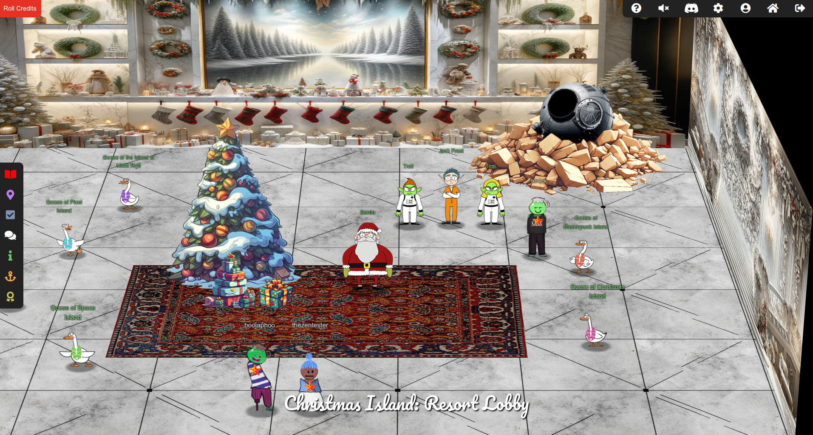

# SANS Holiday Hack Challenge 2023 - The End

If we finish all tasks (especially the last one `Missile Diversion`) we can click on the right door on `Zenith SGS` to see the final animation about our diverted missile. After that get back to the resort lobby, Santa greets us!

<!-- <video src="media/the-end.mp4" width='100%' controls playsinline></video> -->

> **Santa (Rudolph's Rest Resort Lobby Finale)**:
*You've done it! You've saved me and my sleigh from Jack Frost's dastardly plan!
I must admit, it's astonishing the lengths Jack will go to in order to try and stop the holiday season.
Even after being banished from Earth, he managed to create an AI to social engineer us into moving our holiday operations to the Geese Islands, putting us right in the path of his satellite.
And to think he even recruited one of my dear elves... I never saw that coming. Oh, Wombley...
But thanks to your incredible efforts, we've proof that Jack violated his parole, and the chances of him interfering with the holidays ever again are all but impossible!
I can't thank you enough for your help in protecting the magic and joy of this special time of year.
I'd like to wish you a most wonderful holiday season, no matter where you may be on Earth or what the weather is like.
Keep that holiday spirit alive, my friend, and remember: a little change now and then can lead to something magical!
Ho ho ho, happy holidays!*

Also there is `Jack Frost` in chains:

> **Jack Frost (Rudolph's Rest Resort Lobby Finale)**
*Okay, listen up, yes I've been caught, but let me tell you, my plan was incredible, I mean really incredible.
I and the trolls created ChatNPT, a fantastic AI, and left it behind in the North Pole in 2021 to trick Santa into moving to the Geese Islands. It worked like a charm, perfectly perfect.
My satellite was geostationary, right over the islands to maintain comms with ChatNPT, and Wombley in the gound station. It was genius. Absolute genius, really.
I was reviewing all the prompts as they were sent, and changing the responses in real time thanks to Santa's operation moving to the Geese Islands. This was very smart. Very, very, very smart, very efficient.
And Wombley, the elf, joining me? Easy. He was so easy to convince.
You see, there's a big, big dissent in Santa's ranks, huge.
The elves, they're not happy with Santa.
Mark my words, even if I don't stop Santa, his own elves will.
It's going to be tremendous, this you will see.*

And there are two troll to whom we can talk:

> **Troll 1 (Rudolph's Rest Resort Lobby Finale)**:
*Relax, bub. We're just here for Jack Frost. He broke Frostian and Earth law.
The most important condition of his parole agreement was that he’d never set foot on Earth again.
To evade the missile, his ejection pod landed on Geese Islands, so he’s back on earth, violating the explicit terms of his parole.
Don't care he wouldn't have done it if the missile coordinates weren't tampered with. Rules are rules. Jack's time on Earth is finally up. We're taking him back.
Frostian justice waits for no one. Not even Jack. End of story.
And I just really want to be able to boss him around for a change. Keh heh heh.*

> **Troll 2 (Rudolph's Rest Resort Lobby Finale)**:
*Thank you so much!
We assure you and Santa Clause that Jack Frost will be brought to justice!*

We also get the Credits. Thank you very much for the Creators and SANS! <3

<iframe width="1280" height="720" src="https://www.youtube-nocookie.com/embed/LtHHYrNxOEw?start=5582" title="SANS Holiday Hack Challenge 2023 - The End" frameborder="0" allow="accelerometer; autoplay; clipboard-write; encrypted-media; gyroscope; picture-in-picture; web-share" referrerpolicy="strict-origin-when-cross-origin" allowfullscreen></iframe>

We also get a link to by some swag: <https://holiday-hack-challenge-winners.creator-spring.com/>