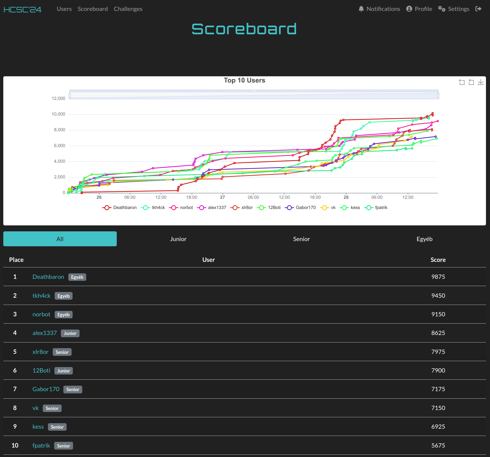
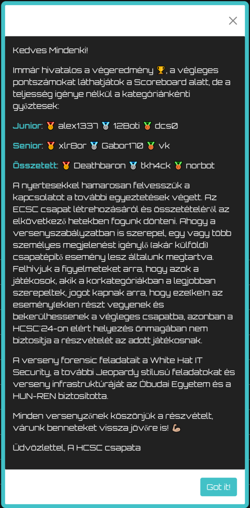

# Hungarian Cyber Security Challenge 2024 (HCSC'24)

Between 25th of April and 28th of April the 7th *Hungarian Cyber Security Challenge (HCSC)* was organized. The competition is organized by *Special Service for National Security National Cyber-Security Center (NKI)*, the challenges were created by *HoneyLab of University of Obuda* and *White Hat IT Security*.

The official website of HCSC is: <https://nki.gov.hu/en/rendezvenyek/hcsc/>

The challenges were available at: <https://ctfd.nki.gov.hu/>

Some statistics about the competition:
- 12 categories
- 36 challenges
- 500+ registered competitiors
- 73 hours of hacking
- 248 competitors submitted at least 1 flag

I achieved the presitigious 2nd place. Congratulations to all other competitiors, especially the winners of each category. And of course, many thanks to the Organizers!

Normal challenges:

- [crypto](crypto)
    - [Epiclit'l' Curve](crypto/Epiclitl-Curve/)
    - [Handy](crypto/Handy/)
- [forensics](forensics)
    - [Not a bad day](forensics/Not-a-bad-day/)
    - [Note to self](forensics/Note-to-self/)
- [malware](malware)
    - [Trampling](malware/Trampling/)
- [misc](misc)
    - [2beornot2bee](misc/2be2bee/)
    - [Esoteric Hell](misc/Esoteric-Hell/)
- [mobile](mobile)
    - [ThereOTT](mobile/ThereOTT/)
- [network](network)
    - [Csak egy litván hálózat](network/Csak-egy-litvan-halozat/)
    - [Return of Jack](network/Return-of-Jack/)
- [osint](osint)
    - [BoB](osint/BoB/)
    - [Creeper or griefer](osint/Creeper-or-griefer/)
- [pwn](pwn)
    - [Prequel](pwn/Prequel/)
    - [Prequel's revenge](pwn/Prequels-revenge/)
- [reverse](reverse)
    - [Patch Adams](reverse/Patch-Adams/)
    - [Tutorial](reverse/Tutorial/)
- [steganography](steganography)
    - [Cool o' red Met Alls](steganography/Cool-o-red-Met-Alls/)
    - [For'n sics](steganography/Forn-sics/)
    - [Sniffing](steganography/Sniffing/)
- [web](web)
    - [SeeQingeviL](web/SeeQingeviL/)
    - [Trekking](web/Trekking/)
    - [Válassz-egy-böngészőt](web/Valassz-egy-bongeszot/)
- [welcome](welcome)
    - [Welcome](welcome/Welcome/)

Forensics VM (defense) challenges:

- [Forensics intro](defense/Forensic-intro)
- [Forensics 1](defense/Forensic-1)
- [Forensics 2](defense/Forensic-2)
- [Forensics 3](defense/Forensic-3)
- [Forensics 4](defense/Forensic-4)
- [Forensics 5](defense/Forensic-5)
- [Forensics 6](defense/Forensic-6)
- [Forensics 7](defense/Forensic-7)
- [Forensics 8](defense/Forensic-8)
- [Forensics 9](defense/Forensic-9)
- [Forensics 10](defense/Forensic-10)
- [Forensics 11](defense/Forensic-11)
- [Forensics 12](defense/Forensic-12)

