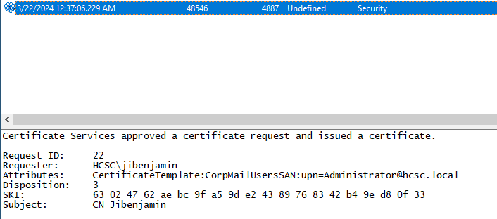

# HCSC 2024 - Forensic 11.

## Description

The Sysadmin calls you to ask, how the investigation is going on. He is pushed by the Management to take actions. He asks you, what if he changes everyone’s password in the company? Would that close out the attackers?

You already know the answer, don't you?

If the admin changes every password on 01/05/2024, - taking in count the actual state of the system - theoretically what is the last day, when the attackers are able to authenticate to the organization? As which account?

(example: `hcsc{MM/DD/YYYY_account}`) American date form!


## Metadata

- Tags: `certificate`, `certificate template`, `persistence`
- Points: `300`
- Number of solvers: `6`
- Filename: -

## Solution

Since the validity of Kerberos TGT tickets are relatively short by default (we can check this on the DC), and considering the clues we have found so far, which do not indicate that any `krbtgt`-related, e.g. *Golden Ticket*, attacks were carried out by the attacker, we should start looking at certificates, since their validity period is independent of the validity of TGTs and passwords. In the Event Log, under event id `4887`, we can find a certificate issue event where: `jibenjamin` is the *requester*, the *template* is the vulnerable `CorpMailUsers` and the *Subject (SAN)* is the `Administrator` user (so the attacker exploited the vulnerability in the certificate template identified earlier. The important thing to note for the solution is that the certificate was issued to the `Administrator` user and was issued on `2024-03-22`.Returning to the output of `Certify`, we observe that the validity period of the certificates issued by the `CorpMailUsers` certificate template is 1 year:



```
[!] Vulnerable Certificates Templates :

    CA Name                               : WIN-5T67MMTJTVE.hcsc.local\hcsc-WIN-5T67MMTJTVE-CA
    Template Name                         : CorpMailUsers
    Schema Version                        : 2
    Validity Period                       : 1 year
```

So the certificate issued will be valid until `2025-03-22` (1 year). (Expiry information can be obtained by other means.)

Flag: `hcsc{03/22/2025_Administrator}`