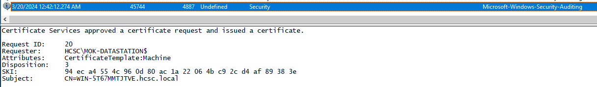

# HCSC 2024 - Forensic 12.

## Description

Almost done. Have you thought about everything? Did you look everywhere? What if they had created something, that they did have not used yet? Anyway… Could you find something, that the attackers created, but not used yet and could give them the key of the kingdom in the next step?

(example: `hcsc{accountName_FQDN.to.impersonate_CVE-exploited-for}`)


## Metadata

- Tags: `certificate`, `computer account`, `machine certificate`, `CVE-2022-26923`, `privilege escalation`
- Points: `400`
- Number of solvers: `2`
- Filename: -

## Solution

From the description of the challenge (*What if they had created something, that they did not have used yet?*), we can infer that the attacker might have uploaded a binary that they had not used yet, or created a Kerberos TGT or certificate that they had not used yet.

In the event log, we can note an interesting *4741 A computer account was created.* event initiated by `jibenjamin` and resulting in a machine named `MOK-DATASTATION$`. 

```
A computer account was created.

Subject:
	Security ID:		S-1-5-21-1585356158-2287584373-2697367087-1758
	Account Name:		jibenjamin
	Account Domain:		HCSC
	Logon ID:		0x4EB626

New Computer Account:
	Security ID:		S-1-5-21-1585356158-2287584373-2697367087-8601
	Account Name:		MOK-DATASTATION$
	Account Domain:		HCSC

Attributes:
	SAM Account Name:	MOK-DATASTATION$
	Display Name:		-
	User Principal Name:	-
	Home Directory:		-
	Home Drive:		-
	Script Path:		-
	Profile Path:		-
	User Workstations:	-
	Password Last Set:	3/20/2024 12:46:46 AM
	Account Expires:		<never>
	Primary Group ID:	515
	AllowedToDelegateTo:	-
	Old UAC Value:		0x0
	New UAC Value:		0x80
	User Account Control:	
		'Workstation Trust Account' - Enabled
	User Parameters:	-
	SID History:		-
	Logon Hours:		<value not set>
	DNS Host Name:		MOK-DATASTATION.hcsc.local
	Service Principal Names:	
		HOST/MOK-DATASTATION
		HOST/MOK-DATASTATION.hcsc.local
		RestrictedKrbHost/MOK-DATASTATION
		RestrictedKrbHost/MOK-DATASTATION.hcsc.local

Additional Information:
	Privileges		SeMachineAccountPrivilege
```

By searching for this machine name in the logs, we can see certificate enrollment and issuance events (`4887`). In the latter, it is interesting to note that the initiator is `MOK-DATASTATION$`, but the *Subject* is the DC (`WIN-5T67MMTJTVE.hcsc.local`) and the enrollment is successful.



```
Certificate Services approved a certificate request and issued a certificate.
	
Request ID:	19
Requester:	HCSC\MOK-DATASTATION$
Attributes:	CertificateTemplate:Machine
Disposition:	3
SKI:		d6 a4 27 9e 29 fe bc 60 59 6b 03 d0 0a d3 c0 72 f7 fd 13 aa
Subject:	CN=WIN-5T67MMTJTVE.hcsc.local
```

A search for a similar vulnerability will find the following page:
<https://juggernaut-sec.com/cve-2022-26923-certifried/>. The article is consistent with what we've identified in the event log, so the vulnerability that the attacker exploited to obtain a certificate on behalf of the DC is `CVE-2022-26923` (aka. *Active Directory Domain Services Elevation of Privilege Vulnerability (Certifried)*). We have the last part of the flag. Interestingly, the vulnerability was also published on the NKI site:
<https://nki.gov.hu/en/figyelmeztetesek/cve-serulekenysegek/cve-2022-26923/> 

Some citation from the `juggernaut-sec.com` page:
> CVE-2022-26923 is a privilege escalation vulnerability that affects AD CS (Active Directory Certificate Services) in an Active Directory domain environment. When AD CS is enabled, a standard user – or any user for that matter – has the ability to generate both user and computer templates. Interestingly, any certificates generated by any user will allow for authentication to the new object.<br>
> When generating a certificate for a computer object, the computer template will check that computer’s DNSHostname property, which would typically not be an issue; however, the DNSHostname does NOT need to be unique when setting up a certificate.<br>
> That means this is a huge vulnerability because any DNSHostname can be spoofed when creating a machine!<br>
> To get malicious with this, an attacker only needs to find the credentials for any one standard user in the domain. With that, they can create a computer object as the standard user and then spoof the DNSHostname of the DC. Once spoofed, the attacker can request the hash of the DC and the hash they receive is not the hash of the object they just created, but the hash of the actual DC! Next, the attacker can utilize a DCSync attack on the DC in a pass-the-hash attack to dump all of the hashes in the domain.

Flag: `hcsc{MOK-DATASTATION$_WIN-5T67MMTJTVE.hcsc.local_CVE-2022-26923}`