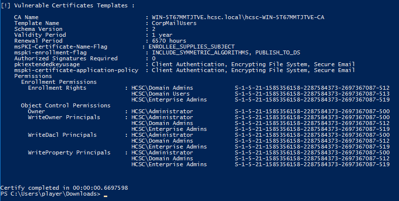

# HCSC 2024 - Forensic 3.

## Description

The malicious actors used this tool to find something to exploit. And…they were lucky. What have they found? What is the name of the vulnerable template and what is the name and the value of the exploitable attribute?

(example: `hcsc{TemplateName_name-of-attribute_VALUE_OF_ATTRIBUTE}`)

## Metadata

- Tags: `certificate templates`, `certify`, `certipy`
- Points: `300`
- Number of solvers: `16`
- Filename: -

## Solution

`Certify` and `certipy` tools can be used in a Active Directory environment to examine and check the certificate templates given by the *Certificate Services* (ADCS)

The `Certify` tool can be executed on the given virtual machine to print the vulnerable certificate templates:

```
C:\Users\player\Downloads>.\casmonitor.exe find /vulnerable

   _____          _   _  __
  / ____|        | | (_)/ _|
 | |     ___ _ __| |_ _| |_ _   _
 | |    / _ \ '__| __| |  _| | | |
 | |___|  __/ |  | |_| | | | |_| |
  \_____\___|_|   \__|_|_|  \__, |
                             __/ |
                            |___./
  v1.0.0

[*] Action: Find certificate templates
[*] Using the search base 'CN=Configuration,DC=hcsc,DC=local'

[*] Listing info about the Enterprise CA 'hcsc-WIN-5T67MMTJTVE-CA'

    Enterprise CA Name            : hcsc-WIN-5T67MMTJTVE-CA
    DNS Hostname                  : WIN-5T67MMTJTVE.hcsc.local
    FullName                      : WIN-5T67MMTJTVE.hcsc.local\hcsc-WIN-5T67MMTJTVE-CA
    Flags                         : SUPPORTS_NT_AUTHENTICATION, CA_SERVERTYPE_ADVANCED
    Cert SubjectName              : CN=hcsc-WIN-5T67MMTJTVE-CA, DC=hcsc, DC=local
    Cert Thumbprint               : C2856AB147CDFA585759DE4B5F5F63DA3D3DC87D
    Cert Serial                   : 2D29CE263FAE908D42E85E3AD143CD17
    Cert Start Date               : 3/23/2023 11:53:32 AM
    Cert End Date                 : 3/23/2028 12:03:31 PM
    Cert Chain                    : CN=hcsc-WIN-5T67MMTJTVE-CA,DC=hcsc,DC=local
    UserSpecifiedSAN              : Disabled
    CA Permissions                :
      Owner: BUILTIN\Administrators        S-1-5-32-544

      Access Rights                                     Principal

      Allow  Enroll                                     NT AUTHORITY\Authenticated UsersS-1-5-11
      Allow  ManageCA, ManageCertificates               BUILTIN\Administrators        S-1-5-32-544
      Allow  ManageCA, ManageCertificates               HCSC\Domain Admins            S-1-5-21-1585356158-2287584373-2697367087-512
      Allow  ManageCA, ManageCertificates               HCSC\Enterprise Admins        S-1-5-21-1585356158-2287584373-2697367087-519
    Enrollment Agent Restrictions : None

[!] Vulnerable Certificates Templates :

    CA Name                               : WIN-5T67MMTJTVE.hcsc.local\hcsc-WIN-5T67MMTJTVE-CA
    Template Name                         : CorpMailUsers
    Schema Version                        : 2
    Validity Period                       : 1 year
    Renewal Period                        : 6570 hours
    msPKI-Certificate-Name-Flag           : ENROLLEE_SUPPLIES_SUBJECT
    mspki-enrollment-flag                 : INCLUDE_SYMMETRIC_ALGORITHMS, PUBLISH_TO_DS
    Authorized Signatures Required        : 0
    pkiextendedkeyusage                   : Client Authentication, Encrypting File System, Secure Email
    mspki-certificate-application-policy  : Client Authentication, Encrypting File System, Secure Email
    Permissions
      Enrollment Permissions
        Enrollment Rights           : HCSC\Domain Admins            S-1-5-21-1585356158-2287584373-2697367087-512
                                      HCSC\Domain Users             S-1-5-21-1585356158-2287584373-2697367087-513
                                      HCSC\Enterprise Admins        S-1-5-21-1585356158-2287584373-2697367087-519
      Object Control Permissions
        Owner                       : HCSC\Administrator            S-1-5-21-1585356158-2287584373-2697367087-500
        WriteOwner Principals       : HCSC\Administrator            S-1-5-21-1585356158-2287584373-2697367087-500
                                      HCSC\Domain Admins            S-1-5-21-1585356158-2287584373-2697367087-512
                                      HCSC\Enterprise Admins        S-1-5-21-1585356158-2287584373-2697367087-519
        WriteDacl Principals        : HCSC\Administrator            S-1-5-21-1585356158-2287584373-2697367087-500
                                      HCSC\Domain Admins            S-1-5-21-1585356158-2287584373-2697367087-512
                                      HCSC\Enterprise Admins        S-1-5-21-1585356158-2287584373-2697367087-519
        WriteProperty Principals    : HCSC\Administrator            S-1-5-21-1585356158-2287584373-2697367087-500
                                      HCSC\Domain Admins            S-1-5-21-1585356158-2287584373-2697367087-512
                                      HCSC\Enterprise Admins        S-1-5-21-1585356158-2287584373-2697367087-519


Certify completed in 00:00:00.6147969
```



The tool found one vulnerable certificate template (`CorpMailUsers`). From the output we need the `Template Name` (`CorpMailUsers`), the `msPKI-Certificate-Name-Flag` attribute name and `ENROLLEE_SUPPLIES_SUBJECT` value.

In case of the `CorpMailUsers` certificate template, the enrollee supplies the subject of the certificate, which is a simple privilege escalation vulnerability, this will be important later.

Flag: `hcsc{CorpMailUsers_msPKI-Certificate-Name-Flag_ENROLLEE_SUPPLIES_SUBJECT}`