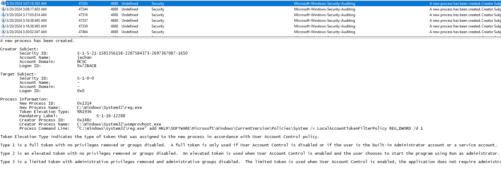

# HCSC 2024 - Forensic 4.

## Description

The attacker manipulated the Registry to handle some UAC restrictions. What is the full path of the modified registry value and which is the privileged user account taken over by the attacker and used to take this action?

(example: `hcsc{HKXX\full\registry\path\To\The\Value_privuser}`)

## Metadata

- Tags: `event log`, `4688`, `reg.exe`, `LocalAccountTokenFilterPolicy`
- Points: `300`
- Number of solvers: `18`
- Filename: -

## Solution

By analyzing the Event Log, we can find interesting process creation events (with Event Id `4688`) around the day `2024-03-20` (we know the interesting day from the previous challenges). By analyzing the events, we can see that `reg.exe` was executed several times by user `jachan` to manipulate the `Registry`. In the `Process Command Line` line you can see the key and value that was set by `reg.exe` (`LocalAccountTokenPolicy`). 

The task can also be solved by searching for `Registry` based UAC bypass solutions in Google and looking for the results in the Event Log.

Flag: `hcsc{HKLM\SOFTWARE\Microsoft\Windows\CurrentVersion\Policies\System\LocalAccountTokenFilterPolicy_jachan}`