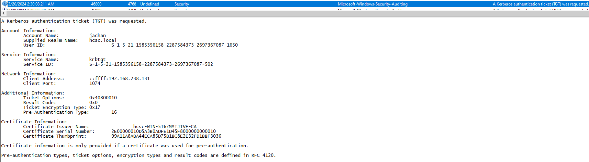

# HCSC 2024 - Forensic 5.

## Description

You are wondering, how this privileged account was taken over exactly? You already have some pieces of the puzzle, lets put them together to see the whole picture. Keeping in mind the exploited vulnerability found in challenge 3 and the name of the privileged user account found in challenge 4 you should be able to find a thumbprint which will identify the tool used for that privilege escalation.

(example: `hcsc{xx xx xx xx xx xx xx xx xx xx xx xx xx xx xx xx xx xx xx xx}` – 20 hex separated by spaces)

## Metadata

- Tags: `event log`, `4768`, `certificate`
- Points: `200`
- Number of solvers: `11`
- Filename: -

## Solution

Based on the description of the challenge, we can use the information found earlier: *certificate template vulnerabilities*, *`jachan` user*. Presumably, the solution to the problem requires a certificate thumbprint.

In an AD environment with a valid certificate we can request a Kerberos TGT. Kerberos TGT requests can be searched under event ID `4768`. By listing these events and searching for the `jachan` user or certificate-based TGT requests, we can find the certificate thumbprint used for the request, which we just need to reformat before submitting.

Flag: `hcsc{99 A1 1A 8A BA 44 EC A8 5D 75 B1 BC 8E 2E 32 FD 1B BF 30 36}`