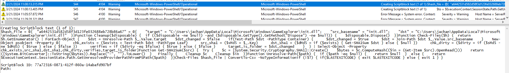

# HCSC 2024 - Forensic 6.

## Description

Which service/protocol was used by the attacker to run commands remotely on the DC? Through which port? What is the IP of the attacker machine?

(example: `hcsc{serviceShortName_port_remoteIPv4}`) – case insensitive

## Metadata

- Tags: `event log`, `4104`, `winrm`, `powershell`, `powershell remoting`
- Points: `400`
- Number of solvers: `8`
- Filename: -

## Solution

By analyzing the *PowerShell Event Log*, we can find events with ID `4104`, which refer to the *PowerShell Remoting* technique. This allows you to run *PowerShell* commands on a remote machine. The communication between the machines is done through the WinRM TCP port, which is port `5985`. So the first half of the solution is `winrm` and `5985`.

The IP address can be taken from the TGT request event in the previous challenge, for example. The solution is `192.168.238.132`. If you look for login events before running *PowerShell*, we can also find the IP address.

Flag: `hcsc{winrm_5985_192.168.238.132}`