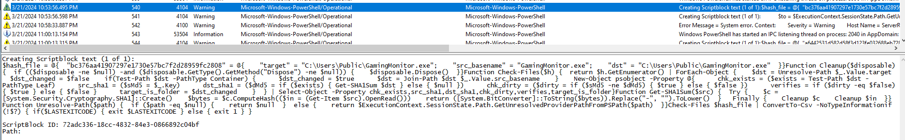
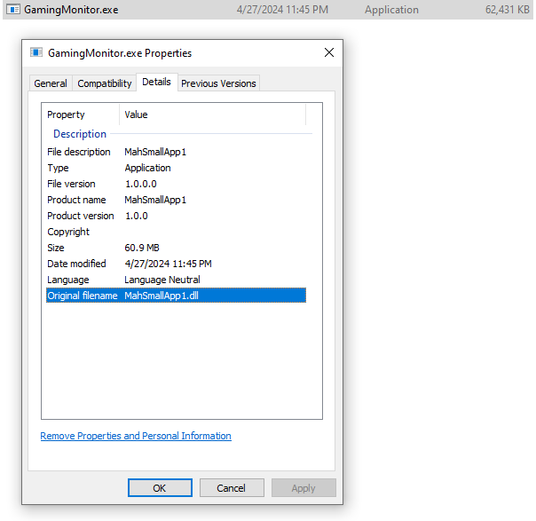

# HCSC 2024 - Forensic 7.

## Description

After a successful first attack phase, hackers worked to create some kind of persistence and functionality that would lead them to their goal. Let’s go to hunt for loaders, trojans and payloads! First we need a loader, what is the full path where it was copied to and its original name?

(example: `hcsc{C:\path\to\loader.exe_origname.extension}`)

## Metadata

- Tags: `event log`, `powershell`
- Points: `300`
- Number of solvers: `17`
- Filename: -

## Solution

By analyzing the *PowerShell Operational* events identified in the previous challenge, we can find an important command that copies `GamingMonitor.exe` to the `C:\Users\Public\` folder. In addition, we can find the file itself in this folder on the given machine.



```powershell
Creating Scriptblock text (1 of 1):
$hash_file = @{
  "bc376aa41907297e1730e57bc7f2d28959fc2808" = @{
    "target" = "C:\Users\Public\GamingMonitor.exe";
    "src_basename" = "GamingMonitor.exe";
    "dst" = "C:\Users\Public\GamingMonitor.exe"
  }
}

Function Cleanup($disposable) {
  if (($disposable -ne $null) -and ($disposable.GetType().GetMethod("Dispose") -ne $null)) {
    $disposable.Dispose()
  }
}

Function Check-Files($h) {
  return $h.GetEnumerator() | ForEach-Object {
    $dst = Unresolve-Path $_.Value.target
    $dst_changed = $false
    if(Test-Path $dst -PathType Container) {
      $dst_changed = $true
      $dst = Join-Path $dst $_.Value.src_basename
    }
    New-Object psobject -Property @{
      chk_exists = ($exists = Test-Path $dst -PathType Leaf)
      src_sha1 = ($sMd5 = $_.Key)
      dst_sha1 = ($dMd5 = if ($exists) { Get-SHA1Sum $dst } else { $null })
      chk_dirty = ($dirty = if ($sMd5 -ne $dMd5) { $true } else { $false })
      verifies = if ($dirty -eq $false) { $true } else { $false }
      target_is_folder = $dst_changed
    }
  } | Select-Object -Property chk_exists,src_sha1,dst_sha1,chk_dirty,verifies,target_is_folder
}

Function Get-SHA1Sum($src) {
  Try {
    $c = [System.Security.Cryptography.SHA1]::Create()
    $bytes = $c.ComputeHash(($in = (Get-Item $src).OpenRead()))
    return ([System.BitConverter]::ToString($bytes)).Replace("-", "").ToLower()
  } 
  Finally {
    Cleanup $c
    Cleanup $in
  }
}

Function Unresolve-Path($path) {
  if ($path -eq $null) {
    return $null
  }
  else {
    return $ExecutionContext.SessionState.Path.GetUnresolvedProviderPathFromPSPath($path)
  }
}

Check-Files $hash_file | ConvertTo-Csv -NoTypeInformation

if (!$?) { if($LASTEXITCODE) { exit $LASTEXITCODE } else { exit 1 } }
```

In `C:\Users\Public\GamingMonitor.exe`, right click on `Properties` and under `Details` the `Original filename` property will give the second half of the answer (`MahSmallApp1.dll`).



Flag: `hcsc{C:\Users\Public\GamingMonitor.exe_MahSmallApp1.dll}`