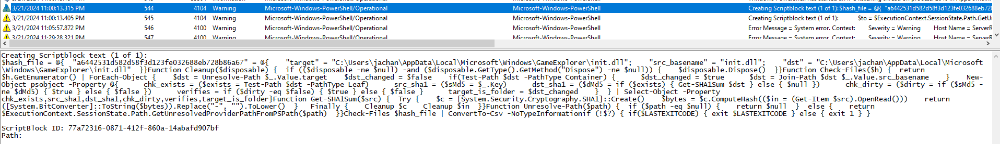

# HCSC 2024 - Forensic 8.

## Description

Have you tried to figure out what our loader is loading actually? It seems to be tricky… So, let’s hunt down that mystery! Where is our trojan and how it is loaded? How it persists to realize regular data theft?

(example: `hcsc{FULLPATH\OF\THE\KEY\OF\PERSISTENCE_C:\Path\to\trojan.ext}`)


## Metadata

- Tags: `event log`, `powershell`, `persistence`, `DOTNET_STARTUP_HOOKS`, `sysmon`
- Points: `500`
- Number of solvers: `11`
- Filename: -

## Solution

When we execute `GamingMonitor.exe` and monitor the execution  with, for example, *Process Monitor*, we might notice that it also tries to use the `C:\Users\jachan\AppData\Local\Microsoft\Windows\GameExplorer\init.dll` file. This file is present in the PowerShell event logs too. 



Interestingly, the `DOTNET_STARTUP_HOOKS` environment variable has the value equal to this path. This environment variable allows anyone to load a .NET DLL and execute some of its functions when any .NET application is executed on the system (a possible implementation of persistence). The environment variables are located in the Registry under `HKLM\System\CurrentControlSet\Control\Session Manager\Environment`.
The task can also be solved by analyzing `Sysmon` events. The following event can be found in the `Microsoft-Windows-Sysmon%4Operational.evtx` file:

```
$ strings -e l Microsoft-Windows-Sysmon%4Operational.evtx | grep DOTNET
Microsoft-Windows-Sysmon/Operational
technique_id=T1546.008,technique_name=Accessibility Features
SetValue
2024-03-21 23:02:51.450
C:\Windows\system32\wsmprovhost.exe
HKLM\System\CurrentControlSet\Control\Session Manager\Environment\DOTNET_STARTUP_HOOKS
C:\Users\jachan\AppData\Local\Microsoft\Windows\GameExplorer\init.dll
HCSC\jachan
```

Flag: `hcsc{HKLM\System\CurrentControlSet\Control\Session Manager\Environment\DOTNET_STARTUP_HOOKS_C:\Users\jachan\AppData\Local\Microsoft\Windows\GameExplorer\init.dll}`