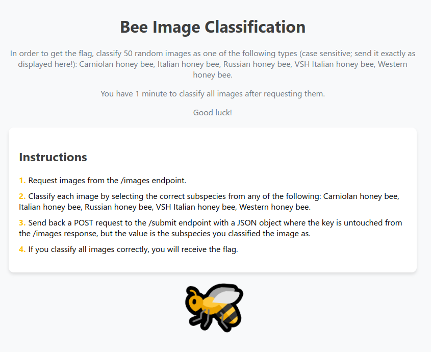

# HCSC 2024 - 2be||!2bee

## Description

Emlékeztek a tavalyi qbittorrent honeypotra? Ahogy a mondás tartja: *ahol csupor, ott méh is van*! Ahogy egy új honeypoton dolgoztam, megtámadott néhány méh. Ezzel csak az a probléma, hogy allergiás vagyok az olasz méhekre. Pontosan tudnom kell, hogy melyik méh milyen, hogy később megmondhassam a háziorvosnak. Csináltam pár képet róluk. Tudnál segíteni nekem?

Útmutatót keresel? Minden, amire szükséged lehet, el van magyarázva. Csak találd meg a szolgáltatást!

Kéne egy GPU? Bár senki nem állítja, hogy szükséges a feladat megoldásához (ezt Neked kell eldöntened), ha úgy gondolod, hogy szükséged van egyre, ajánlom a [Google Colabot](https://colab.research.google.com/) ingyenes GPU hozzáféréshez, illetve úgy tűnik, a [Kaggle](https://www.kaggle.com/code/dansbecker/running-kaggle-kernels-with-a-gpu) is kínál ingyenesen hozzáférést. Bár a feladat szerzője az utóbbit soha nem próbálta ki.

Készítői kommentek:
* a megoldáshoz szerver oldali brute-force nem szükséges
* VPN kapcsolat szükséges
* a challenge egyetlen porton fut

**Flag formátum**: `HCSC24{...}`

*By MJ*

> Hint 1 (cost 225): A JSON válaszod tuti egy dictionary "token": "méhtípus" értékpárokkal? Biztos ML-t akarsz használni? Meg lehet oldani azzal is, de akkor tényleg kell egy classifier.

## Metadata

- Tags: `bees`, `classification`, `kaggle`, `md5`
- Points: `450`
- Number of solvers: `21`
- Filename: -

## Solution

The challenge was running on `http://10.10.(1-9).11:53369`.



```
1. Request images from the /images endpoint.
2. Classify each image by selecting the correct subspecies from any of the following: Carniolan honey bee, Italian honey bee, Russian honey bee, VSH Italian honey bee, Western honey bee.
3. Send back a POST request to the /submit endpoint with a JSON object where the key is untouched from the /images response, but the value is the subspecies you classified the image as.
4. If you classify all images correctly, you will receive the flag.
```

At the `/images` endpoint we get 50 base64 encoded images of different bee subspecies. We have to classify them correctly and send back the correct subspecies for each.

If we seach for a bee image dataset on Google we can find the following Kaggle dataset: <https://www.kaggle.com/datasets/jenny18/honey-bee-annotated-images/data>. In the `Code` submenu, there are many pretrained models available, we can use these models for classification. However, I tried a different path first: I assumed that the creator of the challenge used the same dataset (as there are not many annotated bee image datasets :D). 

1. I downloaded the images and the CSV annotations from Kaggle.
2. Requested 50 images for classification.
3. Calculated the MD5 hashes of these images and tried to find a maching MD5 hash from the dataset.
4. If there was a match, I looked up the subspecies label of the matching image and sent it back to the server.
5. I got the flag.

The solution script ([`solve.py`](files/solve.py)):

```python
import requests
import hashlib
import base64
import pandas as pd

# Download the dataset from https://www.kaggle.com/datasets/jenny18/honey-bee-annotated-images/data

unknown_bees = requests.get('http://10.10.5.11:53369/images').json()

honey_bee_df=pd.read_csv('bee_data.csv')
honey_bee_df = honey_bee_df.loc[honey_bee_df['subspecies'].isin(["Carniolan honey bee", "Italian honey bee", "Russian honey bee", "VSH Italian honey bee", "Western honey bee"])]

def get_md5(filename):
    img = open(f'bee_imgs/bee_imgs/{filename}', 'rb').read()
    return hashlib.md5(img).hexdigest()

hashes = honey_bee_df['file'].apply(get_md5)
honey_bee_df = honey_bee_df.assign(md5=hashes)

result = {}
for unknown_bee in unknown_bees:
    id, img = list(unknown_bee.items())[0]
    hash = hashlib.md5(base64.b64decode(img)).hexdigest()
    subspecies = honey_bee_df.loc[honey_bee_df['md5'] == hash]['subspecies'].values[0]
    result[id] = subspecies

print(result)
r = requests.post('http://10.10.5.11:53369/submit', json=result)
print(r.content)
```

```
$ python solve.py
b'Congratulations! Here is the flag: HCSC24{d1d_y0u_f1nd_th3_d4t4s3t_4nd_h4shed_or_d1d_u_use_ml?}'
```

The official write-up by `MJ` is available at: <https://github.com/NIK-SOC/hcsc_2024_mj/tree/main/ctf-2beornot2bee>

The solution from `fadedave` is at [fadedave-solution.ipynb](files/fadedave-solution.ipynb).

Flag: `HCSC24{d1d_y0u_f1nd_th3_d4t4s3t_4nd_h4shed_or_d1d_u_use_ml?}`
