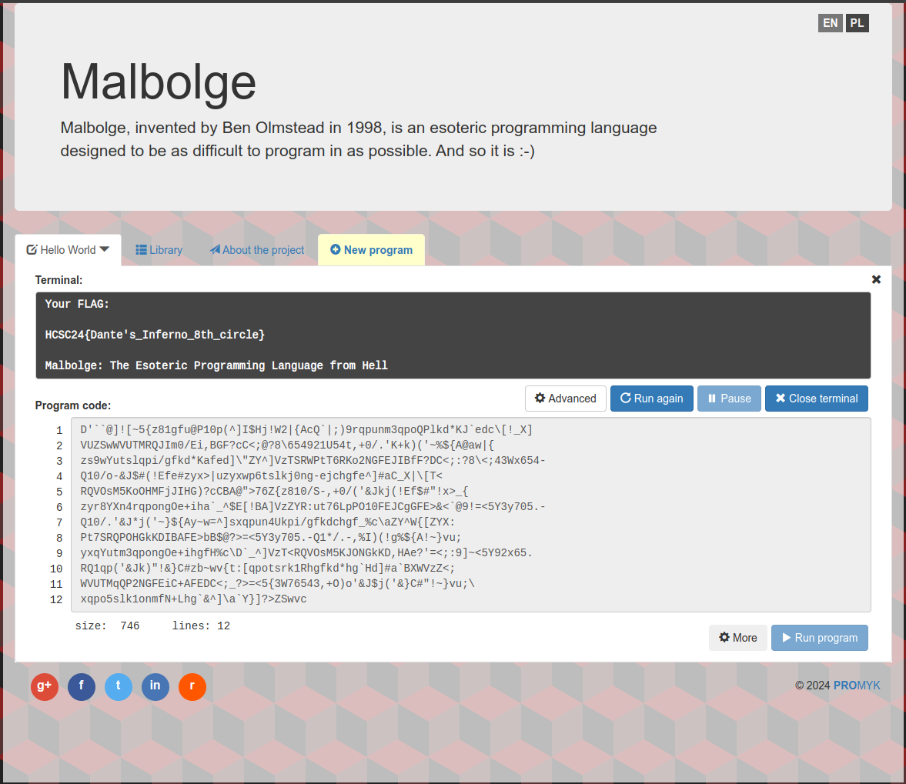

# HCSC 2024 - Esoteric Hell

## Description

Kiugró üdvözlet a mélyből!

Csak a zip file letöltése szükséges!

A flag formátuma: `HCSC24{...}`

> Hint 1 (cost 175): Született: 1998. Nem BOB, Ben!<br>
Brainfuck trónfosztás

## Metadata

- Tags: `esolang`, `malbolge`
- Points: `350`
- Number of solvers: `61`
- Filename: [`esoteric_hell.txt`](files/esoteric_hell.txt)

## Solution

We have a message written in some [esolang](https://esolangs.org/wiki/Main_Page):

```
D'``@]![~5{z81gfu@P10p(^]I$Hj!W2|{AcQ`|;)9rqpunm3qpoQPlkd*KJ`edc\[!_X]
VUZSwWVUTMRQJIm0/Ei,BGF?cC<;@?8\654921U54t,+0/.'K+k)('~%${A@aw|{
zs9wYutslqpi/gfkd*Kafed]\"ZY^]VzTSRWPtT6RKo2NGFEJIBfF?DC<;:?8\<;43Wx654-
Q10/o-&J$#(!Efe#zyx>|uzyxwp6tslkj0ng-ejchgfe^]#aC_X|\[T<
RQVOsM5KoOHMFjJIHG)?cCBA@">76Z{z810/S-,+0/('&Jkj(!Ef$#"!x>_{
zyr8YXn4rqpongOe+iha`_^$E[!BA]VzZYR:ut76LpPO10FEJCgGFE>&<`@9!=<5Y3y705.-
Q10/.'&J*j('~}${Ay~w=^]sxqpun4Ukpi/gfkdchgf_%c\aZY^W{[ZYX:
Pt7SRQPOHGkKDIBAFE>bB$@?>=<5Y3y705.-Q1*/.-,%I)(!g%${A!~}vu;
yxqYutm3qpongOe+ihgfH%c\D`_^]VzT<RQVOsM5KJONGkKD,HAe?'=<;:9]~<5Y92x65.
RQ1qp('&Jk)"!&}C#zb~wv{t:[qpotsrk1Rhgfkd*hg`Hd]#a`BXWVzZ<;
WVUTMqQP2NGFEiC+AFEDC<;_?>=<5{3W76543,+O)o'&J$j('&}C#"!~}vu;\
xqpo5slk1onmfN+Lhg`&^]\a`Y}]?>ZSwvc
```

If we search for the first few characters on Google (`esolang D'``@] esolang, the challenge name is also a hint:

> The language is named after Malebolge [sic], the eighth level of hell in Dante's Inferno, which is reserved for perpetrators of fraud. The actual spelling Malbolge is also used for the sixth hell in the Dungeons and Dragons roleplaying game.

We just need to find an interpreter for it for example: <https://malbolge.doleczek.pl/>. It gives the following output:

```
Your FLAG:

HCSC24{Dante's_Inferno_8th_circle}
```



Flag: HCSC24{Dante's_Inferno_8th_circle}