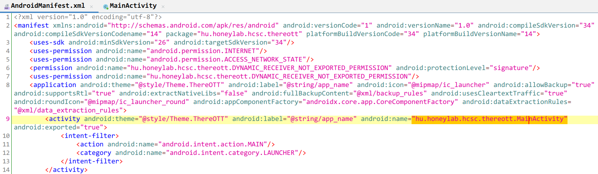
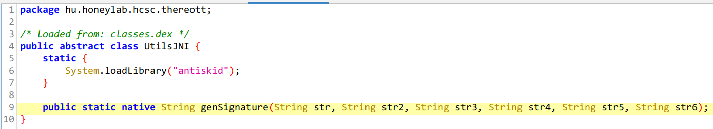
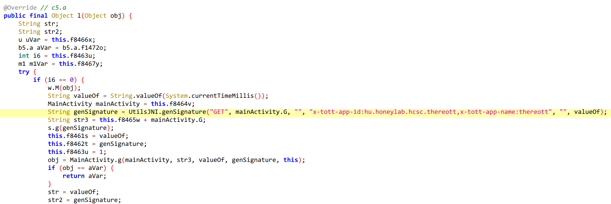
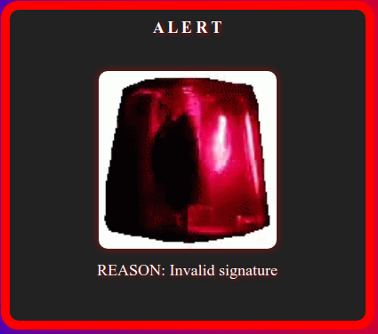

# HCSC 2024 - ThereOTT

## Description

Töltsd le a legújabb alkalmazásomat és szórakozz a legújabb beteg mémeken! 🤪

Sajna semmi se fenékig tejfel, nyilván ezt a szolgáltatást is elkezdték támadni a script kiddiek. És bár a backendem szupergyors, ez okozott némi kimaradást, mivel a kiszolgált videók elég nagyok és elszaturálták a linkemet. Ezért egy forradalmi DDoS védelmi megoldással álltam elő! Eddig tökéletesen működött, SENKI sem tudta feltörni. De ha neked mégis sikerülne, akkor egy tonna dellát ajánlok figyelmedbe challenge pontok formájában! Van egy `/flag` végpont a lelkes bughuntereknek. Küldj rá egy sikeres kérést, küldd el a bizonyítékot, és keresd meg a bugbounty manit!

Még egy boilerplate kódot is adok neked, ez az állapot még a DDoS protection implementálása előtt működött. Ezt kell módosítanod, hogy pontokban gazdag legyél!

```py
import requests

url = "http://replacehost:replaceport"

def main():
    r = requests.post(url + "/flag", data="flag")
    print(r.text)

if __name__ == "__main__":
    main()
```

Készítői kommentek:
* a megoldáshoz szerver oldali brute-force nem szükséges
* a megoldáshoz fizikai Android telefonnal rendelkezni nem szükséges
* az alkalmazás nem kártékony, futtathatod bármilyen eszközön, ha úgy érzed, hogy ez feltétlenül szükséges
* VPN kapcsolat szükséges
* A jelenlegi `app-release.apk` sha256sum hash-e: `d00ec897ffe66d102e47d7cb399ed84075fe96859c190904b49943e08a1d1d2f`
* a challenge egyetlen porton fut

Hasznos lehet:
* https://github.com/skylot/jadx
* https://developer.android.com/studio/run/emulator
* https://apktool.org/
* https://frida.re/docs/android/
* https://stuff.mit.edu/afs/sipb/project/android/docs/tools/help/logcat.html
* https://play.google.com/store/apps/details?id=net.openvpn.openvpn&hl=en&gl=US

**Flag formátum**: `HCSC24{...}`

*By MJ*

> Hint 1 (cost 200): Láttad a binárisokat? Lehet nem akarod te azt statikusan visszafejteni.


## Metadata

- Tags: `Android`, `frida`, `hooking`
- Points: `400`
- Number of solvers: `17`
- Filename: [`app-release.apk`](files/app-release.apk)

## Solution

If we decompile the APK in `jadx-gui` we can see in the `AndroidManifest.xml` that the `MainActivity` is `hu.honeylab.hcsc.hereott.MainActivity`.



There is also a `hu.honeylab.hcsc.hereott.UtilsJNI` class referencing a native `genSignature` method from `antiskid` library.

```java
package hu.honeylab.hcsc.thereott;

/* loaded from: classes.dex */
public abstract class UtilsJNI {
    static {
        System.loadLibrary("antiskid");
    }

    public static native String genSignature(String str, String str2, String str3, String str4, String str5, String str6);
}
```



In `u4.e.l()` method we can see a call to this `genSignature` method:

```java
[...]
String valueOf = String.valueOf(System.currentTimeMillis());
MainActivity mainActivity = this.f8464v;
String genSignature = UtilsJNI.genSignature("GET", mainActivity.G, "", "x-tott-app-id:hu.honeylab.hcsc.thereott,x-tott-app-name:thereott", "", valueOf);
String str3 = this.f8465w + mainActivity.G;
s.g(genSignature);
this.f8461s = valueOf;
this.f8462t = genSignature;
this.f8463u = 1;
obj = MainActivity.g(mainActivity, str3, valueOf, genSignature, this);
[...]
```



`mainActivity.G` is `/api/video.mp4` and the `valueOf` variable is the current time in milliseconds so we know all parameters given to `UtilsJNI.genSignature()`.

Let's install the application on an emulator, proxy the traffic with Burp and see what happens:

```
GET /api/video.mp4 HTTP/1.1
x-timestamp: 1714142417096
x-signature: ObCe/zUJGXmH/eUE5bsPUHVELok=
x-tott-app-id: hu.honeylab.hcsc.thereott
x-tott-app-name: ThereOtt
Host: 10.10.8.11:7385
Connection: close
Accept-Encoding: gzip, deflate, br
User-Agent: okhttp/4.9.3


```

```
HTTP/1.1 200 OK
Content-Type: text/plain
Date: Fri, 26 Apr 2024 14:55:13 GMT
Content-Length: 41
Connection: close

http://10.10.8.11:7385/assets/amAD1Rv_460sv.webm.mp4
```

A `GET` request is sent to `/api/video.mp4` with four interesting headers and we get back a URL to a video, which is downloaded and played by the application.

Here I thought the signature generation was the important part and I completely forgot the boilerplate code given in the description. I started reverse engineering the two native binaries `libantiskid.so` and `libutils.so`. The `libutils.so` is used by `libantiskid.so` to generate the signature which is basically an `HMAC-SHA1` and it was written in `Go`. It was a pain in the ass to reverse engineer and for some reason I could not hook the internal native functions with `frida` (only some). I though that this challenge should not be this hard, so I went back to the backend and ran `feroxbuster`:

```
$ feroxbuster -u http://10.10.1.11:7385/
[...]
204      GET        0l        0w        0c Auto-filtering found 404-like response and created new filter; toggle off with --dont-filter
301      GET        2l        3w       43c http://10.10.1.11:7385/assets => http://10.10.1.11:7385/assets/
404      GET        1l        4w       19c Auto-filtering found 404-like response and created new filter; toggle off with --dont-filter
400      GET       86l      205w     2022c http://10.10.1.11:7385/flag
```

There is a `/flag` (which is also suggested by the given boilerplate code). However, we cannot get or post the endpoint because it requires a valid signature. If the signature is not correct the server sends a `400 Bad Request`:



Here we have to paths: understand the signature generation and reimplement it (the hard way) or reuse the existing functions and call them with `frida` (the easy way).

We already know some of the parameters needed to generate the signature:

```java
UtilsJNI.genSignature(
    "GET",                                                                  // method
    "/api/video.mp4",                                                       // path
    "",                                                                     // unknown (maybe the query string)
    "x-tott-app-id:hu.honeylab.hcsc.thereott,x-tott-app-name:thereott",     // some headers
    "",                                                                     // unknown (maybe the request data in case of POST)
    timestamp                                                               // timestamp, has to be equal to the x-timestamp header
);
```

Let's create a `frida` script which calls this method with some parameters and prints out the result (we need to use `POST` as suggested by the boilerplate code, but the backend also hints this):

```javascript
Java.perform(function() {
    var utilsjni = Java.use('hu.honeylab.hcsc.thereott.UtilsJNI')
    console.log(utilsjni.genSignature("GET", "/flag", "", "x-tott-app-id:hu.honeylab.hcsc.thereott,x-tott-app-name:thereott", "", "1"))
});
```

Start the application and then:

```
$ frida -U -F -l hook.js
[...]
   . . . .   Connected to Android Emulator 5554 (id=emulator-5554)
7Ndu8RQGaOjvpLY7rNWa4evoBm4=
[Android Emulator 5554::ThereOTT ]->
```

We have a signature. Now we can repeat the previous request and Burp, we just have to modify the request (method, path, headers). However, the answer is:

```
Almost! :) But be sure to post "flag" to this endpoint
```

It seems that we have to use `POST` and the body should contain `flag`:

```javascript
Java.perform(function() {
    var utilsjni = Java.use('hu.honeylab.hcsc.thereott.UtilsJNI')
    console.log(utilsjni.genSignature("POST", "/flag", "", "x-tott-app-id:hu.honeylab.hcsc.thereott,x-tott-app-name:thereott", "flag", "1"))
});
```

Let's run it again, change the headers, profit!

```
POST /flag HTTP/1.1
x-timestamp: 1
x-signature: wqB5FlhLbQ1Dl/X+dn5Pn4dW3F4=
x-tott-app-id: hu.honeylab.hcsc.thereott
x-tott-app-name: ThereOtt
Host: 10.10.1.11:7385
Connection: close
Accept-Encoding: gzip, deflate, br
User-Agent: okhttp/4.9.3
Content-Length: 4

flag
```

```
HTTP/1.1 200 OK
Content-Type: text/plain
Date: Fri, 26 Apr 2024 14:55:27 GMT
Content-Length: 34
Connection: close

HCSC24{3v3n_n@t1v3s_c4n_b3_h00k3d}
```

The official write-up by `MJ` is available at: <https://github.com/NIK-SOC/hcsc_2024_mj/tree/main/ctf-thereott>

Flag: `HCSC24{3v3n_n@t1v3s_c4n_b3_h00k3d}`