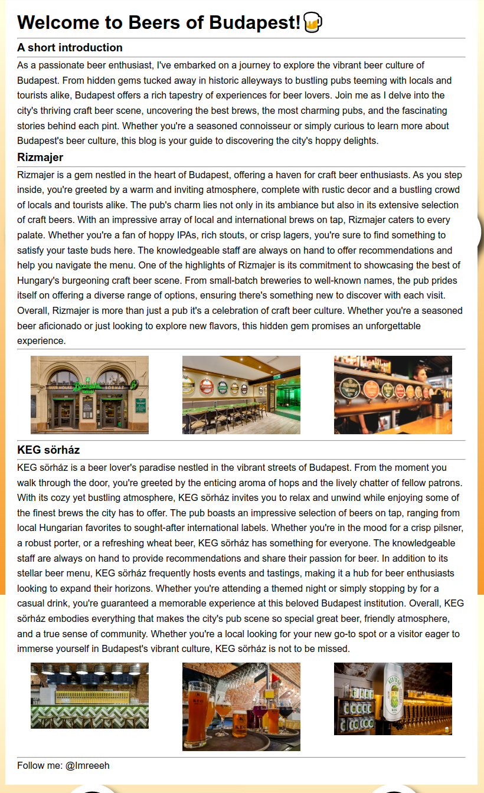

# HCSC 2024 - BoB

## Description

# BoB

Minden magyar szereti a söröket, de vannak akik ezt túlzásba viszik. 
Egy ismert sörkóstolót csalásért köröznek, szinte felszívódott, de volt egy oldala ami úgy tűnik már nem létezik. 
Azért megadom hátha tudsz vele kezdeni valamit.
https://beersofbudapest.blog

Készítői kommentek:
- VPN kapcsolat szükséges
- A challenge-nek egy portja van
- A flag-et pontosan kell beírni

By: `incarrnati0n`

> Hint 1 (cost 150): Próbáltad már wayback machine-t?

## Metadata

- Tags: `web archive`, `archive.org`, `instagram`, `ssh`
- Points: `300`
- Number of solvers: `20`
- Filename: -

## Solution

If we open the website we are greeted by a `Vercel` `404 Not Found` page.


Let's search on `Wayback Machine`, we might get an older snapshot: <https://web.archive.org/web/20240000000000*/https://beersofbudapest.blog/>

Indeed we have a few snapshots.


Looking at all of them we can find an interesting handle: <https://web.archive.org/web/20240412161140/https://beersofbudapest.blog/>



The handle is `@imreeeh`.

We can use many sites listed in the [`Awesome OSINT GitHub`](https://github.com/jivoi/awesome-osint?tab=readme-ov-file#-username-check) page to find social media account with this handle, for example there is an [Instagram account](https://www.instagram.com/imreeeh/) (the related post is already deleted).

When I was looking at the challenge during the first day of the competition the relevant post which was required to solve the challenge had not been posted by mistake so I've spent hours looking everywhere else because the Instagram account looked legit and there was no connection to the storyline.

There was an official announcement after 2 days that the challenge was fixed.


I think it was misleading and I only checked the Instagram account again during the last day.

Nevertheless, there was a new post:


We can see that the username is `incarrnati0n` and the description of the post suggest that the person used credential mirroring. It is not 100% straightforward, but the password might be the reversed version of the username: `n0itanrracni`.

The challenge description suggested that we need VPN connection to solve the challenge and the only remaining unused service was: `10.10.(1-9).10:8746`, `OpenSSH 8.9p1 Ubuntu 3ubuntu0.6 (Ubuntu Linux; protocol 2.0)`

We have some credetials so let's try to log in:

```
$ ssh incarrnati0n@10.10.3.10 -p 8746
incarrnati0n@10.10.3.10's password:
Welcome to Ubuntu 24.04 LTS (GNU/Linux 4.19.0-26-cloud-amd64 x86_64)
[...]
$ ls
flag.txt
$ cat flag.txt
FLAG: HCSC24{Th3Re_1s_No_0Nly_1_b33r}$
```

Flag: `HCSC24{Th3Re_1s_No_0Nly_1_b33r}`