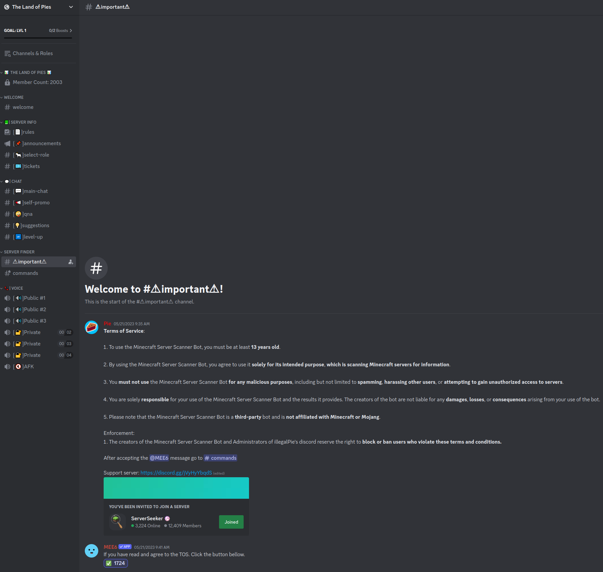
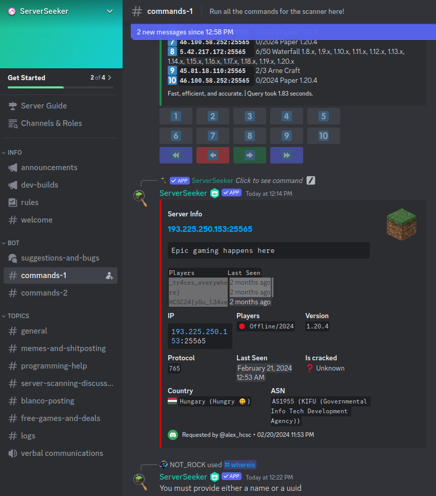

# HCSC 2024 - Creeper or griefer?

## Description

Készítettem egy Minecraft szervert (`1.20.4`) a haveroknak. Kezdetben Hamachi segítségével működött, de hamar késleltetési problémákba ütköztünk. Egy YouTube tutorial alapján áttértem egy VPS-re, és saját port forwardot konfiguráltam, ami jelentősen javította a teljesítményt. Azonban még aznap rövid időre csatlakozott egy ismeretlen játékos, és azóta ismeretlen játékosok tömkelege csatlakozik a szerverünkhöz. A teljes mapot láva és TNT pusztította, ami hackertámadásra engedett gyanakodni. Közel egy hónapra leállítottam a szervert, és végül eladtam a VPS-t, de nagyon szeretném kideríteni, hogy ki áll a rosszindulatú trollkodás mögött. Lehet tényleg csak a creeperek keltek önálló életre? Tudsz segíteni?

**Az IP-cím, ahol a szerver futott**: `193.225.250.153`

**MEGJEGYZÉS**: **Kérlek, ne próbálj meg semmilyen szolgáltatást elérni a megadott IP-címen.** A szerveren már biztosan nem fogod megtalálni a Minecraft szervert. A challenge nem az adott IP feltöréséről, hanem a szerverre vonatkozó információk gyűjtéséről szól. **A jogosulatlan hozzáférés vagy támadás bármilyen formája törvénybe ütközik!**

Készítői kommentek:
* a flag lehetséges, hogy darabokban van, a megfelelő összeillesztés a játékos feladata
* VPN kapcsolat nem szükséges

**Flag formátum**: `HCSC24{...}`

*By MJ*

> Hint 1 (cost 125): "its happened two times, it joins my server and then leaves in the next second, the two times it had happened,he joined when none of my friends had joined yet,but i saw it on the server console,i oppened my ports to my friends to be able to join, but how does he knows my ip? i try to locate its ip and it lead me to a server in germany, its probably a bot, but i want to know if anyone else have seen it." 
<https://youtu.be/JdfHFc85Zow>

## Metadata

- Tags: `Minecraft`, `Discord`
- Points: `250`
- Number of solvers: `19`
- Filename: -

## Solution

**I was only able to solve this with the hint, but after that it was somewhat straightforward.**

The hint contains a youtube link: <https://youtu.be/JdfHFc85Zow>

The video is about sneaking into private Minecraft servers using a Discord bot available via the `The Land of Pies` Discord server: <https://discord.com/invite/uUnXV8X2jw>

There is a `Server Finder` category with an `Importnant` channel were we can join to another `Discord` server called `Server Seeker`: <https://discord.gg/jVyHyYbqdS>

On the `Server Seeker` server there is a `Bot` category with a `command-1` channel. We can search for the IP address (`193.225.250.153`) on the channels and luckily for us `alex_hcsc` already searched for the server using the command: `/servers online: false ip_range: 193.225.250.153`.

The official write-up by `MJ` is available at: <https://github.com/NIK-SOC/hcsc_2024_mj/tree/main/ctf-creeper_or_griefer>

Flag: `HCSC24{y0u_l34ve_tr4ces_everywhere}`