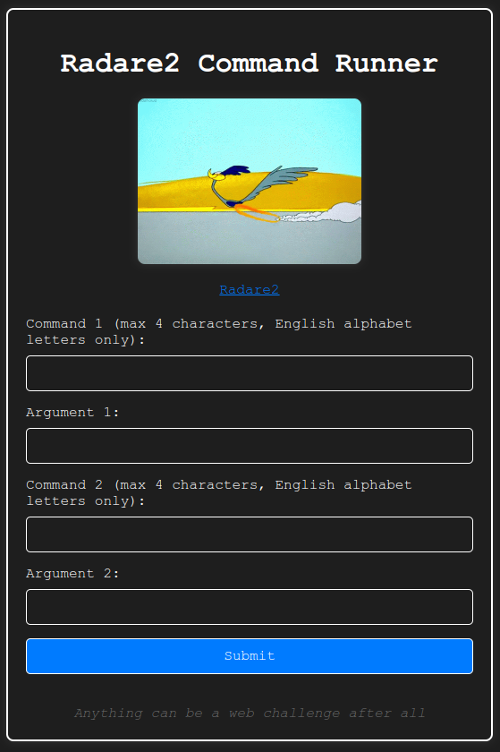

# HCSC 2024 - Patch Adams

## Description

**Kérlek kezdd a megoldást a Tutoriallal! Ott vannak leírva a fontos infók!**

Üdvözlet bajnokom! Ásót, kapát, kalapácsot elő, visszafejtésre fel! Számtalan hasznos eszköz lapul egy igazán jó hacker eszköztárában. Van nekünk ghidránk, IDA-nk, binutils-unk, gdb-nk, radare2-nk *ésatöbbi*. Nincs jó hacker radare2 tudás nélkül. Hogy ne unatkozz, össze is dobtam Neked egy környezetet, ahol kiélheted minden reverse engineering vágyad, amiről eddig csak álmodtál. Nézzük, hogy megtalálod-e a flaget!

**A feladat forráskódjának egy részét csatoltuk!** Jelenlegi `main.go` sha256sum: `6dcbb947247ef67fe3ddf30fd441f624b13bb0b058e4f6a6fee2815344e5f2da`

**Flag formátum**: `HCSC24{...}`

Köszönet kocka-nak a `radare2` inspirációért!

*By MJ*

> Hint 1 (cost 100): Nincs valami fv, ami kiolvasná a flaget?

## Metadata

- Tags: `radare2`, `patching`
- Points: `200`
- Number of solvers: `24`
- Filename: [`main.go`](files/main.go)

## Solution

We have a website and a `main.go` file. Through the website we can send two `radare2` commands, which is executed by the server on a binary. Then the server runs the binary. 



The important parts of `main.go` are the following:

```go
r2Commands := []string{
    "oo+",
    "e cfg.sandbox=all", // idea from pancake
    "aaaa",
    fmt.Sprintf("%s %s", command1, argument1),
    fmt.Sprintf("%s %s", command2, argument2),
}
[...]
randomName := fmt.Sprintf("/tmp/adams_%d", rand.Intn(10000))
err := copyFile("adams", randomName)
[...]
r2Output, err := executeR2Commands(randomName, r2Commands)
[...]
cmd := exec.Command(randomName)
cmd.Stderr = os.Stderr
output, err := cmd.Output()
```

First, we want to understand the `adams` binary. We can get the complete disassembly of the binary using `pd`, but first `seek` to `0x00`:

```bash
$ curl 'http://193.225.251.158:41670/' -d 'command1=s' -d 'argument1=0x00' -d 'command2=pd' -d 'argument2=0xffff'
```

The dump is available at: [`adams.asm`](files/adams.asm)

The interesting parts are around `0x00001000` (`.text`) and `0x00002000` (`.rodata`).

The binary always gives `Unauthorized` output:

```
Final Binary Output:
Unauthorized
```

Using the `iz` command, or the dump, we can check the strings in the binary, there is a `/secret/flag.txt` @ `0x00002577`:

```
0   0x00002000 0x00002000 12  13   .rodata ascii Unauthorized
1   0x00002010 0x00002010 116 117  .rodata ascii You treat a disease, you win, you lose. You treat a person, I guarantee you, you'll win, no matter what the outcome.
2   0x00002088 0x00002088 271 272  .rodata ascii I love you without knowing how, or when, or from where. I love you straightforwardly without complexities or pride. I love you because I know no other way then this. So close that your hand, on my chest, is my hand. So close, that when you close your eyes, I fall asleep.
3   0x00002198 0x00002198 66  67   .rodata ascii Our job is improving the quality of life, not just delaying death.
4   0x000021e0 0x000021e0 116 117  .rodata ascii You're focusing on the problem. If you focus on the problem, you can't see the solution. Never focus on the problem!
5   0x00002258 0x00002258 319 320  .rodata ascii What's wrong with death sir? What are we so mortally afraid of? Why can't we treat death with a certain amount of humanity and dignity, and decency, and God forbid, maybe even humor. Death is not the enemy gentlemen. If we're going to fight a disease, let's fight one of the most terrible diseases of all, indifference.
6   0x00002398 0x00002398 138 139  .rodata ascii See what no one else sees. See what everyone chooses not to see... out of fear, conformity or laziness. See the whole world anew each day!
7   0x00002428 0x00002428 73  74   .rodata ascii We can head on down to the maternity ward. You know those chicks put out.
8   0x00002478 0x00002478 60  61   .rodata ascii We need to start treating the patient as well as the disease
9   0x000024b8 0x000024b8 128 129  .rodata ascii I wanted to become a doctor so I could serve others. And because of that, I've lost everything. But I've also gained everything.
10  0x0000253b 0x0000253b 13  14   .rodata ascii /etc/hostname
11  0x0000254c 0x0000254c 8   9    .rodata ascii adams-pc
12  0x00002558 0x00002558 30  31   .rodata ascii Error: /etc/hostname not found
13  0x00002577 0x00002577 16  17   .rodata ascii /secret/flag.txt
14  0x00002588 0x00002588 25  26   .rodata ascii Error: flag.txt not found
```

The `fcn.0000142d` function calls `fcn.00001215` at the end, which prints the `Unauthorized message`

```
/ 22: fcn.00001215 ();
|           0x00001215      55             push rbp
|           0x00001216      4889e5         mov rbp, rsp
|           0x00001219      488d05e00d00.  lea rax, str.Unauthorized   ; segment.LOAD2
|                                                                      ; 0x2000 ; "Unauthorized"
|           0x00001220      4889c7         mov rdi, rax                ; const char *s
|           0x00001223      e818feffff     call sym.imp.puts           ; int puts(const char *s)
|           0x00001228      90             nop
|           0x00001229      5d             pop rbp
\           0x0000122a      c3             ret
[...]
/ 72: fcn.0000142d ();
|           0x0000142d      55             push rbp
|           0x0000142e      4889e5         mov rbp, rsp
|           0x00001431      bf00000000     mov edi, 0
|           0x00001436      e865fcffff     call sym.imp.time           ; time_t time(time_t *timer)
|           0x0000143b      89c7           mov edi, eax
|           0x0000143d      e83efcffff     call sym.imp.srand          ; void srand(int seed)
|           0x00001442      b800000000     mov eax, 0
|           0x00001447      e8a0feffff     call fcn.000012ec
|           0x0000144c      84c0           test al, al
|           0x0000144e      7414           je 0x1464
|           0x00001450      b800000000     mov eax, 0
|           0x00001455      e8d1fdffff     call fcn.0000122b
|           0x0000145a      4889c7         mov rdi, rax
|           0x0000145d      e8defbffff     call sym.imp.puts           ; int puts(const char *s)
|           0x00001462      eb0a           jmp 0x146e
|           ; CODE XREF from fcn.0000142d @ 0x144e(x)
|           0x00001464      b800000000     mov eax, 0
|           0x00001469      e8a7fdffff     call fcn.00001215
|           ; CODE XREF from fcn.0000142d @ 0x1462(x)
|           0x0000146e      b800000000     mov eax, 0
|           0x00001473      5d             pop rbp
\           0x00001474      c3             ret
```

However, there is a function which reads `/secret/flag.txt` and outputs the content (`fcn.0000139d`).

```
/ 144: fcn.0000139d ();
|           ; var int64_t var_8h @ rbp-0x8
|           ; var int64_t var_70h @ rbp-0x70
|           ; var int64_t var_78h @ rbp-0x78
|           0x0000139d      55             push rbp
|           0x0000139e      4889e5         mov rbp, rsp
|           0x000013a1      4883c480       add rsp, 0xffffffffffffff80
|           0x000013a5      64488b042528.  mov rax, qword fs:[0x28]
|           0x000013ae      488945f8       mov qword [var_8h], rax
|           0x000013b2      31c0           xor eax, eax
|           0x000013b4      488d057e1100.  lea rax, [0x00002539]       ; "r"
|           0x000013bb      4889c6         mov rsi, rax
|           0x000013be      488d05b21100.  lea rax, str._secret_flag.txt ; 0x2577 ; "/secret/flag.txt"
|           0x000013c5      4889c7         mov rdi, rax
|           0x000013c8      e8a3fcffff     call sym.imp.fopen          ; file*fopen(const char *filename, const char *mode)
|           0x000013cd      48894588       mov qword [var_78h], rax
|           0x000013d1      48837d8800     cmp qword [var_78h], 0
|           0x000013d6      742f           je 0x1407
|           0x000013d8      488b5588       mov rdx, qword [var_78h]
|           0x000013dc      488d4590       lea rax, [var_70h]
|           0x000013e0      be64000000     mov esi, 0x64               ; 'd'
|           0x000013e5      4889c7         mov rdi, rax
|           0x000013e8      e843fcffff     call sym.imp.fgets          ; char *fgets(char *s, int size, FILE *stream)
|           0x000013ed      488d4590       lea rax, [var_70h]
|           0x000013f1      4889c7         mov rdi, rax
|           0x000013f4      e847fcffff     call sym.imp.puts           ; int puts(const char *s)
|           0x000013f9      488b4588       mov rax, qword [var_78h]
|           0x000013fd      4889c7         mov rdi, rax
|           0x00001400      e88bfcffff     call sym.imp.fclose         ; int fclose(FILE *stream)
|           0x00001405      eb0f           jmp 0x1416
|           ; CODE XREF from fcn.0000139d @ 0x13d6(x)
|           0x00001407      488d057a1100.  lea rax, str.Error:_flag.txt_not_found ; 0x2588 ; "Error: flag.txt not found"
|           0x0000140e      4889c7         mov rdi, rax
|           0x00001411      e82afcffff     call sym.imp.puts           ; int puts(const char *s)
|           ; CODE XREF from fcn.0000139d @ 0x1405(x)
|           0x00001416      90             nop
|           0x00001417      488b45f8       mov rax, qword [var_8h]
|           0x0000141b      64482b042528.  sub rax, qword fs:[0x28]
|           0x00001424      7405           je 0x142b
|           0x00001426      e825fcffff     call sym.imp.__stack_chk_fail ; void __stack_chk_fail(void)
|           ; CODE XREF from fcn.0000139d @ 0x1424(x)
|           0x0000142b      c9             leave
\           0x0000142c      c3             ret
```

Our solution can be patching `0x00001469    call fcn.00001215` so that it is `0x00001469    call fcn.0000139d`.

This can be done with `s` (`seek`) and `w` (`write`) for example:

```
s 0x0000146a
wv 0xffffff2f
```
or
```
s 0x1469
wa call 0x139d
```

```bash
$ curl 'http://193.225.251.158:41670/' -d 'command1=s' -d 'argument1=0x0000146a' -d 'command2=wv' -d 'argument2=0xffffff2f'
```

```bash
$ curl 'http://193.225.251.158:41670/' -d 'command1=s' -d 'argument1=0x1469' -d 'command2=wa' -d 'argument2=call 0x139d'
```

The official write-up by `MJ` is available at: <https://github.com/NIK-SOC/hcsc_2024_mj/tree/main/ctf-patch_adams>

Flag: `HCSC24{d0ct0r_0r_nOt_U_r3c0v3r3d_7h3_fl4g}`