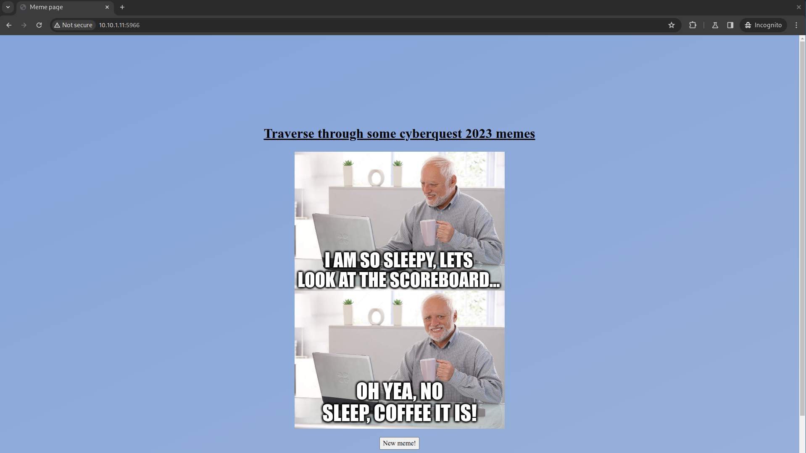
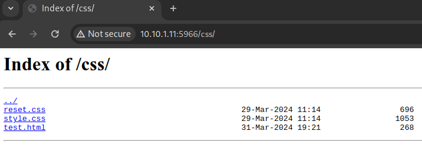
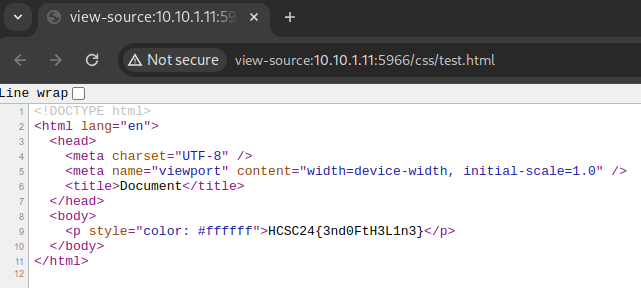
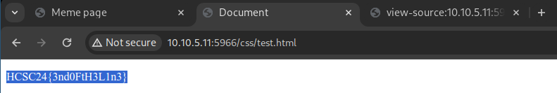

# HCSC 2024 - Trekking

## Description

Bonyolult a labirintust navigálni, bárcsak lenne módunk rá, hogy lebonthassuk a falakat.....

Készítői kommentek:
- VPN kapcsolat szükséges
- A flag-et pontosan kell beadni

**Flag formátum**: `HCSC24{...}`

By: `incarrnati0n`

> Hint 1 (cost 150): Próbáltad a képet új lapon megnyitni? 

## Metadata

- Tags: `web`, `feroxbuster`
- Points: `300`
- Number of solvers: 46
- Filename: -

## Solution

The challenge was available at `10.10.(1-9).11:5966`, for example: <http://10.10.1.11:5966>

There's nothing interesting on the page, it just gives you memes. 



Let's run `feroxbuster` against the site.

```
$ feroxbuster -u http://10.10.1.11:5966
[...]
404      GET        7l       11w      153c Auto-filtering found 404-like response and created new filter; toggle off with --dont-filter
301      GET        7l       11w      169c http://10.10.5.11:5966/images => http://10.10.5.11/images/
200      GET       62l      109w      696c http://10.10.5.11:5966/css/reset.css
200      GET       63l      123w     1053c http://10.10.5.11:5966/css/style.css
200      GET       10l       22w      273c http://10.10.5.11:5966/script.js
301      GET        7l       11w      169c http://10.10.5.11:5966/css => http://10.10.5.11/css/
403      GET        7l        9w      153c http://10.10.5.11:5966/css/test.html
200      GET      205l     1481w   120847c http://10.10.5.11:5966/images/meme3.png
200      GET        0l        0w   411150c http://10.10.5.11:5966/images/meme1.png
200      GET       20l       50w      633c http://10.10.5.11:5966/
200      GET      924l     5720w   466801c http://10.10.5.11:5966/images/meme10.png
200      GET     1647l    11690w   763631c http://10.10.5.11:5966/images/meme4.png
200      GET        0l        0w   393554c http://10.10.5.11:5966/images/meme6.png
200      GET        0l        0w   570316c http://10.10.5.11:5966/images/meme7.png
200      GET        0l        0w   493939c http://10.10.5.11:5966/images/meme9.png
200      GET        0l        0w   506968c http://10.10.5.11:5966/images/meme5.png
200      GET        0l        0w   650231c http://10.10.5.11:5966/images/meme8.png
200      GET        0l        0w   436691c http://10.10.5.11:5966/images/meme2.png
```

There seems to be only one interesting page: `/css/test.html`. However, if we open it, we get a `403 Forbidden` message from `nginx`.

Let's visit `/css/` and see if there is a directory listing (**visit `/css/` and not `/css`**).



```
reset.css                                          29-Mar-2024 11:14                 696
style.css                                          29-Mar-2024 11:14                1053
test.html                                          31-Mar-2024 19:21                 268
```

If we click on the `test.html`, we interestingly don't get a Forbidden response, but an empty page.

Checking the source of the we can see that the flag is written as white.





I've tested why the `/css/test.html` page only gives us the flag if visited from the `/css/` directory. It turned out that it checks the `Referer` header

```bash
└─$ curl -H "Referer: http://10.10.5.11:5966/css/" http://10.10.5.11:5966/css/test.html
<!DOCTYPE html>
<html lang="en">
  <head>
    <meta charset="UTF-8" />
    <meta name="viewport" content="width=device-width, initial-scale=1.0" />
    <title>Document</title>
  </head>
  <body>
    <p style="color: #ffffff">HCSC24{3nd0FtH3L1n3}</p>
  </body>
</html>
```

Flag: `HCSC24{3nd0FtH3L1n3}`