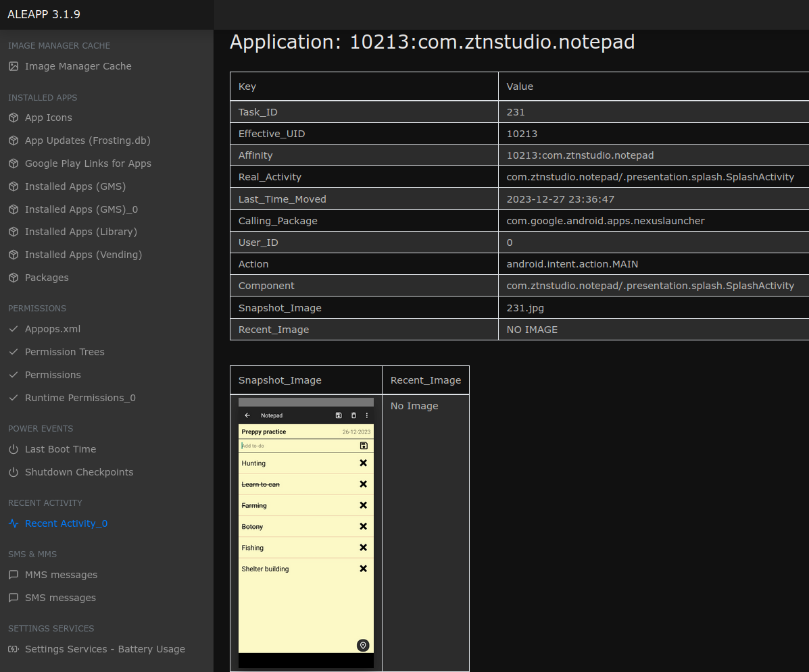
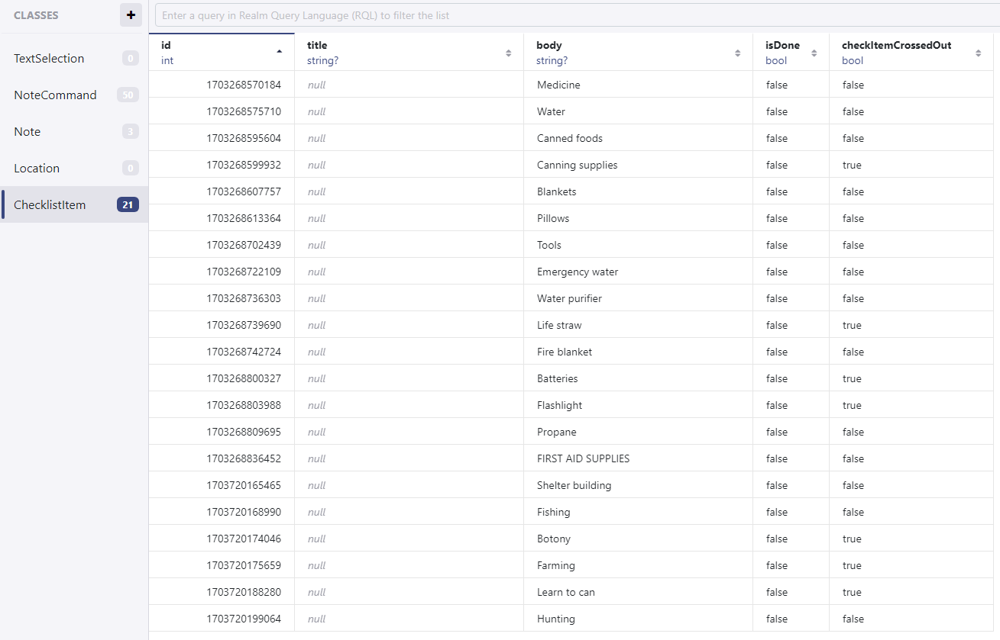

# Hexordia Weekly CTF - Android - Week 1 - Apocalist Now

> What is the timestamp of the last crossed out entry? FORMAT: YYYY-MM-DD HH:MM:SS

- Points: `25`

## Solution

- If we search the ALEAPP `Recent Activity_0` menu we can see that there is a `com.ztnstudio.notepad` application installed and recently viewed and it contains a checklist (the screenshot of the checklist is also present in other place so it can be found)

- The entry has a `Last_Time_Moved` value of `2023-12-27 23:36:47`, we might want to find a timestamp around this time
- If we go to the `/data/data/com.ztnstudio.notepad/` directory and `grep -ir botony` (or `grep -ir "learn to can"`, or any other word present in the checklist), we will find that only the `files/default.realm` file contains all of these strings
- The file is a Realm database file, we can open it in [Realm Studio](https://docs.realm.io/sync/realm-studio)

- There is a `ChecklistItem` class (or table?), where the `Id` is a timestamp
- We can order the items based on the `Id` and search for those, where the `CheckItemCrossedOut` is `true`
- The `Learn to can` item has the latest timestamp from the crossed out items (`1703720188280`)
- As far as I know, there is no Python package (there aren't many other libraries either) to work with Realm databases, so I did not create a script in this case which automatically solve the challenge

Flag: `2023-12-27 23:36:28`
