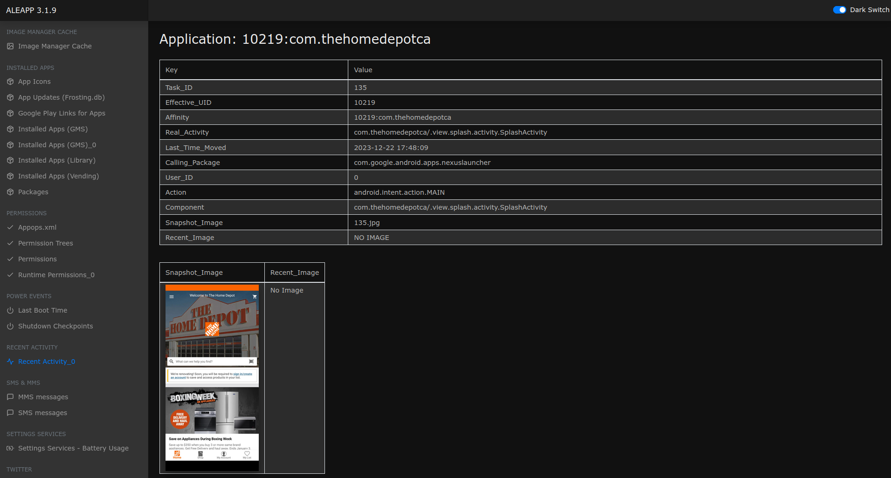

# Hexordia Weekly CTF - Android - Week 1 - Cleanup Aisle #13

> What is the average rating of the item Rocco was recently viewing?

- Points: `15`

## Solution

- If we search the ALEAPP `Recent Activity_0` menu we can see that there is a `com.thehomedepotca` application installed and recently viewed (the name of the challenge is also some kind of hint)



- The home folder of the application is `/data/data/com.thehomedepotca`
- In the `databases` folder, there is an `HD_DATA_BASE` SQLite database
- The `recently_viewed_items` table has the answer

```
$ cd data/data/com.thehomedepotca/databases
$ sqlite3 HD_DATA_BASE
SQLite version 3.45.1 2024-01-30 16:01:20
Enter ".help" for usage hints.

sqlite> .tables
android_metadata       recently_viewed_items  search_suggestions
my_list                room_master_table

sqlite> .schema recently_viewed_items
CREATE TABLE `recently_viewed_items` (`hd_code` TEXT NOT NULL, `total_reviews` INTEGER NOT NULL, `average_rating` REAL NOT NULL, `image_url` TEXT NOT NULL, `brand_name` TEXT NOT NULL, `product_name` TEXT NOT NULL, `last_access_time` INTEGER NOT NULL, `id` INTEGER PRIMARY KEY AUTOINCREMENT NOT NULL);
CREATE UNIQUE INDEX `index_recently_viewed_items_hd_code` ON `recently_viewed_items` (`hd_code`);

sqlite> select * from recently_viewed_items ;
1000149580|301|4.63450002670288|https://images.homedepot.ca/productimages/p_1000149580.jpg|Quikrete|30kg Ready-to-Use Concrete Mix|1703265736276|1
```

- We can also create a small Python script to solve the challenge ([cleanup-aisle.py](files/cleanup-aisle.py)):

```python
import sqlite3
import sys
import pathlib

root = pathlib.Path(sys.argv[1])
app = 'com.thehomedepotca'
database = root / f'data/data/{app}/databases/HD_DATA_BASE'
assert(database.exists())

connection = sqlite3.connect(database)

sql = f"select average_rating from recently_viewed_items"

cursor = connection.cursor()
rows = cursor.execute(sql).fetchall()
assert(len(rows) >= 1)

print(rows[0][0])
```

```bash
$ python solve.py /path-to-extracted-image
4.63450002670288
```

Flag: `4.63450002670288`