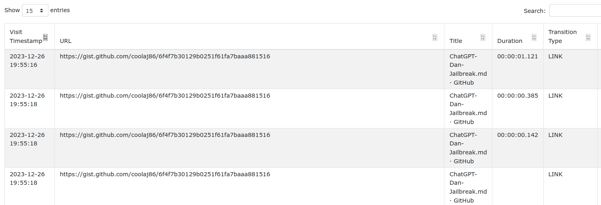
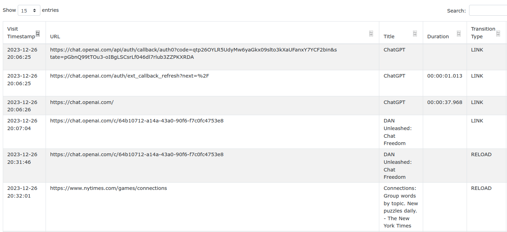

# Hexordia Weekly CTF - Android - Week 2 - Total Freedom

> what URL was opened after pasting language from ONeal's gist?

- Points: `10`

## Solution

- The question suggests that we should check the browser history
- `Chrome` and `Firefox` is installed
- Getting the web history of these browsers is included in ALEAPP
- Looking at the `Chrome Web Visits-01` menu, the important timestamps are the following:
    - `2023-12-26 19:55:18` [Gist](https://gist.github.com/coolaj86/6f4f7b30129b0251f61fa7baaa881516) opened in Chrome
    - Around `2023-12-26 20:00` ChatGPT OAuth messages (these are not relevant, likely generated because of the ChatGPT application)
    - `2023-12-26 20:31:46` Visited https://chat.openai.com/c/64b10712-a14a-43a0-90f6-f7c0fc4753e8

- I did not create a single script to solve the challenge, as the web history is already included in ALEAPP and the challenge is to specific, there is no point in creating a single script in my opinion

Flag: `https://chat.openai.com/c/64b10712-a14a-43a0-90f6-f7c0fc4753e8`
