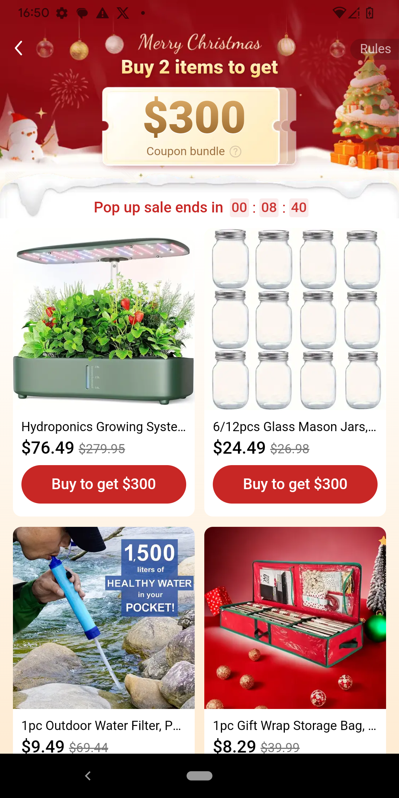
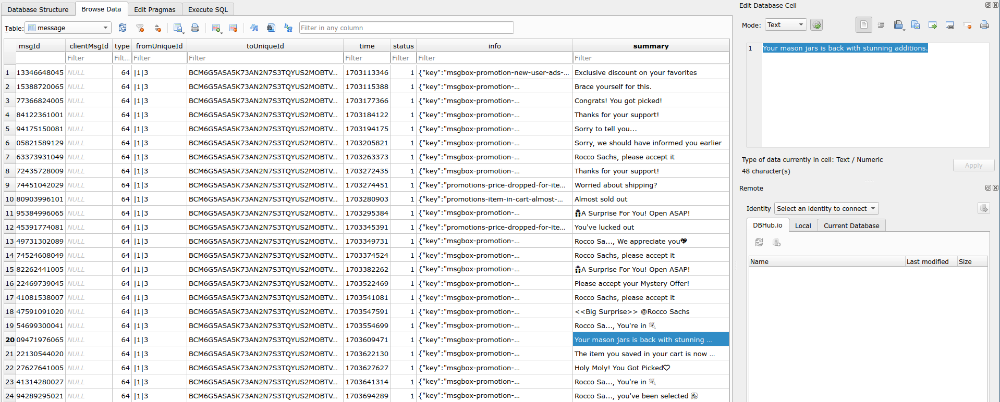
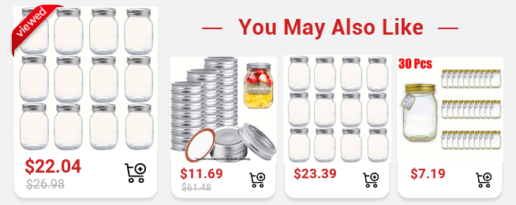

# Hexordia Weekly CTF - Android - Week 4 - TEaM U prep

> What item that Rocco was shopping for came back in stock?

- Points: `15`

## Solution

- The capital letters in the name of the challenge hints that we should look at the `Temu` (`com.einnovation.temu`) application data.
- In the `Screenshots` (`data/media/0/Pictures/Screenshots/`) directory we can find a screenshot of the Temu application (`Screenshot_20231227-165057.png`):



- We can see four items on the picture:
  - Hydroponics Growing System
  - 6/12pcs Glass Mason Jars
  - 1pc Outdoor Water Filter
  - 1pc Gift Wrap Storage Bag
- Let's check what kind of data is stored databases of the application.

```
$ ls -a data/data/com.einnovation.temu/databases/
ChatDB_BCM6G5ASA5K73AN2N7S3TQYUS2MOBTVG2RFRUULJ_mall_1.db
ChatDB_BCM6G5ASA5K73AN2N7S3TQYUS2MOBTVG2RFRUULJ_mall_1.db-shm
ChatDB_BCM6G5ASA5K73AN2N7S3TQYUS2MOBTVG2RFRUULJ_mall_1.db-wal
ChatDB_BCM6G5ASA5K73AN2N7S3TQYUS2MOBTVG2RFRUULJ_mallLocal_6.db
ChatDB_BCM6G5ASA5K73AN2N7S3TQYUS2MOBTVG2RFRUULJ_mallLocal_6.db-shm
ChatDB_BCM6G5ASA5K73AN2N7S3TQYUS2MOBTVG2RFRUULJ_mallLocal_6.db-wal
ChatDB_BCM6G5ASA5K73AN2N7S3TQYUS2MOBTVG2RFRUULJ_msgbox_2.db
ChatDB_BCM6G5ASA5K73AN2N7S3TQYUS2MOBTVG2RFRUULJ_msgbox_2.db-shm
ChatDB_BCM6G5ASA5K73AN2N7S3TQYUS2MOBTVG2RFRUULJ_msgbox_2.db-wal
ChatDB_BCM6G5ASA5K73AN2N7S3TQYUS2MOBTVG2RFRUULJ_platform_3.db
ChatDB_BCM6G5ASA5K73AN2N7S3TQYUS2MOBTVG2RFRUULJ_platform_3.db-shm
ChatDB_BCM6G5ASA5K73AN2N7S3TQYUS2MOBTVG2RFRUULJ_platform_3.db-wal
[...]
```

- If we open the `ChatDB_BCM6G5ASA5K73AN2N7S3TQYUS2MOBTVG2RFRUULJ_msgbox_2.db` database in `sqlitebrowser` we will find a `message` database, which possibly contains notifications from the application (for example promotions).
- In the `summary` column, there is an entry stating: `Your mason jars is back with stunning additions.` The flag is probably: `mason jar`.



- In the `info` column, we can also find a link to an additional picture about the promotion ([link](https://aid.kwcdn.com/maleonn/static/v2/231226-2322920211.png?imageAuto/normal/id/42921bce-21d7-4876-b0b0-f53864f80e6f/format/png)): 



- I've created a Python script, which prints the `summary` column of the messages sent by Temu ([temu-messages.py](files/temu-messages.py)):

```python
import sqlite3
import sys
import pathlib
import re

root = pathlib.Path(sys.argv[1])
app = 'com.einnovation.temu'
databases_folder = root / f'data/data/{app}/databases/'

databases = []
for db in databases_folder.iterdir():
    m = re.search('ChatDB_.*_msgbox_2\.db',str(db))
    if m is not None:
        databases.append(m.group())
assert(len(databases) == 1)

database = databases_folder / databases[0]
assert(database.exists())

connection = sqlite3.connect(database)
sql = "select summary from message"

cursor = connection.cursor()
rows = cursor.execute(sql).fetchall()
assert(len(rows) >= 1)

for row in rows:
    print(row[0])
```

Flag: `mason jar`