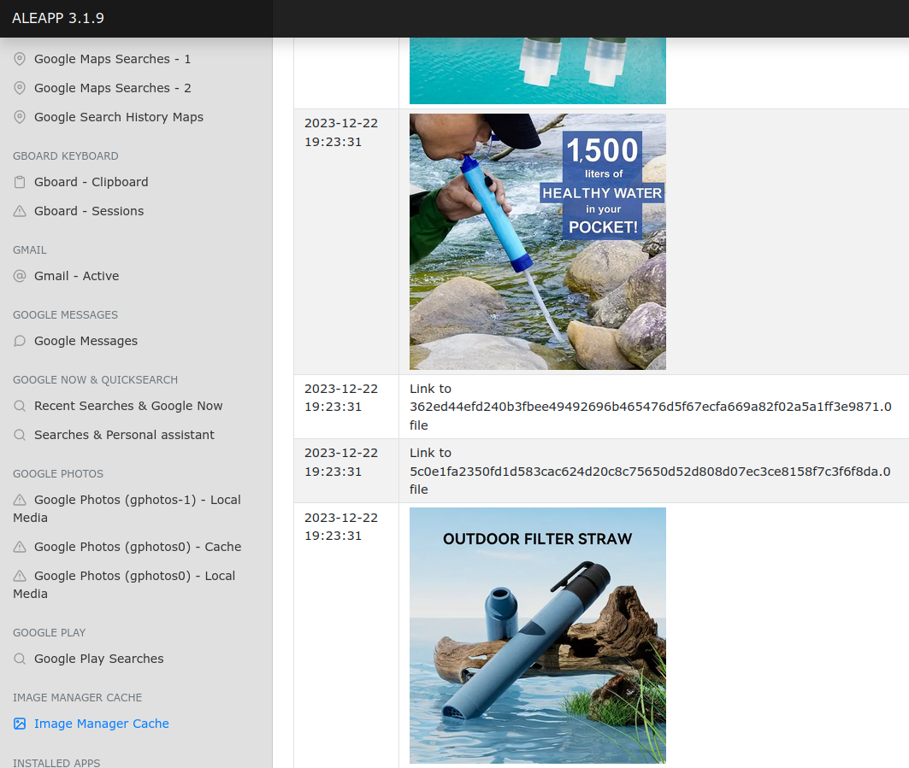
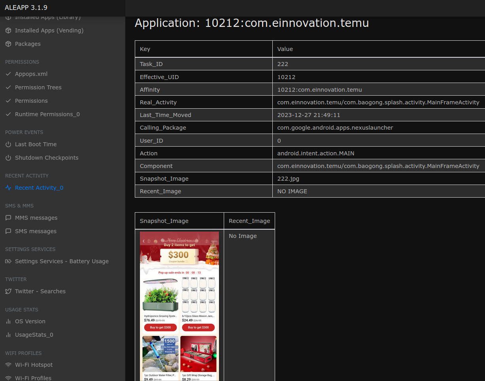
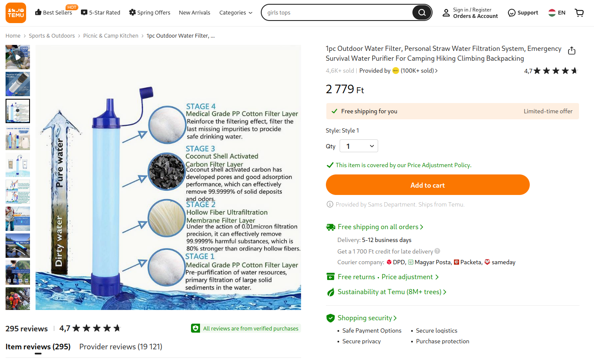
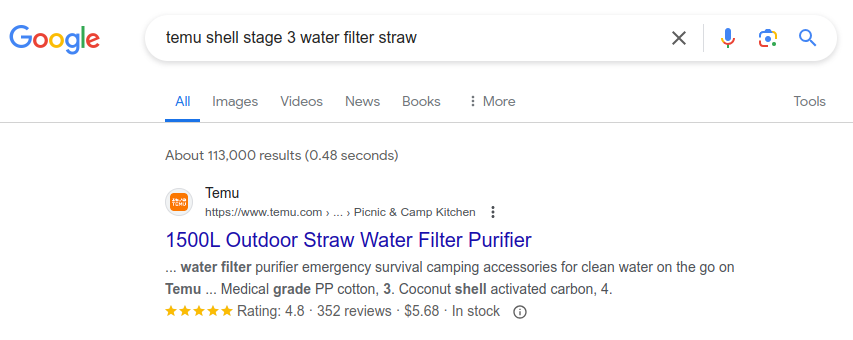

# Hexordia Weekly CTF - Android - Week 4 - Watch for ADditional straw

> What kind of shell is stage 3 of the water filter?

- Points: `20`

## Solution

- The findings in the previous challenge can help us with this one because we already know what `straw` the name of the challenge talks about. It is a *Temu Outdoor Water Filter Straw*.
- We can also find related cached pictures using the `Image Manager Cache` plugin / menu in ALEAPP:

- The exact name of the product can be found using the `Recent Activity` plugin in ALEAPP:

- It is a `1pc Outdoor Water Filter`.
- We can find the exact product on Temu: [link](https://www.temu.com/hu-en/1pc-outdoor-water-filter-personal-straw-water-filtration-system-emergency-survival-water-purifier-for-camping-hiking-climbing-backpacking-g-601099538194043.html)
- The third media content about the product lists the 4 stages of the straw. Stage 3 is a *Coconut Shell Activated Carbon Filter Layer*, so the answer is `coconut`.

- The direct link to the picture which has the answer is: [link](https://img.kwcdn.com/product/open/2023-12-13/1702457052875-9bd4f3cef37d40cfac5a2c15acec8bd2-goods.jpeg)
- The challenge can also be solved immediately by searching for the description of the challenge with additional keywords on Google: `temu shell stage 3 water filter straw`:

- I did not create a single script to solve the challenge, as there is no point in creating it in my opinion.

Flag: `coconut`