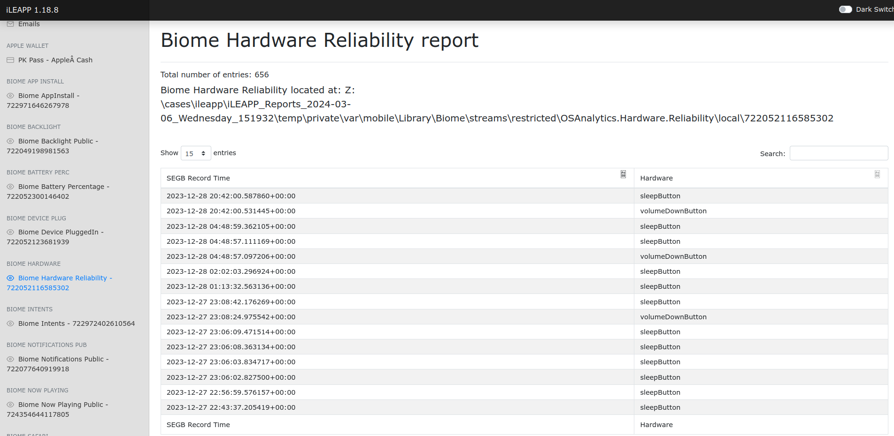

# Hexordia Weekly CTF - iOS - Week 1 - Back to ole Reliable

> When was the sleep button last pushed? (Format YYYY-MM-DD HH:MM:SS)

- Points: `25`

## Solution

- If we execute iLEAPP we can see that it has a `Biome Hardware Reliability report` menu
- Here the report lists the `sleepButton` related hardware events and their timestamps
- We just have to find the latest `sleepButton` record

- It was not necessary to create a script to solve the challenge as iLEAPP already has a [Biome Hardware plugin](https://github.com/abrignoni/iLEAPP/blob/main/scripts/artifacts/biomeHardware.py)
- Related articles:
	- https://blog.d204n6.com/
	- https://cellebrite.com/en/episode-21-i-beg-to-dfir-how-ios-biome-data-reveals-digital-evidence-in-ios-forensics/

Flag: `2023-12-28 20:42:00`
