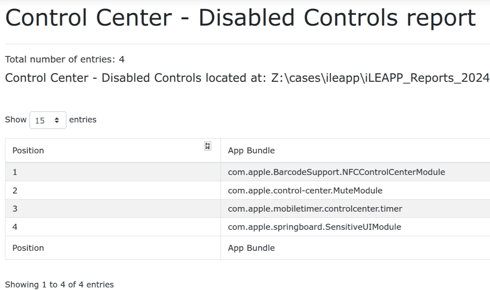

# Hexordia Weekly CTF - iOS - Week 3 - Take Control

> What item was disabled in position 3?

- Points: `15`

## Solution

- There is a `Control Center - Disabled Controls report` menu in iLEAPP

- The flag is the 3rd item
- I did not create an individual script for this challenge as it is already included in iLEAPP

Flag: `com.apple.mobiletimer.controlcenter.timer`