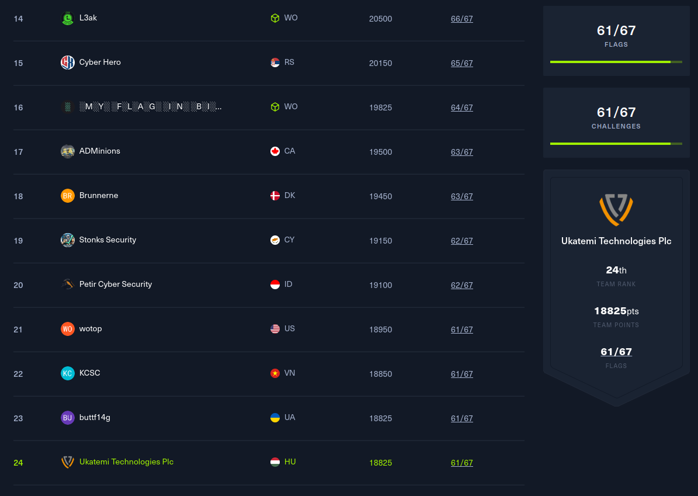
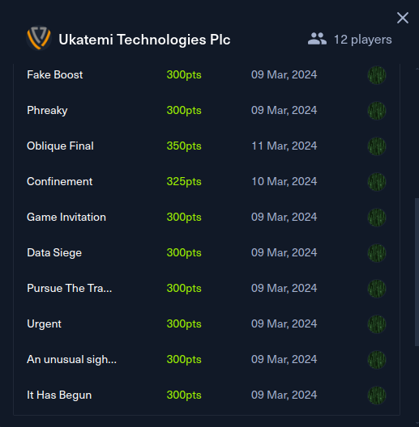

# Hack The Box Cyber Apocalypse 2024: Hacker Royale

I participated in the **Hack The Box Cyber Apocalypse 2024: Hacker Royale** CTF with **Ukatemi**.

To summarize the CTF, here are some stats:
- Date: **09 Mar 2024, 14:00 - 14 Mar, 13:59**
- Teams: **5693**
- Players: **12965**
- Type: **jeopardy**
- Challenges: **67**
- Categories: **blockchain**, **crypto**, **forensics**, **hardware**, **misc**, **pwn**, **reverse**, **web**
- Our team name: **Ukatemi Technologies Plc**
- Our team size: **10**

## Results

We've successfully reached the Top 25 by earning the **24th** place out of the 5693 teams and by solving **61/67** challenges and gaining 18825 points. I'm very proud of our team (**Ukatemi Technologies Plc**), it was a huge team effort, sometimes playing until 4 AM.

Congratulations to the winner teams:
- **Friendly Maltese Citizens**
- **Synacktiv**
- **The Flat Network Society**

And also congratulations to the other Hungarian team from University of Obuda, **CyBetyarz** who have reached the 47th place with 57/67 solves and 17425 points.

**Hoping for a merge in the Hungarian teams soon, so we can compete together and not against each other!**

## Challenges

I mainly solved **blockchain**, **crypto**, **forensics**, **reverse** and **misc** challenges. What I'm most proud of is that I've single-handedly took down my favourite category: **forensics**.

- [blockchain](blockchain)
  - [Lucky Faucet](blockchain/Lucky-Faucet)
  - [Russian Roulette](blockchain/Russian-Roulette)
- [crypto](crypto)
  - [Partial Tenacity](crypto/Partial-Tenacity)
  - [ROT128](crypto/ROT128)
- [forensics](forensics)
  - [An unusual sighting](forensics/An-unusual-sighting)
  - [Confinement](forensics/Confinement)
  - [Data Siege](forensics/Data-Siege)
  - [Fake Boost](forensics/Fake-Boost)
  - [Game Invitation](forensics/Game-Invitation)
  - [It Has Begun](forensics/It-Has-Begun)
  - [Oblique Final](forensics/Oblique-Final)
  - [Phreaky](forensics/Phreaky)
  - [Pursue The Tracks](forensics/Pursue-The-Tracks)
  - [Urgent](forensics/Urgent)
- [misc](misc)
  - [Quantum Conundrum](misc/Quantum-Conundrum)
- [reverse](reverse)
  - [Crushing](reverse/Crushing)
  - [FollowThePath](reverse/FollowThePath)
  - [QuickScan](reverse/QuickScan)

The official write-ups can be found here: <https://github.com/hackthebox/cyber-apocalypse-2024>