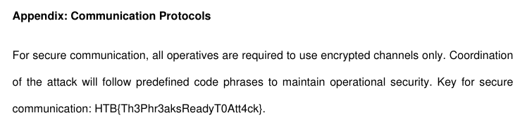

# HTB Cyber Apocalypse 2024: Hacker Royale - Phreaky

## Challenge

> In the shadowed realm where the Phreaks hold sway,<br>
A mole lurks within, leading them astray.<br>
Sending keys to the Talents, so sly and so slick,<br>
A network packet capture must reveal the trick.<br>
Through data and bytes, the sleuth seeks the sign,<br>
Decrypting messages, crossing the line.<br>
The traitor unveiled, with nowhere to hide,<br>
Betrayal confirmed, they'd no longer abide.<br>

## Metadata

- Difficulty: medium
- Creator: `sebh24`
- Files: [`phreaky.pcap`](files/phreaky.pcap)
- Docker: no
- Tags: `pcap`, `wireshark`, `smtp`, `encrypted zip`, `pyshark`
- Points: `300`
- Number of solvers: 

## Solution

Every second TCP stream is an unencrypted SMTP session where the client (`phreak-ubuntu01`) sends the mail to the first mailserver (`mailserver-phreak`) (basically a submission).

```smtp
220 The Phreaks Mail Server - We run this
HELO phreak-ubuntu01
250 mailserver-phreak
MAIL FROM:<caleb@thephreaks.com>
250 2.1.0 Ok
RCPT TO:<resources@thetalents.com>
250 2.1.5 Ok
DATA
354 End data with <CR><LF>.<CR><LF>
Date: Wed, 06 Mar 2024 14:59:12 +0000
From: caleb@thephreaks.com(Caleb)
To: resources@thetalents.com
Subject: Secure File Transfer
Message-ID: <20240306145912.3RkED%caleb@thephreaks.com>
User-Agent: s-nail v14.9.23
MIME-Version: 1.0
Content-Type: multipart/mixed;
 boundary="=-=DBZhoU35m_YtHyGmIsZszrXoWQVlI-1y1rd3=-="

This is a multi-part message in MIME format.

--=-=DBZhoU35m_YtHyGmIsZszrXoWQVlI-1y1rd3=-=
Content-Type: text/plain; charset=us-ascii
Content-Disposition: inline
Content-ID: <20240306145912.g2I1r%caleb@thephreaks.com>

Attached is a part of the file. Password: S3W8yzixNoL8

--=-=DBZhoU35m_YtHyGmIsZszrXoWQVlI-1y1rd3=-=
Content-Type: application/zip
Content-Transfer-Encoding: base64
Content-Disposition: attachment; 
 filename*0="caf33472c6e0b2de339c1de893f78e67088cd6b1586a581c6f8e87b5596";
 filename*1="efcfd.zip"
Content-ID: <20240306145912.Emuab%caleb@thephreaks.com>

UEsDBBQACQAIAGZ3ZlhwRyBT2gAAAN0AAAAWABwAcGhyZWFrc19wbGFuLnBkZi5wYXJ0MVVUCQAD
wIToZcCE6GV1eAsAAQToAwAABOgDAAA9mPwEVmy1t/sLJ62NzXeCBFSSSZppyIzvPXL++cJbuCeL
nP4XXiAK9/HZL9xRw4LjlDf5eDd6BgBOKZqSn6qpM6g1WKXriS7k3lx5VkNnqlqQIfYnUdOCnkD/
1vzCyhuGdHPia5lmy0HoG+qdXABlLyNDgxvB9FTOcXK7oDHBOf3kmLSQFdxXsjfooLtBtC+y4gdB
xB4V3bImQ8TB5sPY55dvEKWCJ34CzRJbgIIirkD2GDIoQEHznvJA7zNnOvce1hXGA2+P/XmHe+4K
tL/fmrWMVpQEd+/GQlBLBwhwRyBT2gAAAN0AAABQSwECHgMUAAkACABmd2ZYcEcgU9oAAADdAAAA
FgAYAAAAAAAAAAAAtIEAAAAAcGhyZWFrc19wbGFuLnBkZi5wYXJ0MVVUBQADwIToZXV4CwABBOgD
AAAE6AMAAFBLBQYAAAAAAQABAFwAAAA6AQAAAAA=

--=-=DBZhoU35m_YtHyGmIsZszrXoWQVlI-1y1rd3=-=--
.
250 2.0.0 Ok: queued as 9CB872113
QUIT
221 2.0.0 Bye
```

As we can see the attachment is a password protected ZIP filea and the password is in the email (in the presented case it is `S3W8yzixNoL8`).

There are around 14 streams, we can do it manually, but choosing automation worth it this time.

I've created a Python script ([`solve.py`](files/solve.py)), which extracts the passwords and the ZIP files, decrypts the ZIP files and saves their content.

The contents are part of a PDF file, so we have to merge them resulting in the [`phreaks_plan.pdf`](files/phreaks_plan.pdf) file, which contains the flag.



Flag: `HTB{Th3Phr3aksReadyT0Att4ck}`